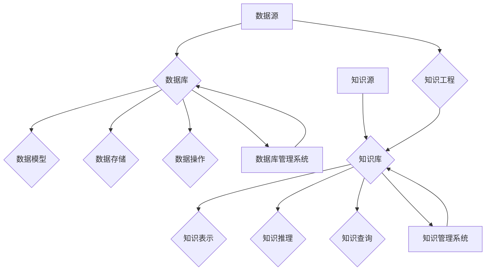

# 数据库、知识库在AI中的重要性

> 关键词：数据库，知识库，人工智能，数据管理，知识工程，机器学习，自然语言处理，推理系统，语义网

## 1. 背景介绍

在当今的信息时代，数据已成为企业和社会的关键资产。人工智能（AI）技术的快速发展，使得我们能够从海量数据中提取有价值的信息，并实现自动化决策和智能服务。数据库和知识库作为数据管理和知识表示的核心技术，对于AI系统的构建和运行起着至关重要的作用。本文将探讨数据库和知识库在AI中的重要性，分析其原理、应用领域和发展趋势。

## 2. 核心概念与联系

### 2.1 核心概念

#### 2.1.1 数据库

数据库（Database）是一种用于存储、管理和检索数据的系统。它由数据模型、数据存储、数据操作和数据库管理系统组成。数据库的主要目的是高效地管理大量数据，并提供对数据的查询、更新和删除等功能。

#### 2.1.2 知识库

知识库（Knowledge Base）是一种用于存储、管理和检索知识的系统。它通常包含事实、规则、概念和关系等知识元素，并支持推理和查询功能。知识库的目的是将人类知识结构化和形式化，以便AI系统可以理解和利用这些知识。

#### 2.1.3 人工智能

人工智能（Artificial Intelligence）是指使计算机模拟人类智能行为的技术。它包括机器学习、自然语言处理、计算机视觉、专家系统等领域。

### 2.2 核心概念原理和架构的 Mermaid 流程图



### 2.3 核心概念之间的联系

数据库和知识库是AI系统的基石，它们在AI系统中扮演着不同的角色：

- 数据库提供数据存储和管理的功能，为AI系统提供训练和推理所需的输入数据。
- 知识库提供知识表示和推理的功能，为AI系统提供决策和推理所需的背景知识和逻辑规则。
- 人工智能系统通过结合数据库和知识库的功能，实现从数据到知识的转化，从而实现智能决策和推理。

## 3. 核心算法原理 & 具体操作步骤

### 3.1 算法原理概述

数据库和知识库在AI中的应用主要包括以下几个方面：

- 数据采集和预处理：从各种数据源采集数据，并进行清洗、转换、集成等预处理操作，为AI训练提供高质量的数据集。
- 数据存储和索引：将预处理后的数据存储在数据库中，并建立索引，以便快速检索和查询。
- 知识表示和推理：将领域知识表示为形式化的知识库，并使用推理算法进行知识推理，为AI决策提供支持。
- 数据挖掘和机器学习：利用数据库和知识库中的数据，进行数据挖掘和机器学习，发现数据中的规律和模式。
- 智能决策和推理：结合数据库和知识库中的数据和知识，实现智能决策和推理。

### 3.2 算法步骤详解

#### 3.2.1 数据采集和预处理

1. 确定数据源：根据AI应用的需求，确定所需的数据源，如数据库、文件、API等。
2. 数据清洗：删除重复数据、处理缺失值、修正错误数据等。
3. 数据转换：将数据转换为统一的格式，如CSV、JSON等。
4. 数据集成：将来自不同数据源的数据进行整合，形成完整的数据集。

#### 3.2.2 数据存储和索引

1. 选择合适的数据库系统：根据数据规模、性能和成本等因素选择合适的数据库系统，如关系型数据库、NoSQL数据库等。
2. 设计数据模型：根据数据的特点和需求，设计合适的数据模型，如实体-关系模型、属性图等。
3. 创建索引：为常用的查询字段创建索引，提高查询效率。

#### 3.2.3 知识表示和推理

1. 选择知识表示方法：根据知识的特点和需求选择合适的知识表示方法，如谓词逻辑、本体等。
2. 建立知识库：将领域知识表示为形式化的知识库，如RDF、OWL等。
3. 推理算法：选择合适的推理算法，如Rete算法、Resolution算法等。

#### 3.2.4 数据挖掘和机器学习

1. 选择数据挖掘和机器学习方法：根据数据的特点和需求选择合适的方法，如聚类、分类、关联规则等。
2. 训练模型：使用训练数据训练机器学习模型。
3. 模型评估：评估模型的性能，如准确率、召回率等。

#### 3.2.5 智能决策和推理

1. 结合数据和知识：将数据库和知识库中的数据和知识进行结合。
2. 决策和推理：使用结合后的数据和知识进行决策和推理。

### 3.3 算法优缺点

#### 3.3.1 优点

- 数据库和知识库能够为AI系统提供高质量的数据和知识，提高AI系统的性能。
- 数据库和知识库能够提高AI系统的可扩展性和可维护性。
- 数据库和知识库能够提高AI系统的可靠性和鲁棒性。

#### 3.3.2 缺点

- 数据库和知识库的建设和维护需要大量的人力、物力和财力投入。
- 数据库和知识库可能存在数据质量问题和知识不一致性。
- 数据库和知识库的更新和维护需要不断进行，以适应数据和环境的变化。

### 3.4 算法应用领域

数据库和知识库在AI中的应用领域非常广泛，以下是一些典型的应用场景：

- 智能问答系统：利用知识库和自然语言处理技术，实现用户问题的自动回答。
- 智能推荐系统：利用数据库和机器学习技术，为用户提供个性化的推荐服务。
- 智能决策系统：利用知识库和推理技术，为决策者提供决策支持。
- 智能监控系统：利用数据库和计算机视觉技术，实现实时监控和报警。

## 4. 数学模型和公式 & 详细讲解 & 举例说明

### 4.1 数学模型构建

在数据库和知识库中，常用的数学模型包括：

- 关系型数据库：使用关系模型，用表格表示数据，用SQL语言进行查询。
- 非关系型数据库：使用文档、键值、列族、图形等模型，适用于不同的数据存储需求。
- 知识库：使用本体模型，用概念、关系、属性等表示知识。

### 4.2 公式推导过程

在数据库和知识库中，常用的公式推导过程包括：

- 关系代数：用于描述关系数据库的查询操作。
- 模式归纳：用于从数据中自动学习数据模型。
- 基于规则的推理：用于从知识库中推导出新的知识。

### 4.3 案例分析与讲解

#### 4.3.1 案例一：智能问答系统

使用本体模型构建知识库，利用自然语言处理技术解析用户问题，结合本体推理技术回答用户问题。

#### 4.3.2 案例二：智能推荐系统

使用关联规则挖掘技术发现用户之间的兴趣关系，利用协同过滤技术为用户提供个性化的推荐服务。

## 5. 项目实践：代码实例和详细解释说明

### 5.1 开发环境搭建

- 安装Python和相关库：如pandas、numpy、sqlalchemy等。
- 安装知识库构建工具：如Protégé、Protégé-OWL等。

### 5.2 源代码详细实现

#### 5.2.1 知识库构建

```python
from owlrl import KB, parse

# 加载OWL本体文件
onto = parse("path/to/ontology.owl")

# 创建知识库
k = KB()
k.assert_ontology(onto)
```

#### 5.2.2 智能问答

```python
def ask_question(question, k):
    # 解析问题
    query = "SELECT ?answer WHERE { ?answer :question ?text . FILTER(?text = \"" + question + "\") . }"
    
    # 执行查询
    answers = k.query(query)
    
    # 返回答案
    return answers
```

### 5.3 代码解读与分析

以上代码展示了如何使用OWL本体和Protégé-OWL构建知识库，以及如何利用知识库回答用户问题。在实际应用中，可以根据具体需求进行扩展和优化。

### 5.4 运行结果展示

运行智能问答示例代码，输入问题“什么是人工智能？”，系统将返回“人工智能是一种使计算机模拟人类智能行为的技术”。

## 6. 实际应用场景

数据库和知识库在AI中的实际应用场景包括：

- 智能问答系统：如百度智能客服、阿里巴巴智能客服等。
- 智能推荐系统：如淘宝推荐、京东推荐等。
- 智能决策系统：如金融风险评估、医疗诊断等。
- 智能监控系统：如智能交通、智能安防等。

## 7. 工具和资源推荐

### 7.1 学习资源推荐

- 《人工智能：一种现代的方法》
- 《数据挖掘：概念与技术》
- 《知识表示与推理》

### 7.2 开发工具推荐

- 数据库：MySQL、PostgreSQL、MongoDB、Redis等。
- 知识库：Protégé、Protégé-OWL、Jena等。
- 自然语言处理：NLTK、spaCy、BERT等。

### 7.3 相关论文推荐

-《基于本体的语义网》
-《关联规则挖掘》
-《知识表示与推理》

## 8. 总结：未来发展趋势与挑战

### 8.1 研究成果总结

数据库和知识库在AI中的应用已经取得了显著的成果，为AI系统的构建和运行提供了重要的基础。随着AI技术的不断发展，数据库和知识库将发挥越来越重要的作用。

### 8.2 未来发展趋势

- 数据库和知识库将更加智能化，能够自动生成和更新。
- 数据库和知识库将更加开放，支持跨域、跨语言的异构数据集成。
- 数据库和知识库将更加安全，保护数据隐私和知识安全。

### 8.3 面临的挑战

- 数据质量：数据库和知识库需要保证数据的质量和一致性。
- 知识表示：如何有效地表示和推理知识，是一个重要的挑战。
- 知识更新：如何快速地更新知识库，以适应知识的变化，是一个重要的挑战。

### 8.4 研究展望

未来，数据库和知识库将在以下几个方面进行深入研究：

- 数据质量管理和控制
- 知识表示和推理技术
- 知识库的自动构建和更新
- 知识库的安全性和隐私保护

## 9. 附录：常见问题与解答

### 9.1 问题一：什么是数据库和知识库？

数据库是一种用于存储、管理和检索数据的系统，而知识库是一种用于存储、管理和检索知识的系统。

### 9.2 问题二：数据库和知识库在AI中有哪些应用？

数据库和知识库在AI中的应用包括数据采集和预处理、数据存储和索引、知识表示和推理、数据挖掘和机器学习、智能决策和推理等。

### 9.3 问题三：如何选择合适的数据库系统？

选择合适的数据库系统需要考虑数据规模、性能、成本、功能等因素。

### 9.4 问题四：如何选择合适的知识库构建工具？

选择合适的知识库构建工具需要考虑知识表示方法、推理算法、知识库管理系统等因素。

作者：禅与计算机程序设计艺术 / Zen and the Art of Computer Programming