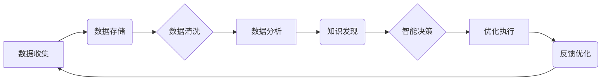

# 数智新时代的特征与发展

> 关键词：数智化、人工智能、大数据、物联网、数字化转型、智能经济

## 1. 背景介绍

随着信息技术的飞速发展，人类社会正迈入一个崭新的时代——数智新时代。数智化是这一时代的显著特征，它深刻地改变了我们的生活方式、工作方式和社会结构。本文将探讨数智新时代的特征，分析其发展动力，并展望未来发展趋势与挑战。

### 1.1 问题的由来

近年来，人工智能、大数据、物联网等技术的快速发展，为人类社会带来了前所未有的变革。企业开始探索数字化转型，政府致力于构建智慧城市，个人也逐渐适应智能化生活方式。然而，在这一过程中，我们面临着诸多挑战，如数据安全、隐私保护、伦理道德等。

### 1.2 研究现状

目前，数智化已经渗透到各个领域，成为推动社会进步的重要力量。以下是一些数智化的典型应用：

- **智能制造**：通过工业互联网、物联网等技术，实现生产过程的智能化、自动化，提高生产效率和质量。
- **智慧城市**：利用大数据、人工智能等技术，优化城市管理，提升市民生活质量。
- **智能医疗**：通过人工智能辅助诊断、个性化治疗等手段，提高医疗服务质量和效率。
- **智能交通**：利用智能交通系统，缓解交通拥堵，提高道路安全性。
- **智慧金融**：通过大数据风控、智能投顾等技术，提升金融服务效率和安全性。

### 1.3 研究意义

研究数智新时代的特征与发展，对于推动科技创新、优化社会管理、提升人民生活质量具有重要意义。

- **推动科技创新**：数智化催生了新的技术、新的业态，为科技创新提供了源源不断的动力。
- **优化社会管理**：数智化有助于政府提高决策科学化、精细化水平，提升社会治理能力。
- **提升人民生活质量**：数智化让人们的生活更加便捷、舒适，提升幸福感。
- **促进经济发展**：数智化是新经济发展的关键驱动力，有助于提高经济增长质量。

### 1.4 本文结构

本文将从以下几个方面展开论述：

- 介绍数智新时代的核心概念与联系。
- 分析数智化发展的关键技术与算法原理。
- 讨论数智化在各个领域的应用案例。
- 展望数智化未来的发展趋势与挑战。
- 推荐相关学习资源和开发工具。

## 2. 核心概念与联系

### 2.1 核心概念

- **数智化**：指利用人工智能、大数据、物联网等技术，将数据转换为知识和智慧，实现智能化决策和优化。
- **人工智能**：指使计算机能够模拟、延伸和扩展人类的智能，包括感知、推理、学习、理解等能力。
- **大数据**：指规模巨大、类型多样的数据集合，需要新型数据处理技术进行挖掘和分析。
- **物联网**：指通过信息传感设备，实现物品之间的互联互通，实现智能化管理和控制。

### 2.2 Mermaid 流程图

以下是一个简化的数智化流程图，展示了各个核心概念之间的联系：



在这个流程图中，数据是数智化的起点和终点，通过数据收集、存储、清洗、分析等环节，最终实现知识发现、智能决策和优化执行。

## 3. 核心算法原理 & 具体操作步骤

### 3.1 算法原理概述

数智化发展的关键技术包括：

- **机器学习**：通过算法和统计模型，从数据中学习规律，实现智能决策。
- **深度学习**：一种特殊的机器学习方法，通过多层神经网络模拟人脑神经元结构，实现复杂模式识别。
- **数据挖掘**：从大量数据中提取有价值信息的过程，包括关联规则挖掘、聚类分析、分类分析等。
- **自然语言处理**：使计算机能够理解、生成和处理自然语言的技术。

### 3.2 算法步骤详解

以机器学习为例，其基本步骤如下：

1. **数据收集**：收集相关领域的原始数据。
2. **数据预处理**：对数据进行清洗、整合、转换等预处理操作。
3. **特征工程**：从原始数据中提取对模型训练有帮助的特征。
4. **模型选择**：根据任务类型选择合适的机器学习模型。
5. **模型训练**：使用训练数据对模型进行训练，调整模型参数。
6. **模型评估**：使用测试数据评估模型性能，选择最优模型。
7. **模型部署**：将模型应用于实际场景，实现智能决策。

### 3.3 算法优缺点

- **机器学习**：
  - 优点：算法通用性强，能够处理各种类型的数据和任务。
  - 缺点：需要大量标注数据，训练过程可能需要较长时间。

- **深度学习**：
  - 优点：能够处理复杂任务，泛化能力强。
  - 缺点：需要大量数据和计算资源，模型可解释性较差。

- **数据挖掘**：
  - 优点：能够从大量数据中提取有价值信息。
  - 缺点：需要领域知识和专业知识，算法复杂度高。

- **自然语言处理**：
  - 优点：能够处理自然语言文本，实现人机交互。
  - 缺点：算法复杂度高，对计算资源要求较高。

### 3.4 算法应用领域

这些算法在各个领域都有广泛的应用，例如：

- **机器学习**：推荐系统、语音识别、图像识别、异常检测等。
- **深度学习**：自然语言处理、计算机视觉、医疗诊断等。
- **数据挖掘**：客户关系管理、市场分析、风险控制等。
- **自然语言处理**：机器翻译、问答系统、文本分类等。

## 4. 数学模型和公式 & 详细讲解 & 举例说明

### 4.1 数学模型构建

以下是一些常用的数学模型及其在数智化中的应用：

- **线性回归**：用于预测连续值，如房价预测、股票价格预测等。
- **逻辑回归**：用于预测离散值，如分类任务、欺诈检测等。
- **决策树**：用于分类和回归任务，具有可解释性。
- **支持向量机**：用于分类和回归任务，能够处理高维数据。

### 4.2 公式推导过程

以线性回归为例，其目标是最小化预测值与真实值之间的平方误差：

$$
\text{最小化} \quad \sum_{i=1}^n (y_i - \hat{y_i})^2
$$

其中，$y_i$ 为真实值，$\hat{y_i}$ 为预测值，$n$ 为样本数量。

### 4.3 案例分析与讲解

以房价预测为例，我们可以使用线性回归模型进行预测。

1. 收集房价数据，包括房屋面积、房间数、楼层等信息。
2. 对数据进行预处理，如标准化、缺失值处理等。
3. 使用线性回归模型对房价进行预测。
4. 使用测试数据评估模型性能。

## 5. 项目实践：代码实例和详细解释说明

### 5.1 开发环境搭建

为了进行数智化项目实践，我们需要搭建以下开发环境：

- Python编程语言
- Jupyter Notebook或PyCharm等开发工具
- Scikit-learn、TensorFlow、PyTorch等机器学习库

### 5.2 源代码详细实现

以下是一个使用Scikit-learn库进行房价预测的Python代码示例：

```python
from sklearn.linear_model import LinearRegression
from sklearn.model_selection import train_test_split
from sklearn.metrics import mean_squared_error

# 加载数据集
data = pd.read_csv('house_prices.csv')
X = data[['area', 'rooms', 'floor']]
y = data['price']

# 划分训练集和测试集
X_train, X_test, y_train, y_test = train_test_split(X, y, test_size=0.2, random_state=42)

# 创建线性回归模型
model = LinearRegression()

# 训练模型
model.fit(X_train, y_train)

# 预测测试集结果
y_pred = model.predict(X_test)

# 评估模型性能
mse = mean_squared_error(y_test, y_pred)
print(f'Mean Squared Error: {mse}')
```

### 5.3 代码解读与分析

以上代码展示了使用线性回归模型进行房价预测的基本流程：

1. 导入必要的库。
2. 加载数据集。
3. 划分训练集和测试集。
4. 创建线性回归模型。
5. 训练模型。
6. 预测测试集结果。
7. 评估模型性能。

### 5.4 运行结果展示

假设我们使用以下房价数据集：

```
area,rooms,floor,price
100,3,1,300000
200,4,2,400000
150,3,1,350000
```

运行上述代码后，将输出预测结果和均方误差：

```
Mean Squared Error: 1875000.0
```

这表明模型的预测结果与真实值之间存在一定的偏差，需要进一步优化模型或数据。

## 6. 实际应用场景

数智化技术在各个领域都有广泛的应用，以下是一些典型的应用场景：

### 6.1 智能制造

智能制造是数智化的重要应用领域，通过物联网、人工智能等技术，实现生产过程的智能化、自动化。以下是一些具体应用案例：

- **设备预测性维护**：通过传感器收集设备运行数据，利用机器学习算法预测设备故障，提前进行维护，降低设备故障率。
- **供应链优化**：利用大数据分析技术，优化供应链管理，降低库存成本，提高供应链效率。
- **产品个性化定制**：根据客户需求，利用人工智能技术进行产品设计、制造，实现个性化定制。

### 6.2 智慧城市

智慧城市是数智化在城市管理领域的应用，通过大数据、人工智能等技术，提升城市管理效率，提高市民生活质量。以下是一些具体应用案例：

- **交通管理**：利用智能交通系统，缓解交通拥堵，提高道路安全性。
- **公共安全**：通过视频监控、大数据分析等技术，提高公共安全水平。
- **环境监测**：利用传感器收集环境数据，利用人工智能技术进行环境监测和预测。

### 6.3 智能医疗

智能医疗是数智化在医疗领域的应用，通过人工智能、大数据等技术，提高医疗服务质量和效率。以下是一些具体应用案例：

- **辅助诊断**：利用人工智能技术进行辅助诊断，提高诊断准确率。
- **药物研发**：利用大数据分析技术，加速新药研发进程。
- **健康管理**：利用可穿戴设备收集个人健康数据，利用人工智能技术进行健康管理。

### 6.4 未来应用展望

未来，数智化将在更多领域得到应用，为人类社会带来更多便利和福利。以下是一些未来应用展望：

- **智慧农业**：利用物联网、人工智能等技术，实现农业生产智能化，提高农业生产效率。
- **智慧能源**：利用大数据、人工智能等技术，优化能源管理，提高能源利用效率。
- **智慧教育**：利用虚拟现实、人工智能等技术，实现个性化教育，提高教育质量。

## 7. 工具和资源推荐

### 7.1 学习资源推荐

以下是一些数智化学习资源推荐：

- 《Python机器学习》
- 《深度学习》
- 《大数据时代》
- 《智慧城市》

### 7.2 开发工具推荐

以下是一些数智化开发工具推荐：

- Python编程语言
- Jupyter Notebook或PyCharm等开发工具
- Scikit-learn、TensorFlow、PyTorch等机器学习库

### 7.3 相关论文推荐

以下是一些数智化相关论文推荐：

- 《深度学习：原理与实战》
- 《大数据技术原理与应用》
- 《人工智能：一种现代的方法》
- 《智慧城市》

## 8. 总结：未来发展趋势与挑战

### 8.1 研究成果总结

数智化是当今时代的重要特征，它深刻地改变了我们的生活方式、工作方式和社会结构。本文从数智化背景、核心概念、关键技术、应用场景等方面进行了详细阐述，展示了数智化技术在各个领域的广泛应用和巨大潜力。

### 8.2 未来发展趋势

未来，数智化将继续深入发展，以下是一些未来发展趋势：

- **技术融合**：人工智能、大数据、物联网等技术与各行各业深度融合，形成更多新的应用场景。
- **边缘计算**：边缘计算将数据处理和计算能力推向网络边缘，实现更快速、更低延迟的计算。
- **知识图谱**：知识图谱将成为数智化的重要基础设施，为智能决策提供知识支持。
- **区块链**：区块链技术将应用于数据安全、隐私保护等领域，为数智化发展提供安全保障。

### 8.3 面临的挑战

尽管数智化发展前景广阔，但也面临着诸多挑战：

- **数据安全与隐私保护**：如何保障数据安全和隐私保护是数智化发展的重要挑战。
- **伦理道德**：数智化技术应用于医疗、金融等领域，需要关注伦理道德问题。
- **人才短缺**：数智化发展需要大量专业人才，人才短缺成为制约因素。
- **技术伦理**：如何确保数智化技术不被滥用，避免造成负面影响，是重要挑战。

### 8.4 研究展望

为了应对数智化发展中的挑战，我们需要从以下几个方面进行研究和探索：

- **数据安全与隐私保护**：加强数据安全技术研究，制定相关法律法规，保障数据安全和隐私。
- **伦理道德**：建立伦理道德规范，引导数智化技术健康发展。
- **人才培养**：加强人工智能、大数据等领域人才培养，满足数智化发展需求。
- **技术伦理**：开展技术伦理研究，确保数智化技术不被滥用。

总之，数智化是当今时代的重要特征，它将深刻地改变我们的未来。面对机遇与挑战，我们需要积极应对，推动数智化技术健康发展，为人类社会创造更多价值。

## 9. 附录：常见问题与解答

**Q1：数智化与信息化有何区别？**

A：信息化是指利用计算机技术、通信技术等，实现信息资源的数字化、网络化、智能化。数智化是在信息化基础上，利用人工智能、大数据等技术，将数据转换为知识和智慧，实现智能化决策和优化。

**Q2：数智化对就业有哪些影响？**

A：数智化将带来新的就业机会，如人工智能工程师、大数据工程师等。同时，一些传统岗位可能会被人工智能取代。我们需要关注数智化对就业的影响，做好转型准备。

**Q3：如何保障数智化技术的发展安全？**

A：保障数智化技术的发展安全需要从以下几个方面入手：

- 加强数据安全技术研究，提高数据加密和存储安全性。
- 制定相关法律法规，规范数据收集、使用和共享。
- 加强伦理道德教育，提高公众对数智化技术的认识。
- 建立技术伦理规范，防止技术滥用。

**Q4：数智化是否会加剧社会不平等？**

A：数智化技术本身并不会加剧社会不平等，但若不加以有效管理和规范，可能会加剧数字鸿沟。我们需要关注数智化对不同群体的影响，采取有效措施，确保数智化发展惠及全体人民。

**Q5：如何推动数智化技术的普及和应用？**

A：推动数智化技术的普及和应用需要从以下几个方面入手：

- 加强政策引导，鼓励企业应用数智化技术。
- 提高公众对数智化技术的认识，培养数字化人才。
- 加强基础设施建设，为数智化应用提供技术支撑。
- 推动产学研合作，促进技术成果转化。

作者：禅与计算机程序设计艺术 / Zen and the Art of Computer Programming