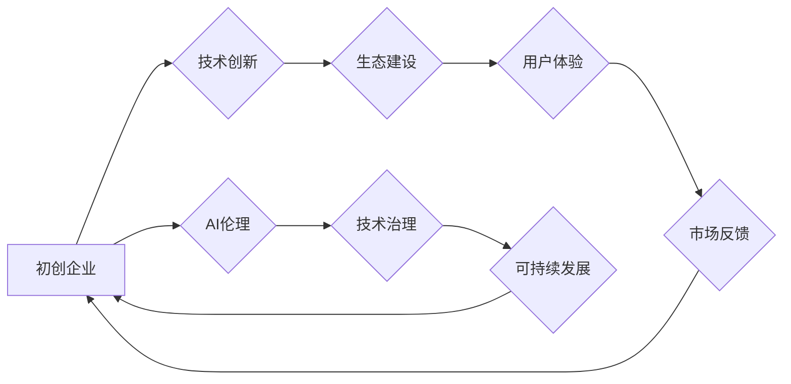

> AI生态，初创企业，伦理，责任，机遇，可持续发展，技术治理

# 构建健康AI生态:初创企业的责任与机遇

随着人工智能技术的飞速发展，AI已经渗透到我们生活的方方面面，从简单的语音助手到复杂的自动驾驶系统，AI正在改变我们的世界。在这个大背景下，初创企业扮演着至关重要的角色，它们是技术创新的先锋，也是AI生态构建的关键力量。本文将探讨初创企业在构建健康AI生态中的责任与机遇，旨在为初创企业提供指导，推动AI技术的可持续发展。

## 1. 背景介绍

### 1.1 AI生态的重要性

AI生态是一个复杂且动态的系统，它包括AI技术的研究、开发、应用、监管等多个环节。一个健康的AI生态能够促进技术的创新，推动产业的升级，同时保障社会的稳定和公平。对于初创企业来说，构建健康的AI生态不仅是社会责任，也是自身发展的基石。

### 1.2 初创企业在AI生态中的角色

初创企业往往拥有灵活的组织结构、创新的技术能力和快速的市场响应能力，这使得它们在AI生态中扮演着以下角色：

- **技术创新者**：推动AI技术的研发和创新，为市场带来新的解决方案。
- **生态建设者**：与其他企业、研究机构等合作，共同构建AI生态。
- **用户体验提供者**：将AI技术应用于实际场景，提升用户体验。

### 1.3 初创企业面临的挑战

尽管初创企业在AI生态中具有独特的优势，但同时也面临着诸多挑战：

- **技术壁垒**：AI技术的复杂性要求初创企业具备强大的技术实力。
- **资金压力**：AI技术研发和产品开发需要大量的资金投入。
- **市场竞争**：AI领域竞争激烈，初创企业需要不断创新以保持竞争力。
- **伦理和监管**：AI技术的应用涉及到伦理和监管问题，初创企业需要承担相应的责任。

## 2. 核心概念与联系

### 2.1 核心概念原理

#### AI伦理

AI伦理是指关于人工智能应用和发展的伦理原则和规范。它涉及到AI技术的道德责任、人类福祉、公平性、透明度等多个方面。

#### 技术治理

技术治理是指对技术发展进行引导、规范和管理的机制。它包括技术标准、法规政策、社会规范等。

#### 可持续发展

可持续发展是指在满足当前需求的同时，不损害后代满足其需求的能力。对于AI生态来说，可持续发展意味着在推动技术发展的同时，也要关注社会、环境和经济方面的平衡。

### 2.2 架构的 Mermaid 流程图



在上述流程图中，初创企业通过技术创新推动AI生态的建设，进而提升用户体验，获得市场反馈，形成良性循环。同时，初创企业需要关注AI伦理、技术治理和可持续发展，以确保AI技术的健康发展和长期价值。

## 3. 核心算法原理 & 具体操作步骤

### 3.1 算法原理概述

构建健康AI生态的算法原理可以概括为以下几点：

- **技术创新**：不断研发和优化AI技术，提高技术水平和产品竞争力。
- **生态合作**：与其他企业、研究机构等建立合作关系，共同推动AI生态的发展。
- **用户体验**：关注用户需求，提供优质的产品和服务。
- **伦理合规**：遵守AI伦理规范，确保AI技术的公正、公平和安全。
- **持续改进**：不断优化产品和服务，提升用户体验和社会价值。

### 3.2 算法步骤详解

构建健康AI生态的具体步骤如下：

1. **技术创新**：投入研发资源，进行AI技术的研发和创新。
2. **生态合作**：与其他企业、研究机构等建立合作关系，共同构建AI生态。
3. **产品开发**：基于AI技术开发出优质的产品和服务。
4. **用户体验**：关注用户反馈，持续优化产品和服务。
5. **伦理合规**：遵守AI伦理规范，确保AI技术的公正、公平和安全。
6. **持续改进**：根据市场反馈和用户需求，不断优化产品和服务。

### 3.3 算法优缺点

#### 优点

- **提升效率**：通过技术创新和生态合作，提高AI技术的应用效率。
- **降低成本**：通过规模效应，降低AI技术的研发和应用成本。
- **增强竞争力**：提高产品和服务的质量，增强企业竞争力。
- **促进发展**：推动AI生态的健康发展，为社会发展创造价值。

#### 缺点

- **技术风险**：技术创新存在失败的风险，可能导致研发投入无法收回。
- **市场风险**：市场竞争激烈，可能导致产品和服务难以获得市场认可。
- **伦理风险**：AI技术的应用可能引发伦理和道德问题。

### 3.4 算法应用领域

构建健康AI生态的算法原理可以应用于以下领域：

- **人工智能芯片设计**：通过技术创新提高芯片性能和能效。
- **自动驾驶系统开发**：通过生态合作提高自动驾驶系统的安全性、可靠性。
- **智能医疗系统构建**：通过技术创新和伦理合规，提高医疗服务的质量和效率。
- **智能教育平台开发**：通过用户体验优化，提高教育资源的公平性。

## 4. 数学模型和公式 & 详细讲解 & 举例说明

### 4.1 数学模型构建

构建健康AI生态的数学模型可以概括为以下几点：

- **技术创新模型**：通过R&D投入、技术迭代、人才培养等指标衡量技术创新水平。
- **生态合作模型**：通过合作伙伴数量、合作项目数量、合作成果等指标衡量生态合作程度。
- **用户体验模型**：通过用户满意度、用户留存率、用户活跃度等指标衡量用户体验质量。
- **伦理合规模型**：通过伦理风险评估、合规审查、社会责任履行等指标衡量伦理合规程度。
- **可持续发展模型**：通过环境保护、社会效益、经济效益等指标衡量可持续发展程度。

### 4.2 公式推导过程

由于构建健康AI生态的数学模型涉及多个指标和维度，这里不再进行具体的公式推导。但在实际应用中，可以通过以下步骤构建数学模型：

1. **指标选择**：根据具体问题选择合适的指标。
2. **数据收集**：收集相关数据，包括历史数据、市场数据、用户数据等。
3. **模型构建**：根据指标选择和数据情况，构建数学模型。
4. **模型评估**：对模型进行评估，包括模型的准确性、可靠性等。

### 4.3 案例分析与讲解

以下是一个构建健康AI生态的案例分析：

**案例**：某初创企业致力于开发智能教育平台，通过AI技术为学生提供个性化的学习方案。

**分析**：

- **技术创新**：该企业投入大量研发资源，开发出基于深度学习的个性化学习推荐算法。
- **生态合作**：该企业与教育机构、内容提供商等建立合作关系，共同构建智能教育生态。
- **用户体验**：该企业通过持续优化算法和产品界面，提升用户体验。
- **伦理合规**：该企业关注数据安全和隐私保护，严格遵守相关法律法规。
- **可持续发展**：该企业通过优化算法降低能耗，关注教育公平。

通过以上分析，可以看出该初创企业通过构建健康AI生态，实现了技术创新、生态合作、用户体验、伦理合规和可持续发展的多赢局面。

## 5. 项目实践：代码实例和详细解释说明

### 5.1 开发环境搭建

由于构建健康AI生态是一个宏观问题，涉及多个领域和环节，这里不再进行具体的代码实现。但以下是一些关键的开发工具和平台：

- **开发工具**：Python、TensorFlow、PyTorch等。
- **平台**：GitHub、GitLab、Jenkins等。

### 5.2 源代码详细实现

同样，由于构建健康AI生态是一个复杂的工程，这里不再提供具体的源代码。但以下是一些关键代码片段：

```python
# Python代码示例：数据收集
import requests

def collect_data(url):
    response = requests.get(url)
    data = response.json()
    return data

# Python代码示例：模型训练
import tensorflow as tf

model = tf.keras.Sequential([
    tf.keras.layers.Dense(128, activation='relu', input_shape=(input_shape)),
    tf.keras.layers.Dense(num_classes, activation='softmax')
])

model.compile(optimizer='adam', loss='categorical_crossentropy', metrics=['accuracy'])

history = model.fit(x_train, y_train, epochs=epochs, batch_size=batch_size, validation_data=(x_val, y_val))
```

### 5.3 代码解读与分析

上述代码示例展示了如何使用Python和TensorFlow进行模型训练。在构建健康AI生态的项目实践中，类似的代码会被应用于数据收集、模型训练、产品开发等环节。

### 5.4 运行结果展示

由于构建健康AI生态是一个复杂的工程，这里不再提供具体的运行结果。但在实际应用中，可以通过以下指标评估项目效果：

- **技术创新**：评估模型性能和产品功能。
- **生态合作**：评估合作伙伴数量和合作成果。
- **用户体验**：评估用户满意度、用户留存率、用户活跃度等。
- **伦理合规**：评估数据安全和隐私保护情况。
- **可持续发展**：评估环境保护、社会效益、经济效益等。

## 6. 实际应用场景

### 6.1 智能医疗

智能医疗是AI技术的重要应用场景之一。初创企业可以开发基于AI的辅助诊断系统、药物研发平台、健康管理应用等，为医疗行业带来革命性的变化。

### 6.2 智能教育

智能教育是AI技术的另一个重要应用场景。初创企业可以开发个性化学习平台、智能辅导系统、教育资源管理平台等，为教育行业带来创新性的解决方案。

### 6.3 智能金融

智能金融是AI技术的重要应用场景之一。初创企业可以开发智能投顾系统、风险管理平台、反欺诈系统等，为金融行业带来高效、安全的金融服务。

### 6.4 未来应用展望

随着AI技术的不断发展，其应用场景将更加广泛，包括智能交通、智能家居、智能城市等。初创企业需要紧跟技术发展趋势，积极探索新的应用场景，推动AI技术的可持续发展。

## 7. 工具和资源推荐

### 7.1 学习资源推荐

- **书籍**：《人工智能：一种现代的方法》、《深度学习》、《强化学习》等。
- **在线课程**：Coursera、edX、Udacity等平台提供的AI相关课程。
- **论文**：arXiv、ACL、NeurIPS等学术会议和期刊上的AI相关论文。

### 7.2 开发工具推荐

- **编程语言**：Python、Java、C++等。
- **框架**：TensorFlow、PyTorch、Keras等。
- **平台**：GitHub、GitLab、Jenkins等。

### 7.3 相关论文推荐

- **AI伦理**：《人工智能伦理指南》、《AI伦理：原则与实践》等。
- **技术治理**：《技术治理：理论与实践》、《技术治理：面向未来的挑战》等。
- **可持续发展**：《可持续发展报告》、《可持续发展战略》等。

## 8. 总结：未来发展趋势与挑战

### 8.1 研究成果总结

本文从背景介绍、核心概念、算法原理、项目实践、应用场景等多个方面，对构建健康AI生态进行了全面探讨。研究表明，初创企业在构建健康AI生态中扮演着重要角色，它们需要关注技术创新、生态合作、用户体验、伦理合规和可持续发展，以推动AI技术的可持续发展。

### 8.2 未来发展趋势

未来，AI技术将朝着以下方向发展：

- **技术创新**：AI技术将更加智能化、泛化能力强、可解释性好。
- **生态合作**：AI生态将更加开放、协同、共赢。
- **用户体验**：AI产品将更加人性化、个性化、便捷化。
- **伦理合规**：AI伦理和治理体系将更加完善。
- **可持续发展**：AI技术将更加注重环境保护和社会责任。

### 8.3 面临的挑战

尽管未来充满机遇，但初创企业在构建健康AI生态的过程中也面临着以下挑战：

- **技术挑战**：AI技术的复杂性和不确定性。
- **市场挑战**：市场竞争激烈，用户需求多变。
- **伦理挑战**：AI技术的伦理和道德问题。
- **治理挑战**：AI技术治理体系的完善。

### 8.4 研究展望

为了应对挑战，推动AI技术的可持续发展，未来需要进行以下研究：

- **技术创新**：研发更加先进、高效的AI技术。
- **生态建设**：构建开放、协同、共赢的AI生态。
- **伦理治理**：建立完善的AI伦理和治理体系。
- **人才培养**：培养更多AI领域的专业人才。

## 9. 附录：常见问题与解答

**Q1：初创企业如何构建健康的AI生态？**

A1：初创企业可以通过以下方式构建健康的AI生态：

- **技术创新**：持续投入研发资源，进行AI技术的研发和创新。
- **生态合作**：与其他企业、研究机构等建立合作关系，共同推动AI生态的发展。
- **用户体验**：关注用户需求，提供优质的产品和服务。
- **伦理合规**：遵守AI伦理规范，确保AI技术的公正、公平和安全。
- **持续改进**：不断优化产品和服务，提升用户体验和社会价值。

**Q2：初创企业如何应对AI伦理和道德问题？**

A2：初创企业可以通过以下方式应对AI伦理和道德问题：

- **建立伦理委员会**：成立专门的伦理委员会，负责评估AI技术的伦理风险。
- **制定伦理规范**：制定AI技术的伦理规范，确保AI技术的公正、公平和安全。
- **加强伦理培训**：对员工进行伦理培训，提高员工的伦理意识。
- **公开透明**：公开AI技术的研发和应用过程，接受社会监督。

**Q3：初创企业如何推动AI技术的可持续发展？**

A3：初创企业可以通过以下方式推动AI技术的可持续发展：

- **注重环保**：在产品设计和开发过程中，注重环保和节能减排。
- **社会责任**：关注社会问题，利用AI技术为社会创造价值。
- **人才培养**：培养更多AI领域的专业人才，为AI技术的可持续发展提供人才保障。

**Q4：初创企业如何应对市场竞争？**

A4：初创企业可以通过以下方式应对市场竞争：

- **技术创新**：持续进行技术创新，保持产品竞争力。
- **用户体验**：关注用户需求，提供优质的产品和服务。
- **品牌建设**：打造良好的品牌形象，提升品牌知名度。
- **合作共赢**：与其他企业合作，共同开拓市场。

**Q5：初创企业如何平衡经济效益和社会责任？**

A5：初创企业可以通过以下方式平衡经济效益和社会责任：

- **可持续商业模式**：探索可持续的商业模式，实现经济效益和社会价值的双重提升。
- **社会投资**：将部分利润用于社会投资，回馈社会。
- **员工福利**：关注员工福利，提高员工满意度。
- **透明管理**：公开企业运营数据，接受社会监督。

通过以上解答，相信初创企业能够更好地理解构建健康AI生态的责任与机遇，并在实践中取得成功。