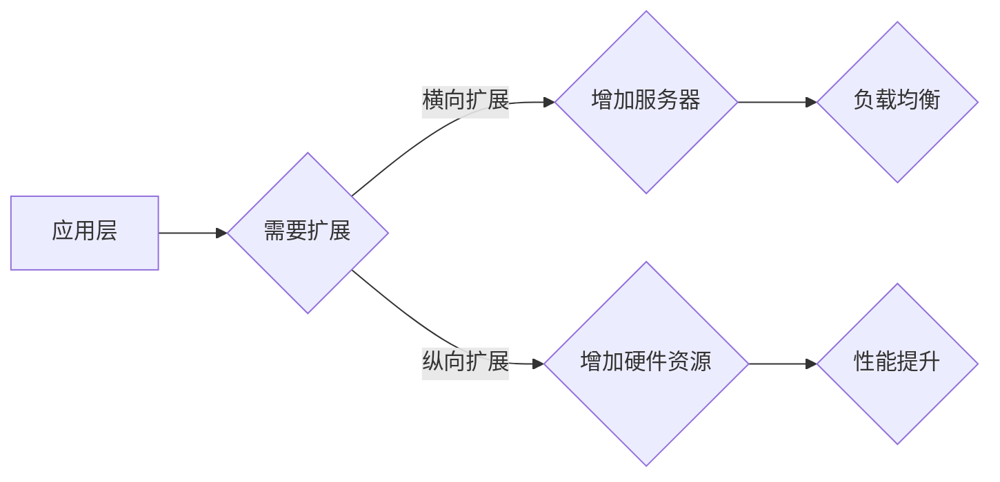

# 横向扩展与纵向扩展的最佳实践

> 关键词：横向扩展，纵向扩展，可伸缩性，分布式系统，负载均衡，资源管理，数据库，云计算

## 1. 背景介绍

随着互联网的快速发展，企业对IT系统的需求日益增长。如何构建可伸缩、可靠、高效的系统架构，成为了一个重要的课题。横向扩展（Horizontal Scaling）和纵向扩展（Vertical Scaling）是两种常见的系统伸缩策略，它们分别通过增加硬件资源和提高单个节点性能来实现系统的扩展。本文将深入探讨这两种扩展策略的原理、实践和最佳应用，帮助读者在构建可伸缩系统时做出明智的决策。

## 2. 核心概念与联系

### 2.1 核心概念

#### 横向扩展（Horizontal Scaling）

横向扩展是指通过增加服务器或节点数量来提高系统处理能力的方法。这种方法通常适用于负载均衡和可扩展性要求较高的应用。

#### 纵向扩展（Vertical Scaling）

纵向扩展是指通过增加单个服务器或节点的硬件资源（如CPU、内存、存储）来提高系统性能的方法。这种方法适用于对单个节点性能要求较高的应用。

### 2.2 架构原理和Mermaid流程图

以下是横向扩展和纵向扩展的Mermaid流程图：



### 2.3 关联分析

横向扩展和纵向扩展是系统可伸缩性的两种互补策略。在实际应用中，应根据系统的具体需求和资源限制，灵活选择合适的扩展方式。

## 3. 核心算法原理 & 具体操作步骤

### 3.1 算法原理概述

#### 横向扩展

- 算法原理：将负载分配到多个服务器或节点上，实现负载均衡。
- 操作步骤：
  1. 选择合适的负载均衡算法（如轮询、最少连接、IP哈希等）。
  2. 将请求分发到不同的服务器或节点。
  3. 监控系统性能，确保负载均衡。

#### 纵向扩展

- 算法原理：通过增加硬件资源（如CPU、内存、存储）来提高单个节点的性能。
- 操作步骤：
  1. 评估单个节点的性能瓶颈。
  2. 购买或升级硬件资源。
  3. 优化系统配置，确保硬件资源得到充分利用。

### 3.2 算法步骤详解

#### 横向扩展步骤详解

1. **评估需求**：分析系统负载，确定是否需要横向扩展。
2. **选择负载均衡器**：根据业务需求和网络环境选择合适的负载均衡器（如Nginx、HAProxy等）。
3. **配置负载均衡器**：设置负载均衡策略和健康检查机制。
4. **部署应用**：将应用部署到多个服务器或节点上。
5. **监控性能**：监控系统性能，确保负载均衡效果。

#### 纵向扩展步骤详解

1. **性能瓶颈分析**：通过性能分析工具（如Profiling、Logging等）确定系统瓶颈。
2. **硬件资源升级**：根据分析结果，购买或升级硬件资源。
3. **系统配置优化**：调整系统配置，确保硬件资源得到充分利用。
4. **测试**：在测试环境中验证系统性能。

### 3.3 算法优缺点

#### 横向扩展优缺点

- 优点：
  - 可扩展性强，易于应对突发流量。
  - 系统可用性高，故障转移方便。
- 缺点：
  - 系统复杂性增加，管理难度加大。
  - 硬件成本高，维护成本高。

#### 纵向扩展优缺点

- 优点：
  - 性能提升明显，单节点性能强。
  - 系统易于管理和维护。
- 缺点：
  - 可扩展性差，难以应对大规模负载。
  - 成本较高，硬件升级周期长。

### 3.4 算法应用领域

#### 横向扩展应用领域

- Web服务器
- 应用服务器
- 数据库副本

#### 纵向扩展应用领域

- 数据库主节点
- 关键业务服务器
- 高性能计算节点

## 4. 数学模型和公式 & 详细讲解 & 举例说明

### 4.1 数学模型构建

在横向扩展和纵向扩展中，常用的数学模型包括：

#### 负载均衡模型

- $ L = \frac{1}{N} \sum_{i=1}^{N} L_i $

其中 $ L $ 为系统总负载，$ L_i $ 为第 $ i $ 个节点的负载，$ N $ 为节点总数。

#### 资源利用模型

- $ R = \frac{C}{T} $

其中 $ R $ 为资源利用率，$ C $ 为资源消耗，$ T $ 为时间。

### 4.2 公式推导过程

#### 负载均衡模型

假设系统由 $ N $ 个节点组成，每个节点负载均衡分配，则有：

- $ L_1 = \frac{L}{N} $
- $ L_2 = \frac{L}{N} $
- ...
- $ L_N = \frac{L}{N} $

因此，系统总负载为：

- $ L = \frac{L}{N} + \frac{L}{N} + \ldots + \frac{L}{N} = \frac{1}{N} \sum_{i=1}^{N} L_i $

#### 资源利用模型

资源利用率是指资源消耗与时间的比值，表示为：

- $ R = \frac{C}{T} $

其中 $ C $ 为资源消耗，$ T $ 为时间。

### 4.3 案例分析与讲解

以下是一个简单的横向扩展案例：

假设一个Web服务器每秒处理100个请求，现有3个节点，每个节点每秒处理33个请求。若将节点数量增加到6个，则每个节点每秒处理约16.7个请求。

通过横向扩展，系统可以更好地应对突发流量，提高系统可用性。

## 5. 项目实践：代码实例和详细解释说明

### 5.1 开发环境搭建

本节将以使用Nginx作为负载均衡器为例，演示横向扩展的实践过程。

1. 安装Nginx：在服务器上安装Nginx。
2. 配置Nginx：编辑Nginx配置文件（如nginx.conf），配置负载均衡策略。

### 5.2 源代码详细实现

以下是一个简单的Nginx配置文件示例：

```nginx
http {
    upstream webserver {
        server server1.example.com;
        server server2.example.com;
        server server3.example.com;
    }

    server {
        listen 80;

        location / {
            proxy_pass http://webserver;
        }
    }
}
```

### 5.3 代码解读与分析

在上面的配置文件中，我们定义了一个名为 `webserver` 的upstream，其中包括了三个服务器节点。当请求到达Nginx时，请求将被分发到这些节点中的任意一个。

### 5.4 运行结果展示

运行Nginx服务器，并使用压力测试工具（如ApacheBench）模拟并发请求，可以观察到请求在多个节点之间进行负载均衡。

## 6. 实际应用场景

### 6.1 云计算平台

云计算平台通常采用横向扩展策略，通过增加虚拟机实例数量来提高系统处理能力。

### 6.2 大数据处理

在大数据处理领域，横向扩展是提高数据处理速度和容量的关键。

### 6.3 电子商务平台

电子商务平台通过横向扩展来提高系统处理能力，应对购物高峰期。

## 7. 工具和资源推荐

### 7.1 学习资源推荐

- 《大型网站技术架构》
- 《分布式系统原理与范型》
- 《集群系统与云计算》

### 7.2 开发工具推荐

- Nginx
- HAProxy
- Kubernetes

### 7.3 相关论文推荐

-《大规模分布式存储系统》
-《负载均衡算法研究综述》
-《云计算平台的可伸缩性设计》

## 8. 总结：未来发展趋势与挑战

### 8.1 研究成果总结

本文介绍了横向扩展和纵向扩展的原理、实践和最佳应用，并分析了其在实际应用场景中的价值。

### 8.2 未来发展趋势

随着云计算、大数据和物联网等技术的发展，横向扩展和纵向扩展将在更多领域得到应用。

### 8.3 面临的挑战

- 资源管理的复杂性
- 系统安全与稳定性
- 系统可观测性

### 8.4 研究展望

未来，横向扩展和纵向扩展技术将朝着更加智能化、自动化、高效化的方向发展。

## 9. 附录：常见问题与解答

### 9.1 横向扩展和纵向扩展的区别

- 横向扩展：通过增加服务器或节点数量来提高系统处理能力。
- 纵向扩展：通过增加单个服务器或节点的硬件资源来提高系统性能。

### 9.2 何时使用横向扩展？

当系统负载较高，且对性能要求不是特别高时，可以考虑使用横向扩展。

### 9.3 何时使用纵向扩展？

当系统对性能要求较高，且资源充足时，可以考虑使用纵向扩展。

### 9.4 如何选择负载均衡算法？

选择负载均衡算法时，需要考虑以下因素：

- 系统负载特性
- 网络环境
- 节点性能

作者：禅与计算机程序设计艺术 / Zen and the Art of Computer Programming