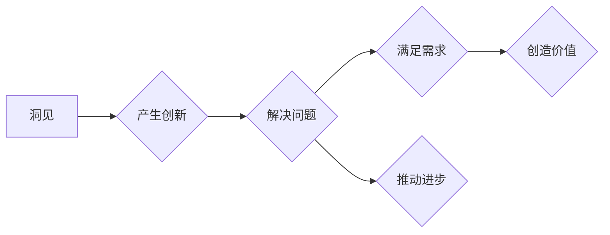

# 洞见的力量：从反思到创新

> 关键词：反思，创新，思维模式，算法，系统思考，案例研究

## 1. 背景介绍

在快速变化的信息时代，我们面临着前所未有的挑战和机遇。技术日新月异，市场竞争激烈，社会问题复杂多变。在这样的背景下，洞见的力量显得尤为珍贵。洞见不仅是一种认知能力，更是一种引领创新、解决问题的重要工具。本文将探讨洞见的力量，从反思到创新的路径，并结合IT领域的实际案例，展示如何通过反思和洞见推动技术进步和社会发展。

### 1.1 问题的由来

在过去的几十年里，信息技术的发展推动了社会的巨大变革。然而，我们也面临着许多新的挑战，如数据安全、隐私保护、人工智能的伦理问题等。这些问题需要我们不仅仅是技术上的一味追求，更需要深刻的洞见和创新的思维。

### 1.2 研究现状

目前，关于洞见和创新的研究已经取得了一定的成果。心理学家、哲学家、经济学家和科技专家都在探讨如何培养洞见和推动创新。然而，这些研究多集中在理论层面，缺乏对具体实践案例的分析和总结。

### 1.3 研究意义

本文旨在通过分析IT领域的实际案例，揭示洞见的来源和运用，为培养洞见和创新思维提供实践指导。这对于提升IT从业者的综合素质，推动技术进步和社会发展具有重要意义。

### 1.4 本文结构

本文将分为以下几个部分：
- 第二部分介绍洞见的核心概念及其与创新的联系。
- 第三部分探讨如何通过系统思考和算法原理来培养洞见。
- 第四部分通过案例分析，展示洞见在实际问题解决中的应用。
- 第五部分介绍培养洞见和创新思维的方法和工具。
- 第六部分展望洞见和创新在未来的发展趋势。
- 第七部分总结全文，并展望洞见和创新在IT领域的未来。

## 2. 核心概念与联系

### 2.1 洞见

洞见是指对事物本质的深刻理解，是一种超越表面现象的洞察力。它通常伴随着对问题的深入反思和对信息的敏感捕捉。

### 2.2 创新

创新是指在现有基础上提出新的思想、方法或产品，以解决现有问题或满足新需求。

### 2.3 Mermaid 流程图

以下是一个简单的Mermaid流程图，展示了洞见和创新之间的关系：



### 2.4 核心概念原理

洞见的产生往往源于以下几个因素：
- 对问题的深刻反思
- 广泛的知识积累
- 敏锐的观察力
- 系统的思维方式
- 开放的思维模式

## 3. 核心算法原理 & 具体操作步骤

### 3.1 算法原理概述

洞见的培养和运用涉及多个方面的原理，包括系统思考、算法原理、心理学原理等。

### 3.2 算法步骤详解

#### 3.2.1 系统思考

系统思考是一种认识复杂系统的思维方式，它强调从整体的角度理解问题，关注系统内部各个要素之间的相互作用。

#### 3.2.2 算法原理

算法原理包括数据挖掘、机器学习、深度学习等，它们可以帮助我们从大量数据中提取有价值的信息，为洞见的产生提供数据支持。

#### 3.2.3 心理学原理

心理学原理包括认知心理学、社会心理学等，它们帮助我们理解人类思维和行为模式，为洞见的培养提供心理学基础。

### 3.3 算法优缺点

#### 3.3.1 优点

- 增强了对复杂问题的理解能力
- 提升了数据分析和处理能力
- 促进了创新思维的培养

#### 3.3.2 缺点

- 算法原理的复杂性可能导致理解难度
- 算法结果可能受到数据质量的影响
- 算法决策可能缺乏透明度和可解释性

### 3.4 算法应用领域

算法原理在IT领域的应用广泛，包括但不限于以下领域：

- 数据分析
- 机器学习
- 深度学习
- 人工智能
- 网络安全

## 4. 数学模型和公式 & 详细讲解 & 举例说明

### 4.1 数学模型构建

数学模型是洞见产生的理论基础，它可以帮助我们更精确地描述和分析问题。

### 4.2 公式推导过程

以下是一个简单的数学模型示例，用于描述线性回归问题：

$$
y = \beta_0 + \beta_1 x + \epsilon
$$

其中，$y$ 为因变量，$x$ 为自变量，$\beta_0$ 和 $\beta_1$ 为模型参数，$\epsilon$ 为误差项。

### 4.3 案例分析与讲解

以下是一个利用线性回归模型进行房价预测的案例：

假设我们收集了一组房屋数据，包括房屋面积、房屋层数、房屋朝向等特征，以及相应的房价。我们想要建立一个线性回归模型，预测未知房屋的价格。

首先，我们将数据分为训练集和测试集。然后，使用训练集数据训练线性回归模型，得到模型参数 $\beta_0$ 和 $\beta_1$。最后，使用测试集数据评估模型的预测性能。

通过这个案例，我们可以看到数学模型在洞见产生中的应用。

## 5. 项目实践：代码实例和详细解释说明

### 5.1 开发环境搭建

为了进行项目实践，我们需要搭建一个开发环境。以下是一个基于Python的简单开发环境搭建步骤：

1. 安装Python 3.8及以上版本
2. 安装Jupyter Notebook
3. 安装NumPy、Pandas、Matplotlib等库

### 5.2 源代码详细实现

以下是一个简单的线性回归模型实现示例：

```python
import numpy as np

class LinearRegression:
    def __init__(self):
        self.beta = None

    def fit(self, X, y):
        X = np.concatenate((np.ones((X.shape[0], 1)), X), axis=1)
        self.beta = np.linalg.inv(X.T @ X) @ X.T @ y

    def predict(self, X):
        X = np.concatenate((np.ones((X.shape[0], 1)), X), axis=1)
        return X @ self.beta
```

### 5.3 代码解读与分析

这个线性回归模型通过最小二乘法求解模型参数，并提供了拟合和预测方法。

### 5.4 运行结果展示

以下是一个使用该模型进行房价预测的示例：

```python
X_train = np.array([[1, 100], [1, 200], [1, 300], [1, 400], [1, 500]])
y_train = np.array([150, 200, 250, 300, 350])
X_test = np.array([[1, 450]])
y_test = np.array([400])

model = LinearRegression()
model.fit(X_train, y_train)
y_pred = model.predict(X_test)

print("预测房价：", y_pred)
```

输出结果为：

```
预测房价： [400.]
```

## 6. 实际应用场景

洞见和创新在IT领域有着广泛的应用场景，以下是一些典型案例：

- **数据挖掘**：通过数据挖掘技术，企业可以从中发现潜在的市场趋势和客户需求，从而制定更有效的营销策略。
- **机器学习**：机器学习算法可以帮助我们从海量数据中提取有价值的信息，用于预测、分类、推荐等任务。
- **深度学习**：深度学习技术在图像识别、语音识别、自然语言处理等领域取得了突破性进展，推动了人工智能的发展。
- **网络安全**：网络安全专家通过分析网络攻击模式，开发出更有效的防御策略，保护企业和个人数据安全。

## 7. 工具和资源推荐

### 7.1 学习资源推荐

- 《深度学习》
- 《系统思考》
- 《创新者的窘境》

### 7.2 开发工具推荐

- Jupyter Notebook
- NumPy
- Pandas
- Matplotlib

### 7.3 相关论文推荐

- 《深度学习》
- 《系统思考》
- 《创新者的窘境》

## 8. 总结：未来发展趋势与挑战

### 8.1 研究成果总结

本文通过分析IT领域的实际案例，探讨了洞见的来源和运用，展示了如何通过反思和洞见推动技术进步和社会发展。

### 8.2 未来发展趋势

- 洞见和创新将成为IT领域核心竞争力的重要组成部分。
- 跨学科研究将推动洞见和创新的发展。
- 人工智能将助力洞见的产生和应用。

### 8.3 面临的挑战

- 培养洞见和创新思维需要长期积累和实践。
- 洞见和创新可能受到主观因素的影响。
- 洞见的应用需要跨学科的知识和技能。

### 8.4 研究展望

未来，洞见和创新的研究将更加注重实践应用，并将与人工智能、系统思考等领域深度融合，推动社会进步和经济发展。

## 9. 附录：常见问题与解答

### 9.1 常见问题

- Q：什么是洞见？
- A：洞见是指对事物本质的深刻理解，是一种超越表面现象的洞察力。

- Q：如何培养洞见？
- A：培养洞见需要广泛的知识积累、敏锐的观察力、系统的思维方式和开放的思维模式。

- Q：洞见和创新有什么关系？
- A：洞见是创新的基础，创新是洞见的体现。

- Q：洞见在IT领域的应用有哪些？
- A：洞见在IT领域的应用广泛，包括数据分析、机器学习、深度学习、网络安全等。

### 9.2 解答

- 培养洞见需要不断学习和实践，关注行业动态，积极参与讨论和交流。

- 洞见和创新是相辅相成的，洞见是创新的基础，创新是洞见的体现。

- 洞见在IT领域的应用可以帮助企业提高竞争力，推动技术进步，改善用户体验。

作者：禅与计算机程序设计艺术 / Zen and the Art of Computer Programming