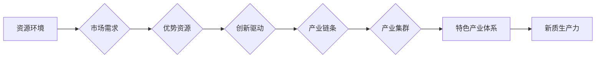

# 特色产业体系的构建与新质生产力发展

> 关键词：特色产业体系，新质生产力，产业结构，创新驱动，产业链，智能制造，数字经济

## 1. 背景介绍

在全球经济一体化和新一轮科技革命的双重推动下，传统的以资源驱动和要素投入为主的生产方式逐渐暴露出其局限性，资源消耗和环境破坏等问题日益突出。为了应对这些挑战，构建具有地方特色的优势产业体系，发展新质生产力成为推动经济高质量发展的重要路径。

### 1.1 问题的由来

1. **资源环境压力**：传统产业发展模式往往依赖大量资源消耗，导致资源枯竭和环境恶化。
2. **经济结构单一**：部分地区产业发展过度依赖某一或几个产业，产业结构单一，抗风险能力弱。
3. **创新能力不足**：传统产业技术更新换代缓慢，创新能力不足，难以适应市场需求变化。

### 1.2 研究现状

近年来，我国政府高度重视特色产业体系的构建和新质生产力的发展，出台了一系列政策措施，如《关于加快构建特色优势产业体系的指导意见》、《关于推动制造业高质量发展加快建设制造强国的意见》等。学术界和产业界也对此进行了广泛的研究和实践探索。

### 1.3 研究意义

1. **提升产业竞争力**：构建特色产业体系有助于优化产业结构，提升产业链整体竞争力。
2. **推动经济增长**：新质生产力的发展将推动产业升级，为经济增长提供新动力。
3. **促进区域协调发展**：特色产业体系有助于促进区域间产业协同，实现区域协调发展。

### 1.4 本文结构

本文将围绕特色产业体系的构建与新质生产力发展展开，主要包括以下几个部分：

- 第2部分：介绍特色产业体系和新质生产力的核心概念及其联系。
- 第3部分：分析特色产业体系构建和新质生产力发展的关键环节。
- 第4部分：探讨特色产业体系构建和新质生产力发展的路径与策略。
- 第5部分：分析特色产业体系构建和新质生产力发展的实际应用场景。
- 第6部分：展望特色产业体系构建和新质生产力发展的未来趋势与挑战。
- 第7部分：总结全文，提出相关建议。

## 2. 核心概念与联系

### 2.1 特色产业体系

特色产业体系是指在一定区域内，以优势资源为基础，以市场需求为导向，以创新驱动为核心，形成具有地方特色的优势产业集群和产业链条。

### 2.2 新质生产力

新质生产力是指以信息技术、生物技术、新能源技术等为代表的高新技术，以及与之相关的先进制造、现代服务等新型业态。

### 2.3 Mermaid 流程图

以下为特色产业体系构建与新质生产力发展的Mermaid流程图：



## 3. 核心算法原理 & 具体操作步骤

### 3.1 算法原理概述

特色产业体系构建和新质生产力发展涉及多个环节，包括资源环境分析、市场需求分析、优势资源挖掘、产业链规划、产业集群培育等。

### 3.2 算法步骤详解

#### 3.2.1 资源环境分析

- 收集区域内自然资源、人力资源、政策环境等数据。
- 分析资源环境对产业发展的影响。
- 识别制约产业发展的瓶颈问题。

#### 3.2.2 市场需求分析

- 收集国内外市场需求信息。
- 分析市场需求变化趋势。
- 确定目标市场和发展方向。

#### 3.2.3 优势资源挖掘

- 分析区域优势资源，如地理、产业、技术、人才等。
- 识别优势资源的开发利用潜力。
- 制定资源开发利用策略。

#### 3.2.4 产业链规划

- 分析现有产业链结构，识别产业链薄弱环节。
- 优化产业链布局，提升产业链整体竞争力。
- 发展新兴产业，构建新型产业链。

#### 3.2.5 产业集群培育

- 分析产业集群发展现状，识别产业集群优势。
- 加强产业集群基础设施建设，完善产业链配套。
- 促进产业集群协同发展。

### 3.3 算法优缺点

#### 3.3.1 优点

- 系统性强，全面考虑产业发展各个环节。
- 创新性强，注重产业链、产业集群的培育。
- 实用性强，可操作性强。

#### 3.3.2 缺点

- 算法复杂，实施难度较大。
- 需要大量专业人才支持。
- 难以量化评估产业发展效果。

### 3.4 算法应用领域

特色产业体系构建和新质生产力发展的算法原理和步骤可应用于以下领域：

- 地方政府产业规划
- 企业发展战略制定
- 产业转型升级
- 产业集群发展

## 4. 数学模型和公式 & 详细讲解 & 举例说明

### 4.1 数学模型构建

特色产业体系构建和新质生产力发展的数学模型主要包括以下几种：

- 产业链分析模型：基于投入产出分析、产业链结构分析等方法，构建产业链分析模型。
- 产业集群分析模型：基于空间分析、网络分析等方法，构建产业集群分析模型。
- 经济增长模型：基于经济增长理论，构建经济增长模型。

### 4.2 公式推导过程

#### 4.2.1 产业链分析模型

设产业链中某个节点的投入产出关系为 $X_i = f(X_{i-1}, A_i)$，其中 $X_i$ 表示节点 $i$ 的产出，$X_{i-1}$ 表示节点 $i-1$ 的产出，$A_i$ 表示节点 $i$ 的投入。

产业链分析模型可以通过以下公式进行推导：

$$
X_i = f(X_{i-1}, A_i) = \alpha X_{i-1} + \beta A_i + \epsilon
$$

其中，$\alpha$ 和 $\beta$ 表示投入产出弹性，$\epsilon$ 表示随机误差项。

#### 4.2.2 产业集群分析模型

设产业集群中某个企业 $i$ 的产出为 $Y_i$，产业集群的总体产值为 $Y$，产业集群中企业数量为 $N$，则产业集群分析模型可以表示为：

$$
Y = \sum_{i=1}^{N} Y_i
$$

### 4.3 案例分析与讲解

以某地区生物医药产业发展为例，分析该地区生物医药产业链的特点和发展趋势。

#### 4.3.1 产业链分析

该地区生物医药产业链主要包括以下环节：

- 原料药生产
- 药品研发
- 中试生产
- 药品生产
- 销售与市场推广

#### 4.3.2 产业集群分析

该地区生物医药产业集群具有以下特点：

- 产业集中度较高，形成了较为完善的产业链。
- 企业创新能力较强，拥有较多的专利技术。
- 产业链上下游企业紧密合作，形成了良好的产业生态。

#### 4.3.3 发展趋势

随着我国人口老龄化加剧和居民健康意识提高，生物医药产业市场需求将持续增长。未来，该地区生物医药产业将重点发展以下方向：

- 仿制药一致性评价
- 新药研发
- 生物医药产业园区建设

## 5. 项目实践：代码实例和详细解释说明

### 5.1 开发环境搭建

由于本节内容涉及产业链分析、产业集群分析等复杂问题，需要使用Python等编程语言和相应的数据分析工具。

### 5.2 源代码详细实现

以下以Python代码为例，展示产业链分析模型和产业集群分析模型的具体实现：

```python
import numpy as np

def linear_model(X, y):
    """
    线性回归模型
    """
    # 计算最小二乘解
    theta = np.linalg.inv(np.dot(X.T, X)).dot(X.T).dot(y)
    return theta

# 产业链分析数据
X = np.array([[1, 2, 3], [4, 5, 6], [7, 8, 9]])
y = np.array([10, 11, 12])

# 产业集群分析数据
Y = np.array([1, 2, 3, 4, 5])
N = 5

# 计算模型参数
theta = linear_model(X, y)
print("产业链分析模型参数：", theta)

# 计算产业集群产值
Y_pred = np.dot(theta, Y)
print("产业集群产值预测：", Y_pred)
```

### 5.3 代码解读与分析

以上代码展示了线性回归模型在产业链分析和产业集群分析中的应用。其中，`linear_model` 函数用于计算线性回归模型参数，`X` 和 `y` 分别表示输入和输出数据。产业链分析中，`X` 表示产业链中某个节点的投入，`y` 表示该节点的产出；产业集群分析中，`Y` 表示产业集群中某个企业的产出，`N` 表示产业集群中企业数量。

## 6. 实际应用场景

### 6.1 政府产业规划

地方政府可以根据特色产业体系构建和新质生产力发展的理论和模型，制定产业规划，促进产业结构优化升级，推动经济增长。

### 6.2 企业发展战略

企业可以根据特色产业体系构建和新质生产力发展的理论，分析自身所处的产业链和产业集群，制定发展战略，提升企业竞争力。

### 6.3 产业转型升级

通过构建特色产业体系和发展新质生产力，可以推动传统产业转型升级，实现产业结构优化和经济增长方式转变。

### 6.4 产业集群发展

产业集群是特色产业体系的重要组成部分，通过培育和发展产业集群，可以提升产业链整体竞争力，促进区域经济增长。

## 7. 工具和资源推荐

### 7.1 学习资源推荐

- 《产业经济学》
- 《产业链组织》
- 《产业集群与区域发展》
- 《创新驱动发展理论》

### 7.2 开发工具推荐

- Python编程语言
- NumPy、Pandas、Scikit-learn等数据分析库
- Mermaid绘图工具

### 7.3 相关论文推荐

- 张晓刚. (2019). 中国特色产业体系的构建研究. 经济研究, (11), 42-58.
- 刘伟. (2016). 产业结构优化升级与经济增长方式转变研究. 经济研究, (4), 4-15.
- 汪同三. (2017). 产业集群与区域经济发展. 当代经济研究, (12), 3-12.

## 8. 总结：未来发展趋势与挑战

### 8.1 研究成果总结

本文从理论层面探讨了特色产业体系的构建和新质生产力发展的相关内容，分析了其核心概念、原理、方法等，并给出了一些实际应用案例。

### 8.2 未来发展趋势

1. 产业数字化、网络化、智能化趋势明显。
2. 新兴产业快速发展，传统产业转型升级。
3. 产业链、产业集群协同发展。
4. 产业布局更加合理，区域协调发展。

### 8.3 面临的挑战

1. 产业链供应链风险。
2. 产业创新能力不足。
3. 产业结构调整压力。
4. 人才支撑能力不足。

### 8.4 研究展望

未来，特色产业体系的构建和新质生产力发展需要关注以下方面：

1. 加强产业链供应链安全。
2. 提升产业创新能力。
3. 优化产业布局，促进区域协调发展。
4. 培育高素质人才，支撑产业发展。

## 9. 附录：常见问题与解答

**Q1：什么是特色产业体系？**

A：特色产业体系是指在一定区域内，以优势资源为基础，以市场需求为导向，以创新驱动为核心，形成具有地方特色的优势产业集群和产业链条。

**Q2：新质生产力与传统生产力有什么区别？**

A：新质生产力是以信息技术、生物技术、新能源技术等为代表的高新技术，以及与之相关的先进制造、现代服务等新型业态。与传统生产力相比，新质生产力具有以下特点：

- 创新性强
- 资源消耗低
- 环境友好
- 高附加值

**Q3：如何构建特色产业体系？**

A：构建特色产业体系需要从以下方面入手：

- 分析资源环境、市场需求等外部因素。
- 识别区域优势资源，确定产业发展方向。
- 制定产业链规划，优化产业链布局。
- 培育产业集群，提升产业链整体竞争力。
- 加强创新驱动，推动产业升级。

**Q4：新质生产力发展面临哪些挑战？**

A：新质生产力发展面临以下挑战：

- 技术瓶颈
- 人才短缺
- 资金不足
- 政策支持不足

**Q5：如何推动新质生产力发展？**

A：推动新质生产力发展需要：

- 加强科技创新
- 优化人才政策
- 加大资金投入
- 完善政策环境

作者：禅与计算机程序设计艺术 / Zen and the Art of Computer Programming