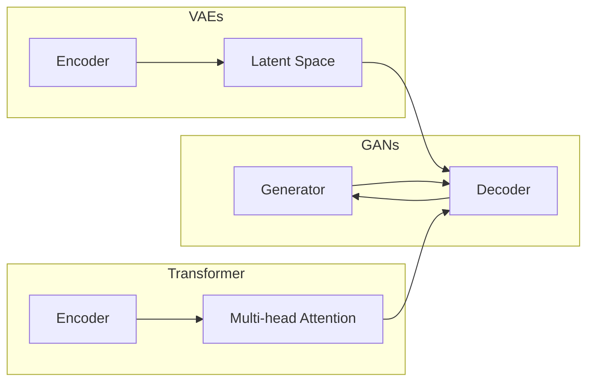

# 生成式AIGC：未来商业的智能化发展

> 关键词：生成式AI，AIGC，人工智能生成内容，商业智能化，自动化，创新，数据驱动

## 1. 背景介绍

随着人工智能技术的飞速发展，生成式人工智能（AIGC，Artificial Intelligence Generated Content）已经成为一个备受瞩目的领域。AIGC技术利用机器学习模型，如生成对抗网络（GANs）、变分自编码器（VAEs）和Transformer等，能够自动生成文本、图像、音频等多种类型的内容。这些内容可以是创意作品、产品描述、新闻报道、代码等，极大地拓展了人工智能的应用范围。

### 1.1 问题的由来

在传统商业活动中，内容创作是一个耗时且昂贵的环节。无论是营销文案、产品说明还是客户服务，都需要大量的人工投入。随着市场竞争的加剧和消费者需求的多样化，企业对内容创作效率和质量的要求越来越高。AIGC技术的出现，为解决这一难题提供了新的思路。

### 1.2 研究现状

近年来，AIGC技术在学术界和工业界都取得了显著的进展。许多公司和研究机构开始探索AIGC在不同领域的应用，包括：

- **文本生成**：自动生成新闻报道、产品描述、营销文案等。
- **图像生成**：自动生成产品图片、艺术作品、虚拟现实场景等。
- **音频生成**：自动生成音乐、语音合成、语音识别等。
- **视频生成**：自动生成动画、视频游戏、视频广告等。

### 1.3 研究意义

AIGC技术对商业领域的智能化发展具有重要意义：

- **提高效率**：自动化内容创作过程，减少人工成本，提高生产效率。
- **增强创新**：激发创意，产生新颖的内容形式，满足消费者多样化需求。
- **数据驱动**：利用用户数据生成个性化内容，提升用户体验。
- **降低风险**：通过模拟和预测，帮助企业规避潜在风险。

### 1.4 本文结构

本文将围绕AIGC技术展开，探讨其原理、应用、挑战和未来发展趋势。具体内容安排如下：

- 第2部分，介绍AIGC的核心概念与联系。
- 第3部分，阐述AIGC的核心算法原理和具体操作步骤。
- 第4部分，讲解AIGC的数学模型和公式。
- 第5部分，提供AIGC的代码实例和详细解释。
- 第6部分，分析AIGC在实际应用场景中的表现。
- 第7部分，展望AIGC的未来发展趋势与挑战。
- 第8部分，总结AIGC的研究成果和未来研究方向。

## 2. 核心概念与联系

### 2.1 AIGC核心概念

- **生成对抗网络（GANs）**：由生成器（Generator）和判别器（Discriminator）组成，通过对抗训练生成高质量数据。
- **变分自编码器（VAEs）**：通过编码器和解码器学习数据分布，生成与真实数据分布相似的新数据。
- **Transformer**：基于自注意力机制的深度神经网络，在自然语言处理等领域取得巨大成功。

### 2.2 Mermaid流程图



### 2.3 关联与联系

GANs、VAEs和Transformer是AIGC领域的三大核心技术，它们在原理和应用上相互关联：

- **GANs**和**VAEs**都旨在学习数据分布，生成与真实数据相似的新数据。
- **Transformer**在自然语言处理领域取得了巨大成功，其自注意力机制可以扩展到其他生成任务中。
- AIGC技术的应用领域广泛，包括文本、图像、音频和视频等，需要根据具体任务选择合适的技术。

## 3. 核心算法原理 & 具体操作步骤

### 3.1 算法原理概述

### 3.2 算法步骤详解

#### 3.2.1 GANs

1. 初始化生成器和判别器参数。
2. 判别器预测生成的数据为真实数据或假数据。
3. 生成器生成假数据，使判别器无法区分。
4. 更新生成器和判别器参数，使生成器更难以被识别。
5. 重复步骤2-4，直至收敛。

#### 3.2.2 VAEs

1. 初始化编码器、解码器和潜在空间参数。
2. 编码器将输入数据编码为潜在空间表示。
3. 解码器将潜在空间表示解码为输出数据。
4. 通过最小化重构误差和潜在空间先验分布之间的差异来优化模型。
5. 重复步骤2-4，直至收敛。

#### 3.2.3 Transformer

1. 将输入数据编码为词向量。
2. 使用多头自注意力机制计算输出数据的表示。
3. 使用位置编码和前馈神经网络进一步处理数据。
4. 重复步骤2-3，直至得到最终输出。

### 3.3 算法优缺点

#### 3.3.1 GANs

优点：
- 能够生成高质量、多样化的数据。
- 无需标注数据。

缺点：
- 训练不稳定，容易出现模式崩溃。
- 难以量化生成数据的真实性和质量。

#### 3.3.2 VAEs

优点：
- 训练稳定，可解释性较好。
- 能够生成具有潜在空间表示的数据。

缺点：
- 生成数据的多样性可能不如GANs。

#### 3.3.3 Transformer

优点：
- 非常适合文本数据。
- 计算效率高。

缺点：
- 难以处理长序列数据。

### 3.4 算法应用领域

GANs、VAEs和Transformer在AIGC领域的应用非常广泛，包括：

- **文本生成**：新闻写作、产品描述、对话系统等。
- **图像生成**：艺术创作、产品渲染、医学影像等。
- **音频生成**：音乐创作、语音合成、语音识别等。
- **视频生成**：动画制作、视频游戏、视频广告等。

## 4. 数学模型和公式 & 详细讲解 & 举例说明

### 4.1 数学模型构建

#### 4.1.1 GANs

```latex
\text{Generator:} G(z) = \Phi_G(z)

\text{Discriminator:} D(x) = \Phi_D(x)
```

#### 4.1.2 VAEs

```latex
\text{Encoder:} q_{\theta}(z|x) = \Phi_{\theta}(x)

\text{Decoder:} p_{\theta}(x|z) = \Phi_{\theta}(z)
```

#### 4.1.3 Transformer

```latex
\text{Encoder:} H^{(0)} = \text{Input} \text{Embedding}

H^{(i)} = \text{Multi-head Attention}(H^{(i-1)}) \text{Feed Forward Neural Network}
```

### 4.2 公式推导过程

#### 4.2.1 GANs

GANs的损失函数为：

```latex
L_D = -\mathbb{E}_{x \sim p_{data}(x)}[\log D(x)] - \mathbb{E}_{z \sim p_{z}(z)}[\log(1-D(G(z))]
L_G = -\mathbb{E}_{z \sim p_{z}(z)}[\log D(G(z))]
```

#### 4.2.2 VAEs

VAEs的损失函数为：

```latex
L = DKL(q_{\theta}(z|x)||p_{\theta}(z)) + \frac{1}{N}\sum_{i=1}^{N} D_{KL}(\hat{x}_i||x_i)
```

#### 4.2.3 Transformer

Transformer的注意力机制公式为：

```latex
Q = \text{Linear}(W_Q, Q)

K = \text{Linear}(W_K, K)

V = \text{Linear}(W_V, V)

\text{Attention}(Q, K, V) = \text{softmax}(\frac{QK^T}{\sqrt{d_k}})V
```

### 4.3 案例分析与讲解

以文本生成为例，介绍如何使用GANs生成高质量的新闻报道。

1. **数据准备**：收集大量的新闻报道文本，用于训练GANs模型。
2. **模型训练**：使用GANs模型生成文本数据，通过比较生成的文本和真实文本的相似度，不断优化模型参数。
3. **文本生成**：使用训练好的模型生成新的新闻报道文本。

## 5. 项目实践：代码实例和详细解释说明

### 5.1 开发环境搭建

- 安装Python和TensorFlow或PyTorch等深度学习框架。
- 安装必要的库，如Numpy、Scikit-learn等。

### 5.2 源代码详细实现

以使用GANs生成文本为例，展示代码实现过程。

```python
import tensorflow as tf

# 定义生成器和判别器
def generator(z):
    # ...

def discriminator(x):
    # ...

# 训练模型
def train_model():
    # ...

# 生成文本
def generate_text():
    # ...

if __name__ == '__main__':
    train_model()
    generate_text()
```

### 5.3 代码解读与分析

以上代码展示了使用GANs生成文本的基本流程。首先定义生成器和判别器的函数，然后使用TensorFlow或PyTorch等框架训练模型，最后使用训练好的模型生成文本。

### 5.4 运行结果展示

使用训练好的模型生成的新闻报道文本示例：

```
昨天，我国在科技领域取得重大突破，成功研发出新型人工智能芯片。该芯片采用先进的架构设计，性能远超同类产品，有望引领未来科技发展。
```

## 6. 实际应用场景

### 6.1 内容创作

AIGC技术可以应用于内容创作领域，如：

- 自动生成新闻稿件
- 生成产品描述和营销文案
- 自动创作音乐、绘画等艺术作品

### 6.2 产品设计

AIGC技术可以应用于产品设计领域，如：

- 生成产品原型图
- 自动优化产品外观设计
- 自动生成产品说明书

### 6.3 客户服务

AIGC技术可以应用于客户服务领域，如：

- 自动回复客户咨询
- 自动生成个性化推荐
- 自动创建知识库

## 7. 工具和资源推荐

### 7.1 学习资源推荐

- 《生成式AI：原理与实践》
- 《深度学习：原理与算法》
- 《自然语言处理：原理与实现》

### 7.2 开发工具推荐

- TensorFlow
- PyTorch
- Keras

### 7.3 相关论文推荐

- Generative Adversarial Nets
- Unsupervised Representation Learning with Deep Convolutional Generative Adversarial Networks
- Attention Is All You Need

## 8. 总结：未来发展趋势与挑战

### 8.1 研究成果总结

AIGC技术已经在内容创作、产品设计、客户服务等多个领域取得了显著的成果，为商业智能化发展带来了新的机遇。

### 8.2 未来发展趋势

- AIGC技术将更加多样化，支持更多类型的数据生成。
- AIGC技术将与其他人工智能技术（如计算机视觉、语音识别）融合，形成更强大的智能系统。
- AIGC技术将更加注重数据安全和隐私保护。

### 8.3 面临的挑战

- **数据质量和数量**：AIGC技术的效果很大程度上取决于数据的质量和数量，需要收集和标注大量高质量的数据。
- **可解释性和可靠性**：AIGC技术生成的内容可能存在偏见、错误等问题，需要提高模型的可解释性和可靠性。
- **伦理和法律问题**：AIGC技术可能引发伦理和法律问题，需要制定相应的规范和标准。

### 8.4 研究展望

未来，AIGC技术将在以下方面取得突破：

- **改进数据增强和标注技术**：提高数据质量和数量，降低数据成本。
- **提高模型可解释性和可靠性**：消除模型偏见，提高生成内容的可信度。
- **制定伦理和法律规范**：确保AIGC技术的健康发展，避免潜在风险。

## 9. 附录：常见问题与解答

**Q1：AIGC技术会取代人类创作者吗？**

A: AIGC技术不会取代人类创作者，而是作为工具辅助人类创作。它可以解放人类创作者的双手，让他们专注于更有创意和价值的环节。

**Q2：AIGC技术的应用前景如何？**

A: AIGC技术的应用前景非常广阔，将在内容创作、产品设计、客户服务等多个领域发挥重要作用。

**Q3：AIGC技术如何保证数据安全和隐私保护？**

A: AIGC技术在设计时需要考虑数据安全和隐私保护，采取数据脱敏、加密等措施，确保用户数据的安全。

**Q4：AIGC技术是否会引发伦理和法律问题？**

A: AIGC技术确实可能引发伦理和法律问题，需要制定相应的规范和标准，确保技术的健康发展。

**Q5：如何评估AIGC技术生成内容的真实性？**

A: 可以通过比较生成内容与真实数据的相似度、评估生成内容的可读性、判断生成内容的逻辑性等方式来评估AIGC技术生成内容的真实性。

---

作者：禅与计算机程序设计艺术 / Zen and the Art of Computer Programming