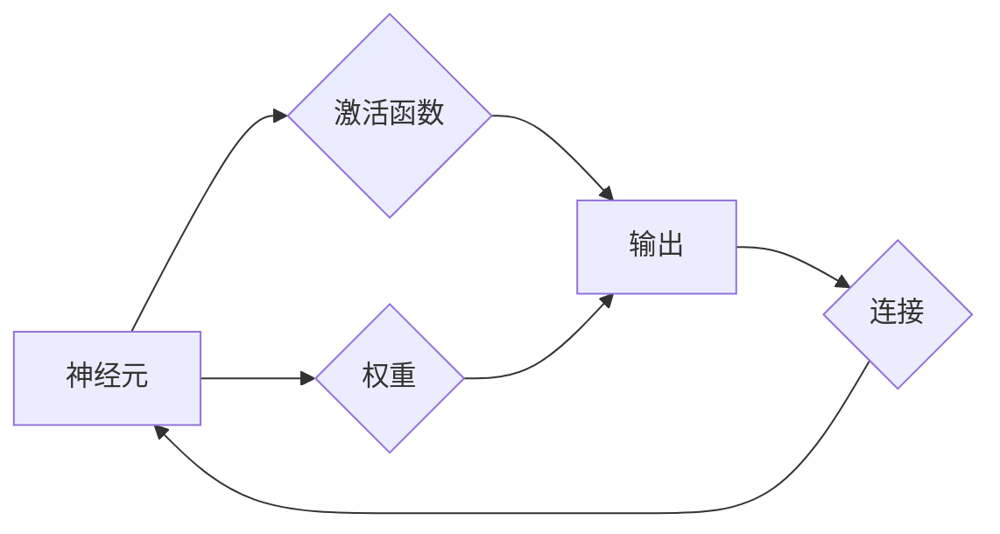

> 神经网络，深度学习，人工智能，机器学习，数据科学，计算机视觉，自然语言处理，强化学习，应用领域，未来展望

# 神经网络：推动社会进步的力量

### 1. 背景介绍

自20世纪50年代神经网络概念的提出以来，这一领域经历了起伏的历程。从最初的过热到90年代的衰落，再到21世纪初的复兴，神经网络技术已经发展成为一个强大而多样化的工具，极大地推动了人工智能和机器学习领域的进步。本文将深入探讨神经网络的原理、应用以及其对社会的深远影响。

### 2. 核心概念与联系

神经网络是一种模拟人脑神经元结构和功能的计算模型。它通过大量的节点（或称为神经元）相互连接，形成一个网络，用于执行复杂的计算任务。以下是神经网络的核心概念及其相互关系：



**A. 神经元**：神经网络的基本单元，负责接收输入、计算加权求和并应用激活函数，最后输出结果。

**B. 激活函数**：将神经元的线性组合映射到一个新的范围，引入非线性，允许神经网络学习复杂的模式。

**C. 权重**：连接神经元的参数，通过学习调整，使得神经网络能够对特定输入产生正确的输出。

**D. 输出**：神经元计算后的结果，可以是其他神经元的输入或最终模型的输出。

**E. 连接**：神经元之间的连线，表示它们之间的交互，权重是这种交互的强度。

### 3. 核心算法原理 & 具体操作步骤

#### 3.1 算法原理概述

神经网络的核心原理是通过反向传播算法（Backpropagation）来不断调整权重，使得网络能够对训练数据集中的样本进行正确分类或预测。这个过程包括以下步骤：

1. **前向传播**：将输入数据通过网络，计算每一层的输出。
2. **计算损失**：将网络的预测输出与真实标签比较，计算损失值。
3. **反向传播**：计算损失对网络参数的梯度，并更新权重。
4. **迭代**：重复上述步骤，直到网络性能达到预期。

#### 3.2 算法步骤详解

1. **初始化**：随机初始化网络的权重和偏置。
2. **前向传播**：输入数据通过网络，每一层计算加权求和并应用激活函数。
3. **计算损失**：使用损失函数（如均方误差、交叉熵等）计算预测值与真实值之间的差异。
4. **反向传播**：计算损失对权重的梯度，使用梯度下降或其他优化算法更新权重。
5. **迭代**：重复步骤2-4，直到满足停止条件（如损失值低于阈值或迭代次数达到上限）。

#### 3.3 算法优缺点

**优点**：

- **强大的模式识别能力**：神经网络可以学习非常复杂的非线性关系。
- **自适应能力**：可以通过训练自动调整权重，适应不同的数据分布。
- **泛化能力**：训练好的模型可以应用于未见过的数据。

**缺点**：

- **计算复杂度高**：需要大量的计算资源进行训练。
- **数据需求量大**：需要大量的标注数据进行训练。
- **可解释性差**：神经网络的结构复杂，难以解释其决策过程。

#### 3.4 算法应用领域

神经网络在多个领域都有广泛应用，包括：

- **计算机视觉**：图像识别、目标检测、图像生成等。
- **自然语言处理**：文本分类、机器翻译、情感分析等。
- **语音识别**：语音转文字、语音合成等。
- **强化学习**：游戏、机器人控制等。

### 4. 数学模型和公式 & 详细讲解 & 举例说明

#### 4.1 数学模型构建

神经网络的数学模型可以表示为：

$$
y = f(W \cdot x + b)
$$

其中 $y$ 是输出，$W$ 是权重矩阵，$x$ 是输入，$b$ 是偏置向量，$f$ 是激活函数。

#### 4.2 公式推导过程

以多层感知器（MLP）为例，其数学模型可以表示为：

$$
z_2 = W_1 \cdot x + b_1 \\
a_2 = f(z_2) \\
z_3 = W_2 \cdot a_2 + b_2 \\
y = f(z_3)
$$

其中 $W_1$ 和 $W_2$ 分别是第一层和第二层的权重矩阵，$b_1$ 和 $b_2$ 分别是第一层和第二层的偏置向量，$f$ 是激活函数。

#### 4.3 案例分析与讲解

以手写数字识别任务为例，使用多层感知器（MLP）进行分类。

1. **数据预处理**：将手写数字图像转换为灰度图，并归一化到[0, 1]范围。
2. **网络结构**：设计一个包含输入层、隐藏层和输出层的MLP，其中输入层有784个节点（28x28像素），隐藏层有128个节点，输出层有10个节点（对应0-9的数字）。
3. **训练**：使用反向传播算法训练网络，训练数据集为MNIST手写数字数据集。
4. **测试**：使用测试数据集评估网络性能，计算准确率。

### 5. 项目实践：代码实例和详细解释说明

#### 5.1 开发环境搭建

使用Python和TensorFlow框架进行神经网络开发。

```bash
pip install tensorflow numpy matplotlib
```

#### 5.2 源代码详细实现

```python
import tensorflow as tf
from tensorflow.keras.datasets import mnist
from tensorflow.keras.models import Sequential
from tensorflow.keras.layers import Dense, Flatten

# 加载MNIST数据集
(train_images, train_labels), (test_images, test_labels) = mnist.load_data()

# 数据预处理
train_images = train_images.reshape((60000, 28, 28, 1)).astype('float32') / 255
test_images = test_images.reshape((10000, 28, 28, 1)).astype('float32') / 255
train_labels = tf.keras.utils.to_categorical(train_labels)
test_labels = tf.keras.utils.to_categorical(test_labels)

# 创建模型
model = Sequential()
model.add(Flatten(input_shape=(28, 28, 1)))
model.add(Dense(128, activation='relu'))
model.add(Dense(10, activation='softmax'))

# 编译模型
model.compile(optimizer='adam', loss='categorical_crossentropy', metrics=['accuracy'])

# 训练模型
model.fit(train_images, train_labels, epochs=5, batch_size=64)

# 评估模型
test_loss, test_acc = model.evaluate(test_images, test_labels)
print(f"Test accuracy: {test_acc:.4f}")
```

#### 5.3 代码解读与分析

1. **加载MNIST数据集**：使用TensorFlow的Keras接口加载MNIST数据集。
2. **数据预处理**：将图像数据转换为浮点数并进行归一化，将标签转换为one-hot编码。
3. **创建模型**：使用Sequential模型构建一个包含Flatten、Dense层的MLP。
4. **编译模型**：指定优化器、损失函数和评价指标。
5. **训练模型**：使用训练数据训练模型。
6. **评估模型**：使用测试数据评估模型性能。

### 6. 实际应用场景

神经网络在许多实际应用场景中发挥着重要作用，以下是一些例子：

- **医疗诊断**：利用神经网络进行医学图像分析，如肿瘤检测、骨折诊断等。
- **自动驾驶**：使用神经网络进行环境感知、路径规划、决策等任务。
- **金融分析**：利用神经网络进行风险评估、股票预测等任务。
- **推荐系统**：使用神经网络进行个性化推荐，如电影推荐、商品推荐等。

### 6.4 未来应用展望

随着神经网络技术的不断发展，未来将在更多领域发挥重要作用：

- **更强大的模型**：开发更强大的神经网络模型，如Transformer、图神经网络等。
- **更高效的算法**：开发更高效的训练算法，如混合精度训练、模型压缩等。
- **更广泛的应用**：神经网络将在更多领域得到应用，如生物信息学、环境科学等。
- **更安全可靠的模型**：开发更安全可靠的神经网络模型，提高模型的鲁棒性和可解释性。

### 7. 工具和资源推荐

#### 7.1 学习资源推荐

- 《深度学习》（Goodfellow et al.）
- 《神经网络与深度学习》（邱锡鹏）
- TensorFlow官方文档
- PyTorch官方文档

#### 7.2 开发工具推荐

- TensorFlow
- PyTorch
- Keras
- scikit-learn

#### 7.3 相关论文推荐

- "A Few Useful Things to Know about Machine Learning"（Goodfellow et al.）
- "Deep Learning"（Goodfellow et al.）
- "Backpropagation"（Rumelhart et al.）

### 8. 总结：未来发展趋势与挑战

#### 8.1 研究成果总结

神经网络作为一种强大的计算模型，已经在人工智能和机器学习领域取得了巨大的成功。它通过模拟人脑神经元的工作方式，能够学习复杂的模式，并在多个领域得到广泛应用。

#### 8.2 未来发展趋势

未来神经网络的发展趋势包括：

- **更强大的模型**：开发更强大的神经网络模型，如Transformer、图神经网络等。
- **更高效的算法**：开发更高效的训练算法，如混合精度训练、模型压缩等。
- **更广泛的应用**：神经网络将在更多领域得到应用，如生物信息学、环境科学等。
- **更安全可靠的模型**：开发更安全可靠的神经网络模型，提高模型的鲁棒性和可解释性。

#### 8.3 面临的挑战

神经网络面临的挑战包括：

- **计算复杂度高**：需要大量的计算资源进行训练。
- **数据需求量大**：需要大量的标注数据进行训练。
- **可解释性差**：神经网络的结构复杂，难以解释其决策过程。

#### 8.4 研究展望

随着神经网络技术的不断发展，未来将在更多领域发挥重要作用。研究者需要不断探索新的模型、算法和应用，以推动神经网络技术的进步。

---

作者：禅与计算机程序设计艺术 / Zen and the Art of Computer Programming