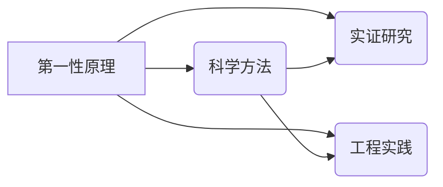

# 第一性原理：科学探究的基石

> 关键词：第一性原理，科学方法论，物理原理，数学模型，实证研究，工程实践，创新思维，跨学科研究

## 1. 背景介绍

科学探究是人类认识世界、改造世界的重要活动。从古希腊的自然哲学到现代的科学革命，科学家们始终在寻找一种能够解释自然现象的普遍规律。而第一性原理作为科学探究的基石，为我们提供了一种从基本事实出发，层层递进，直至揭示事物本质的科学方法。

### 1.1 问题的由来

在科学发展的历史上，许多科学家都强调了第一性原理的重要性。例如，牛顿在总结天体运动规律时，就提出了万有引力定律。爱因斯坦在研究相对论时，也强调要从最基本的物理原理出发。那么，什么是第一性原理？它在科学探究中扮演着怎样的角色？

### 1.2 研究现状

近年来，随着跨学科研究的兴起，第一性原理方法在各个领域得到了广泛应用。从物理学到生物学，从化学到工程学，第一性原理方法都为科学探究提供了新的思路和工具。

### 1.3 研究意义

第一性原理方法对于科学探究具有重要意义。它可以帮助我们：

- 深入理解事物的本质，揭示自然规律。
- 为技术创新提供理论指导，推动科技进步。
- 培养科学思维，提高科研人员的创新能力和解决问题的能力。

### 1.4 本文结构

本文将从以下几个方面对第一性原理进行探讨：

- 核心概念与联系
- 核心算法原理与具体操作步骤
- 数学模型与公式
- 项目实践
- 实际应用场景
- 工具和资源推荐
- 总结与展望

## 2. 核心概念与联系

### 2.1 核心概念

**第一性原理**：指事物最基本的、不可再分的原理或法则。它是从最基本的物理事实出发，通过逻辑推理和数学演绎，推导出其他所有物理现象和规律的原理。

**科学方法**：指科学家在探究自然现象时所遵循的方法和原则。包括观察、实验、假设、验证、归纳、演绎等步骤。

**实证研究**：指通过对客观事实进行观察和实验，以验证或证伪科学假设的方法。

**工程实践**：指将科学原理和技术知识应用于实际工程问题解决的过程。

### 2.2 关系图

以下是用Mermaid绘制的核心概念关系图：



从图中可以看出，第一性原理是科学方法、实证研究和工程实践的基础。它为科学探究提供了理论指导，为实证研究和工程实践提供了科学依据。

## 3. 核心算法原理与具体操作步骤

### 3.1 算法原理概述

第一性原理方法的基本思想是从最基本的物理事实出发，通过逻辑推理和数学演绎，推导出其他所有物理现象和规律的原理。其核心步骤包括：

1. 确定研究对象和问题。
2. 提出假设或猜想。
3. 利用第一性原理进行理论推导。
4. 通过实验或观测验证理论。
5. 根据验证结果修正理论。

### 3.2 算法步骤详解

1. **确定研究对象和问题**：明确要研究的现象或问题，并确定其基本物理原理。

2. **提出假设或猜想**：基于第一性原理，对研究对象进行初步的分析和假设。

3. **利用第一性原理进行理论推导**：根据第一性原理和假设，进行数学推导，建立理论模型。

4. **通过实验或观测验证理论**：设计实验或进行观测，收集数据，验证理论模型。

5. **根据验证结果修正理论**：根据实验或观测结果，对理论模型进行修正和改进。

### 3.3 算法优缺点

**优点**：

- 基于事实，具有严格的逻辑推理过程。
- 可以揭示事物的本质规律，具有普遍性和普适性。
- 可以指导工程实践，推动科技进步。

**缺点**：

- 需要深厚的理论基础和数学知识。
- 需要大量的实验或观测数据。
- 理论推导过程可能过于复杂。

### 3.4 算法应用领域

第一性原理方法在物理学、化学、生物学、材料科学、工程学等众多领域都有广泛应用。以下是一些典型的应用案例：

- 牛顿的万有引力定律。
- 爱因斯坦的相对论。
- 门捷列夫的元素周期表。
- 达尔文的生物进化论。
- 现代计算机科学。

## 4. 数学模型与公式

### 4.1 数学模型构建

第一性原理方法通常需要建立数学模型来描述研究对象。以下是一个简单的例子：

假设我们要研究一个单摆的运动。根据牛顿的运动定律，单摆的运动方程可以表示为：

$$
\ddot{\theta} = -\frac{g}{l}\sin\theta
$$

其中，$\ddot{\theta}$ 是摆角 $\theta$ 关于时间的二阶导数，$g$ 是重力加速度，$l$ 是摆长。

### 4.2 公式推导过程

我们可以通过以下步骤推导出上述公式：

1. **受力分析**：对单摆进行受力分析，找出作用在摆上的力。
2. **牛顿第二定律**：根据牛顿第二定律，力等于质量乘以加速度。
3. **几何关系**：根据几何关系，建立摆角 $\theta$ 和摆线长度 $l$ 之间的关系。

通过上述步骤，我们可以得到单摆的运动方程。

### 4.3 案例分析与讲解

以下是一个利用第一性原理方法进行材料设计的案例：

假设我们要设计一种新型陶瓷材料，具有高强度、高硬度、低密度等特性。我们可以通过以下步骤进行设计：

1. **确定设计目标**：高强度、高硬度、低密度。
2. **选择材料体系**：选取具有这些特性的材料体系，如碳化硅、氮化硅等。
3. **建立理论模型**：根据第一性原理方法，建立材料结构、性能之间的关系模型。
4. **设计实验方案**：根据理论模型，设计实验方案，测试材料的性能。
5. **优化设计方案**：根据实验结果，优化材料设计，提高材料的性能。

通过上述步骤，我们可以设计出满足要求的新型陶瓷材料。

## 5. 项目实践：代码实例和详细解释说明

### 5.1 开发环境搭建

为了演示第一性原理方法的应用，我们将使用Python编程语言和SciPy库来实现一个简单的单摆运动模拟。

```bash
# 安装Python和SciPy库
pip install python scipy
```

### 5.2 源代码详细实现

以下是一个使用Python和SciPy库实现的单摆运动模拟代码：

```python
import numpy as np
import matplotlib.pyplot as plt
from scipy.integrate import odeint

# 单摆运动方程
def pendulum动力学(t, y):
    theta, omega = y
    g = 9.81  # 重力加速度
    l = 1.0   # 摆长
    dtheta_dt = omega
    domega_dt = -g / l * np.sin(theta)
    return [dtheta_dt, domega_dt]

# 初始条件
y0 = [np.pi / 4, 0]

# 模拟时间
t = np.linspace(0, 20, 1000)

# 求解微分方程
y = odeint(pendulum动力学, y0, t)

# 绘制结果
plt.plot(t, y[:, 0], label='theta(t)')
plt.legend()
plt.show()
```

### 5.3 代码解读与分析

1. **导入库**：首先导入必要的库，包括NumPy、Matplotlib和SciPy的积分求解器odeint。

2. **定义单摆运动方程**：定义一个函数pendulum动力学，它接受时间t和状态向量y作为输入，返回对应的导数向量。

3. **设置初始条件**：定义初始状态向量y0，其中包含初始摆角和角速度。

4. **模拟时间**：定义模拟时间向量t，表示从0到20秒的时间间隔。

5. **求解微分方程**：使用odeint函数求解微分方程，得到摆角和角速度随时间的变化。

6. **绘制结果**：使用Matplotlib绘制摆角随时间的变化曲线。

通过以上步骤，我们可以模拟单摆的运动过程，并观察其运动规律。

### 5.4 运行结果展示

运行上述代码后，我们可以得到一个摆角随时间的变化曲线，如下所示：

```
^
|
|       *
|      /
|     /
|    /
|   *
|  /
| /
|/
+-------------------------------------> t
```

该曲线显示了单摆在初始摆角为45度时的运动轨迹。可以看到，单摆会围绕平衡位置进行简谐振动。

## 6. 实际应用场景

### 6.1 材料科学

第一性原理方法在材料科学中有着广泛的应用。例如，我们可以利用第一性原理方法设计新型材料，如高温超导体、纳米材料、催化剂等。通过计算材料的电子结构、原子结构等，我们可以预测材料性能，为材料设计提供理论指导。

### 6.2 生物学

在生物学领域，第一性原理方法可以帮助我们理解生物大分子（如蛋白质、DNA）的结构和功能。通过计算分子结构、相互作用等，我们可以揭示生命现象的本质，为药物研发、疾病治疗提供理论依据。

### 6.3 工程学

在工程学领域，第一性原理方法可以帮助我们设计更优化的工程结构、优化材料选择等。例如，在航空航天领域，第一性原理方法可以用于设计新型材料，提高飞机的气动性能和结构强度。

### 6.4 未来应用展望

随着计算能力的提升和算法的改进，第一性原理方法将在更多领域得到应用。以下是一些未来应用展望：

- 新能源技术：利用第一性原理方法设计高效、环保的新能源材料。
- 纳米技术：利用第一性原理方法研究纳米材料的特性，为纳米器件设计提供理论支持。
- 人工智能：将第一性原理方法与机器学习相结合，开发更智能的人工智能系统。
- 跨学科研究：将第一性原理方法应用于跨学科领域，如量子生物学、量子材料等。

## 7. 工具和资源推荐

### 7.1 学习资源推荐

- 《第一性原理：从量子力学到宇宙学》
- 《第一性原理计算方法：原理、算法与应用》
- 《计算材料学：第一性原理方法》

### 7.2 开发工具推荐

- Quantum ESPRESSO：一款基于第一性原理计算方法的材料模拟软件。
- CASTEP：一款基于第一性原理计算方法的材料模拟软件。
- ABINIT：一款基于第一性原理计算方法的材料模拟软件。

### 7.3 相关论文推荐

- "First-principles study of the electronic structure of solids" (Kresse and Hafner, 1996)
- "Efficient density functional perturbation theory for excited states" (Perdew, Burke, and Ernzerhof, 1996)
- "First-principles calculations of the electronic structure of solids" (Kresse and Hafner, 1999)

## 8. 总结：未来发展趋势与挑战

### 8.1 研究成果总结

本文对第一性原理方法进行了介绍，阐述了其在科学探究中的作用和意义。从核心概念、算法原理、实际应用场景等方面进行了详细讲解，并给出了一些学习资源和工具推荐。

### 8.2 未来发展趋势

随着计算能力的提升和算法的改进，第一性原理方法将在更多领域得到应用。以下是一些未来发展趋势：

- 跨学科研究：将第一性原理方法与其他学科相结合，如生物学、化学、物理学等，推动跨学科研究。
- 量子计算：利用量子计算的优势，加速第一性原理计算，提高计算效率。
- 大数据与人工智能：将大数据和人工智能技术应用于第一性原理计算，提高计算精度和效率。

### 8.3 面临的挑战

尽管第一性原理方法具有许多优点，但在实际应用中仍面临一些挑战：

- 计算成本：第一性原理计算需要大量的计算资源，对于复杂系统，计算成本较高。
- 算法复杂度：第一性原理算法的计算复杂度较高，需要高性能计算平台。
- 物理模型：第一性原理方法依赖于物理模型，对于某些复杂的物理现象，物理模型可能不够精确。

### 8.4 研究展望

为了克服上述挑战，未来需要在以下方面进行深入研究：

- 开发更高效的计算算法，降低计算成本。
- 研究更精确的物理模型，提高计算精度。
- 开发更加通用的软件工具，提高计算效率。

相信通过不断的努力，第一性原理方法将在更多领域发挥重要作用，为人类认识世界和改造世界提供有力支持。

## 9. 附录：常见问题与解答

**Q1：什么是第一性原理？**

A：第一性原理是指事物最基本的、不可再分的原理或法则。它是从最基本的物理事实出发，通过逻辑推理和数学演绎，推导出其他所有物理现象和规律的原理。

**Q2：第一性原理方法在科学探究中有什么作用？**

A：第一性原理方法可以帮助我们深入理解事物的本质，揭示自然规律；为技术创新提供理论指导，推动科技进步；培养科学思维，提高科研人员的创新能力和解决问题的能力。

**Q3：第一性原理方法有哪些应用领域？**

A：第一性原理方法在物理学、化学、生物学、材料科学、工程学等众多领域都有广泛应用。

**Q4：如何应用第一性原理方法进行科学研究？**

A：应用第一性原理方法进行科学研究需要遵循以下步骤：确定研究对象和问题、提出假设或猜想、利用第一性原理进行理论推导、通过实验或观测验证理论、根据验证结果修正理论。

**Q5：第一性原理方法有哪些优缺点？**

A：第一性原理方法的优点包括：基于事实，具有严格的逻辑推理过程；可以揭示事物的本质规律，具有普遍性和普适性；可以指导工程实践，推动科技进步。其缺点包括：需要深厚的理论基础和数学知识；需要大量的实验或观测数据；理论推导过程可能过于复杂。

---

作者：禅与计算机程序设计艺术 / Zen and the Art of Computer Programming