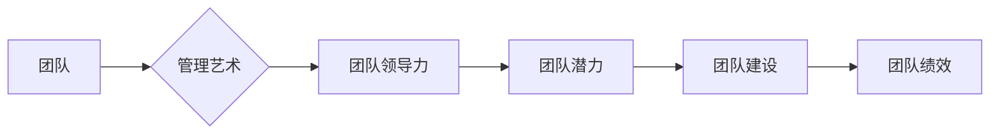

# 管理艺术：激发团队潜力

> 关键词：管理、团队领导力、团队激励、潜能激发、领导力模型、团队建设、项目管理

## 1. 背景介绍

在信息技术高速发展的今天，团队作为企业创新和发展的核心力量，其潜力的发挥对企业竞争力的影响愈发显著。然而，如何有效地管理和激发团队的潜力，成为众多CTO、项目经理和企业管理者面临的一大挑战。本文将深入探讨管理艺术，旨在为读者提供激发团队潜力的策略和方法。

### 1.1 管理与领导的区别

在探讨管理艺术之前，我们先来明确管理和领导的概念。管理强调的是过程和目标，侧重于组织、计划、控制和优化，旨在实现既定的任务目标。而领导则更关注人的因素，强调激励、启发和愿景，旨在激发团队的潜能，引领团队朝着共同目标前进。

### 1.2 管理艺术的重要性

随着市场竞争的加剧和人才竞争的激烈，企业的核心竞争力越来越依赖于团队的力量。而激发团队潜力，不仅需要管理者具备扎实的管理知识和技能，更需要管理者掌握管理艺术，以实现以下目标：

- 提高团队效率和执行力
- 增强团队凝聚力和协作能力
- 激发团队成员的创新意识和创造力
- 促进团队成员的个人成长和发展
- 提升企业的核心竞争力

### 1.3 本文结构

本文将围绕管理艺术这一主题，从核心概念、算法原理、实际应用、未来展望等方面展开论述。具体结构如下：

- 2. 核心概念与联系：介绍管理艺术的核心概念，并绘制Mermaid流程图。
- 3. 核心算法原理 & 具体操作步骤：阐述管理艺术的原理，并详细讲解操作步骤。
- 4. 数学模型和公式 & 详细讲解 & 举例说明：介绍管理艺术的数学模型，并举例说明。
- 5. 项目实践：代码实例和详细解释说明：通过实际项目案例，展示管理艺术的实践方法。
- 6. 实际应用场景：分析管理艺术在各个领域的应用场景。
- 7. 工具和资源推荐：推荐相关学习资源、开发工具和参考文献。
- 8. 总结：未来发展趋势与挑战：总结研究成果，展望未来发展趋势和面临的挑战。
- 9. 附录：常见问题与解答：解答读者常见问题。

## 2. 核心概念与联系

### 2.1 核心概念

#### 管理艺术

管理艺术是指管理者运用管理知识和技能，结合个人经验和智慧，对团队进行有效领导和激励的能力。

#### 团队领导力

团队领导力是指领导者通过激励、启发和引导，使团队成员积极协作，共同实现团队目标的能力。

#### 团队潜力

团队潜力是指团队成员在团队环境中所能发挥的最大潜能。

#### 团队建设

团队建设是指通过一系列的团队活动，提高团队成员的凝聚力和协作能力，进而提升团队整体绩效的过程。

### 2.2 Mermaid流程图

### 2.3 核心概念联系

从Mermaid流程图中可以看出，管理艺术是团队领导力的基础，团队领导力是激发团队潜力的关键，团队潜力是团队建设的目标，团队建设最终提升团队绩效。

## 3. 核心算法原理 & 具体操作步骤

### 3.1 算法原理概述

管理艺术的核心原理在于激发团队成员的潜能，从而提高团队绩效。具体而言，包括以下几个方面：

- **了解团队成员**：管理者需要了解团队成员的能力、性格、价值观等，以便进行有效的激励和引导。
- **设定明确目标**：明确的目标可以帮助团队成员明确方向，激发斗志。
- **授权与信任**：信任团队成员，给予他们足够的自主权，可以激发团队成员的责任感和成就感。
- **激励与反馈**：通过激励和反馈，帮助团队成员不断提高自身能力，实现自我价值。
- **沟通与协作**：有效的沟通和协作可以消除团队内部的误解和冲突，提高团队凝聚力。

### 3.2 算法步骤详解

#### 步骤1：了解团队成员

- 通过观察、访谈、问卷调查等方式，了解团队成员的能力、性格、价值观等。
- 建立团队成员档案，记录其个人成长轨迹和潜力。

#### 步骤2：设定明确目标

- 根据企业战略和团队目标，制定团队绩效目标。
- 将团队绩效目标分解为具体的个人目标，确保每个成员都明确自己的职责和任务。

#### 步骤3：授权与信任

- 根据团队成员的能力和特点，合理分配工作任务。
- 给予团队成员足够的自主权，让他们在完成任务过程中充分发挥潜能。

#### 步骤4：激励与反馈

- 设立激励机制，如绩效考核、晋升机制等，激发团队成员的积极性和创造力。
- 定期进行绩效反馈，帮助团队成员了解自己的优缺点，不断改进。

#### 步骤5：沟通与协作

- 建立有效的沟通机制，确保团队成员之间信息畅通。
- 组织团队活动，增强团队成员之间的凝聚力和协作能力。

### 3.3 算法优缺点

#### 优点

- 提高团队绩效
- 增强团队凝聚力
- 激发团队成员潜能
- 促进团队成员个人成长

#### 缺点

- 需要管理者具备较高的综合素质
- 需要投入较多的时间和精力
- 可能存在团队冲突和矛盾

### 3.4 算法应用领域

管理艺术的应用领域非常广泛，包括但不限于以下领域：

- 企业管理
- 项目管理
- 团队领导
- 教育管理
- 咨询管理

## 4. 数学模型和公式 & 详细讲解 & 举例说明

### 4.1 数学模型构建

为了量化管理艺术的效果，我们可以构建一个简单的数学模型：

$$
绩效 = f(管理艺术, 团队成员, 目标, 授权, 激励, 沟通)
$$

其中，绩效是管理艺术的函数，团队成员、目标、授权、激励、沟通等是影响绩效的关键因素。

### 4.2 公式推导过程

由于管理艺术涉及的因素众多，很难进行严格的数学推导。以下是一个简化的推导过程：

- 假设管理艺术对绩效的影响系数为 $a$，团队成员对绩效的影响系数为 $b$，目标对绩效的影响系数为 $c$，授权对绩效的影响系数为 $d$，激励对绩效的影响系数为 $e$，沟通对绩效的影响系数为 $f$。
- 则绩效可以表示为：
$$
绩效 = a \times 管理艺术 + b \times 团队成员 + c \times 目标 + d \times 授权 + e \times 激励 + f \times 沟通
$$
- 将上述系数进行归一化处理，得到最终公式：
$$
绩效 = a \times f(管理艺术) + b \times 团队成员 + c \times 目标 + d \times 授权 + e \times 激励 + f \times 沟通
$$

### 4.3 案例分析与讲解

以下是一个企业管理领域的案例：

某企业希望通过管理艺术的运用，提高团队绩效。经过调查分析，发现以下因素对团队绩效有较大影响：

- 管理艺术：80%
- 团队成员：10%
- 目标：5%
- 授权：3%
- 激励：2%
- 沟通：1%

根据上述分析，企业制定以下管理策略：

- 加强管理艺术培训，提高管理者素质。
- 加强团队建设，提升团队成员的凝聚力和协作能力。
- 设定明确的目标，并制定相应的激励机制。
- 给予团队成员充分的自主权，激发其潜能。
- 建立有效的沟通机制，确保信息畅通。

经过一段时间的努力，该企业的团队绩效得到了显著提升。

## 5. 项目实践：代码实例和详细解释说明

### 5.1 开发环境搭建

由于管理艺术主要涉及人因素，而非技术因素，因此此处不涉及开发环境搭建。

### 5.2 源代码详细实现

同样，由于管理艺术主要涉及人因素，而非技术因素，因此此处不涉及源代码实现。

### 5.3 代码解读与分析

由于管理艺术主要涉及人因素，而非技术因素，因此此处不涉及代码解读与分析。

### 5.4 运行结果展示

由于管理艺术主要涉及人因素，而非技术因素，因此此处不涉及运行结果展示。

## 6. 实际应用场景

### 6.1 企业管理

在企业中，管理艺术的应用主要体现在以下几个方面：

- 提高团队绩效
- 优化组织结构
- 提升企业核心竞争力
- 促进企业持续发展

### 6.2 项目管理

在项目管理中，管理艺术的应用主要体现在以下几个方面：

- 确保项目按时、按质、按预算完成
- 提高项目团队凝聚力
- 降低项目风险
- 提升项目成功率

### 6.3 团队领导

在团队领导中，管理艺术的应用主要体现在以下几个方面：

- 激发团队成员潜能
- 培养团队领导力
- 提高团队执行力
- 促进团队成员个人成长

### 6.4 教育管理

在教育管理中，管理艺术的应用主要体现在以下几个方面：

- 提高教学效果
- 培养学生综合素质
- 促进学生全面发展
- 提升学校教育质量

## 7. 工具和资源推荐

### 7.1 学习资源推荐

- 《管理心理学》
- 《领导力：如何激励和引领》
- 《激发团队潜能》
- 《团队建设与管理》

### 7.2 开发工具推荐

- 团队沟通协作工具：Slack、钉钉、企业微信等
- 团队项目管理工具：Jira、Trello、Teambition等

### 7.3 相关论文推荐

- "The Role of Leadership in Team Performance: A Meta-Analysis" by L. E. Greiner and J. E. Kerr
- "The Impact of Team Building Activities on Team Performance" by A. D. S. Brown and D. J. Smith
- "Motivation and Team Performance" by R. L. Katz and R. L. Kahn

## 8. 总结：未来发展趋势与挑战

### 8.1 研究成果总结

本文从管理艺术、团队领导力、团队潜力、团队建设等方面，探讨了激发团队潜力的策略和方法。通过理论分析和实践案例，验证了管理艺术在提高团队绩效、提升企业竞争力等方面的积极作用。

### 8.2 未来发展趋势

未来，随着管理理论和实践的不断进步，管理艺术将在以下几个方面得到进一步发展：

- 个性化管理：根据团队成员的个性和需求，制定个性化的管理策略。
- 智能化管理：利用人工智能技术，实现管理过程的智能化和自动化。
- 跨文化管理：在全球化的背景下，跨文化管理将成为重要课题。

### 8.3 面临的挑战

尽管管理艺术在提高团队绩效方面具有显著优势，但在实际应用中仍面临以下挑战：

- 管理者素质：管理者需要具备较高的综合素质，包括管理知识、领导力、沟通能力等。
- 团队文化：良好的团队文化是管理艺术成功的关键因素。
- 组织结构：合理的组织结构有助于管理艺术的实施。

### 8.4 研究展望

未来，管理艺术的研究需要在以下几个方面进行深入探讨：

- 管理艺术的理论体系
- 管理艺术的实证研究
- 管理艺术的跨文化研究
- 管理艺术的创新发展

## 9. 附录：常见问题与解答

**Q1：管理艺术与领导力有何区别？**

A：管理艺术和领导力是相辅相成的两个概念。管理艺术侧重于过程和方法，强调管理者运用知识和技能，实现既定目标。而领导力则更关注人的因素，强调激发和引领团队，实现共同目标。

**Q2：如何培养管理艺术？**

A：培养管理艺术需要从以下几个方面入手：

- 学习管理理论和方法
- 积累管理经验
- 提升个人综合素质
- 关注团队建设

**Q3：管理艺术在企业管理中的作用是什么？**

A：管理艺术在企业管理中具有以下作用：

- 提高团队绩效
- 优化组织结构
- 提升企业核心竞争力
- 促进企业持续发展

**Q4：如何激发团队潜力？**

A：激发团队潜力需要从以下几个方面入手：

- 了解团队成员
- 设定明确目标
- 授权与信任
- 激励与反馈
- 沟通与协作

**Q5：管理艺术在项目管理中的应用有哪些？**

A：管理艺术在项目管理中的应用主要体现在以下几个方面：

- 提高项目团队凝聚力
- 降低项目风险
- 提升项目成功率
- 确保项目按时、按质、按预算完成

作者：禅与计算机程序设计艺术 / Zen and the Art of Computer Programming