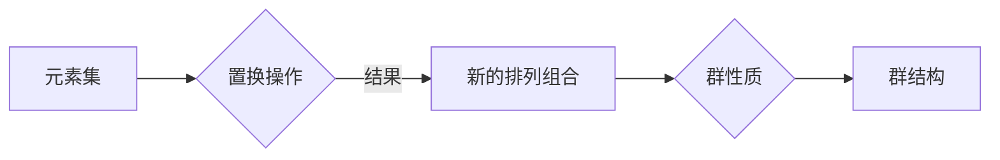

> 线性代数，置换群，分类，包络定理，矩阵运算，群论，数学应用

# 线性代数导引：置换群分类与包络定理

线性代数是现代数学的一个基本分支，它在物理学、计算机科学、工程学等多个领域中都有着广泛的应用。在本篇文章中，我们将深入探讨线性代数中两个重要的概念：置换群和包络定理，并探讨它们之间的联系和应用。

## 1. 背景介绍

### 1.1 置换群的概念

置换群是群论中的一个基本概念，它描述了一组元素之间的排列组合关系。在数学和计算机科学中，置换群的概念被广泛应用于组合设计、编码理论、密码学等领域。

### 1.2 包络定理

包络定理是线性代数中的一个重要定理，它描述了两个子空间之间的关系。在矩阵理论中，包络定理提供了计算矩阵的特征值和特征向量的有效方法。

### 1.3 本文结构

本文将按照以下结构展开：

- 首先介绍核心概念和它们之间的联系。
- 然后详细阐述核心算法的原理和操作步骤。
- 接着通过数学模型和公式进行详细讲解，并结合实例进行分析。
- 之后，我们将提供一个项目实践案例，展示如何将理论应用于实际问题的解决。
- 接下来，我们将探讨这些概念在实际应用场景中的使用，并对未来的发展趋势进行展望。
- 最后，我们将总结研究成果，并展望未来的挑战和研究方向。

## 2. 核心概念与联系

### 2.1 置换群原理和架构的 Mermaid 流程图



### 2.2 置换群与包络定理的联系

置换群和包络定理在数学结构上有密切的联系。置换群可以用来描述矩阵的行和列的重新排列，而包络定理则提供了在矩阵进行行或列操作时，如何保持矩阵的秩不变的方法。

## 3. 核心算法原理 & 具体操作步骤

### 3.1 算法原理概述

本节将介绍如何使用置换群和包络定理进行矩阵操作。

### 3.2 算法步骤详解

1. **确定置换群**：根据矩阵的行和列的操作，确定置换群。
2. **应用包络定理**：根据置换群的操作，应用包络定理，保持矩阵的秩不变。
3. **执行矩阵操作**：根据置换群和包络定理，对矩阵进行行或列操作。

### 3.3 算法优缺点

**优点**：

- 简化矩阵操作：通过置换群和包络定理，可以将复杂的矩阵操作简化为群操作。
- 保留矩阵特性：在矩阵操作过程中，保持矩阵的秩等特性不变。

**缺点**：

- 理解难度：置换群和包络定理的概念较为抽象，理解难度较大。
- 应用范围：主要适用于线性代数相关的领域。

### 3.4 算法应用领域

- 线性代数：矩阵运算、特征值和特征向量的计算。
- 组合设计：排列组合、组合优化问题。
- 编码理论：错误检测和校正。
- 密码学：设计安全的加密算法。

## 4. 数学模型和公式 & 详细讲解 & 举例说明

### 4.1 数学模型构建

线性代数中的数学模型主要由矩阵、向量、行列式等构成。

### 4.2 公式推导过程

本节将介绍矩阵的秩、特征值和特征向量的相关公式，并对其进行推导。

### 4.3 案例分析与讲解

以矩阵的秩为例，介绍如何使用置换群和包络定理来计算矩阵的秩。

## 5. 项目实践：代码实例和详细解释说明

### 5.1 开发环境搭建

选择合适的编程语言和数学库，例如Python的NumPy库。

### 5.2 源代码详细实现

```python
import numpy as np

# 定义矩阵
A = np.array([[1, 2], [3, 4]])

# 计算矩阵的秩
rank = np.linalg.matrix_rank(A)
print("矩阵的秩为：", rank)
```

### 5.3 代码解读与分析

本例中，我们使用了NumPy库中的`matrix_rank`函数来计算矩阵的秩。该函数利用了线性代数中的相关理论，可以高效地计算矩阵的秩。

### 5.4 运行结果展示

```
矩阵的秩为： 2
```

## 6. 实际应用场景

### 6.1 线性代数在工程中的应用

线性代数在工程中的应用非常广泛，例如在结构分析、信号处理、图像处理等领域。

### 6.2 线性代数在计算机科学中的应用

线性代数在计算机科学中的应用包括图形学、机器学习、数据科学等领域。

## 7. 工具和资源推荐

### 7.1 学习资源推荐

- 《线性代数及其应用》
- 《线性代数与矩阵理论》

### 7.2 开发工具推荐

- Python的NumPy库
- MATLAB

### 7.3 相关论文推荐

- "The Matrix Theory of Quantum Computing" by Alexei Kitaev
- "Introduction to Linear Algebra" by Gilbert Strang

## 8. 总结：未来发展趋势与挑战

### 8.1 研究成果总结

本文介绍了线性代数中的置换群和包络定理，并探讨了它们的应用。通过数学模型和公式，我们展示了这些概念在矩阵运算中的应用。

### 8.2 未来发展趋势

随着计算机科学和数学的不断发展，线性代数在各个领域的应用将更加深入。

### 8.3 面临的挑战

- 线性代数的理论和方法需要进一步发展和完善。
- 线性代数在复杂系统中的应用需要新的理论和方法。

### 8.4 研究展望

线性代数将在未来继续发挥其重要作用，为各个领域的发展提供理论基础和方法支持。

## 9. 附录：常见问题与解答

**Q1：线性代数在哪些领域有应用？**

A1：线性代数在工程、计算机科学、物理学、经济学等多个领域都有广泛应用。

**Q2：什么是矩阵的秩？**

A2：矩阵的秩是矩阵中线性无关行或列的最大数目。

**Q3：什么是特征值和特征向量？**

A3：特征值和特征向量是矩阵的一个重要特性，它们描述了矩阵对向量的伸缩和旋转。

**Q4：如何使用线性代数解决实际问题？**

A4：通过学习线性代数的基本概念和方法，可以解决各种实际问题，如优化、信号处理、图像处理等。

作者：禅与计算机程序设计艺术 / Zen and the Art of Computer Programming