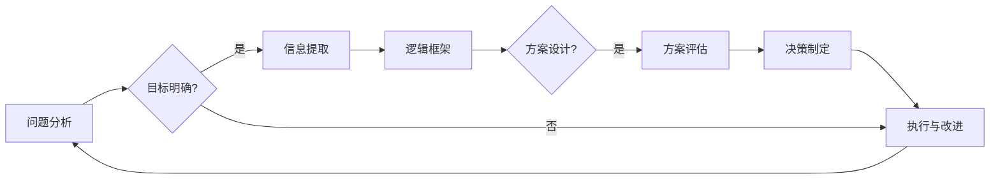

> 结构化思维，逻辑框架，知识体系，决策分析，问题解决，软件工程，项目管理，沟通协作

# 结构化思维原理与应用：掌握结构化思维的内核

结构化思维，作为一种逻辑清晰、条理分明的思维方式，已经成为现代职场人士必备的核心能力。它不仅能够帮助我们更好地理解复杂问题，还能提升我们的决策效率，优化团队协作。本文将深入探讨结构化思维的原理，并从实际应用出发，提供一系列实用技巧，帮助您掌握这一强大的思维方式。

## 1. 背景介绍

在信息爆炸的时代，我们每天都要面对海量信息。如何从这些信息中提取关键，形成清晰的逻辑框架，成为每个职场人士都需要面对的挑战。结构化思维正是为了解决这一问题而诞生的。它通过将复杂问题分解成多个模块，逐一分析，最终形成完整的解决方案。

### 1.1 问题的由来

随着知识体系的不断扩张，人们越来越难以掌握所有的信息。如何从海量的知识中筛选出有用的信息，如何将碎片化的知识整合成完整的知识体系，成为现代职场人士亟待解决的问题。

### 1.2 研究现状

结构化思维作为一种思维方式，已经广泛应用于各个领域。在软件工程、项目管理、沟通协作等方面，结构化思维都发挥着至关重要的作用。然而，如何将结构化思维深入人心，并有效地应用于实际工作中，仍然是一个值得探讨的课题。

### 1.3 研究意义

掌握结构化思维，可以帮助我们：

- 提高信息处理能力，快速从海量信息中提取关键信息。
- 增强逻辑思维能力，形成清晰、条理分明的思维框架。
- 提升决策效率，减少决策失误。
- 优化团队协作，提高团队执行力。

### 1.4 本文结构

本文将围绕以下内容展开：

- 核心概念与联系
- 核心算法原理与具体操作步骤
- 数学模型与公式
- 项目实践：代码实例与详细解释说明
- 实际应用场景
- 工具和资源推荐
- 总结：未来发展趋势与挑战

## 2. 核心概念与联系

### 2.1 核心概念

结构化思维的核心概念包括：

- **问题分析**：识别和定义问题，理解问题的本质。
- **目标明确**：确定解决问题的目标和预期结果。
- **信息提取**：从大量信息中提取关键信息，形成知识体系。
- **逻辑框架**：构建逻辑清晰、条理分明的思维框架。
- **方案设计**：设计解决问题的方案，并进行可行性分析。
- **决策制定**：基于逻辑框架和方案设计，制定最终决策。

### 2.2 Mermaid 流程图

以下为结构化思维流程的Mermaid流程图：



### 2.3 核心概念联系

以上核心概念相互关联，形成一个闭环的结构化思维流程。问题分析是整个流程的起点，通过目标明确和信息提取，构建逻辑框架，设计解决方案，最终进行决策制定和执行改进。

## 3. 核心算法原理 & 具体操作步骤

### 3.1 算法原理概述

结构化思维的核心原理是将复杂问题分解成多个子问题，并对每个子问题进行深入分析，最终形成完整的解决方案。

### 3.2 算法步骤详解

1. **问题分析**：识别和定义问题，明确问题的本质和范围。
2. **目标明确**：确定解决问题的目标和预期结果，确保解决方案能够满足需求。
3. **信息提取**：从大量信息中提取关键信息，形成知识体系。
4. **逻辑框架**：构建逻辑清晰、条理分明的思维框架，包括问题分解、关系分析、因果关系等。
5. **方案设计**：设计解决问题的方案，并进行可行性分析。
6. **决策制定**：基于逻辑框架和方案设计，制定最终决策。
7. **执行与改进**：执行解决方案，并根据反馈进行改进。

### 3.3 算法优缺点

**优点**：

- 提高问题解决效率。
- 增强逻辑思维能力。
- 提升团队协作效果。

**缺点**：

- 需要一定的训练和学习。
- 在面对未知问题时，可能难以快速构建逻辑框架。

### 3.4 算法应用领域

结构化思维在以下领域具有广泛的应用：

- 软件工程：需求分析、系统设计、项目管理等。
- 项目管理：项目规划、风险分析、进度管理等。
- 沟通协作：会议组织、团队协作、汇报展示等。

## 4. 数学模型和公式 & 详细讲解 & 举例说明

### 4.1 数学模型构建

结构化思维没有特定的数学模型，但其核心原理可以借助一些数学概念进行阐述。

- **决策树**：将问题分解为多个子问题，并通过条件判断进行决策的树状模型。
- **流程图**：用图形化的方式描述问题处理流程。
- **网络图**：描述问题中各个元素之间的联系。

### 4.2 公式推导过程

结构化思维的核心在于逻辑推理，其推导过程如下：

1. **问题分析**：将问题分解为多个子问题。
2. **目标明确**：确定每个子问题的目标和预期结果。
3. **信息提取**：从相关资料中提取关键信息。
4. **逻辑框架**：构建逻辑关系，将子问题连接起来。
5. **方案设计**：设计解决方案，并进行可行性分析。
6. **决策制定**：基于逻辑框架和方案设计，制定最终决策。

### 4.3 案例分析与讲解

**案例**：软件开发过程中的需求分析

1. **问题分析**：确定项目需求，包括功能需求、性能需求、用户体验等。
2. **目标明确**：确保需求分析全面、准确，满足用户需求。
3. **信息提取**：收集相关资料，包括用户需求、竞品分析、技术文档等。
4. **逻辑框架**：将需求分解为功能模块，分析各模块之间的关系和依赖。
5. **方案设计**：设计功能模块，并分析其可行性。
6. **决策制定**：根据分析结果，确定最终需求方案。

## 5. 项目实践：代码实例和详细解释说明

### 5.1 开发环境搭建

由于结构化思维是一种思维方式，不涉及具体的编程语言或开发环境。以下以Python为例，展示如何使用代码辅助结构化思维。

### 5.2 源代码详细实现

```python
def analyze_problem(problem):
    """
    分析问题，并返回分解后的子问题列表。
    """
    sub_problems = []
    # 根据具体问题，分解为多个子问题
    # ...
    return sub_problems

def design_solution(sub_problems):
    """
    设计解决方案，并返回解决方案列表。
    """
    solutions = []
    # 根据每个子问题，设计解决方案
    # ...
    return solutions

def make_decision(solutions):
    """
    基于解决方案，做出最终决策。
    """
    # 根据分析结果，选择最佳解决方案
    # ...
    return best_solution

# 示例
problem = "软件开发过程中的需求分析"
sub_problems = analyze_problem(problem)
solutions = design_solution(sub_problems)
best_solution = make_decision(solutions)
```

### 5.3 代码解读与分析

以上代码展示了如何使用Python实现结构化思维的基本流程。`analyze_problem` 函数用于分析问题，`design_solution` 函数用于设计解决方案，`make_decision` 函数用于做出最终决策。通过这种方式，我们可以将复杂的思维过程转化为可执行的代码，有助于我们更好地理解问题、分析问题和解决问题。

### 5.4 运行结果展示

由于结构化思维是一种思维方式，其结果并非直接体现在代码运行结果上。以上代码旨在帮助读者理解结构化思维的基本流程，并使用编程语言辅助实现这一流程。

## 6. 实际应用场景

### 6.1 软件开发

在软件开发过程中，结构化思维可以帮助开发者：

- 明确软件需求，避免需求遗漏或歧义。
- 设计清晰、合理的系统架构。
- 优化代码结构和性能。

### 6.2 项目管理

在项目管理中，结构化思维可以帮助项目经理：

- 准确评估项目风险。
- 制定合理的项目计划。
- 优化项目执行过程。

### 6.3 沟通协作

在沟通协作中，结构化思维可以帮助团队：

- 明确沟通目标。
- 提高沟通效率。
- 优化团队协作效果。

## 7. 工具和资源推荐

### 7.1 学习资源推荐

- 《金字塔原理》
- 《结构化思维》
- 《麦肯锡教我的思考武器》

### 7.2 开发工具推荐

- XMind
- MindManager
- Miro

### 7.3 相关论文推荐

- 《结构化思维：一种解决问题的思维方式》
- 《结构化思维在项目管理中的应用》
- 《结构化思维在软件工程中的应用》

## 8. 总结：未来发展趋势与挑战

### 8.1 研究成果总结

本文从结构化思维的核心概念、原理、操作步骤等方面进行了深入探讨，并通过实际案例和代码实例展示了结构化思维的应用。研究表明，结构化思维是一种有效的思维方式，可以帮助我们更好地理解复杂问题、优化决策过程、提高团队协作效果。

### 8.2 未来发展趋势

随着人工智能技术的发展，结构化思维的应用将更加广泛。例如，基于结构化思维的AI助手、智能决策系统等将逐渐出现在我们的生活中。

### 8.3 面临的挑战

尽管结构化思维具有诸多优势，但在实际应用中仍面临以下挑战：

- 如何将结构化思维与人工智能技术深度融合。
- 如何培养和普及结构化思维。
- 如何在复杂多变的场景中应用结构化思维。

### 8.4 研究展望

未来，结构化思维的研究将重点关注以下几个方面：

- 开发基于结构化思维的AI助手。
- 建立结构化思维训练体系。
- 探索结构化思维在更多领域的应用。

## 9. 附录：常见问题与解答

**Q1：结构化思维是否适用于所有人？**

A：结构化思维是一种通用的思维方式，适用于所有人。无论从事何种职业，掌握结构化思维都能够提升工作效率和决策质量。

**Q2：如何培养结构化思维？**

A：培养结构化思维需要长期训练和实践。以下是一些建议：

- 多读书、多思考，积累知识体系。
- 练习使用思维导图、流程图等工具，构建逻辑框架。
- 参加相关培训课程，学习结构化思维的方法和技巧。

**Q3：结构化思维与线性思维有什么区别？**

A：结构化思维是一种非线性思维，强调将复杂问题分解成多个子问题，并进行逐个分析。而线性思维则是一种线性思维方式，按照时间或顺序依次处理问题。

**Q4：结构化思维在项目管理中的应用有哪些？**

A：在项目管理中，结构化思维可以应用于：

- 项目需求分析。
- 项目计划制定。
- 项目风险管理。
- 项目执行监控。

**Q5：结构化思维在沟通协作中的应用有哪些？**

A：在沟通协作中，结构化思维可以应用于：

- 明确沟通目标。
- 提高沟通效率。
- 优化团队协作效果。

---

作者：禅与计算机程序设计艺术 / Zen and the Art of Computer Programming