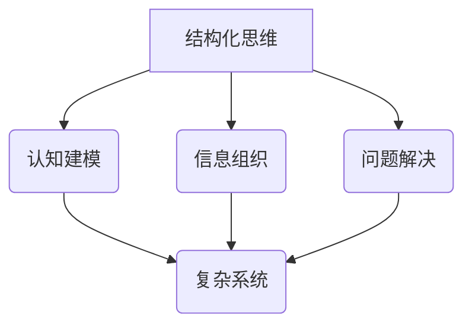

> 结构化思维，认知建模，信息组织，问题解决，复杂系统，Mermaid流程图

# 结构化思维：从混沌到秩序

结构化思维是一种高效的信息处理和问题解决方法，它帮助我们从混沌中提取秩序，将复杂的信息和问题转化为可操作的模式。在信息技术高速发展的今天，结构化思维对于程序员、软件架构师、CTO等IT领域的专业人士尤为重要。本文将深入探讨结构化思维的核心概念、原理、实践方法，并展望其未来发展趋势。

## 1. 背景介绍

在信息爆炸的时代，我们每天都要处理大量的信息。这些信息可能来自书籍、网络、会议、邮件等各种渠道，它们以不同的形式、不同的内容呈现。如果没有有效的处理方法，这些信息就会变得杂乱无章，难以理解和应用。结构化思维正是为了解决这一问题而生的。

### 1.1 问题的由来

信息过载和复杂性问题日益突出，人们对高效的信息处理和问题解决方法的需求越来越迫切。传统的线性思维、经验思维等方法已经无法满足现代社会的需求。结构化思维作为一种新的思维方式，能够帮助我们更好地理解和处理复杂信息。

### 1.2 研究现状

结构化思维已经在多个领域得到了应用，包括管理学、心理学、计算机科学等。在IT领域，结构化思维被广泛应用于需求分析、系统设计、项目管理等方面。

### 1.3 研究意义

研究结构化思维对于以下方面具有重要意义：

- 提高信息处理效率
- 增强问题解决能力
- 提升团队合作效果
- 促进个人和组织发展

### 1.4 本文结构

本文将分为以下几个部分：

- 核心概念与联系
- 核心算法原理 & 具体操作步骤
- 数学模型和公式 & 详细讲解 & 举例说明
- 项目实践：代码实例和详细解释说明
- 实际应用场景
- 工具和资源推荐
- 总结：未来发展趋势与挑战
- 附录：常见问题与解答

## 2. 核心概念与联系

### 2.1 核心概念

- **结构化思维**：一种基于逻辑和系统性的思维方式，将复杂的信息和问题分解为可管理的部分，从而提高理解和解决问题的效率。
- **认知建模**：将现实世界的复杂问题转化为计算机可以处理和解决的问题。
- **信息组织**：对信息进行分类、整理、存储和检索，使信息更加有序和可访问。
- **问题解决**：识别问题、分析问题、设计方案、实施方案、评估结果的过程。
- **复杂系统**：由多个相互作用的组成部分组成的系统，其行为难以预测和描述。

### 2.2 Mermaid流程图



### 2.3 联系

结构化思维是认知建模和信息组织的基础，它帮助我们将复杂系统中的信息和问题转化为可管理的形式。通过结构化思维，我们可以更有效地进行问题解决。

## 3. 核心算法原理 & 具体操作步骤

### 3.1 算法原理概述

结构化思维的核心原理是将复杂问题分解为更小、更易于管理的部分。这通常通过以下步骤实现：

1. **定义问题**：明确问题的范围和目标。
2. **分解问题**：将问题分解为更小的子问题。
3. **分析子问题**：分析每个子问题的性质和相互关系。
4. **设计解决方案**：为每个子问题设计解决方案。
5. **实施解决方案**：将解决方案应用于实际问题。
6. **评估结果**：评估解决方案的有效性。

### 3.2 算法步骤详解

1. **定义问题**：明确问题的范围、目标和约束条件。
2. **分解问题**：将问题分解为更小的子问题。可以使用层次分解、因果分析、SWOT分析等方法。
3. **分析子问题**：分析每个子问题的性质和相互关系。可以使用系统分析、流程图、鱼骨图等方法。
4. **设计解决方案**：为每个子问题设计解决方案。可以使用头脑风暴、迭代设计、原型设计等方法。
5. **实施解决方案**：将解决方案应用于实际问题。可以使用项目管理、敏捷开发、持续集成等方法。
6. **评估结果**：评估解决方案的有效性。可以使用测试、用户反馈、数据分析等方法。

### 3.3 算法优缺点

#### 优点

- **提高效率**：结构化思维可以显著提高信息处理和问题解决效率。
- **增强可理解性**：通过分解和整理，复杂问题变得更加易于理解。
- **促进创新**：结构化思维可以激发新的想法和解决方案。

#### 缺点

- **可能过度简化**：在分解问题时，可能忽略了一些重要的细节。
- **容易陷入局部最优**：在解决问题时，可能只关注某个子问题，而忽略了整体解决方案。

### 3.4 算法应用领域

结构化思维在以下领域有广泛的应用：

- **软件开发**：需求分析、系统设计、代码编写、测试等。
- **项目管理**：项目规划、进度管理、风险管理等。
- **数据科学**：数据分析、数据可视化、机器学习等。
- **商业分析**：市场分析、竞争对手分析、财务分析等。

## 4. 数学模型和公式 & 详细讲解 & 举例说明

### 4.1 数学模型构建

结构化思维没有特定的数学模型，但它可以与数学方法相结合，例如：

- **决策树**：用于分类和回归问题。
- **图论**：用于网络分析和优化问题。
- **线性代数**：用于数据分析和机器学习。

### 4.2 公式推导过程

由于结构化思维没有特定的数学公式，这里不进行公式推导。

### 4.3 案例分析与讲解

假设我们需要设计一个软件系统，我们可以使用结构化思维来分析这个问题：

1. **定义问题**：设计一个软件系统，用于管理公司的库存。
2. **分解问题**：将问题分解为以下子问题：
    - 用户界面设计
    - 数据库设计
    - 业务逻辑设计
    - 系统测试
3. **分析子问题**：分析每个子问题的性质和相互关系。
4. **设计解决方案**：为每个子问题设计解决方案。
5. **实施解决方案**：将解决方案应用于实际问题。
6. **评估结果**：评估解决方案的有效性。

## 5. 项目实践：代码实例和详细解释说明

### 5.1 开发环境搭建

为了演示结构化思维在软件开发中的应用，我们可以使用Python语言编写一个简单的库存管理系统。

### 5.2 源代码详细实现

以下是一个简单的库存管理系统的示例代码：

```python
class Inventory:
    def __init__(self):
        self.items = []

    def add_item(self, item):
        self.items.append(item)

    def remove_item(self, item_name):
        for i, item in enumerate(self.items):
            if item['name'] == item_name:
                del self.items[i]
                return True
        return False

    def list_items(self):
        return self.items


class Item:
    def __init__(self, name, quantity):
        self.name = name
        self.quantity = quantity


# 使用结构化思维设计库存管理系统
inventory_system = Inventory()
inventory_system.add_item(Item("Apple", 10))
inventory_system.add_item(Item("Banana", 20))

# 添加一个新项目
inventory_system.add_item(Item("Orange", 5))

# 移除一个项目
inventory_system.remove_item("Apple")

# 列出所有项目
for item in inventory_system.list_items():
    print(f"{item.name}: {item.quantity}")
```

### 5.3 代码解读与分析

这个简单的库存管理系统包含两个类：`Inventory` 和 `Item`。

- `Inventory` 类管理库存项目，包括添加、删除和列出项目。
- `Item` 类表示单个库存项目，包括名称和数量。

我们使用结构化思维来设计这个系统，首先定义了问题，然后分解为更小的子问题，并逐步实现了这些子问题。

### 5.4 运行结果展示

运行上述代码，将得到以下输出：

```
Banana: 20
Orange: 5
```

这表明系统已经成功添加和移除了项目，并能够列出所有项目。

## 6. 实际应用场景

### 6.1 软件开发

在软件开发中，结构化思维可以帮助我们进行以下工作：

- 需求分析：将用户需求分解为更小的功能模块。
- 系统设计：设计系统的架构和组件。
- 代码编写：编写代码实现系统功能。
- 测试：测试代码的正确性和性能。

### 6.2 项目管理

在项目管理中，结构化思维可以帮助我们：

- 项目规划：制定项目计划，包括时间表、里程碑和资源分配。
- 进度管理：跟踪项目进度，确保项目按时完成。
- 风险管理：识别和评估项目风险，制定应对策略。

### 6.3 数据科学

在数据科学中，结构化思维可以帮助我们：

- 数据分析：分析数据，提取有用的信息。
- 数据可视化：将数据可视化，以便更好地理解数据。
- 机器学习：设计机器学习模型，进行预测和分析。

## 7. 工具和资源推荐

### 7.1 学习资源推荐

- 《结构化思维：从混沌到秩序》
- 《金字塔原理》
- 《麦肯锡教我的思考、表达与解决问题》

### 7.2 开发工具推荐

- Mermaid：用于创建流程图和时序图。
- XMind：用于创建思维导图。
- Miro：用于在线协作。

### 7.3 相关论文推荐

- 《结构化思维：一种有效的信息处理方法》
- 《基于结构化思维的软件开发》
- 《结构化思维在项目管理中的应用》

## 8. 总结：未来发展趋势与挑战

### 8.1 研究成果总结

结构化思维是一种有效的信息处理和问题解决方法，它可以帮助我们从混沌中提取秩序，提高效率和可理解性。在IT领域，结构化思维已经被广泛应用于软件开发、项目管理、数据科学等领域。

### 8.2 未来发展趋势

未来，结构化思维可能会向以下方向发展：

- 与人工智能技术结合，开发智能化的结构化思维辅助工具。
- 在更多领域得到应用，如教育、医疗、法律等。
- 与其他思维方法结合，形成更加综合的思维方式。

### 8.3 面临的挑战

结构化思维也面临一些挑战：

- 如何将结构化思维应用于更复杂的系统。
- 如何克服思维定式，提高结构化思维的灵活性。
- 如何在快速变化的环境中保持结构化思维的适用性。

### 8.4 研究展望

未来，结构化思维的研究将朝着以下方向发展：

- 开发更加有效的结构化思维方法和工具。
- 探索结构化思维与其他思维方法的结合。
- 研究结构化思维在人工智能领域的应用。

## 9. 附录：常见问题与解答

### 9.1 常见问题

**Q1：结构化思维只适用于逻辑思维能力强的人吗？**

A1：结构化思维并不局限于逻辑思维能力强的人。它是一种通用的思维方式，任何人都可以通过学习和实践来提高自己的结构化思维能力。

**Q2：结构化思维是否限制了创造性思维？**

A2：结构化思维并不会限制创造性思维。相反，它可以帮助我们更好地组织和整理创意，使创意更加系统化和可实施。

**Q3：如何提高结构化思维能力？**

A3：提高结构化思维能力可以通过以下方法：

- 学习相关的书籍和课程。
- 多实践，将结构化思维应用于实际问题。
- 反思自己的思维方式，不断改进。

### 9.2 解答

**解答1**：结构化思维是一种通用的思维方式，任何人都可以通过学习和实践来提高自己的结构化思维能力。

**解答2**：结构化思维并不会限制创造性思维。相反，它可以帮助我们更好地组织和整理创意，使创意更加系统化和可实施。

**解答3**：提高结构化思维能力可以通过以下方法：

- 学习相关的书籍和课程。
- 多实践，将结构化思维应用于实际问题。
- 反思自己的思维方式，不断改进。

作者：禅与计算机程序设计艺术 / Zen and the Art of Computer Programming