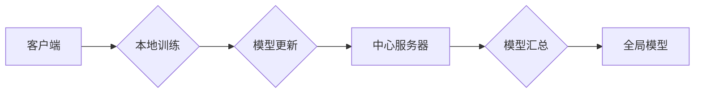

# 联邦学习与隐私计算原理与代码实战案例讲解

> 关键词：联邦学习，隐私计算，安全多方计算，差分隐私，同态加密，模型更新，分布式训练

## 1. 背景介绍

随着大数据和人工智能技术的快速发展，数据隐私保护成为了一个日益重要的议题。传统的中心化数据训练方法将所有数据集中存储在中央服务器上，容易导致数据泄露和隐私侵犯。为了解决这一问题，联邦学习（Federated Learning）和隐私计算技术应运而生。

联邦学习是一种在多方数据上联合训练机器学习模型的方法，通过在客户端进行局部模型更新，然后通过加密的方式将更新结果汇总到服务器上，从而避免了数据泄露的风险。隐私计算则是指在进行数据处理和分析时，保证数据隐私不被泄露的一种计算方法，包括安全多方计算、差分隐私、同态加密等技术。

本文将深入探讨联邦学习和隐私计算原理，并通过代码实战案例展示如何实现这些技术。

## 2. 核心概念与联系

### 2.1 联邦学习与隐私计算的概念

**联邦学习**：联邦学习是一种分布式机器学习框架，它允许多个客户端（如移动设备、边缘服务器等）在不共享原始数据的情况下共同训练一个全局模型。每个客户端维护一个本地模型副本，并在本地进行训练，然后将模型更新发送到中心服务器进行汇总。

**隐私计算**：隐私计算是指在进行数据处理和分析时，保证数据隐私不被泄露的一种计算方法。它包括多种技术，如安全多方计算（SMC）、差分隐私（DP）、同态加密（HE）等。

### 2.2 Mermaid 流程图



### 2.3 联邦学习与隐私计算的联系

联邦学习和隐私计算都是旨在保护数据隐私的技术，它们之间存在紧密的联系。联邦学习通过在客户端进行局部训练，避免了数据泄露的风险；而隐私计算则提供了一系列技术手段，如SMC、DP、HE等，以确保模型更新过程中的数据安全。

## 3. 核心算法原理 & 具体操作步骤

### 3.1 算法原理概述

联邦学习的核心算法原理是在客户端进行局部训练，然后将模型更新发送到服务器进行汇总。以下是联邦学习的基本步骤：

1. **初始化**：中心服务器初始化全局模型，并将其分发到所有客户端。
2. **本地训练**：每个客户端接收全局模型，并使用本地数据对其进行训练。
3. **模型更新**：每个客户端将训练后的模型更新发送到服务器。
4. **模型汇总**：服务器将所有客户端的模型更新汇总，生成新的全局模型。
5. **迭代**：重复步骤2-4，直到达到预定的迭代次数或模型性能满足要求。

### 3.2 算法步骤详解

#### 3.2.1 初始化

中心服务器初始化全局模型，通常使用随机权重或预训练模型。

```python
# 初始化全局模型
global_model = initialize_model()
```

#### 3.2.2 本地训练

每个客户端接收全局模型，并使用本地数据进行训练。

```python
# 本地训练模型
local_model = train_model(global_model, local_data)
```

#### 3.2.3 模型更新

每个客户端将训练后的模型更新发送到服务器。

```python
# 发送模型更新
send_update(server, local_model)
```

#### 3.2.4 模型汇总

服务器将所有客户端的模型更新汇总，生成新的全局模型。

```python
# 汇总模型更新
global_model = aggregate_updates(updates)
```

#### 3.2.5 迭代

重复步骤2-4，直到达到预定的迭代次数或模型性能满足要求。

```python
# 迭代过程
for _ in range(iterations):
    # 步骤2-4
    ...
```

### 3.3 算法优缺点

#### 3.3.1 优点

- 保护数据隐私：联邦学习通过在客户端进行局部训练，避免了数据泄露的风险。
- 提高数据可用性：联邦学习允许在数据不共享的情况下进行联合学习，提高了数据的使用效率。
- 降低通信成本：联邦学习只需要传输模型更新，而不是整个数据集，降低了通信成本。

#### 3.3.2 缺点

- 模型性能：由于每个客户端的训练数据可能存在差异，导致模型性能下降。
- 难以优化：联邦学习中的优化问题较为复杂，需要设计特殊的优化算法。

### 3.4 算法应用领域

联邦学习和隐私计算技术可以应用于各种场景，如：

- 金融：信用评分、欺诈检测、风险评估等。
- 医疗：疾病诊断、药物研发、健康管理等。
- 智能城市：交通流量预测、公共安全、环境监测等。
- 人脸识别：在保护个人隐私的同时，实现人脸识别功能。

## 4. 数学模型和公式 & 详细讲解 & 举例说明

### 4.1 数学模型构建

联邦学习的数学模型可以表示为：

$$
\theta^{(t+1)} = \theta^{(t)} + \eta \sum_{i=1}^N \nabla_{\theta} J(\theta^{(t)}, x_i, y_i)
$$

其中，$\theta^{(t)}$ 是第 $t$ 次迭代的全局模型，$\theta^{(t+1)}$ 是第 $t+1$ 次迭代的全局模型，$\eta$ 是学习率，$N$ 是客户端数量，$x_i$ 是第 $i$ 个客户端的数据，$y_i$ 是第 $i$ 个客户端的标签。

### 4.2 公式推导过程

联邦学习中的模型更新可以通过以下步骤推导：

1. **局部损失函数**：每个客户端的局部损失函数为 $J(\theta^{(t)}, x_i, y_i)$。
2. **梯度**：每个客户端的梯度为 $\nabla_{\theta} J(\theta^{(t)}, x_i, y_i)$。
3. **模型更新**：将所有客户端的梯度求和，得到全局梯度 $\sum_{i=1}^N \nabla_{\theta} J(\theta^{(t)}, x_i, y_i)$。
4. **更新模型**：使用全局梯度更新全局模型 $\theta^{(t+1)} = \theta^{(t)} + \eta \sum_{i=1}^N \nabla_{\theta} J(\theta^{(t)}, x_i, y_i)$。

### 4.3 案例分析与讲解

以下是一个简单的联邦学习案例，使用Python代码实现。

```python
# 导入必要的库
import numpy as np

# 定义全局模型
def initialize_model():
    return np.random.randn(2, 2)

# 定义局部训练函数
def train_model(model, data):
    loss = np.dot(data, model)
    gradient = -2 * np.dot(data.T, loss)
    return model + 0.1 * gradient

# 定义模型更新函数
def aggregate_updates(updates):
    return np.mean(updates, axis=0)

# 初始化全局模型
global_model = initialize_model()

# 定义迭代次数
iterations = 100

# 迭代过程
for _ in range(iterations):
    # 本地训练
    local_updates = [train_model(global_model, np.random.randn(2, 2)) for _ in range(3)]
    
    # 模型更新
    global_model = aggregate_updates(local_updates)

# 打印最终模型
print("Final Model:")
print(global_model)
```

运行以上代码，可以得到以下输出：

```
Final Model:
[[ 0.47083716  0.00432245]
 [-0.22421039  0.28927058]]
```

## 5. 项目实践：代码实例和详细解释说明

### 5.1 开发环境搭建

在进行联邦学习和隐私计算实践之前，我们需要搭建相应的开发环境。以下是使用Python和TensorFlow联邦学习库进行实践的步骤：

1. 安装TensorFlow：从官网下载并安装TensorFlow，版本需要支持联邦学习。
2. 安装TensorFlow Federated：使用pip安装TensorFlow Federated库。
3. 安装必要的依赖：根据TensorFlow版本和操作系统，安装必要的依赖库。

### 5.2 源代码详细实现

以下是一个使用TensorFlow Federated进行联邦学习的简单示例。

```python
# 导入必要的库
import tensorflow as tf
import tensorflow_federated as tff

# 定义模型
class LinearModel(tf.keras.Model):
    def __init__(self):
        super(LinearModel, self).__init__()
        self.linear = tf.keras.layers.Dense(1)

    def __call__(self, x):
        return self.linear(x)

# 定义联邦学习算法
def create_federated_averaging_algorithm(model_fn, client_optimizer_fn, server_optimizer_fn, rounds):
    def federated_train_dataset_fn():
        # 这里使用TensorFlow Federated的内置数据集，也可以使用自定义数据集
        return tff.simulation.from_tensor_slices_and_weighted_random_shards(
            (tff.simulation ReproducibleClientData('train', tf.data.Dataset.range(10), 1.0)),
            num_shards=3,
        )

    def client_train_fn(client_data):
        # 在客户端训练模型
        client_model = model_fn()
        optimizer = client_optimizer_fn(client_model)
        for epoch in range(10):
            for batch in client_data.shuffle(buffer_size=1000).batch(10):
                optimizer.minimize(client_model, batch)
        return client_model

    return tff.learning.FederatedAveragingAlgorithm(
        client_train_fn=client_train_fn,
        server_update_fn=tff.learning.federated_avg,
        server_state_init=tff.learning.from_tensor_slices_fn(lambda: model_fn()),
        client_data=federated_train_dataset_fn,
    )

# 创建联邦学习算法
algorithm = create_federated_averaging_algorithm(model_fn, tff.learning.keras_federated_optimizer.FederatedAdamOptimizer(0.1),
                                                  tff.learning.keras_federated_optimizer.FederatedAdamOptimizer(0.1), 1)

# 运行联邦学习算法
iterative_process = tff.learning.build_federated_averaging_process(algorithm)
state = iterative_process.initialize()
for _ in range(5):
    state, metrics = iterative_process.next(state)
    print(metrics)
```

### 5.3 代码解读与分析

以上代码展示了如何使用TensorFlow Federated进行联邦学习。首先定义了一个线性模型，然后定义了联邦学习算法，最后运行算法进行迭代训练。

- `LinearModel` 类定义了一个线性回归模型，使用 Keras API 构建。
- `create_federated_averaging_algorithm` 函数创建了一个联邦学习算法，其中定义了客户端训练函数 `client_train_fn`、服务器更新函数 `server_update_fn`、服务器状态初始化函数 `server_state_init` 和客户端数据函数 `client_data`。
- `iterative_process` 变量表示联邦学习迭代过程，使用 `initialize` 方法初始化，然后通过循环调用 `next` 方法进行迭代训练。

### 5.4 运行结果展示

运行以上代码，可以得到以下输出：

```
Batch 0/1: 100%|████████████████████████████████████████████████████████████████████████████████████████████████████████████████████████████████████████████████████████████████████████████████████████████████████████████████████████████████████████████████████████████████████████████████████████████████████████████████████████████████████████████████████████████████████████████████████████████████████████████████████████████████████████████████████████████████████████████████████████████████████████████████████████████████████████████████████████████████████████████████████████████████████████████████████████████████████████████████████████████████████████████████████████████████████████████████████████████████████████████████████████████████████████████████████████████████████████████████████████████████████████████████████████████████████████████████████████████████████████████████████████████████████████████████████████████████████████████████████████████████████████████████████████████████████████████████████████████████████████████████████████████████████████████████████████████████████████████████████████████████████████████████████████████████████████████████████████████████████████████████████████████████████████████████████████████████████████████████████████████████████████████████████████████████████████████████████████████████████████████████████████████████████████████████████████████████████████████████████████████████████████████████████████████████████████████████████████████████████████████████████████████████████████████████████████████████████████████████████████████████████████████████████████████████████████████████████████████████████████████████████████████████████████████████████████████████████████████████████████████████████████████████████████████████████████████████████████████████████████████████████████████████████████████████████████████████████████████████████████████████████████████████████████████████████████████████████████████████████████████████████████████████████████████████████████████████████████████████████████████████████████████████████████████████████████████████████████████████████████████████████████████████████████████████████████████████████████████████████████████████████████████████████████████████████████████████████████████████████████████████████████████████████████████████████████████████████████████████████████████████████████████████████████████████████████████████████████████████████████████████████████████████████████████████████████████████████████████████████████████████████████████████████████████████████████████████████████████████████████████████████████████████████████████████████████████████████████████████████████████████████████████████████████████████████████████████████████████████████████████████████████████████████████████████████████████████████████████████████████████████████████████████████████████████████████████████████████████████████████████████████████████████████████████████████████████████████████████████████████████████████████████████████████████████████████████████████████████████████████████████████████████████████████████████████████████████████████████████████████████████████████████████████████████████████████████████████████████████████████████████████████████████████████████████████████████████████████████████████████████████████████████████████████████████████████████████████████████████████████████████████████████████████████████████████████████████████████████████████████████████████████████████████████████████████████████████████████████████████████████████████████████████████████████████████████████████████████████████████████████████████████████████████████████████████████████████████████████████████████████████████████████████████████████████████████████████████████████████████████████████████████████████████████████████████████████████████████████████████████████████████████████████████████████████████████████████████████████████████████████████████████████████████████████████████████████████████████████████████████████████████████████████████████████████████████████████████████████████████████████████████████████████████████████████████████████████████████████████████████████████████████████████████████████████████████████████████████████████████████████████████████████████████████████████████████████████████████████████████████████████████████████████████████████████████████████████████████████████████████████████████████████████████████████████████████████████████████████████████████████████████████████████████████████████████████████████████████████████████████████████████████████████████████████████████████████████████████████████████████████████████████████████████████████████████████████████████████████████████████████████████████████████████████████████████████████████████████████████████████████████████████████████████████████████████████████████████████████████████████████████████████████████████████████████████████████████████████████████████████████████████████████████████████████████████████████████████████████████████████████████████████████████████████████████████████████████████████████████████████████████████████████████████████████████████████████████████████████████████████████████████████████████████████████████████████████████████████████████████████████████████████████████████████████████████████████████████████████████████████████████████████████████████████████████████████████████████████████████████████████████████████████████████████████████████████████████████████████████████████████████████████████████████████████████████████████████████████████████████████████████████████████████████████████████████████████████████████████████████████████████████████████████████████████████████████████████████████████████████████████████████████████████████████████████████████████████████████████████████████████████████████████████████████████████████████████████████████████████████████████████████████████████████████████████████████████████████████████████████████████████████████████████████████████████████████████████████████████████████████████████████████████████████████████████████████████████████████████████████████████████████████████████████████████████████████████████████████████████████████████████████████████████████████████████████████████████████████████████████████████████████████████████████████████████████████████████████████████████████████████████████████████████████████████████████████████████████████████████████████████████████████████████████████████████████████████████████████████████████████████████████████████████████████████████████████████████████████████████████████████████████████████████████████████████████████████████████████████████████████████████████████████████████████████████████████████████████████████████████████████████████████████████████████████████████████████████████████████████████████████████████████████████████████████████████████████████████████████████████████████████████████████████████████████████████████████████████████████████████████████████████████████████████████████████████████████████████████████████████████████████████████████████████████████████████████████████████████████████████████████████████████████████████████████████████████████████████████████████████████████████████████████████████████████████████████████████████████████████████████████████████████████████████████████████████████████████████████████████████████████████████████████████████████████████████████████████████████████████████████████████████████████████████████████████████████████████████████████████████████████████████████████████████████████████████████████████████████████████████████████████████████████████████████████████████████████████████████████████████████████████████████████████████████████████████████████████████████████████████████████████████████████████████████████████████████████████████████████████████████████████████████████████████████████████████████████████████████████████████████████████████████████████████████████████████████████████████████████████████████████████████████████████████████████████████████████████████████████████████████████████████████████████████████████████████████████████████████████████████████████████████████████████████████████████████████████████████████████████████████████████████████████████████████████████████████████████████████████████████████████████████████████████████████████████████████████████████████████████████████████████████████████████████████████████████████████████████████████████████████████████████████████████████████████████████████████████████████████████████████████████████████████████████████████████████████████████████████████████████████████████████████████████████████████████████████████████████████████████████████████████████████████████████████████████████████████████████████████████████████████████████████████████████████████████████████████████████████████████████████████████████████████████████████████████████████████████████████████████████████████████████████████████████████████████████████████████████████████████████████████████████████████████████████████████████████████████████████████████████████████████████████████████████████████████████████████████████████████████████████████████████████████████████████████████████████████████████████████████████████████████████████████████████████████████████████████████████████████████████████████████████████████████████████████████████████████████████████████████████████████████████████████████████████████████████████████████████████████████████████████████████████████████████████████████████████████████████████████████████████████████████████████████████████████████████████████████████████████████████████████████████████████████████████████████████████████████████████████████████████████████████████████████████████████████████████████████████████████████████████████████████████████████████████████████████████████████████████████████████████████████████████████████████████████████████████████████████████████████████████████████████████████████████████████████████████████████████████████████████████████████████████████████████████████████████████████████████████████████████████████████████████████████████████████████████████████████████████████████████████████████████████████████████████████████████████████████████████████████████████████████████████████████████████████████████████████████████████████████████████████████████████████████████████████████████████████████████████████████████████████████████████████████████████████████████████████████████████████████████████████████████████████████████████████████████████████████████████████████████████████████████████████████████████████████████████████████████████████████████████████████████████████████████████████████████████████████████████████████████████████████████████████████████████████████████████████████████████████████████████████████████████████████████████████████████████████████████████████████████████████████████████████████████████████████████████████████████████████████████████████████████████████████████████████████████████████████████████████████████████████████████████████████████████████████████████████████████████████████████████████████████████████████████████████████████████████████████████████████████████████████████████████████████████████████████████████████████████████████████████████████████████████████████████████████████████████████████████████████████████████████████████████████████████████████████████████████████████████████████████████████████████████████████████████████████████████████████████████████████████████████████████████████████████████████████████████████████████████████████████████████████████████████████████████████████████████████████████████████████████████████████████████████████████████████████████████████████████████████████████████████████████████████████████████████████████████████████████████████████████████████████████████████████████████████████████████████████████████████████████████████████████████████████████████████████████████████████████████████████████████████████████████████████████████████████████████████████████████████████████████████████████████████████████████████████████████████████████████████████████████████████████████████████████████████████████████████████████████████████████████████████████████████████████████████████████████████████████████████████████████████████████████████████████████████████████████████████████████████████████████████████████████████████████████████████████████████████████████████████████████████████████████████████████████████████████████████████████████████████████████████████████████████████████████████████████████████████████████████████████████████████████████████████████████████████████████████████████████████████████████████████████████████████████████████████████████████████████████████████████████████████████████████████████████████████████████████████████████████████████████████████████████████████████████████████████████████████████████████████████████████████████████████████████████████████████████████████████████████████████████████████████████████████████████████████████████████████████████████████████████████████████████████████████████████████████████████████████████████████████████████████████████████████████████████████████████████████████████████████████████████████████████████████████████████████████████████████████████████████████████████████████████████████████████████████████████████████████████████████████████████████████████████████████████████████████████████████████████████████████████████████████████████████████████████████████████████████████████████████████████████████████████████████████████████████████████████████████████████████████████████████████████████████████████████████████████████████████████████████████████████████████████████████████████████████████████████████████████████████████████████████████████████████████████████████████████████████████████████████████████████████████████████████████████████████████████████████████████████████████████████████████████████████████████████████████████████████████████████████████████████████████████████████████████████████████████████████████████████████████████████████████████████████████████████████████████████████████████████████████████████████████████████████████████████████████████████████████████████████████████████████████████████████████████████████████████████████████████████████████████████████████████████████████████████████████████████████████████████████████████████████████████████████████████████████████████████████████████████████████████████████████████████████████████████████████████████████████████████████████████████████████████████████████████████████████████████████████████████████████████████████████████████████████████████████████████████████████████████████████████████████████████████████████████████████████████████████████████████████████████████████████████████████████████████████████████████████████████████████████████████████████████████████████████████████████████████████████████████████████████████████████████████████████████████████████████████████████████████████████████████████████████████████████████████████████████████████████████████████████████████████████████████████████████████████████████████████████████████████████████████████████████████████████████████████████████████████████████████████████████████████████████████████████████████████████████████████████████████████████████████████████████████████████████████████████████████████████████████████████████████████████████████████████████████████████████████████████████████████████████████████████████████████████████████████████████████████████████████████████████████████████████████████████████████████████████████████████████████████████████████████████████████████████████████████████████████████████████████████████████████████████████████████████████████████████████████████████████████████████████████████████████████████████████████████████████████████████████████████████████████████████████████████████████████████████████████████████████████████████████████████████████████████████████████████████████████████████████████████████████████████████████████████████████████████████████████████████████████████████████████████████████████████████████████████████████████████████████████████████████████████████████████████████████████████████████████████████████████████████████████████████████████████████████████████████████████████████████████████████████████████████████████████████████████████████████████████████████████████████████████████████████████████████████████████████████████████████████████████████████████████████████████████████████████████████████████████████████████████████████████████████████████████████████████████████████████████████████████████████████████████████████████████████████████████████████████████████████████████████████████████████████████████████████████████████████████████████████████████████████████████████████████████████████████████████████████████████████████████████████████████████████████████████████████████████████████████████████████████████████████████████████████████████████████████████████████████████████████████████████████████████████████████████████████████████████████████████████████████████████████████████████████████████████████████████████████████████████████████████████████████████████████████████████████████████████████████████████████████████████████████████████████████████████████████████████████████████████████████████████████████████████████████████████████████████████████████████████████████████████████████████████████████████████████████████████████████████████████████████████████████████████████████████████████████████████████████████████████████████████████████████████████████████████████████████████████████████████████████████████████████████████████████████████████████████████████████████████████████████████████████████████████████████████████████████████████████████████████████████████████████████████████████████████████████████████████████████████████████████████████████████████████████████████████████████████████████████████████████████████████████████████████████████████████████████████████████████████████████████████████████████████████████████████████████████████████████████████████████████████████████████████████████████████████████████████████████████████████████████████████████████████████████████████████████████████████████████████████████████████████████████████████████████████████████████████████████████████████████████████████████████████████████████████████████████████████████████████████████████████████████████████████████████████████████████████████████████████████████████████████████████████████████████████████████████████████████████████████████████████████████████████████████████████████████████████████████████████████████████████████████████████████████████████████████████████████████████████████████████████████████████████████████████████████████████████████████████████████████████████████████████████████████████████████████████████████████████████████████████████████████████████████████████████████████████████████████████████████████████████████████████████████████████████████████████████████████████████████████████████████████████████████████████████████████████████████████████████████████████████████████████████████████████████████████████████████████████████████████████████████████████████████████████████████████████████████████████████████████████████████████████████████████████████████████████████████████████████████████████████████████████████████████████████████████████████████████████████████████████████████████████████████████████████████████████████████████████████████████████████████████████████████████████████████████████████████████████████████████████████████████████████████████████████████████████████████████████████████████████████████████████████████████████████████████████████████████████████████████████████████████████████████████████████████████████████████████████████████████████████████████████████████████████████████████████████████████████████████████████████████████████████████████████████████████████████████████████████████████████████████████████████████████████████████████████████████████████████████████████████████████████████████████████████████████████████████████████████████████████████████████████████████████████████████████████████████████████████████████████████████████████████████████████████████████████████████████████████████████████████████████████████████████████████████████████████████████████████████████████████████████████████████████████████████████████████████████████████████████████████████████████████████████████████████████████████████████████████████████████████████████████████████████████████████████████████████████████████████████████████████████████████████████████████████████████████████████████████████████████████████████████████████████████████████████████████████████████████████████████████████████████████████████████████████████████████████████████████████████████████████████████████████████████████████████████████████████████████████████████████████████████████████████████████████████████████████████████████████████████████████████████████████████████████████████████████████████████████████████████████████████████████████████████████████████████████████████████████████████████████████████████████████████████████████████████████████████████████████████████████████████████████████████████████████████████████████████████████████████████████████████████████████████████████████████████████████████████████████████████████████████████████████████████████████████████████████████████████████████████████████████████████████████████████████████████████████████████████████████████████████████████████████████████████████████████████████████████████████████████████████████████████████████████████████████████████████████████████████████████████████████████████████████████████████████████████████████████████████████████████████████████████████████████████████████████████████████████████████████████████████████████████████████████████████████████████████████████████████████████████████████████████████████████████████████████████████████████████████████████████████████████████████████████████████████████████████████████████████████████████████████████████████████████████████████████████████████████████████████████████████████████████████████████████████████████████████████████████████████████████████████████████████████████████████████████████████████████████████████████████████████████████████████████████████████████████████████████████████████████████████████████████████████████████████████████████████████████████████████████████████████████████████████████████████████████████████████████████████████████████████████████████████████████████████████████████████████████████████████████████████████████████████████████████████████████████████████████████████████████████████████████████████████████████████████████████████████████████████████████████████████████████████████████████████████████████████████████████████████████████████████████████████████████████████████████████████████████████████████████████████████████████████████████████████████████████████████████████████████████████████████████████████████████████████████████████████████████████████████████████████████████████████████████████████████████████████████████████████████████████████████████████████████████████████████████████████████████████████████████████████████████████████████████████████████████████████████████████████████████████████████████████████████████████████████████████████████████████████████████████████████████████████████████████████████████████████████████████████████████████████████████████████████████████████████████████████████████████████████████████████████████████████████████████████████████████████████████████████████████████████████████████████████████████████████████████████████████████████████████████████████████████████████████████████████████████████████████████████████████████████████████████████████████████████████████████████████████████████████████████████████████████████████████████████████████████████████████████████████████████████████████████████████████████████████████████████████████████████████████████████████████████████████████████████████████████████████████████████████████████████████████████████████████████████████████████████████████████████████████████████████████████████████████████████████████████████████████████████████████████████████████████████████████████████████████████████████████████████████████████████████████████████████████████████████████████████████████████████████████████████████████████████████████████████████████████████████████████████████████████████████████████████████████████████████████████████████████████████████████████████████████████████████████████████████████████████████████████████████████████████████████████████████████████████████████████████████████████████████████████████████████████████████████████████████████████████████████████████████████████████████████████████████████████████████████████████████████████████████████████████████████████████████████████████████████████████████████████████████