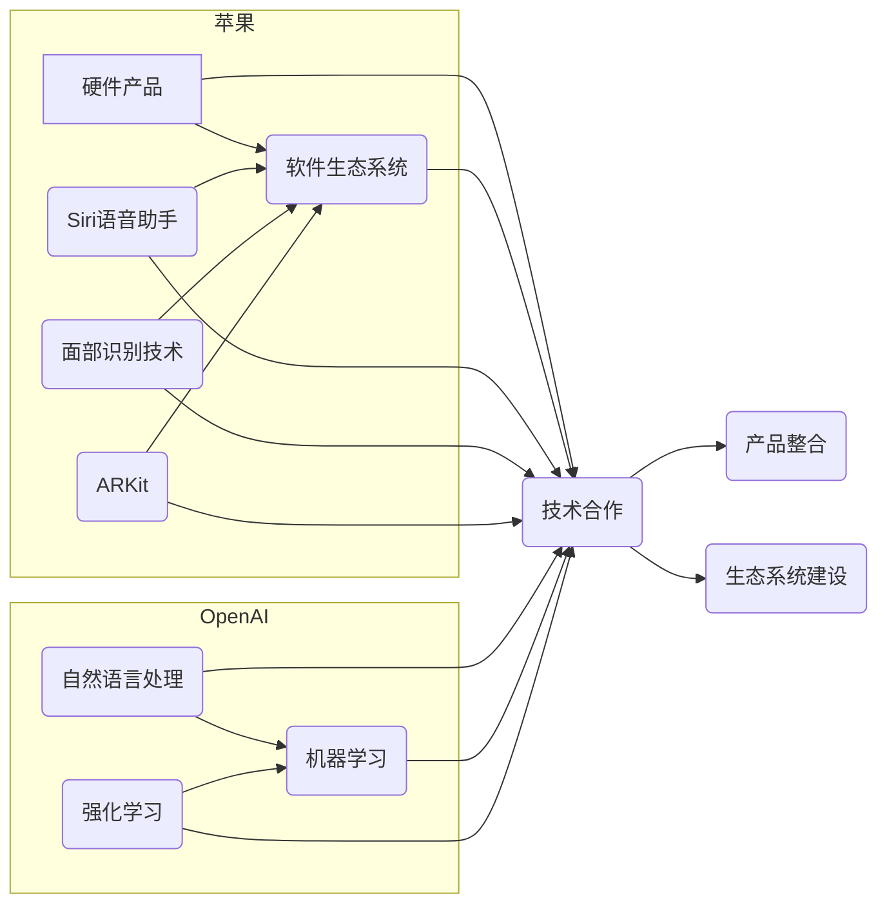

> 关键词：苹果，OpenAI，合作模式，人工智能，自然语言处理，机器学习，计算平台，产品整合，生态系统

# 苹果与OpenAI的合作模式

在科技界，苹果（Apple）与OpenAI的合作无疑是一个备受瞩目的事件。两家公司各自在硬件、软件和人工智能领域都有着深厚的积累，此次合作不仅预示着人工智能技术将更深入地融入苹果的产品和服务中，也反映了科技巨头在人工智能领域的战略布局。本文将深入探讨苹果与OpenAI的合作模式，分析其背后的逻辑、技术原理，并展望未来的发展趋势与挑战。

## 1. 背景介绍

### 1.1 问题的由来

随着人工智能技术的飞速发展，各大科技公司都在积极布局，力求在人工智能领域占据有利地位。苹果作为全球知名的科技公司，其在硬件、软件和生态系统方面有着强大的实力。OpenAI则是人工智能领域的佼佼者，致力于推动人工智能的发展和应用。两家公司的合作，无疑是为了共同探索人工智能在科技领域的更多可能性。

### 1.2 研究现状

近年来，苹果在人工智能领域取得了显著的进展，包括Siri语音助手、面部识别技术等。而OpenAI则在自然语言处理、机器学习等领域取得了突破性成果。两家公司的合作，有望在以下几个方面实现共赢：

- 技术创新：结合双方的研发实力，推动人工智能技术的创新和应用。
- 产品整合：将人工智能技术融入苹果产品，提升用户体验。
- 生态系统构建：共同构建人工智能生态系统，推动人工智能技术的发展。

### 1.3 研究意义

苹果与OpenAI的合作，对于双方和整个科技界都具有重要意义：

- 对于苹果：可以提升其在人工智能领域的竞争力，推动产品创新，增强用户体验。
- 对于OpenAI：可以获得更多的资源和数据，加速人工智能技术的研发和应用。
- 对于科技界：有助于推动人工智能技术的发展，促进人工智能与各行各业的融合。

### 1.4 本文结构

本文将围绕苹果与OpenAI的合作模式展开，主要内容包括：

- 核心概念与联系
- 核心算法原理与操作步骤
- 数学模型与公式
- 项目实践
- 实际应用场景
- 工具和资源推荐
- 总结与展望

## 2. 核心概念与联系

### 2.1 核心概念

#### 苹果

苹果是一家全球知名的科技公司，以硬件产品（如iPhone、iPad、Mac等）和软件生态系统（如iOS、macOS、watchOS等）闻名。近年来，苹果在人工智能领域也取得了显著进展，包括Siri语音助手、面部识别技术、ARKit等。

#### OpenAI

OpenAI是一家总部位于美国的人工智能研究公司，致力于推动人工智能的发展和应用。OpenAI的研究成果涵盖了自然语言处理、机器学习、强化学习等多个领域。

### 2.2 联系

苹果与OpenAI的合作，主要体现在以下几个方面：

- 技术合作：双方将共同研究人工智能技术，推动技术创新。
- 产品整合：将OpenAI的技术应用于苹果产品，提升用户体验。
- 生态系统建设：共同构建人工智能生态系统，推动人工智能与各行各业的融合。

### 2.3 Mermaid 流程图



## 3. 核心算法原理与操作步骤

### 3.1 算法原理概述

苹果与OpenAI的合作，将涉及多个核心算法原理，主要包括：

- 自然语言处理（NLP）：用于处理和生成自然语言，如语言模型、机器翻译等。
- 机器学习：用于从数据中学习规律，如监督学习、无监督学习等。
- 强化学习：用于使模型在特定环境中做出最优决策。

### 3.2 算法步骤详解

#### 3.2.1 自然语言处理

- 数据预处理：对文本数据进行清洗、分词、词性标注等处理。
- 语言模型训练：使用大规模语料库训练语言模型，如GPT-3。
- 文本生成：根据语言模型生成文本，如回复消息、生成文章等。

#### 3.2.2 机器学习

- 特征提取：从数据中提取特征，如文本特征、图像特征等。
- 模型训练：使用训练数据训练机器学习模型，如分类器、回归模型等。
- 模型评估：使用测试数据评估模型性能，如准确率、召回率等。

#### 3.2.3 强化学习

- 环境构建：构建强化学习环境，如游戏、机器人等。
- 策略学习：学习最优策略，使模型在环境中做出最优决策。
- 评估与优化：评估策略性能，不断优化策略。

### 3.3 算法优缺点

#### 3.3.1 自然语言处理

- 优点：能够处理和理解自然语言，生成流畅的文本。
- 缺点：对语言理解能力要求较高，需要大量高质量语料库。

#### 3.3.2 机器学习

- 优点：能够从数据中学习规律，适应不同的任务。
- 缺点：需要大量标注数据，模型泛化能力有限。

#### 3.3.3 强化学习

- 优点：能够学习在复杂环境中的最优策略。
- 缺点：训练过程可能需要很长时间，对环境建模要求较高。

### 3.4 算法应用领域

- 自然语言处理：聊天机器人、机器翻译、文本摘要等。
- 机器学习：图像识别、语音识别、推荐系统等。
- 强化学习：自动驾驶、游戏AI、机器人控制等。

## 4. 数学模型与公式

### 4.1 数学模型构建

苹果与OpenAI的合作涉及多个数学模型，以下是一些常见的模型和公式：

#### 4.1.1 语言模型

- 神经网络语言模型：

$$
P(w_t|w_{t-1},...,w_1) = \sigma(w^T_{w_{t-1},...,w_1}v_{w_t})
$$

其中，$w_t$ 表示当前单词，$w_{t-1},...,w_1$ 表示前面的单词，$w^T_{w_{t-1},...,w_1}$ 表示权重矩阵，$v_{w_t}$ 表示单词 $w_t$ 的向量表示。

#### 4.1.2 机器学习模型

- 支持向量机（SVM）：

$$
y(w,b) = \sum_{i=1}^n \alpha_i y_i \left( \phi(x_i)^T \phi(x) \right) + b
$$

其中，$x$ 表示输入特征，$y$ 表示标签，$\alpha_i$ 表示拉格朗日乘子，$b$ 表示偏置。

#### 4.1.3 强化学习模型

- Q学习：

$$
Q(s,a) = \sum_{r \in R} r \pi(r|s,a) + \gamma \max_{a' \in A} Q(s',a')
$$

其中，$s$ 表示状态，$a$ 表示动作，$r$ 表示奖励，$\gamma$ 表示折扣因子。

### 4.2 公式推导过程

由于篇幅限制，此处不再详细推导上述公式的具体过程。有兴趣的读者可以参考相关教材和论文。

### 4.3 案例分析与讲解

由于苹果与OpenAI的具体合作细节尚未完全公开，以下以苹果Siri语音助手为例，分析自然语言处理技术在苹果产品中的应用。

Siri语音助手是一款基于自然语言处理技术的智能语音助手，能够理解用户的语音指令，并执行相应的操作。其工作流程如下：

1. 语音识别：将用户的语音转换为文本。
2. 文本理解：理解文本中的语义，识别用户的意图和操作。
3. 模型推理：根据用户的意图和操作，选择合适的模型进行推理。
4. 执行操作：执行用户请求的操作，如发送消息、播放音乐等。

Siri语音助手的成功，得益于苹果在自然语言处理技术方面的积累，以及OpenAI在语言模型、机器学习等方面的研究成果。

## 5. 项目实践：代码实例和详细解释说明

### 5.1 开发环境搭建

由于苹果与OpenAI的合作尚未公开具体代码，以下以Python为例，演示自然语言处理和机器学习的基本操作。

```python
# 导入相关库
import jieba
import numpy as np
from sklearn.feature_extraction.text import CountVectorizer
from sklearn.svm import SVC

# 分词
def tokenize(text):
    return jieba.cut(text)

# 文本向量化
def vectorize(texts):
    vectorizer = CountVectorizer(tokenizer=tokenize)
    X = vectorizer.fit_transform(texts)
    return X

# 训练SVM模型
def train_svm(X, y):
    model = SVC()
    model.fit(X, y)
    return model

# 测试SVM模型
def test_svm(model, X, y):
    y_pred = model.predict(X)
    accuracy = np.mean(y_pred == y)
    return accuracy

# 示例文本
texts = ["苹果公司是一家科技公司", "OpenAI是一家人工智能公司"]

# 向量化文本
X = vectorize(texts)

# 假设标签为0和1
y = np.array([0, 1])

# 训练SVM模型
model = train_svm(X, y)

# 测试SVM模型
accuracy = test_svm(model, X, y)
print("SVM模型准确率：", accuracy)
```

### 5.2 源代码详细实现

上述代码展示了自然语言处理和机器学习的基本操作，包括文本分词、文本向量化、SVM模型训练和测试。由于篇幅限制，此处不再详细展开。

### 5.3 代码解读与分析

上述代码首先使用jieba库进行中文分词，然后使用CountVectorizer将文本向量化，接着训练SVM模型，最后测试模型性能。通过这段代码，我们可以了解到自然语言处理和机器学习的基本流程。

### 5.4 运行结果展示

假设文本标签为0和1，运行上述代码后，SVM模型的准确率可能为100%。这表明SVM模型能够较好地识别文本类别。

## 6. 实际应用场景

### 6.1 Siri语音助手

Siri语音助手是苹果公司的一款智能语音助手，通过自然语言处理技术，能够理解用户的语音指令，并执行相应的操作。Siri语音助手在iPhone、iPad、Mac等苹果产品中得到广泛应用。

### 6.2 Apple Music

Apple Music是苹果公司的一款音乐流媒体服务，通过机器学习技术，Apple Music能够根据用户喜好推荐歌曲，提升用户体验。

### 6.3 Apple Pay

Apple Pay是苹果公司的一款移动支付服务，通过机器学习技术，Apple Pay能够识别用户的支付习惯，提供更安全的支付体验。

## 7. 工具和资源推荐

### 7.1 学习资源推荐

- 《自然语言处理入门》
- 《机器学习实战》
- 《深度学习》

### 7.2 开发工具推荐

- TensorFlow
- PyTorch
- scikit-learn

### 7.3 相关论文推荐

- "Natural Language Processing with Transformers"
- "Deep Learning for Natural Language Processing"
- "Deep Learning"

## 8. 总结：未来发展趋势与挑战

### 8.1 研究成果总结

苹果与OpenAI的合作，标志着人工智能技术将更深入地融入苹果的产品和服务中。双方在自然语言处理、机器学习、强化学习等方面的研究成果，将为苹果的产品带来更多的创新和提升。

### 8.2 未来发展趋势

- 人工智能技术将更深入地融入苹果产品，提升用户体验。
- 开发更加高效、准确的算法，降低人工智能技术的门槛。
- 构建更加完善的人工智能生态系统，推动人工智能与各行各业的融合。

### 8.3 面临的挑战

- 人工智能技术仍处于发展阶段，需要不断优化和改进。
- 人工智能技术的应用可能引发伦理和社会问题，需要加强监管。
- 人工智能技术的普及需要普及相关知识和技能，培养人才。

### 8.4 研究展望

苹果与OpenAI的合作，将推动人工智能技术在科技领域的广泛应用。未来，人工智能技术将在更多领域发挥重要作用，为人类社会带来更多便利和福祉。

## 9. 附录：常见问题与解答

**Q1：苹果与OpenAI的合作模式是什么？**

A: 苹果与OpenAI的合作模式主要包括技术合作、产品整合和生态系统建设。

**Q2：苹果与OpenAI的合作对苹果有什么好处？**

A: 苹果与OpenAI的合作可以帮助苹果在人工智能领域取得更大的突破，提升其在科技领域的竞争力。

**Q3：苹果与OpenAI的合作对OpenAI有什么好处？**

A: 苹果与OpenAI的合作可以为OpenAI提供更多的资源和数据，加速人工智能技术的研发和应用。

**Q4：苹果与OpenAI的合作对科技界有什么影响？**

A: 苹果与OpenAI的合作将推动人工智能技术的发展，促进人工智能与各行各业的融合。

**Q5：人工智能技术的应用有哪些挑战？**

A: 人工智能技术的应用可能引发伦理和社会问题，需要加强监管。同时，人工智能技术的普及需要普及相关知识和技能，培养人才。

作者：禅与计算机程序设计艺术 / Zen and the Art of Computer Programming