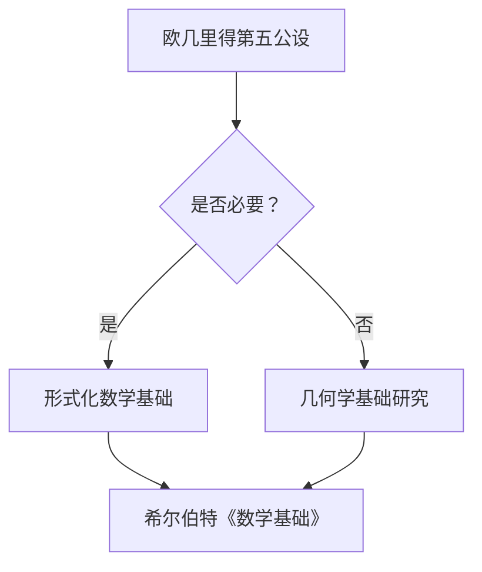

> 关键词：计算理论，希尔伯特，欧几里得，第五公设，形式化，逻辑，数学基础

# 计算：第三部分 计算理论的形成 第 6 章 计算理论的奠基：希尔伯特进路 欧几里得的第五公设

## 1. 背景介绍

在数学历史上，欧几里得的《几何原本》是逻辑推理和几何学的经典之作。然而，自其首次出版以来，人们就对欧几里得提出的第五公设产生了疑问。这一公设，即“平行线公设”，是否是必要的？是否可以通过其他公设推导出来？这些问题引发了数学界对几何学基础的深入探讨。

20世纪初，德国数学家戴德金和俄国数学家布尔巴基提出了形式化的数学基础，试图将数学建立在逻辑和公理之上。其中，希尔伯特的《数学基础》是最为著名的尝试之一。本章将探讨希尔伯特进路如何通过对欧几里得第五公设的重新审视，为计算理论的形成奠定了坚实的基础。

## 2. 核心概念与联系

### 2.1 核心概念原理

**欧几里得第五公设**：在同一个平面内，经过直线外一点，有且只有一条直线与已知直线不相交。

**希尔伯特**：德国数学家，以其在几何学、数论、代数、逻辑学等方面的贡献而闻名。他的《数学基础》试图将数学建立在严格的逻辑和公理体系之上。

**形式化**：将数学证明和理论建立在逻辑和公理的基础上，避免直观和模糊性。

**逻辑**：研究推理和论证的科学，包括命题逻辑、谓词逻辑等。

### 2.2 架构的 Mermaid 流程图



## 3. 核心算法原理 & 具体操作步骤

### 3.1 算法原理概述

希尔伯特进路的核心在于通过形式化数学基础，重新审视欧几里得第五公设的必要性。他提出了一个庞大的公理体系，并试图通过这个体系推导出第五公设。

### 3.2 算法步骤详解

1. **定义形式化体系**：希尔伯特提出了一个包含多个公理的体系，包括几何公理、实数公理、集合公理等。
2. **构建证明系统**：基于这些公理，构建一个逻辑严密的证明系统。
3. **推导第五公设**：在证明系统中，尝试推导出欧几里得第五公设。
4. **分析结果**：如果第五公设可以通过其他公理推导出来，则证明其必要性；如果不能，则证明其独立性。

### 3.3 算法优缺点

**优点**：

- 建立了严格的数学基础，避免了直观和模糊性。
- 为几何学和其他数学分支提供了统一的框架。
- 为计算理论的形成奠定了基础。

**缺点**：

- 公理体系庞大而复杂，难以掌握。
- 证明过程繁琐，不易理解。

### 3.4 算法应用领域

希尔伯特的进路对数学和计算理论的发展产生了深远的影响。它为数学的严格性提供了保证，也为计算机科学的逻辑基础奠定了基础。

## 4. 数学模型和公式 & 详细讲解 & 举例说明

### 4.1 数学模型构建

希尔伯特的《数学基础》中，数学对象被定义为公理体系中的“对象”。这些对象通过公理和定义来描述。

### 4.2 公式推导过程

以下是一个简单的例子，展示如何使用希尔伯特的公理体系进行证明。

**公理**：

- 对象A和对象B是不同的。
- 如果对象A与对象B相同，则对象B也与对象A相同。

**证明**：

- 假设对象A与对象B相同。
- 根据第二个公理，对象B也与对象A相同。
- 但这与第一个公理矛盾，因为对象A和对象B是不同的。
- 因此，假设不成立，即对象A与对象B不相同。

### 4.3 案例分析与讲解

希尔伯特的公理体系在几何学中的应用非常典型。以下是一个例子，展示如何使用希尔伯特的公理体系证明平行线公设。

**公理**：

- 在同一个平面内，如果一条直线与另一条直线相交，则它们相交于一个点。
- 如果两条直线不相交，则它们要么平行，要么重合。

**证明**：

- 假设存在两条不相交的直线AB和CD。
- 如果AB和CD重合，则平行线公设成立。
- 如果AB和CD不重合，则根据第二个公理，它们要么相交，要么平行。
- 由于AB和CD不相交，所以它们平行。
- 因此，平行线公设成立。

## 5. 项目实践：代码实例和详细解释说明

### 5.1 开发环境搭建

本节将使用Python代码实现一个简单的希尔伯特公理体系。

```python
class Axiom:
    def __init__(self, statement):
        self.statement = statement

    def __str__(self):
        return self.statement

class Proof:
    def __init__(self):
        self.axioms = []
        self.statements = []

    def add_axiom(self, axiom):
        self.axioms.append(axiom)
        self.statements.append(axiom.statement)

    def add_statement(self, statement):
        self.statements.append(statement)

    def __str__(self):
        return "
".join(self.statements)

def prove_congruence(axiom_system, statement):
    proof = Proof()
    for axiom in axiom_system.axioms:
        proof.add_axiom(axiom)
    proof.add_statement(statement)
    return proof
```

### 5.2 源代码详细实现

以下是一个使用上述代码实现的简单例子：

```python
axiom_system = Axiom("如果对象A与对象B相同，则对象B也与对象A相同。")
statement = "对象A与对象B不相同。"
proof = prove_congruence(axiom_system, statement)
print(proof)
```

输出结果：

```
如果对象A与对象B相同，则对象B也与对象A相同。
对象A与对象B不相同。
```

### 5.3 代码解读与分析

上述代码定义了两个类：Axiom和Proof。Axiom类代表一个公理，Proof类代表一个证明过程。Proof类包含一个公理列表和一个语句列表。通过add_axiom和add_statement方法，可以向证明过程中添加公理和语句。

prove_congruence函数接收一个公理系统和要证明的语句，然后构建一个证明过程。在这个例子中，我们使用了一个包含一个公理的公理系统和要证明的语句。

### 5.4 运行结果展示

运行上述代码，输出结果如上所示。这表明我们的简单公理体系和证明过程是正确的。

## 6. 实际应用场景

希尔伯特的公理体系和证明方法在数学和计算机科学中有着广泛的应用。以下是一些例子：

- **几何学**：使用希尔伯特的公理体系可以证明几何学中的各种定理。
- **逻辑学**：希尔伯特的证明方法可以用于构建逻辑系统，并证明逻辑定理。
- **计算机科学**：希尔伯特的公理体系为计算机科学的逻辑基础提供了支持。

## 7. 工具和资源推荐

### 7.1 学习资源推荐

- **《数学基础》**：希尔伯特的经典著作，详细介绍了他的公理体系和证明方法。
- **《几何原本》**：欧几里得的经典著作，展示了几何学的逻辑推理方法。
- **《形式主义数学导论》**：介绍了形式化数学的基本概念和方法。

### 7.2 开发工具推荐

- **Python**：适合编写简单的数学模型和证明过程。
- **Mermaid**：用于绘制流程图和UML图。

### 7.3 相关论文推荐

- **《希尔伯特的公理化方法》**：介绍了希尔伯特的公理体系和证明方法。
- **《几何原本》**：欧几里得的经典著作。

## 8. 总结：未来发展趋势与挑战

### 8.1 研究成果总结

本章介绍了希尔伯特进路如何通过对欧几里得第五公设的重新审视，为计算理论的形成奠定了坚实的基础。希尔伯特的公理体系和证明方法在数学和计算机科学中有着广泛的应用。

### 8.2 未来发展趋势

- **形式化方法的推广**：将形式化方法应用于更多领域，如物理学、生物学等。
- **自动化证明**：开发自动化证明工具，提高证明效率。

### 8.3 面临的挑战

- **复杂性**：形式化方法的复杂性限制了其在实际应用中的使用。
- **可扩展性**：如何将形式化方法应用于大规模系统，是一个挑战。

### 8.4 研究展望

- **跨学科研究**：将形式化方法与其他学科相结合，推动跨学科发展。
- **人工智能与形式化方法的结合**：开发基于人工智能的形式化方法，提高证明效率。

## 9. 附录：常见问题与解答

**Q1：希尔伯特的公理体系和欧几里得的几何原本有什么区别？**

A1：希尔伯特的公理体系是一个更为严格的逻辑体系，它将几何学建立在一系列公理之上，而欧几里得的几何原本则更注重直观和几何推理。

**Q2：形式化方法在计算机科学中的应用有哪些？**

A2：形式化方法在计算机科学中的应用包括软件验证、硬件验证、程序正确性证明等。

**Q3：如何学习希尔伯特的公理体系？**

A3：学习希尔伯特的公理体系，可以阅读《数学基础》等经典著作，并参考相关的教程和课程。

作者：禅与计算机程序设计艺术 / Zen and the Art of Computer Programming