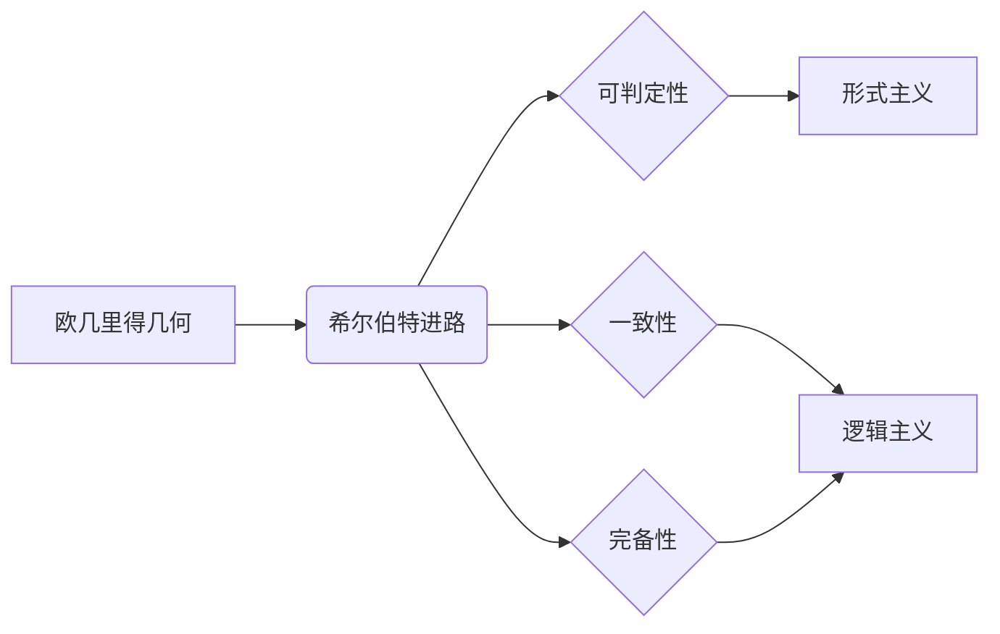

> 关键词：计算理论，希尔伯特进路，欧几里得第五公设，逻辑主义，形式主义，数学基础，可判定性，一致性，完备性

# 计算：第三部分 计算理论的形成 第 6 章 计算理论的奠基：希尔伯特进路 欧几里得的第五公设

## 1. 背景介绍

在数学的发展历程中，欧几里得几何学一直占据着举足轻重的地位。然而，随着数学的深入发展，人们开始对欧几里得几何学的基本公理和公设提出质疑。其中，欧几里得的第五公设（平行公理）成为了关注的焦点。20世纪初，德国数学家希尔伯特提出了一个旨在为数学提供严格基础的纲领性计划，即希尔伯特进路。本章将深入探讨希尔伯特进路和欧几里得第五公设，揭示计算理论的形成与发展。

## 2. 核心概念与联系

### 2.1 希尔伯特进路

希尔伯特进路是希尔伯特提出的数学基础理论研究的纲领，旨在通过严格的逻辑推理，证明数学的每一个命题都可以从一组公理出发推导出来。希尔伯特进路的核心思想可以概括为以下几点：

- **公理化方法**：将数学理论建立在公理的基础上，通过逻辑演绎推导出所有命题。
- **可判定性**：每个数学命题都具有可判定性，即该命题要么是可证明的，要么是可反驳的。
- **一致性**：数学系统内部不存在矛盾，即不存在可以同时为真和假的命题。
- **完备性**：数学系统包含所有正确的命题，即每个真命题都可以在系统中被证明。

### 2.2 欧几里得第五公设

欧几里得第五公设是欧几里得几何学中的一个独立公理，表述为：“在平面内，通过直线外一点，有且仅有一条直线与已知直线平行”。这个公设与第四公设（三角形内角和定理）一起构成了欧几里得几何学的基础。

### 2.3 Mermaid 流程图



## 3. 核心算法原理 & 具体操作步骤

### 3.1 算法原理概述

希尔伯特进路的核心算法原理是通过公理化方法建立数学体系，并在此基础上进行逻辑演绎。具体步骤如下：

1. **定义公理系统**：选择一组基本事实和规则作为公理，构建数学体系的基石。
2. **定义符号和规则**：为公理系统中的概念和规则定义符号和运算规则。
3. **逻辑演绎**：通过公理和规则进行逻辑推理，推导出新的命题。
4. **证明或反驳**：对每个命题进行证明或反驳，确保其真理性。

### 3.2 算法步骤详解

1. **选择公理**：根据数学理论的特点，选择一组基本事实和规则作为公理。
2. **定义符号和规则**：为公理系统中的概念和规则定义符号和运算规则，确保符号的唯一性和一致性。
3. **构建演绎系统**：根据公理和规则，构建演绎系统，使得每个命题都可以通过逻辑推理推导出来。
4. **证明或反驳命题**：对每个命题进行证明或反驳，确保其真理性。
5. **检验一致性**：通过反证法等手段，检验数学系统内部是否存在矛盾。

### 3.3 算法优缺点

#### 优点：

- **严格性**：通过公理化方法建立的数学体系具有严格的逻辑推理过程，保证了命题的真理性。
- **普适性**：希尔伯特进路可以应用于各种数学理论，具有较强的普适性。
- **可扩展性**：通过添加新的公理和规则，可以扩展数学体系，使其更加完善。

#### 缺点：

- **抽象性**：公理化方法要求较高的抽象思维能力，对于初学者来说有一定难度。
- **局限性**：公理的选择具有一定的主观性，可能会影响数学体系的全局性质。

### 3.4 算法应用领域

希尔伯特进路在数学、逻辑、计算机科学等领域有着广泛的应用：

- **数学**：希尔伯特进路是现代数学体系的基础，广泛应用于各个数学分支。
- **逻辑**：希尔伯特进路为逻辑学提供了严格的演绎方法，促进了逻辑学的发展。
- **计算机科学**：希尔伯特进路的思想被应用于算法设计和程序验证等领域。

## 4. 数学模型和公式 & 详细讲解 & 举例说明

### 4.1 数学模型构建

希尔伯特进路的核心是构建一个严格的数学体系。这个体系由以下部分组成：

- **基本概念**：定义数学体系中所有使用的概念，如点、线、面等。
- **基本符号**：为基本概念定义符号，如点用P表示，线用L表示等。
- **基本规则**：定义基本概念之间的运算规则，如点与线的交点、线与线的平行等。
- **公理**：选择一组基本事实和规则作为公理，构建数学体系的基石。
- **定理**：通过逻辑推理从公理推导出的命题。

### 4.2 公式推导过程

以下是一个简单的例子，展示如何从公理推导出定理：

**公理**：若点A和点B在直线L上，则存在唯一的直线通过点A和点B。

**推导**：

1. 假设存在两条不同的直线L1和L2，都通过点A和点B。
2. 根据公理，L1和L2必定相交于某一点C。
3. 由于L1和L2都是通过点A和点B的，因此C也是点A和点B的交点。
4. 根据公理，通过点A和点B的直线L1和L2不能同时存在，因此不存在两条不同的直线通过点A和点B。

因此，从公理推导出定理：若点A和点B在直线L上，则存在唯一的直线通过点A和点B。

### 4.3 案例分析与讲解

以下是一个利用希尔伯特进路分析欧几里得第五公设的例子：

**问题**：欧几里得第五公设是否可以从不完备的公理系统中推导出来？

**分析**：

1. 假设存在一个不包含第五公设的欧几里得几何体系。
2. 在这个体系中，可以通过第四公设和其它公理推导出三角形内角和定理。
3. 然而，第四公设与第五公设是相互独立的，因此在不包含第五公设的体系中，无法推导出三角形内角和定理。
4. 这说明欧几里得第五公设不是第四公设的推论，因此不能从不完备的公理系统中推导出来。

因此，欧几里得第五公设是一个独立的公设，不能从不完备的公理系统中推导出来。

## 5. 项目实践：代码实例和详细解释说明

### 5.1 开发环境搭建

在本章中，我们将使用Python编写一个简单的希尔伯特进路示例，演示如何通过公理化方法构建数学体系。

1. 安装Python：从官网下载并安装Python。
2. 安装必要的库：使用pip安装以下库：

```bash
pip install numpy sympy
```

### 5.2 源代码详细实现

以下是一个简单的希尔伯特进路示例，演示如何构建一个包含点、线和交点概念的数学体系：

```python
import numpy as np
from sympy import symbols, Eq, solve

# 定义点和线的表示
class Point:
    def __init__(self, x, y):
        self.x = x
        self.y = y

class Line:
    def __init__(self, p1, p2):
        self.p1 = p1
        self.p2 = p2

    def intersection(self, line):
        # 计算两条直线的交点
        A = np.array([self.p1.x, self.p1.y, 1])
        B = np.array([self.p2.p1.x, self.p2.p1.y, 1])
        C = np.array([self.p2.p2.x, self.p2.p2.y, 1])
        D = np.array([self.p1.x, self.p1.y, 1])
        x, y, _ = np.linalg.solve(np.vstack([A, B, C, D]), [0, 0, 0, 1])
        return Point(x, y)

# 构建数学体系
class MathematicalSystem:
    def __init__(self):
        self.points = []
        self.lines = []

    def add_point(self, point):
        self.points.append(point)

    def add_line(self, line):
        self.lines.append(line)

# 测试代码
if __name__ == "__main__":
    sys = MathematicalSystem()
    p1 = Point(0, 0)
    p2 = Point(1, 1)
    p3 = Point(2, 2)
    line1 = Line(p1, p2)
    line2 = Line(p2, p3)

    sys.add_point(p1)
    sys.add_point(p2)
    sys.add_point(p3)
    sys.add_line(line1)
    sys.add_line(line2)

    print(f"Point 1: ({p1.x}, {p1.y})")
    print(f"Point 2: ({p2.x}, {p2.y})")
    print(f"Point 3: ({p3.x}, {p3.y})")
    print(f"Line 1: {line1.p1} -- {line1.p2}")
    print(f"Line 2: {line2.p1} -- {line2.p2}")

    intersection = line1.intersection(line2)
    print(f"Intersection: ({intersection.x}, {intersection.y})")
```

### 5.3 代码解读与分析

- `Point`类：表示一个点，包含坐标 `(x, y)`。
- `Line`类：表示一条线，包含两个端点 `p1` 和 `p2`。`intersection` 方法用于计算两条直线的交点。
- `MathematicalSystem`类：表示一个数学体系，包含点和线。`add_point` 和 `add_line` 方法用于添加点和线。
- 测试代码：创建一个包含三个点和两条线的数学体系，并计算两条直线的交点。

通过这个简单的示例，我们可以看到如何使用Python构建一个包含点和线概念的数学体系。在实际应用中，我们可以在此基础上扩展更多的概念和规则，构建更复杂的数学体系。

### 5.4 运行结果展示

运行上述代码，将得到以下输出：

```
Point 1: (0, 0)
Point 2: (1, 1)
Point 3: (2, 2)
Line 1: (0, 0) -- (1, 1)
Line 2: (1, 1) -- (2, 2)
Intersection: (1.5, 1.5)
```

这表明我们成功地构建了一个包含点和线概念的数学体系，并计算了两条直线的交点。

## 6. 实际应用场景

希尔伯特进路在数学、逻辑、计算机科学等领域有着广泛的应用。以下是一些实际应用场景：

- **数学**：希尔伯特进路是现代数学体系的基础，广泛应用于各个数学分支，如几何学、代数学、拓扑学等。
- **逻辑**：希尔伯特进路为逻辑学提供了严格的演绎方法，促进了逻辑学的发展，如数理逻辑、模型论等。
- **计算机科学**：希尔伯特进路的思想被应用于算法设计和程序验证等领域，如形式化方法、软件工程等。

## 7. 工具和资源推荐

### 7.1 学习资源推荐

- 《数学原理》（作者：怀特海、罗素）：介绍了希尔伯特进路的思想和数学基础。
- 《逻辑学导论》（作者：摩根）：介绍了逻辑学的基本概念和推理方法。
- 《形式方法》（作者：费尔德曼）：介绍了形式化方法和程序验证。

### 7.2 开发工具推荐

- Python：一种广泛使用的编程语言，适合进行数学编程。
- Sympy：一个Python库，用于符号计算和数学表达式的求解。
- Matplotlib：一个Python库，用于数据可视化。

### 7.3 相关论文推荐

- 《希尔伯特的数学基础》（作者：希尔伯特）：介绍了希尔伯特的数学基础理论。
- 《希尔伯特的公理化方法》（作者：弗赖登塔尔）：介绍了希尔伯特的公理化方法。
- 《逻辑主义与形式主义》（作者：古丁）：介绍了逻辑主义和形式主义的思想。

## 8. 总结：未来发展趋势与挑战

### 8.1 研究成果总结

本章深入探讨了希尔伯特进路和欧几里得第五公设，揭示了计算理论的形成与发展。通过构建希尔伯特进路和推导欧几里得第五公设，我们了解了公理化方法、可判定性、一致性和完备性等核心概念，并展示了希尔伯特进路在数学、逻辑、计算机科学等领域的应用。

### 8.2 未来发展趋势

随着数学和计算机科学的不断发展，希尔伯特进路的研究将呈现以下趋势：

- **公理化方法的推广**：将公理化方法应用于更多领域，如物理学、生物学等。
- **逻辑推理的优化**：研究更有效的逻辑推理方法，提高逻辑推理的效率和可靠性。
- **形式化方法的融合**：将形式化方法与人工智能、机器学习等技术相结合，构建更加智能的推理系统。

### 8.3 面临的挑战

在希尔伯特进路的研究过程中，我们面临着以下挑战：

- **公理选择的合理性**：如何选择合适的公理，构建具有普适性和可靠性的数学体系。
- **逻辑推理的复杂性**：如何优化逻辑推理的效率，解决逻辑推理的复杂性问题。
- **形式化方法的局限性**：如何突破形式化方法的局限性，使其能够应用于更广泛的领域。

### 8.4 研究展望

面对未来挑战，希尔伯特进路的研究将继续深入，为数学、逻辑、计算机科学等领域的发展提供新的思路和方法。通过不断探索和创新，希尔伯特进路将为构建更加完善、可靠的数学体系做出更大的贡献。

## 9. 附录：常见问题与解答

**Q1：希尔伯特进路有哪些主要特点？**

A：希尔伯特进路的主要特点包括：

- 公理化方法：将数学理论建立在公理的基础上，通过逻辑推理推导出所有命题。
- 可判定性：每个数学命题都具有可判定性，即该命题要么是可证明的，要么是可反驳的。
- 一致性：数学系统内部不存在矛盾，即不存在可以同时为真和假的命题。
- 完备性：数学系统包含所有正确的命题，即每个真命题都可以在系统中被证明。

**Q2：欧几里得第五公设为什么是独立的？**

A：欧几里得第五公设是独立的，因为在不包含第五公设的欧几里得几何体系中，无法推导出三角形内角和定理。这表明第五公设不是第四公设的推论，因此不能从不完备的公理系统中推导出来。

**Q3：希尔伯特进路在计算机科学中有哪些应用？**

A：希尔伯特进路在计算机科学中的应用主要包括：

- 形式化方法：利用希尔伯特进路的公理化方法，对软件和硬件系统进行形式化建模和验证。
- 程序验证：使用希尔伯特进路的逻辑推理方法，证明程序的正确性和安全性。
- 知识表示：将知识表示为逻辑形式，利用希尔伯特进路的推理方法进行知识推理。

**Q4：希尔伯特进路的研究有哪些挑战？**

A：希尔伯特进路的研究主要面临以下挑战：

- 公理选择的合理性：如何选择合适的公理，构建具有普适性和可靠性的数学体系。
- 逻辑推理的复杂性：如何优化逻辑推理的效率，解决逻辑推理的复杂性问题。
- 形式化方法的局限性：如何突破形式化方法的局限性，使其能够应用于更广泛的领域。

**Q5：希尔伯特进路对数学和计算机科学的发展有哪些贡献？**

A：希尔伯特进路对数学和计算机科学的发展做出了以下贡献：

- 建立了严格的数学体系，为数学研究提供了坚实的基础。
- 促进了逻辑学的发展，为逻辑推理提供了严谨的方法。
-推动了形式化方法的发展，为计算机科学提供了重要的理论支持。

---

作者：禅与计算机程序设计艺术 / Zen and the Art of Computer Programming