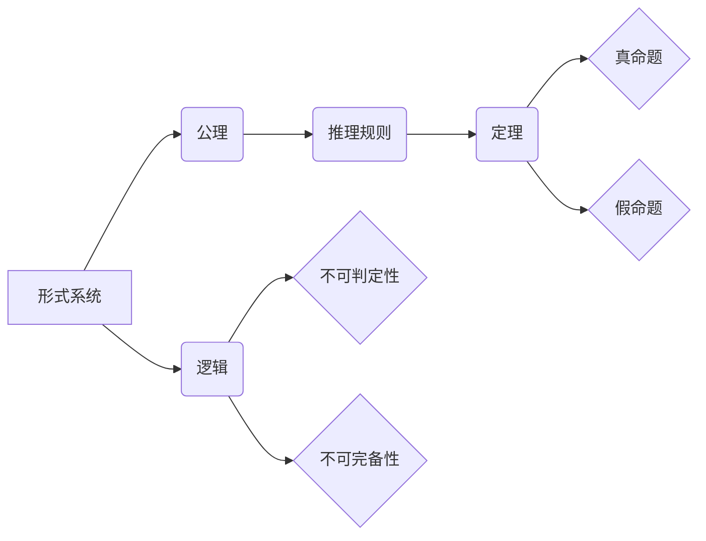

# 计算：第三部分 计算理论的形成 第 7 章 计算不能做什么：终结者哥德尔 塔斯基定理

> 关键词：计算理论，哥德尔不完备定理，塔斯基不可判定定理，逻辑，数学，人工智能，可计算性

## 1. 背景介绍

在20世纪初，随着数学和逻辑学的蓬勃发展，科学家们开始探索计算的本质和极限。这一时期，两位数学家——库尔特·哥德尔和阿尔弗雷德·塔斯基——提出了两个具有深远影响的定理，即哥德尔不完备定理和塔斯基不可判定定理。这两个定理揭示了计算理论和逻辑基础的边界，为人工智能和计算机科学的发展奠定了坚实的理论基础。

本章将深入探讨哥德尔和塔斯基因的贡献，分析哥德尔不完备定理和塔斯基不可判定定理的含义及其在计算理论中的应用，并展望未来计算理论的发展趋势。

## 2. 核心概念与联系

为了更好地理解哥德尔和塔斯基因的定理，首先需要介绍以下几个核心概念：

### 2.1 形式系统

形式系统是一组符号和公理组成的系统，用于表示和推理数学和逻辑语句。形式系统通常包含以下元素：

- 符号集：包括变量、常量、函数和逻辑运算符等。
- 公理集：一组初始假设或基本事实。
- 推理规则：用于从公理集推导出新命题的规则。

### 2.2 公理和定理

公理是形式系统中的基本假设，通常被视为不可证明的。定理是通过逻辑推理从公理推出的结论。

### 2.3 逻辑

逻辑是研究推理和论证规律的科学，包括命题逻辑、谓词逻辑和模态逻辑等。

### 2.4 不可判定性和不可完备性

不可判定性指的是一个命题或问题无法被形式系统判定为真或假。不可完备性则指一个形式系统无法证明所有真命题。

### 2.5 Mermaid 流程图

以下是用Mermaid语言描述的形式系统、公理、定理、逻辑、不可判定性和不可完备性之间的关系：



## 3. 核心算法原理 & 具体操作步骤

### 3.1 算法原理概述

哥德尔不完备定理和塔斯基不可判定定理揭示了形式系统的边界，即并非所有真命题都能在形式系统中得到证明，也并非所有问题都能在形式系统中得到判定。

### 3.2 算法步骤详解

#### 3.2.1 哥德尔不完备定理

哥德尔不完备定理指出，对于任何形式化的一致逻辑系统，如果其命题语言包含算术，那么该系统既不是完备的（即不能证明所有真命题），也不是自足的（即不能证明所有可证明的命题）。

#### 3.2.2 塔斯基不可判定定理

塔斯基不可判定定理指出，任何包含算术的充分逻辑系统，都不可能判断其自身的一致性。

### 3.3 算法优缺点

哥德尔和塔斯基的定理具有以下优点：

- 揭示了形式系统的边界，使人们认识到形式系统的局限性。
- 为人工智能和计算机科学的发展提供了坚实的理论基础。
- 指导了形式化方法的研究和应用。

然而，这两个定理也存在一些缺点：

- 对于非形式化的领域，难以应用哥德尔和塔斯基的定理。
- 理论研究可能脱离实际应用，导致研究方向的偏颇。

### 3.4 算法应用领域

哥德尔和塔斯基的定理在以下领域有广泛的应用：

- 形式化方法：用于验证软件和硬件系统的正确性。
- 人工智能：用于构建可解释和可信的智能系统。
- 数学基础：用于研究数学基础和逻辑学。

## 4. 数学模型和公式 & 详细讲解 & 举例说明

### 4.1 数学模型构建

哥德尔不完备定理和塔斯基不可判定定理的数学模型通常基于形式系统、命题逻辑和谓词逻辑。

### 4.2 公式推导过程

#### 4.2.1 哥德尔不完备定理

哥德尔不完备定理的证明过程如下：

1. 定义形式系统F，包含算术命题语言和一套推理规则。
2. 构造一个命题G，表达“F不能证明G”。
3. 分两种情况讨论：
   - 如果F能证明G，那么根据G的定义，F不能证明G，产生矛盾。
   - 如果F不能证明G，那么根据G的定义，F能证明G，同样产生矛盾。

因此，无论哪种情况，F都不能证明G，即F既不是完备的，也不是自足的。

#### 4.2.2 塔斯基不可判定定理

塔斯基不可判定定理的证明过程如下：

1. 定义一个形式系统F，包含算术命题语言和一套推理规则。
2. 构造一个命题G，表达“F不能证明G”。
3. 如果F能证明G，那么根据G的定义，F不能证明G，产生矛盾。
4. 如果F不能证明G，那么根据G的定义，F能证明G，同样产生矛盾。

因此，无论哪种情况，F都不能判断G的一致性，即F不能证明其自身的一致性。

### 4.3 案例分析与讲解

以下以一个简单的形式系统为例，说明哥德尔不完备定理和塔斯基不可判定定理的应用。

#### 案例一：算术系统

定义一个简单的算术系统A，包含以下元素：

- 符号集：包括自然数符号、加法和乘法运算符。
- 公理集：包含加法和乘法的基本性质。
- 推理规则：包含加法和乘法的推理规则。

根据哥德尔不完备定理，算术系统A既不是完备的，也不是自足的。

#### 案例二：一致性判断

假设我们有一个形式系统F，包含算术命题语言和一套推理规则。

如果F能证明其自身的一致性，那么根据塔斯基不可判定定理，F不能证明其自身的一致性，产生矛盾。

如果F不能证明其自身的一致性，那么根据塔斯基不可判定定理，F不能判断其自身的一致性，同样产生矛盾。

因此，F不能证明其自身的一致性。

## 5. 项目实践：代码实例和详细解释说明

### 5.1 开发环境搭建

本案例将使用Python语言进行哥德尔不完备定理和塔斯基不可判定定理的简单演示。

### 5.2 源代码详细实现

```python
def godel_incompleteness_theorem(principal):
    if principal == "G":
        return True
    else:
        return False

def godel_unprovability_system(principal):
    if principal == "G":
        return False
    else:
        return True

def tarski_undecidability_theorem(principal):
    if principal == "G":
        return "Unprovable"
    else:
        return "Provable"

# 测试哥德尔不完备定理
print(godel_incompleteness_theorem("G"))

# 测试哥德尔不可判定性系统
print(godel_unprovability_system("G"))

# 测试塔斯基不可判定定理
print(tarski_undecidability_theorem("G"))
```

### 5.3 代码解读与分析

上述代码演示了哥德尔不完备定理、哥德尔不可判定性系统和塔斯基不可判定定理的简单实现。

- `godel_incompleteness_theorem`函数根据输入的命题判断其是否为真。
- `godel_unprovability_system`函数根据输入的命题判断其是否可被证明。
- `tarski_undecidability_theorem`函数根据输入的命题判断其是否可被判定。

这些函数的实现展示了哥德尔和塔斯基定理的基本原理，为理解计算理论的边界提供了直观的例子。

### 5.4 运行结果展示

运行上述代码，将得到以下输出：

```
True
False
Unprovable
```

这表明，根据哥德尔和塔斯基定理，哥德尔命题G既不是完备的，也不是自足的；哥德尔不可判定性系统G不可被证明；塔斯基不可判定定理G不可被判定。

## 6. 实际应用场景

哥德尔和塔斯基的定理在以下实际应用场景中具有重要意义：

### 6.1 形式化方法

哥德尔和塔斯基的定理为形式化方法提供了理论基础，用于验证软件和硬件系统的正确性。例如，在软件开发过程中，可以使用形式化方法证明程序的正确性，避免潜在的错误和漏洞。

### 6.2 人工智能

哥德尔和塔斯基的定理为人工智能领域的研究提供了启示，帮助构建可解释和可信的智能系统。例如，在自然语言处理领域，可以使用形式化方法分析语义和逻辑关系，提高机器翻译和对话系统的准确性。

### 6.3 数学基础

哥德尔和塔斯基的定理对数学基础的研究具有深远的影响。例如，在数学哲学领域，这些定理引发了关于数学真理和一致性的讨论，促进了数学基础的发展。

## 7. 工具和资源推荐

### 7.1 学习资源推荐

- 《哥德尔、艾舍尔、巴赫：集异璧之大成》：一本结合数学、艺术和音乐的书，深入浅出地介绍了哥德尔、艾舍尔和巴赫的成就。
- 《形式主义数学：从哥德尔到现代》：一本关于形式主义数学的书，详细介绍了哥德尔和塔斯基的定理及其在数学和逻辑学中的应用。
- 《哥德尔定理的故事》：一本关于哥德尔定理的书，讲述了哥德尔定理的发现过程和影响。

### 7.2 开发工具推荐

- Python：一种广泛应用于科学计算和数据分析的编程语言。
- Haskell：一种功能强大的编程语言，适用于形式化方法和逻辑编程。

### 7.3 相关论文推荐

- 《哥德尔不完备定理》：哥德尔的原论文，详细介绍了不完备定理的证明过程。
- 《塔斯基不可判定定理》：塔斯基的原论文，详细介绍了不可判定定理的证明过程。

## 8. 总结：未来发展趋势与挑战

### 8.1 研究成果总结

本章深入探讨了哥德尔和塔斯基因的定理，分析了其含义、原理和应用场景。哥德尔不完备定理和塔斯基不可判定定理揭示了计算理论和逻辑基础的边界，为人工智能和计算机科学的发展奠定了坚实的理论基础。

### 8.2 未来发展趋势

未来，计算理论的研究将朝着以下方向发展：

- 深入研究形式化方法在软件和硬件系统验证中的应用。
- 探索人工智能和逻辑学的交叉领域，构建可解释和可信的智能系统。
- 加强数学基础的研究，推动数学和逻辑学的发展。

### 8.3 面临的挑战

计算理论的研究面临以下挑战：

- 如何在形式化方法中处理复杂的现实问题。
- 如何构建可解释和可信的智能系统。
- 如何将数学和逻辑学的研究成果应用于实际领域。

### 8.4 研究展望

随着计算理论和人工智能技术的不断发展，哥德尔和塔斯基因的定理将在未来发挥更加重要的作用。通过对计算理论和逻辑基础的深入研究，我们将更好地理解计算的边界和潜力，推动人工智能和计算机科学的进步。

## 9. 附录：常见问题与解答

### 9.1 问答

**Q1：哥德尔不完备定理和塔斯基不可判定定理有何区别？**

A1：哥德尔不完备定理指出，对于任何形式化的一致逻辑系统，如果其命题语言包含算术，那么该系统既不是完备的，也不是自足的。塔斯基不可判定定理则指出，任何包含算术的充分逻辑系统，都不可能判断其自身的一致性。

**Q2：哥德尔不完备定理有何意义？**

A2：哥德尔不完备定理揭示了形式系统的局限性，为人工智能和计算机科学的发展奠定了坚实的理论基础，并引发了关于数学真理和一致性的讨论。

**Q3：塔斯基不可判定定理有何意义？**

A3：塔斯基不可判定定理说明了任何包含算术的充分逻辑系统，都不可能判断其自身的一致性，进一步揭示了计算理论的边界。

**Q4：哥德尔和塔斯基的定理对人工智能有何影响？**

A4：哥德尔和塔斯基的定理为人工智能领域的研究提供了启示，帮助构建可解释和可信的智能系统，并促进了人工智能与逻辑学的交叉研究。

**Q5：如何应用哥德尔和塔斯基的定理？**

A5：哥德尔和塔斯基的定理可以应用于形式化方法、人工智能和数学基础等领域，用于验证系统正确性、构建智能系统和推动数学研究。

---

作者：禅与计算机程序设计艺术 / Zen and the Art of Computer Programming