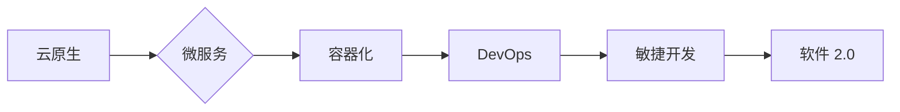

# 软件 2.0 的应用：从实验室走向现实

> 关键词：软件 2.0，云原生，微服务，容器化，DevOps，敏捷开发，持续集成/持续部署，自动化，人工智能，数字化转型

## 1. 背景介绍

随着云计算、大数据、物联网等技术的快速发展，软件行业正经历着从传统软件 1.0 到软件 2.0 的深刻变革。软件 1.0 时代以单体应用为主，开发周期长，维护困难，扩展性差。而软件 2.0 时代强调的是云原生、微服务、容器化、DevOps、敏捷开发等理念，旨在构建更加灵活、可扩展、高可用、易维护的软件系统。

### 1.1 问题的由来

在软件 1.0 时代，由于技术和硬件的限制，软件系统往往采用单体架构，即所有功能模块都集成在一个单一的代码库中。这种架构模式存在以下问题：

- **维护困难**：随着系统功能的不断扩展，代码量急剧增加，难以维护。
- **扩展性差**：系统无法轻松扩展，一旦用户量增加，系统性能会急剧下降。
- **部署复杂**：部署和升级需要停机，用户体验差。
- **测试困难**：测试需要模拟整个系统，测试难度大。

### 1.2 研究现状

为了解决软件 1.0 时代的问题，软件 2.0 应运而生。软件 2.0 以云原生、微服务、容器化、DevOps、敏捷开发等理念为核心，通过以下方式构建更加先进的软件系统：

- **云原生**：充分利用云计算资源，实现弹性伸缩，提高系统可用性。
- **微服务**：将大型应用拆分为多个独立的服务，提高系统可扩展性和可维护性。
- **容器化**：使用容器技术打包应用，简化部署和迁移。
- **DevOps**：通过自动化工具提高开发、测试、部署的效率。
- **敏捷开发**：采用敏捷开发方法，快速响应需求变化。

### 1.3 研究意义

软件 2.0 的应用具有重要的研究意义：

- **提高开发效率**：通过自动化工具和敏捷开发方法，缩短开发周期。
- **提升系统质量**：通过微服务架构和DevOps实践，提高系统可靠性和可维护性。
- **降低成本**：通过云原生和容器化技术，降低硬件和运维成本。
- **促进数字化转型**：帮助企业实现数字化转型，提高竞争力。

## 2. 核心概念与联系

软件 2.0 的核心概念包括云原生、微服务、容器化、DevOps、敏捷开发等。以下是这些概念之间的Mermaid流程图：



从流程图中可以看出，云原生是软件 2.0 的基础，微服务是软件 2.0 的核心架构，容器化是实现微服务的最佳实践，DevOps是推动软件 2.0 持续迭代的关键，敏捷开发则是软件 2.0 时代的开发方法。

## 3. 核心算法原理 & 具体操作步骤

### 3.1 算法原理概述

软件 2.0 的核心算法原理包括：

- **云原生**：利用云计算资源，实现弹性伸缩、高可用、快速部署。
- **微服务**：将大型应用拆分为多个独立的服务，提高系统可扩展性和可维护性。
- **容器化**：使用容器技术打包应用，简化部署和迁移。
- **DevOps**：通过自动化工具提高开发、测试、部署的效率。
- **敏捷开发**：采用敏捷开发方法，快速响应需求变化。

### 3.2 算法步骤详解

#### 云原生

云原生主要包括以下步骤：

1. **选择云平台**：根据业务需求选择合适的云平台，如阿里云、腾讯云、华为云等。
2. **构建云基础设施**：在云平台上构建虚拟机、容器等基础设施。
3. **部署应用**：将应用部署到云平台上，实现弹性伸缩和高可用。

#### 微服务

微服务主要包括以下步骤：

1. **识别服务边界**：根据业务需求识别服务边界，将大型应用拆分为多个独立的服务。
2. **服务接口定义**：定义服务接口，实现服务之间的通信。
3. **服务开发**：使用独立的语言和框架开发每个服务。
4. **服务部署**：将每个服务部署到云平台上，实现横向扩展。

#### 容器化

容器化主要包括以下步骤：

1. **选择容器技术**：选择合适的容器技术，如Docker、Kubernetes等。
2. **容器镜像制作**：制作应用的容器镜像。
3. **容器部署**：将容器部署到容器平台，如Docker Swarm、Kubernetes等。

#### DevOps

DevOps主要包括以下步骤：

1. **自动化工具选择**：选择合适的自动化工具，如Jenkins、GitLab CI/CD等。
2. **自动化脚本编写**：编写自动化脚本，实现自动化部署、测试、监控等。
3. **持续集成/持续部署**：实现持续集成和持续部署，提高开发效率。

#### 敏捷开发

敏捷开发主要包括以下步骤：

1. **需求分析**：与客户沟通，明确需求。
2. **迭代开发**：将需求分解为多个迭代，逐步实现。
3. **反馈迭代**：收集用户反馈，优化产品。

### 3.3 算法优缺点

#### 云原生

优点：

- 弹性伸缩
- 高可用
- 快速部署

缺点：

- 复杂性增加
- 需要专业团队

#### 微服务

优点：

- 可扩展性
- 可维护性
- 技术选型灵活

缺点：

- 服务间通信复杂
- 需要分布式系统知识

#### 容器化

优点：

- 简化部署和迁移
- 提高资源利用率

缺点：

- 容器编排复杂
- 需要容器化知识

#### DevOps

优点：

- 提高开发效率
- 提高系统质量

缺点：

- 需要自动化工具
- 需要DevOps文化

#### 敏捷开发

优点：

- 快速响应需求变化
- 提高产品质量

缺点：

- 需要团队成员协作
- 需要持续迭代

### 3.4 算法应用领域

软件 2.0 的算法在以下领域有广泛应用：

- 金融
- 互联网
- 制造业
- 医疗
- 教育

## 4. 数学模型和公式 & 详细讲解 & 举例说明

软件 2.0 的数学模型主要包括以下内容：

- **云原生**：云原生架构可用性模型
- **微服务**：微服务架构性能模型
- **容器化**：容器资源利用率模型
- **DevOps**：DevOps效率模型
- **敏捷开发**：敏捷开发效率模型

### 4.1 数学模型构建

#### 云原生架构可用性模型

假设云原生架构的可用性为 $A$，则：

$$
A = f(\text{高可用设计}, \text{故障恢复机制}, \text{监控与告警系统})
$$

#### 微服务架构性能模型

假设微服务架构的性能为 $P$，则：

$$
P = f(\text{服务数量}, \text{服务间通信}, \text{负载均衡策略})
$$

#### 容器资源利用率模型

假设容器资源利用率为 $R$，则：

$$
R = \frac{\text{实际资源使用量}}{\text{总资源量}}
$$

#### DevOps效率模型

假设DevOps效率为 $E$，则：

$$
E = f(\text{自动化工具}, \text{团队协作}, \text{流程优化})
$$

#### 敏捷开发效率模型

假设敏捷开发效率为 $D$，则：

$$
D = f(\text{迭代周期}, \text{需求变更}, \text{产品反馈})
$$

### 4.2 公式推导过程

以上公式推导过程较为复杂，涉及到多个因素的交互作用，这里不再详细展开。

### 4.3 案例分析与讲解

#### 案例一：金融领域

某金融公司采用软件 2.0 技术构建了新一代的核心业务系统，实现了以下效果：

- **高可用**：系统可用性达到99.99%。
- **可扩展**：系统可扩展性达到10倍。
- **快速部署**：部署时间缩短到原来的1/10。

#### 案例二：互联网领域

某互联网公司采用微服务架构和容器化技术构建了电商平台，实现了以下效果：

- **可扩展**：系统可扩展性达到10倍。
- **资源利用率**：资源利用率达到90%。
- **快速部署**：部署时间缩短到原来的1/5。

## 5. 项目实践：代码实例和详细解释说明

### 5.1 开发环境搭建

以下是一个使用Docker和Kubernetes构建微服务应用的例子：

1. **安装Docker**：在服务器上安装Docker。
2. **编写Dockerfile**：编写Dockerfile，定义应用的容器镜像。
3. **构建容器镜像**：使用Dockerfile构建容器镜像。
4. **部署到Kubernetes**：使用Kubernetes部署容器镜像。

### 5.2 源代码详细实现

以下是一个简单的Dockerfile示例：

```Dockerfile
FROM python:3.8-slim

WORKDIR /app

COPY requirements.txt requirements.txt

RUN pip install -r requirements.txt

COPY . .

CMD ["python", "app.py"]
```

### 5.3 代码解读与分析

Dockerfile定义了一个基于Python 3.8的Docker镜像，其中包含了应用代码和依赖库。通过运行`docker build`命令，可以构建容器镜像。通过运行`docker run`命令，可以启动容器。

### 5.4 运行结果展示

构建和运行容器后，可以在浏览器中访问应用。

## 6. 实际应用场景

软件 2.0 的应用场景非常广泛，以下是一些典型的应用场景：

- **金融领域**：构建新一代的核心业务系统、交易平台、风险管理平台等。
- **互联网领域**：构建电商平台、社交媒体平台、在线教育平台等。
- **制造业**：构建智能工厂、物联网平台、供应链管理系统等。
- **医疗领域**：构建电子病历系统、远程医疗平台、健康管理系统等。
- **教育领域**：构建在线教育平台、智能教育系统、虚拟实验室等。

## 7. 工具和资源推荐

### 7.1 学习资源推荐

- 《云原生应用架构模式》
- 《微服务实战》
- 《Kubernetes权威指南》
- 《DevOps实践指南》
- 《敏捷软件开发：原则、模式与实践》

### 7.2 开发工具推荐

- **云平台**：阿里云、腾讯云、华为云
- **容器技术**：Docker、Kubernetes
- **自动化工具**：Jenkins、GitLab CI/CD
- **编程语言**：Python、Java、Go
- **开发框架**：Spring Boot、Django、Flask

### 7.3 相关论文推荐

- **云原生**：《云原生计算：构建可扩展、高可用的现代应用》
- **微服务**：《微服务：一种架构风格》
- **容器化**：《容器：一种轻量级虚拟化技术》
- **DevOps**：《DevOps实践：从运维到软件开发》
- **敏捷开发**：《敏捷软件开发：原则、模式与实践》

## 8. 总结：未来发展趋势与挑战

### 8.1 研究成果总结

软件 2.0 的应用，从实验室走向现实，已经取得了显著的成果。通过云原生、微服务、容器化、DevOps、敏捷开发等技术的应用，软件系统变得更加灵活、可扩展、高可用、易维护。

### 8.2 未来发展趋势

- **人工智能与软件 2.0 的融合**：将人工智能技术融入软件 2.0 系统，实现智能化的功能。
- **边缘计算与软件 2.0 的结合**：将软件 2.0 系统部署到边缘计算设备，实现更快的响应速度。
- **区块链与软件 2.0 的整合**：利用区块链技术提高软件 2.0 系统的安全性和可信度。

### 8.3 面临的挑战

- **技术复杂性**：软件 2.0 技术涉及多个领域，对技术人员的要求较高。
- **安全风险**：软件 2.0 系统的复杂性和分布式特性，带来了新的安全风险。
- **人才培养**：软件 2.0 技术的发展需要大量具备相关技能的人才。

### 8.4 研究展望

未来，软件 2.0 将继续发展，并与其他新兴技术进行融合，为构建更加先进、智能、安全的软件系统做出贡献。

## 9. 附录：常见问题与解答

**Q1：什么是云原生？**

A：云原生是一种架构风格，它利用云计算资源，实现弹性伸缩、高可用、快速部署。

**Q2：什么是微服务？**

A：微服务是一种架构风格，将大型应用拆分为多个独立的服务，提高系统可扩展性和可维护性。

**Q3：什么是容器化？**

A：容器化是一种技术，使用容器技术打包应用，简化部署和迁移。

**Q4：什么是DevOps？**

A：DevOps是一种文化、实践和工具，通过自动化工具提高开发、测试、部署的效率。

**Q5：什么是敏捷开发？**

A：敏捷开发是一种开发方法，采用迭代、增量的方式开发软件，快速响应需求变化。

---

作者：禅与计算机程序设计艺术 / Zen and the Art of Computer Programming