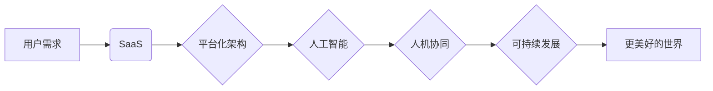

# 软件 2.0 的未来愿景：创造更美好的世界

> 关键词：软件2.0，智能化，软件即服务，平台化，自动化，人机协同，可持续发展

## 1. 背景介绍

软件2.0时代，我们正站在信息技术发展的新起点。从早期的命令行界面到图形用户界面，再到互联网和移动互联网的普及，软件技术经历了翻天覆地的变化。如今，随着云计算、大数据、人工智能等新兴技术的快速发展，软件的形态和功能正发生着前所未有的变革。软件2.0时代，我们不再仅仅满足于软件的功能性，更追求软件对人类社会的深刻影响和积极贡献。

### 1.1 信息时代的挑战

信息时代，数据成为最宝贵的资源，但同时也带来了诸多挑战：

- 数据孤岛：各个系统之间的数据难以共享和流通，导致信息不对称和决策困难。
- 系统复杂性：随着系统规模的扩大，系统复杂性指数级增长，维护难度和成本增加。
- 安全性问题：网络安全威胁日益严峻，数据泄露、恶意攻击等问题频发。
- 用户体验：随着用户需求的不断变化，传统软件难以满足个性化、便捷化的需求。

### 1.2 软件2.0的兴起

软件2.0时代，以智能化、平台化、自动化为核心特征，旨在解决信息时代面临的挑战，创造更美好的世界。

- **智能化**：通过人工智能技术，让软件具备更强的自学习和自适应能力，实现智能决策和自动化操作。
- **平台化**：构建开放、互联的软件平台，实现资源共享、协同开发，提升软件开发的效率和协同性。
- **自动化**：利用自动化工具，降低软件开发、部署和维护的复杂度，降低成本，提高效率。

## 2. 核心概念与联系

软件2.0的核心概念包括：

- **软件即服务（SaaS）**：将软件作为一种服务提供给用户，用户按需使用，按使用量付费。
- **平台化架构**：以平台为中心，将软件功能模块化，实现资源共享、协同开发。
- **人工智能**：利用机器学习、深度学习等技术，让软件具备智能决策和自动操作的能力。
- **人机协同**：将人类智能与机器智能相结合，实现优势互补，提高效率。
- **可持续发展**：在软件开发和运营过程中，关注环境保护、资源节约，实现可持续发展。

以下为软件2.0核心概念原理和架构的 Mermaid 流程图：



## 3. 核心算法原理 & 具体操作步骤

### 3.1 算法原理概述

软件2.0的核心算法包括：

- **机器学习算法**：用于数据挖掘、模式识别、预测分析等。
- **深度学习算法**：用于图像识别、语音识别、自然语言处理等。
- **强化学习算法**：用于智能决策、自动化控制等。

### 3.2 算法步骤详解

以SaaS为例，其具体操作步骤如下：

1. **需求分析**：了解用户需求，确定SaaS产品的功能和服务内容。
2. **平台搭建**：构建开放、互联的软件平台，实现资源共享、协同开发。
3. **模型训练**：利用机器学习或深度学习算法，对用户数据进行训练，建立预测模型。
4. **服务封装**：将模型和服务封装成API接口，供用户调用。
5. **部署上线**：将SaaS产品部署到云平台，实现远程访问。

### 3.3 算法优缺点

**优点**：

- **提高效率**：自动化处理大量数据，提高工作效率。
- **降低成本**：降低人力成本和设备成本。
- **提升用户体验**：提供更加便捷、个性化的服务。

**缺点**：

- **数据安全**：用户数据安全风险。
- **算法偏见**：机器学习算法可能导致算法偏见。
- **技术更新**：技术更新迭代快，需要不断学习和更新。

### 3.4 算法应用领域

软件2.0的核心算法在多个领域得到广泛应用：

- **金融行业**：风险评估、信贷审核、投资决策等。
- **医疗行业**：疾病诊断、药物研发、健康管理等。
- **教育行业**：个性化推荐、智能辅导、在线学习等。
- **交通行业**：智能交通、自动驾驶、车联网等。

## 4. 数学模型和公式 & 详细讲解 & 举例说明

### 4.1 数学模型构建

以机器学习算法为例，其数学模型可以表示为：

$$
y = f(x; \theta)
$$

其中，$y$ 为输出结果，$x$ 为输入数据，$\theta$ 为模型参数。

### 4.2 公式推导过程

以线性回归为例，其公式推导过程如下：

- 假设输入数据为 $x = (x_1, x_2, ..., x_n)$，输出结果为 $y = (y_1, y_2, ..., y_n)$。
- 线性回归模型假设输出结果与输入数据之间存在线性关系，即：

$$
y = \beta_0 + \beta_1 x_1 + \beta_2 x_2 + ... + \beta_n x_n
$$

- 其中，$\beta_0, \beta_1, ..., \beta_n$ 为模型参数。

### 4.3 案例分析与讲解

以推荐系统为例，其数学模型可以表示为：

$$
P(x_i|u) = \frac{\exp(\theta^T x_i)}{\sum_{j=1}^M \exp(\theta^T x_j)}
$$

其中，$P(x_i|u)$ 为用户 $u$ 对物品 $x_i$ 的偏好概率，$\theta$ 为模型参数。

## 5. 项目实践：代码实例和详细解释说明

### 5.1 开发环境搭建

以TensorFlow为例，其开发环境搭建步骤如下：

1. 安装Anaconda：从官网下载并安装Anaconda，用于创建独立的Python环境。
2. 创建并激活虚拟环境：
```bash
conda create -n tensorflow-env python=3.8 
conda activate tensorflow-env
```
3. 安装TensorFlow：
```bash
pip install tensorflow
```

### 5.2 源代码详细实现

以下使用TensorFlow实现线性回归模型的代码示例：

```python
import tensorflow as tf

# 构建线性回归模型
def linear_regression_model(x, w, b):
    y_pred = tf.matmul(x, w) + b
    return y_pred

# 创建随机数据
x = tf.random.normal([100, 1])
w = tf.constant([1.0])
b = tf.constant([1.0])

# 构建线性回归模型
model = tf.keras.Sequential([
    tf.keras.layers.Dense(units=1, input_shape=[1], 
                          activation='linear', 
                          kernel_initializer='ones', 
                          bias_initializer='zeros')
])

# 编译模型
model.compile(optimizer=tf.optimizers.Adam(learning_rate=0.01),
              loss='mse')

# 训练模型
model.fit(x, x, epochs=1000)

# 评估模型
test_loss = model.evaluate(x, x, verbose=2)
```

### 5.3 代码解读与分析

以上代码首先导入TensorFlow库，并定义了线性回归模型。然后创建随机数据和模型参数，构建线性回归模型。接着编译模型，设置优化器和损失函数，训练模型。最后评估模型在测试集上的性能。

## 6. 实际应用场景

### 6.1 智能金融

智能金融是软件2.0在金融领域的应用，通过人工智能技术实现：

- 信贷风险评估：利用机器学习算法对信贷申请人的信用风险进行评估，提高信贷审批效率。
- 量化交易：利用算法分析市场数据，进行自动化的交易决策。
- 个性化推荐：根据用户的风险偏好和投资历史，为用户提供个性化的投资建议。

### 6.2 智能医疗

智能医疗是软件2.0在医疗领域的应用，通过人工智能技术实现：

- 疾病诊断：利用深度学习算法对医学影像进行自动诊断，提高诊断准确率。
- 药物研发：利用人工智能技术加速药物研发进程，降低研发成本。
- 健康管理：根据用户健康数据，提供个性化的健康管理方案。

### 6.3 智能教育

智能教育是软件2.0在教育领域的应用，通过人工智能技术实现：

- 个性化学习：根据学生的学习情况，提供个性化的学习方案。
- 智能辅导：利用人工智能技术进行在线辅导，提高学习效果。
- 智能评估：利用人工智能技术对学生的学习成果进行评估。

## 7. 工具和资源推荐

### 7.1 学习资源推荐

1. 《机器学习》周志华著
2. 《深度学习》Ian Goodfellow等著
3. 《自然语言处理综论》哈里斯等著

### 7.2 开发工具推荐

1. TensorFlow
2. PyTorch
3. Scikit-learn

### 7.3 相关论文推荐

1. "Large Scale Visual Recognition Challenge 2012" (ImageNet)
2. "Deep Learning for Speech Recognition: A Deep Neural Network Approach"
3. "The Unsupervised Approach to Learning a Probabilistic Language Model from Raw Text"

## 8. 总结：未来发展趋势与挑战

### 8.1 研究成果总结

软件2.0时代，智能化、平台化、自动化成为软件技术发展的核心趋势。通过人工智能、大数据等技术，软件将具备更强的自学习和自适应能力，实现智能决策和自动操作，为人类创造更美好的世界。

### 8.2 未来发展趋势

1. 软件功能将更加智能化、个性化、便捷化。
2. 软件开发将更加平台化、模块化、协作化。
3. 软件应用将更加广泛，涵盖各个领域。

### 8.3 面临的挑战

1. 数据安全、隐私保护问题。
2. 算法偏见和歧视问题。
3. 技术更新迭代快，人才需求大。
4. 软件质量保障问题。

### 8.4 研究展望

未来，软件2.0将朝着以下方向发展：

1. 跨领域融合：将人工智能、大数据、物联网等技术与软件相结合，创造更加智能化的软件应用。
2. 软件伦理：关注软件伦理问题，确保软件技术的可持续发展。
3. 开放合作：推动软件开源社区的发展，促进技术创新和产业升级。

## 9. 附录：常见问题与解答

**Q1：软件2.0与软件1.0有什么区别？**

A：软件1.0时代，软件以功能为导向，注重软件的运行效率和稳定性；软件2.0时代，软件以用户体验为导向，注重软件的智能化、平台化和可持续发展。

**Q2：软件2.0的核心技术是什么？**

A：软件2.0的核心技术包括人工智能、大数据、云计算、物联网等。

**Q3：软件2.0有哪些应用场景？**

A：软件2.0在金融、医疗、教育、交通等各个领域都有广泛的应用。

**Q4：软件2.0的未来发展趋势是什么？**

A：软件2.0将朝着智能化、平台化、可持续发展的方向发展。

作者：禅与计算机程序设计艺术 / Zen and the Art of Computer Programming