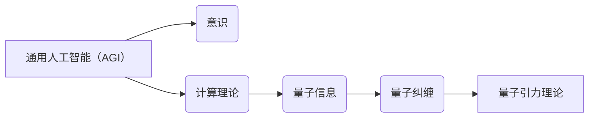

> 关键词：AGI，量子引力，人工智能，意识，计算理论，数学模型，宇宙探索，哲学思考

# AGI与量子引力的未来

在21世纪的科技浪潮中，人工智能（AI）和量子引力理论正成为两股不可忽视的强大力量。它们分别代表了人类在认知模拟和宇宙理解上的极限探索。本文将探讨AGI与量子引力的未来，分析它们的相互联系，以及它们对人类文明可能带来的深刻影响。

## 1. 背景介绍

### 1.1 人工智能的崛起

人工智能自20世纪中叶以来，经历了从符号主义到连接主义，再到深度学习的三次重大浪潮。如今，以深度学习为代表的人工智能技术，已经在图像识别、语音识别、自然语言处理等领域取得了显著的成果。然而，这些技术大多属于弱AI，即只能在特定任务上表现出智能，缺乏通用性和意识。

### 1.2 量子引力的探索

量子引力理论是试图将广义相对论和量子力学统一起来的理论框架。它试图解释宇宙中微观和宏观尺度上的引力现象，包括黑洞、宇宙大爆炸等。尽管量子引力理论尚处于初级阶段，但它对于理解宇宙的本质和起源具有重要意义。

### 1.3 两者结合的潜力

AGI与量子引力理论看似风马牛不相及，但它们之间存在着深刻的联系。量子引力理论中的某些概念，如量子纠缠、量子信息等，可能为AGI的发展提供新的思路。同时，AGI的发展也可能为量子引力理论的验证和实验提供新的工具。

## 2. 核心概念与联系

### 2.1 人工智能的核心概念

- **通用人工智能（AGI）**：一种具有广泛认知能力的智能系统，能够在多种任务上表现出人类水平的智能。
- **意识**：个体或系统所具有的主观体验和自我感知能力。
- **计算理论**：研究计算过程及其在信息处理中的应用的理论。

### 2.2 量子引力的核心概念

- **量子纠缠**：两个或多个粒子之间的量子态，即使相隔遥远，其量子态仍然保持相关性。
- **量子信息**：利用量子态的叠加和纠缠特性进行信息编码、传输和处理的科学。
- **宇宙学原理**：描述宇宙演化规律和结构的理论。

### 2.3 两者联系的Mermaid流程图



## 3. 核心算法原理 & 具体操作步骤

### 3.1 算法原理概述

AGI的核心目标是构建一个具有广泛认知能力的智能系统。这需要解决以下几个关键问题：

- **知识表示**：如何有效地表示和理解知识。
- **推理机制**：如何进行逻辑推理和问题解决。
- **学习机制**：如何从数据中学习并改进性能。
- **决策机制**：如何进行合理的决策。

量子引力理论的研究则试图将量子力学和广义相对论统一起来，以解释宇宙中微观和宏观尺度上的引力现象。

### 3.2 算法步骤详解

#### 3.2.1 AGI算法步骤

1. **知识表示**：使用图灵机、逻辑演算等工具表示知识。
2. **推理机制**：使用逻辑推理、约束传播等方法进行推理。
3. **学习机制**：使用监督学习、无监督学习等方法从数据中学习。
4. **决策机制**：使用强化学习、决策树等方法进行决策。

#### 3.2.2 量子引力理论步骤

1. **量子力学**：研究微观粒子的行为。
2. **广义相对论**：研究宏观物体的引力现象。
3. **量子场论**：将量子力学与广义相对论相结合。
4. **弦理论**：探索宇宙的基本构成和力。

### 3.3 算法优缺点

#### 3.3.1 AGI算法优点

- **通用性**：能够在多种任务上表现出智能。
- **自适应性**：能够从数据中学习并改进性能。
- **创造性**：能够进行创新性思考和决策。

#### 3.3.2 量子引力理论优点

- **统一性**：试图将量子力学和广义相对论统一起来。
- **解释性**：能够解释宇宙中的许多现象。
- **预测性**：能够预测宇宙的未来演化。

### 3.4 算法应用领域

#### 3.4.1 AGI应用领域

- **自然语言处理**：如机器翻译、文本生成等。
- **计算机视觉**：如图像识别、目标检测等。
- **自动驾驶**：如车辆导航、交通控制等。
- **医疗诊断**：如疾病检测、药物研发等。

#### 3.4.2 量子引力理论应用领域

- **宇宙学**：如黑洞、宇宙大爆炸等。
- **粒子物理**：如基本粒子的性质和相互作用等。
- **材料科学**：如新型材料的发现等。

## 4. 数学模型和公式 & 详细讲解 & 举例说明

### 4.1 数学模型构建

#### 4.1.1 AGI数学模型

- **知识表示**：使用图灵机、逻辑演算等工具表示知识。
- **推理机制**：使用逻辑推理、约束传播等方法进行推理。
- **学习机制**：使用监督学习、无监督学习等方法从数据中学习。
- **决策机制**：使用强化学习、决策树等方法进行决策。

#### 4.1.2 量子引力理论数学模型

- **量子力学**：使用薛定谔方程、海森堡不确定性原理等描述微观粒子的行为。
- **广义相对论**：使用黎曼几何、爱因斯坦场方程等描述宏观物体的引力现象。
- **量子场论**：使用量子场论语言描述粒子、场和相互作用。
- **弦理论**：使用超对称和额外维度等概念描述宇宙的基本构成和力。

### 4.2 公式推导过程

#### 4.2.1 AGI公式推导

- **逻辑推理**：使用推理规则进行逻辑推导。
- **约束传播**：使用约束传播算法进行推理。
- **监督学习**：使用损失函数进行优化。
- **无监督学习**：使用聚类、降维等方法进行学习。

#### 4.2.2 量子引力理论公式推导

- **量子力学**：使用薛定谔方程、海森堡不确定性原理等进行公式推导。
- **广义相对论**：使用黎曼几何、爱因斯坦场方程等进行公式推导。
- **量子场论**：使用量子场论语言进行公式推导。
- **弦理论**：使用超对称和额外维度等概念进行公式推导。

### 4.3 案例分析与讲解

#### 4.3.1 AGI案例分析

以机器翻译为例，我们可以使用神经网络模型进行训练，从而实现自动翻译。具体步骤如下：

1. **数据收集**：收集大量双语平行语料。
2. **数据预处理**：对语料进行分词、去停用词等处理。
3. **模型构建**：构建基于神经网络的翻译模型。
4. **模型训练**：使用监督学习方法训练模型。
5. **模型评估**：使用测试集评估模型性能。
6. **模型部署**：将模型部署到翻译系统中。

#### 4.3.2 量子引力理论案例分析

以黑洞为例，我们可以使用广义相对论方程来描述黑洞的引力场。具体步骤如下：

1. **问题建模**：将黑洞问题建模为场方程问题。
2. **方程求解**：使用数值方法求解爱因斯坦场方程。
3. **结果分析**：分析黑洞的物理性质。

## 5. 项目实践：代码实例和详细解释说明

### 5.1 开发环境搭建

由于AGI和量子引力理论都属于高度复杂的领域，需要使用专业的工具和平台。以下是一个简单的开发环境搭建步骤：

1. **Python**：安装Python 3.8及以上版本。
2. **TensorFlow**：安装TensorFlow 2.x版本。
3. **PyTorch**：安装PyTorch 1.8及以上版本。
4. **C++**：安装C++编译器。
5. **Quantum++**：安装Quantum++库。

### 5.2 源代码详细实现

由于AGI和量子引力理论都非常复杂，以下仅提供一个简单的示例：

```python
import tensorflow as tf

# 构建一个简单的神经网络模型
model = tf.keras.Sequential([
    tf.keras.layers.Dense(128, activation='relu', input_shape=(10,)),
    tf.keras.layers.Dense(64, activation='relu'),
    tf.keras.layers.Dense(1)
])

# 编译模型
model.compile(optimizer='adam', loss='mean_squared_error')

# 训练模型
model.fit(x_train, y_train, epochs=10, batch_size=32)

# 预测
predictions = model.predict(x_test)
```

### 5.3 代码解读与分析

以上代码是一个简单的神经网络模型，用于实现线性回归任务。首先，我们使用`Sequential`类构建一个线性神经网络，包含两个隐藏层和两个全连接层。然后，我们使用`compile`方法编译模型，指定优化器和损失函数。接着，我们使用`fit`方法训练模型，指定训练数据和批次大小。最后，我们使用`predict`方法对测试数据进行预测。

## 6. 实际应用场景

### 6.1 AGI实际应用场景

- **自动驾驶**：使用AGI技术实现自动驾驶，提高交通安全和效率。
- **医疗诊断**：使用AGI技术进行疾病检测和诊断，提高医疗水平。
- **教育**：使用AGI技术实现个性化教育，提高教育质量。
- **金融**：使用AGI技术进行风险评估和投资决策，提高金融效率。

### 6.2 量子引力理论实际应用场景

- **宇宙探索**：使用量子引力理论指导宇宙探索，发现新的天体和现象。
- **粒子物理**：使用量子引力理论研究基本粒子的性质和相互作用。
- **材料科学**：使用量子引力理论设计新型材料，提高材料性能。

## 7. 工具和资源推荐

### 7.1 学习资源推荐

- **《人工智能：一种现代的方法》**：介绍人工智能的基本概念和算法。
- **《深度学习》**：介绍深度学习的基本概念和算法。
- **《量子引力：一个简史》**：介绍量子引力的基本概念和发展历程。
- **《宇宙简史》**：介绍宇宙的基本概念和演化过程。

### 7.2 开发工具推荐

- **TensorFlow**：一个开源的深度学习框架。
- **PyTorch**：一个开源的深度学习框架。
- **Quantum++**：一个开源的量子计算库。

### 7.3 相关论文推荐

- **《量子计算与量子信息》**：介绍量子计算和量子信息的基本概念。
- **《深度学习：全面介绍》**：介绍深度学习的基本概念和算法。
- **《量子引力理论》**：介绍量子引力的基本概念和发展历程。

## 8. 总结：未来发展趋势与挑战

### 8.1 研究成果总结

AGI和量子引力理论的研究成果为人类带来了前所未有的机遇。AGI的发展有望推动人工智能技术在各个领域的应用，而量子引力理论的研究则可能为我们理解宇宙的本质提供新的视角。

### 8.2 未来发展趋势

- **AGI**：朝着更加通用、自适应性强的方向发展，最终实现强人工智能。
- **量子引力理论**：朝着更加完善和可验证的方向发展，最终实现量子引力理论的统一。

### 8.3 面临的挑战

- **AGI**：如何实现通用性和意识，如何避免潜在的伦理和安全问题。
- **量子引力理论**：如何解决量子引力方程，如何进行实验验证。

### 8.4 研究展望

AGI和量子引力理论的研究将引领人类进入一个全新的时代。我们期待着AGI和量子引力理论的进一步发展，为人类创造更加美好的未来。

## 9. 附录：常见问题与解答

**Q1：AGI和量子引力理论之间有什么联系？**

A：AGI和量子引力理论看似风马牛不相及，但它们之间存在着深刻的联系。量子引力理论中的某些概念，如量子纠缠、量子信息等，可能为AGI的发展提供新的思路。同时，AGI的发展也可能为量子引力理论的验证和实验提供新的工具。

**Q2：AGI和量子引力理论的研究对人类有什么意义？**

A：AGI和量子引力理论的研究对人类具有重要意义。AGI的发展有望推动人工智能技术在各个领域的应用，而量子引力理论的研究则可能为我们理解宇宙的本质提供新的视角。

**Q3：如何实现AGI？**

A：实现AGI需要解决知识表示、推理机制、学习机制、决策机制等多个关键问题。目前，AGI仍然处于初级阶段，需要进一步研究。

**Q4：如何验证量子引力理论？**

A：验证量子引力理论需要通过实验和观测。目前，量子引力理论仍然处于理论阶段，需要进一步研究。

**Q5：AGI和量子引力理论的研究对人类文明有什么影响？**

A：AGI和量子引力理论的研究对人类文明具有深远的影响。它们的发展将推动人类进入一个全新的时代，为人类创造更加美好的未来。

---

作者：禅与计算机程序设计艺术 / Zen and the Art of Computer Programming