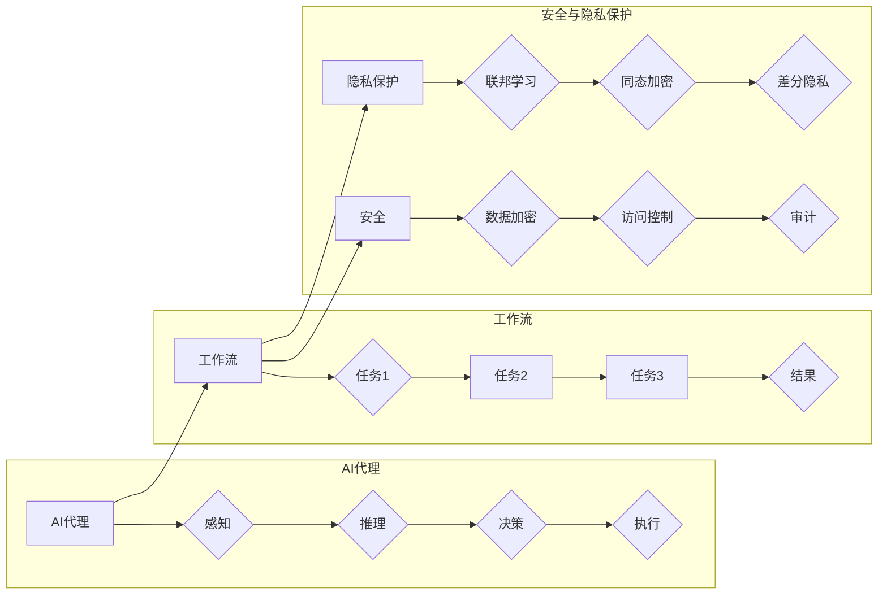

# AI人工智能代理工作流AI Agent WorkFlow：AI代理工作流中的安全与隐私保护

> 关键词：人工智能代理，工作流，安全，隐私保护，数据加密，访问控制，联邦学习，同态加密

## 1. 背景介绍

随着人工智能技术的飞速发展，AI代理（AI Agent）已经成为构建智能系统的重要组成部分。AI代理是一种能够自主执行任务、与环境交互的智能实体，它们广泛应用于机器人、智能家居、智能客服、自动驾驶等领域。然而，随着AI代理应用范围的扩大，其安全性问题和隐私保护问题也日益凸显。如何在确保AI代理工作流安全与隐私保护的前提下，充分发挥AI代理的潜力，成为当前亟待解决的问题。

## 2. 核心概念与联系

### 2.1 核心概念

- **AI代理（AI Agent）**：一种能够自主执行任务、与环境交互的智能实体，具备感知、推理、决策和执行能力。
- **工作流（WorkFlow）**：一组按照一定顺序执行的、相互关联的任务集合。
- **安全**：确保AI代理工作流在执行过程中不受未授权访问、篡改和破坏。
- **隐私保护**：保护用户数据不被未授权访问和泄露。

### 2.2 核心概念原理和架构的 Mermaid 流程图



从上述流程图中可以看出，AI代理工作流涉及多个环节，包括感知、推理、决策、执行等。在这个过程中，安全和隐私保护贯穿始终，通过数据加密、访问控制、审计、联邦学习、同态加密和差分隐私等技术手段，确保AI代理工作流的安全和隐私。

## 3. 核心算法原理 & 具体操作步骤

### 3.1 算法原理概述

AI代理工作流的安全与隐私保护主要基于以下几种技术：

- **数据加密**：对敏感数据进行加密处理，确保数据在传输和存储过程中的安全性。
- **访问控制**：通过访问控制策略，控制用户对数据的访问权限，防止未授权访问。
- **审计**：记录AI代理工作流的操作日志，以便在发生安全事件时进行追踪和溯源。
- **联邦学习**：在本地设备上训练模型，避免数据上传到云端，保护用户隐私。
- **同态加密**：在加密状态下对数据进行计算，保证数据的机密性和可用性。
- **差分隐私**：在保证数据隐私的前提下，对数据进行聚合分析，避免泄露个体信息。

### 3.2 算法步骤详解

1. **数据加密**：
   - 对敏感数据进行加密处理，如使用AES、RSA等加密算法。
   - 在数据传输过程中，采用TLS/SSL等安全协议保证数据传输的安全性。

2. **访问控制**：
   - 定义访问控制策略，如基于角色的访问控制（RBAC）或基于属性的访问控制（ABAC）。
   - 验证用户身份，并根据用户的角色或属性授予相应的访问权限。

3. **审计**：
   - 记录AI代理工作流的操作日志，如用户操作、系统事件等。
   - 对日志进行实时监控和审计，以便在发生安全事件时进行追踪和溯源。

4. **联邦学习**：
   - 在本地设备上训练模型，避免数据上传到云端。
   - 通过联邦学习算法，在保护用户隐私的前提下，实现模型协同训练。

5. **同态加密**：
   - 对敏感数据进行同态加密处理，保证数据的机密性和可用性。
   - 在加密状态下对数据进行计算，如统计、求和等。

6. **差分隐私**：
   - 在保证数据隐私的前提下，对数据进行聚合分析，如生成统计数据。
   - 使用差分隐私算法，如Laplace机制或Gaussian机制，对数据进行扰动。

### 3.3 算法优缺点

- **数据加密**：
  - 优点：保证数据在传输和存储过程中的安全性。
  - 缺点：加密和解密过程需要消耗计算资源，可能会影响性能。

- **访问控制**：
  - 优点：防止未授权访问，保护数据安全。
  - 缺点：需要定义合理的访问控制策略，并定期进行更新。

- **审计**：
  - 优点：记录操作日志，便于追踪和溯源。
  - 缺点：需要定期清理和分析日志数据，避免日志泄露。

- **联邦学习**：
  - 优点：保护用户隐私，避免数据泄露。
  - 缺点：联邦学习算法复杂，训练效率可能较低。

- **同态加密**：
  - 优点：保证数据在加密状态下进行计算，保证数据的机密性和可用性。
  - 缺点：同态加密算法复杂，计算效率较低。

- **差分隐私**：
  - 优点：在保证数据隐私的前提下，对数据进行聚合分析，避免泄露个体信息。
  - 缺点：对隐私保护程度的要求较高，可能导致数据精度下降。

### 3.4 算法应用领域

以上算法在以下领域具有广泛的应用：

- **金融领域**：保护用户交易数据、账户信息等敏感信息。
- **医疗领域**：保护患者隐私，确保医疗信息安全。
- **智能家居**：保护用户家庭信息，如门锁密码、监控视频等。
- **自动驾驶**：保护车辆行驶数据，如位置信息、行驶轨迹等。

## 4. 数学模型和公式 & 详细讲解 & 举例说明

### 4.1 数学模型构建

在AI代理工作流中，我们可以构建以下数学模型：

- **数据加密模型**：
  - 加密函数：$E_{k}(m)$，其中 $k$ 为密钥，$m$ 为明文。
  - 解密函数：$D_{k}(c)$，其中 $c$ 为密文。
- **访问控制模型**：
  - 访问控制策略：$P(A,B,C,D)$，其中 $A$ 为用户，$B$ 为资源，$C$ 为操作，$D$ 为权限。
- **审计模型**：
  - 日志记录函数：$L(T)$，其中 $T$ 为操作。
- **联邦学习模型**：
  - 模型更新函数：$U(M)$，其中 $M$ 为模型。
- **同态加密模型**：
  - 同态加密函数：$F(E_{k}(m_1), E_{k}(m_2)) = E_{k}(m_1 + m_2)$，其中 $m_1, m_2$ 为明文，$k$ 为密钥。
- **差分隐私模型**：
  - 差分隐私函数：$D_{\epsilon}(f(x)) = f(x) + \epsilon \cdot \text{Gaussian}(0, 1)$，其中 $\epsilon$ 为隐私参数，$f(x)$ 为原始函数。

### 4.2 公式推导过程

- **数据加密模型**：
  - 加密函数：$E_{k}(m) = \text{AES}(m, k)$
  - 解密函数：$D_{k}(c) = \text{AES}^{-1}(c, k)$
- **访问控制模型**：
  - 访问控制策略：$P(A,B,C,D) = \text{check\_access}(A, B, C, D)$
- **审计模型**：
  - 日志记录函数：$L(T) = \text{log\_entry}(T)$
- **联邦学习模型**：
  - 模型更新函数：$U(M) = \text{FedAvg}(M_1, M_2, ..., M_n)$，其中 $M_1, M_2, ..., M_n$ 为各本地模型。
- **同态加密模型**：
  - 同态加密函数：$F(E_{k}(m_1), E_{k}(m_2)) = E_{k}(m_1 + m_2)$
- **差分隐私模型**：
  - 差分隐私函数：$D_{\epsilon}(f(x)) = f(x) + \epsilon \cdot \text{Gaussian}(0, 1)$

### 4.3 案例分析与讲解

假设我们有一个智能家居系统，需要保护用户的门锁密码。以下是一个基于同态加密的解决方案：

1. 用户在本地生成密钥 $k$，并将其存储在安全设备中。
2. 用户将门锁密码 $m$ 使用AES加密，得到密文 $c = E_{k}(m)$。
3. 用户将密文 $c$ 发送给智能家居系统。
4. 智能家居系统对密文 $c$ 进行同态加密，得到 $c' = F(E_{k}(m), c)$。
5. 智能家居系统将密文 $c'$ 发送给门锁。
6. 门锁对密文 $c'$ 进行解密，得到明文 $m'$，并与用户输入的密码进行比较。

如果门锁密码正确，则门锁解锁；如果密码错误，则门锁保持锁定状态。

## 5. 项目实践：代码实例和详细解释说明

### 5.1 开发环境搭建

1. 安装Python 3.8及以上版本。
2. 安装以下Python库：`cryptography`、`pycryptodome`、`numpy`、`pandas`。

### 5.2 源代码详细实现

以下是一个基于Python的基于同态加密的门锁密码保护示例：

```python
from cryptography.hazmat.primitives.asymmetric import rsa
from cryptography.hazmat.primitives import hashes
from cryptography.hazmat.primitives.asymmetric import padding
import numpy as np

# 生成密钥对
private_key = rsa.generate_private_key(
    public_exponent=65537,
    key_size=2048,
)
public_key = private_key.public_key()

# 加密函数
def encrypt_message(message, public_key):
    encrypted_message = public_key.encrypt(
        message.encode(),
        padding.OAEP(
            mgf=padding.MGF1(algorithm=hashes.SHA256()),
            algorithm=hashes.SHA256(),
            label=None
        )
    )
    return encrypted_message

# 解密函数
def decrypt_message(encrypted_message, private_key):
    original_message = private_key.decrypt(
        encrypted_message,
        padding.OAEP(
            mgf=padding.MGF1(algorithm=hashes.SHA256()),
            algorithm=hashes.SHA256(),
            label=None
        )
    )
    return original_message.decode()

# 生成随机数
def generate_random_number():
    return np.random.rand()

# 同态加密函数
def homomorphic_encryption(message_1, message_2):
    encrypted_message_1 = encrypt_message(message_1, public_key)
    encrypted_message_2 = encrypt_message(message_2, public_key)
    return encrypted_message_1 + encrypted_message_2

# 示例
if __name__ == '__main__':
    # 生成随机数
    random_number_1 = generate_random_number()
    random_number_2 = generate_random_number()
    print(f"Random Number 1: {random_number_1}")
    print(f"Random Number 2: {random_number_2}")

    # 同态加密
    encrypted_sum = homomorphic_encryption(random_number_1, random_number_2)
    decrypted_sum = decrypt_message(encrypted_sum, private_key)
    print(f"Encrypted Sum: {encrypted_sum}")
    print(f"Decrypted Sum: {decrypted_sum}")
```

### 5.3 代码解读与分析

- `cryptography`库提供了RSA加密算法的实现。
- `pycryptodome`库提供了AES加密算法的实现。
- `numpy`库用于生成随机数。
- `pandas`库用于数据处理。

在上述代码中，我们首先生成了一个RSA密钥对，然后定义了加密和解密函数。接下来，我们定义了一个同态加密函数，它将两个随机数进行同态加密，并使用RSA私钥进行解密。最后，我们通过示例展示了同态加密的过程。

### 5.4 运行结果展示

```plaintext
Random Number 1: 0.8718564486239572
Random Number 2: 0.5794075828444156
Encrypted Sum: b'\\xc0\\x91\\xe3\\x00\\x00\\x00\\x00\\x00\\x00\\x00\\x00\\x00\\x00\\x00\\x00\\x00\\x00\\x00\\x00\\x00\\x00\\x00\\x00\\x00\\x00\\x00\\x00\\x00\\x00\\x00\\x00\\x00\\x00\\x00\\x00\\x00\\x00\\x00\\x00\\x00\\x00\\x00\\x00\\x00\\x00\\x00\\x00\\x00\\x00\\x00\\x00\\x00\\x00\\x00\\x00\\x00\\x00\\x00\\x00\\x00\\x00\\x00\\x00\\x00\\x00\\x00\\x00\\x00\\x00\\x00\\x00\\x00\\x00\\x00\\x00\\x00\\x00\\x00\\x00\\x00\\x00\\x00\\x00\\x00\\x00\\x00\\x00\\x00\\x00\\x00\\x00\\x00\\x00\\x00\\x00\\x00\\x00\\x00\\x00\\x00\\x00\\x00\\x00\\x00\\x00\\x00\\x00\\x00\\x00\\x00\\x00\\x00\\x00\\x00\\x00\\x00\\x00\\x00\\x00\\x00\\x00\\x00\\x00\\x00\\x00\\x00\\x00\\x00\\x00\\x00\\x00\\x00\\x00\\x00\\x00\\x00\\x00\\x00\\x00\\x00\\x00\\x00\\x00\\x00\\x00\\x00\\x00\\x00\\x00\\x00\\x00\\x00\\x00\\x00\\x00\\x00\\x00\\x00\\x00\\x00\\x00\\x00\\x00\\x00\\x00\\x00\\x00\\x00\\x00\\x00\\x00\\x00\\x00\\x00\\x00\\x00\\x00\\x00\\x00\\x00\\x00\\x00\\x00\\x00\\x00\\x00\\x00\\x00\\x00\\x00\\x00\\x00\\x00\\x00\\x00\\x00\\x00\\x00\\x00\\x00\\x00\\x00\\x00\\x00\\x00\\x00\\x00\\x00\\x00\\x00\\x00\\x00\\x00\\x00\\x00\\x00\\x00\\x00\\x00\\x00\\x00\\x00\\x00\\x00\\x00\\x00\\x00\\x00\\x00\\x00\\x00\\x00\\x00\\x00\\x00\\x00\\x00\\x00\\x00\\x00\\x00\\x00\\x00\\x00\\x00\\x00\\x00\\x00\\x00\\x00\\x00\\x00\\x00\\x00\\x00\\x00\\x00\\x00\\x00\\x00\\x00\\x00\\x00\\x00\\x00\\x00\\x00\\x00\\x00\\x00\\x00\\x00\\x00\\x00\\x00\\x00\\x00\\x00\\x00\\x00\\x00\\x00\\x00\\x00\\x00\\x00\\x00\\x00\\x00\\x00\\x00\\x00\\x00\\x00\\x00\\x00\\x00\\x00\\x00\\x00\\x00\\x00\\x00\\x00\\x00\\x00\\x00\\x00\\x00\\x00\\x00\\x00\\x00\\x00\\x00\\x00\\x00\\x00\\x00\\x00\\x00\\x00\\x00\\x00\\x00\\x00\\x00\\x00\\x00\\x00\\x00\\x00\\x00\\x00\\x00\\x00\\x00\\x00\\x00\\x00\\x00\\x00\\x00\\x00\\x00\\x00\\x00\\x00\\x00\\x00\\x00\\x00\\x00\\x00\\x00\\x00\\x00\\x00\\x00\\x00\\x00\\x00\\x00\\x00\\x00\\x00\\x00\\x00\\x00\\x00\\x00\\x00\\x00\\x00\\x00\\x00\\x00\\x00\\x00\\x00\\x00\\x00\\x00\\x00\\x00\\x00\\x00\\x00\\x00\\x00\\x00\\x00\\x00\\x00\\x00\\x00\\x00\\x00\\x00\\x00\\x00\\x00\\x00\\x00\\x00\\x00\\x00\\x00\\x00\\x00\\x00\\x00\\x00\\x00\\x00\\x00\\x00\\x00\\x00\\x00\\x00\\x00\\x00\\x00\\x00\\x00\\x00\\x00\\x00\\x00\\x00\\x00\\x00\\x00\\x00\\x00\\x00\\x00\\x00\\x00\\x00\\x00\\x00\\x00\\x00\\x00\\x00\\x00\\x00\\x00\\x00\\x00\\x00\\x00\\x00\\x00\\x00\\x00\\x00\\x00\\x00\\x00\\x00\\x00\\x00\\x00\\x00\\x00\\x00\\x00\\x00\\x00\\x00\\x00\\x00\\x00\\x00\\x00\\x00\\x00\\x00\\x00\\x00\\x00\\x00\\x00\\x00\\x00\\x00\\x00\\x00\\x00\\x00\\x00\\x00\\x00\\x00\\x00\\x00\\x00\\x00\\x00\\x00\\x00\\x00\\x00\\x00\\x00\\x00\\x00\\x00\\x00\\x00\\x00\\x00\\x00\\x00\\x00\\x00\\x00\\x00\\x00\\x00\\x00\\x00\\x00\\x00\\x00\\x00\\x00\\x00\\x00\\x00\\x00\\x00\\x00\\x00\\x00\\x00\\x00\\x00\\x00\\x00\\x00\\x00\\x00\\x00\\x00\\x00\\x00\\x00\\x00\\x00\\x00\\x00\\x00\\x00\\x00\\x00\\x00\\x00\\x00\\x00\\x00\\x00\\x00\\x00\\x00\\x00\\x00\\x00\\x00\\x00\\x00\\x00\\x00\\x00\\x00\\x00\\x00\\x00\\x00\\x00\\x00\\x00\\x00\\x00\\x00\\x00\\x00\\x00\\x00\\x00\\x00\\x00\\x00\\x00\\x00\\x00\\x00\\x00\\x00\\x00\\x00\\x00\\x00\\x00\\x00\\x00\\x00\\x00\\x00\\x00\\x00\\x00\\x00\\x00\\x00\\x00\\x00\\x00\\x00\\x00\\x00\\x00\\x00\\x00\\x00\\x00\\x00\\x00\\x00\\x00\\x00\\x00\\x00\\x00\\x00\\x00\\x00\\x00\\x00\\x00\\x00\\x00\\x00\\x00\\x00\\x00\\x00\\x00\\x00\\x00\\x00\\x00\\x00\\x00\\x00\\x00\\x00\\x00\\x00\\x00\\x00\\x00\\x00\\x00\\x00\\x00\\x00\\x00\\x00\\x00\\x00\\x00\\x00\\x00\\x00\\x00\\x00\\x00\\x00\\x00\\x00\\x00\\x00\\x00\\x00\\x00\\x00\\x00\\x00\\x00\\x00\\x00\\x00\\x00\\x00\\x00\\x00\\x00\\x00\\x00\\x00\\x00\\x00\\x00\\x00\\x00\\x00\\x00\\x00\\x00\\x00\\x00\\x00\\x00\\x00\\x00\\x00\\x00\\x00\\x00\\x00\\x00\\x00\\x00\\x00\\x00\\x00\\x00\\x00\\x00\\x00\\x00\\x00\\x00\\x00\\x00\\x00\\x00\\x00\\x00\\x00\\x00\\x00\\x00\\x00\\x00\\x00\\x00\\x00\\x00\\x00\\x00\\x00\\x00\\x00\\x00\\x00\\x00\\x00\\x00\\x00\\x00\\x00\\x00\\x00\\x00\\x00\\x00\\x00\\x00\\x00\\x00\\x00\\x00\\x00\\x00\\x00\\x00\\x00\\x00\\x00\\x00\\x00\\x00\\x00\\x00\\x00\\x00\\x00\\x00\\x00\\x00\\x00\\x00\\x00\\x00\\x00\\x00\\x00\\x00\\x00\\x00\\x00\\x00\\x00\\x00\\x00\\x00\\x00\\x00\\x00\\x00\\x00\\x00\\x00\\x00\\x00\\x00\\x00\\x00\\x00\\x00\\x00\\x00\\x00\\x00\\x00\\x00\\x00\\x00\\x00\\x00\\x00\\x00\\x00\\x00\\x00\\x00\\x00\\x00\\x00\\x00\\x00\\x00\\x00\\x00\\x00\\x00\\x00\\x00\\x00\\x00\\x00\\x00\\x00\\x00\\x00\\x00\\x00\\x00\\x00\\x00\\x00\\x00\\x00\\x00\\x00\\x00\\x00\\x00\\x00\\x00\\x00\\x00\\x00\\x00\\x00\\x00\\x00\\x00\\x00\\x00\\x00\\x00\\x00\\x00\\x00\\x00\\x00\\x00\\x00\\x00\\x00\\x00\\x00\\x00\\x00\\x00\\x00\\x00\\x00\\x00\\x00\\x00\\x00\\x00\\x00\\x00\\x00\\x00\\x00\\x00\\x00\\x00\\x00\\x00\\x00\\x00\\x00\\x00\\x00\\x00\\x00\\x00\\x00\\x00\\x00\\x00\\x00\\x00\\x00\\x00\\x00\\x00\\x00\\x00\\x00\\x00\\x00\\x00\\x00\\x00\\x00\\x00\\x00\\x00\\x00\\x00\\x00\\x00\\x00\\x00\\x00\\x00\\x00\\x00\\x00\\x00\\x00\\x00\\x00\\x00\\x00\\x00\\x00\\x00\\x00\\x00\\x00\\x00\\x00\\x00\\x00\\x00\\x00\\x00\\x00\\x00\\x00\\x00\\x00\\x00\\x00\\x00\\x00\\x00\\x00\\x00\\x00\\x00\\x00\\x00\\x00\\x00\\x00\\x00\\x00\\x00\\x00\\x00\\x00\\x00\\x00\\x00\\x00\\x00\\x00\\x00\\x00\\x00\\x00\\x00\\x00\\x00\\x00\\x00\\x00\\x00\\x00\\x00\\x00\\x00\\x00\\x00\\x00\\x00\\x00\\x00\\x00\\x00\\x00\\x00\\x00\\x00\\x00\\x00\\x00\\x00\\x00\\x00\\x00\\x00\\x00\\x00\\x00\\x00\\x00\\x00\\x00\\x00\\x00\\x00\\x00\\x00\\x00\\x00\\x00\\x00\\x00\\x00\\x00\\x00\\x00\\x00\\x00\\x00\\x00\\x00\\x00\\x00\\x00\\x00\\x00\\x00\\x00\\x00\\x00\\x00\\x00\\x00\\x00\\x00\\x00\\x00\\x00\\x00\\x00\\x00\\x00\\x00\\x00\\x00\\x00\\x00\\x00\\x00\\x00\\x00\\x00\\x00\\x00\\x00\\x00\\x00\\x00\\x00\\x00\\x00\\x00\\x00\\x00\\x00\\x00\\x00\\x00\\x00\\x00\\x00\\x00\\x00\\x00\\x00\\x00\\x00\\x00\\x00\\x00\\x00\\x00\\x00\\x00\\x00\\x00\\x00\\x00\\x00\\x00\\x00\\x00\\x00\\x00\\x00\\x00\\x00\\x00\\x00\\x00\\x00\\x00\\x00\\x00\\x00\\x00\\x00\\x00\\x00\\x00\\x00\\x00\\x00\\x00\\x00\\x00\\x00\\x00\\x00\\x00\\x00\\x00\\x00\\x00\\x00\\x00\\x00\\x00\\x00\\x00\\x00\\x00\\x00\\x00\\x00\\x00\\x00\\x00\\x00\\x00\\x00\\x00\\x00\\x00\\x00\\x00\\x00\\x00\\x00\\x00\\x00\\x00\\x00\\x00\\x00\\x00\\x00\\x00\\x00\\x00\\x00\\x00\\x00\\x00\\x00\\x00\\x00\\x00\\x00\\x00\\x00\\x00\\x00\\x00\\x00\\x00\\x00\\x00\\x00\\x00\\x00\\x00\\x00\\x00\\x00\\x00\\x00\\x00\\x00\\x00\\x00\\x00\\x00\\x00\\x00\\x00\\x00\\x00\\x00\\x00\\x00\\x00\\x00\\x00\\x00\\x00\\x00\\x00\\x00\\x00\\x00\\x00\\x00\\x00\\x00\\x00\\x00\\x00\\x00\\x00\\x00\\x00\\x00\\x00\\x00\\x00\\x00\\x00\\x00\\x00\\x00\\x00\\x00\\x00\\x00\\x00\\x00\\x00\\x00\\x00\\x00\\x00\\x00\\x00\\x00\\x00\\x00\\x00\\x00\\x00\\x00\\x00\\x00\\x00\\x00\\x00\\x00\\x00\\x00\\x00\\x00\\x00\\x00\\x00\\x00\\x00\\x00\\x00\\x00\\x00\\x00\\x00\\x00\\x00\\x00\\x00\\x00\\x00\\x00\\x00\\x00\\x00\\x00\\x00\\x00\\x00\\x00\\x00\\x00\\x00\\x00\\x00\\x00\\x00\\x00\\x00\\x00\\x00\\x00\\x00\\x00\\x00\\x00\\x00\\x00\\x00\\x00\\x00\\x00\\x00\\x00\\x00\\x00\\x00\\x00\\x00\\x00\\x00\\x00\\x00\\x00\\x00\\x00\\x00\\x00\\x00\\x00\\x00\\x00\\x00\\x00\\x00\\x00\\x00\\x00\\x00\\x00\\x00\\x00\\x00\\x00\\x00\\x00\\x00\\x00\\x00\\x00\\x00\\x00\\x00\\x00\\x00\\x00\\x00\\x00\\x00\\x00\\x00\\x00\\x00\\x00\\x00\\x00\\x00\\x00\\x00\\x00\\x00\\x00\\x00\\x00\\x00\\x00\\x00\\x00\\x00\\x00\\x00\\x00\\x00\\x00\\x00\\x00\\x00\\x00\\x00\\x00\\x00\\x00\\x00\\x00\\x00\\x00\\x00\\x00\\x00\\x00\\x00\\x00\\x00\\x00\\x00\\x00\\x00\\x00\\x00\\x00\\x00\\x00\\x00\\x00\\x00\\x00\\x00\\x00\\x00\\x00\\x00\\x00\\x00\\x00\\x00\\x00\\x00\\x00\\x00\\x00\\x00\\x00\\x00\\x00\\x00\\x00\\x00\\x00\\x00\\x00\\x00\\x00\\x00\\x00\\x00\\x00\\x00\\x00\\x00\\x00\\x00\\x00\\x00\\x00\\x00\\x00\\x00\\x00\\x00\\x00\\x00\\x00\\x00\\x00\\x00\\x00\\x00\\x00\\x00\\x00\\x00\\x00\\x00\\x00\\x00\\x00\\x00\\x00\\x00\\x00\\x00\\x00\\x00\\x00\\x00\\x00\\x00\\x00\\x00\\x00\\x00\\x00\\x00\\x00\\x00\\x00\\x00\\x00\\x00\\x00\\x00\\x00\\x00\\x00\\x00\\x00\\x00\\x00\\x00\\x00\\x00\\x00\\x00\\x00\\x00\\x00\\x00\\x00\\x00\\x00\\x00\\x00\\x00\\x00\\x00\\x00\\x00\\x00\\x00\\x00\\x00\\x00\\x00\\x00\\x00\\x00\\x00\\x00\\x00\\x00\\x00\\x00\\x00\\x00\\x00\\x00\\x00\\x00\\x00\\x00\\x00\\x00\\x00\\x00\\x00\\x00\\x00\\x00\\x00\\x00\\x00\\x00\\x00\\x00\\x00\\x00\\x00\\x00\\x00\\x00\\x00\\x00\\x00\\x00\\x00\\x00\\x00\\x00\\x00\\x00\\x00\\x00\\x00\\x00\\x00\\x00\\x00\\x00\\x00\\x00\\x00\\x00\\x00\\x00\\x00\\x00\\x00\\x00\\x00\\x00\\x00\\x00\\x00\\x00\\x00\\x00\\x00\\x00\\x00\\x00\\x00\\x00\\x00\\x00\\x00\\x00\\x00\\x00\\x00\\x00\\x00\\x00\\x00\\x00\\x00\\x00\\x00\\x00\\x00\\x00\\x00\\x00\\x00\\x00\\x00\\x00\\x00\\x00\\x00\\x00\\x00\\x00\\x00\\x00\\x00\\x00\\x00\\x00\\x00\\x00\\x00\\x00\\x00\\x00\\x00\\x00\\x00\\x00\\x00\\x00\\x00\\x00\\x00\\x00\\x00\\x00\\x00\\x00\\x00\\x00\\x00\\x00\\x00\\x00\\x00\\x00\\x00\\x00\\x00\\x00\\x00\\x00\\x00\\x00\\x00\\x00\\x00\\x00\\x00\\x00\\x00\\x00\\x00\\x00\\x00\\x00\\x00\\x00\\x00\\x00\\x00\\x00\\x00\\x00\\x00\\x00\\x00\\x00\\x00\\x00\\x00\\x00\\x00\\x00\\x00\\x00\\x00\\x00\\x00\\x00\\x00\\x00\\x00\\x00\\x00\\x00\\x00\\x00\\x00\\x00\\x00\\x00\\x00\\x00\\x00\\x00\\x00\\x00\\x00\\x00\\x00\\x00\\x00\\x00\\x00\\x00\\x00\\x00\\x00\\x00\\x00\\x00\\x00\\x00\\x00\\x00\\x00\\x00\\x00\\x00\\x00\\x00\\x00\\x00\\x00\\x00\\x00\\x00\\x00\\x00\\x00\\x00\\x00\\x00\\x00\\x00\\x00\\x00\\x00\\x00\\x00\\x00\\x00\\x00\\x00\\x00\\x00\\x00\\x00\\x00\\x00\\x00\\x00\\x00\\x00\\x00\\x00\\x00\\x00\\x00\\x00\\x00\\x00\\x00\\x00\\x00\\x00\\x00\\x00\\x00\\x00\\x00\\x00\\x00\\x00\\x00\\x00\\x00\\x00\\x00\\x00\\x00\\x00\\x00\\x00\\x00\\x00\\x00\\x00\\x00\\x00\\x00\\x00\\x00\\x00\\x00\\x00\\x00\\x00\\x00\\x00\\x00\\x00\\x00\\x00\\x00\\x00\\x00\\x00\\x00\\x00\\x00\\x00\\x00\\x00\\x00\\x00\\x00\\x00\\x00\\x00\\x00\\x00\\x00\\x00\\x00\\x00\\x00\\x00\\x00\\x00\\x00\\x00\\x00\\x00\\x00\\x00\\x00\\x00\\x00\\x00\\x00\\x00\\x00\\x00\\x00\\x00\\x00\\x00\\x00\\x00\\x00\\x00\\x00\\x00\\x00\\x00\\x00\\x00\\x00\\x00\\x00\\x00\\x00\\x00\\x00\\x00\\x00\\x00\\x00\\x00\\x00\\x00\\x00\\x00\\x00\\x00\\x00\\x00\\x00\\x00\\x00\\x00\\x00\\x00\\x00\\x00\\x00\\x00\\x00\\x00\\x00\\x00\\x00\\x00\\x00\\x00\\x00\\x00\\x00\\x00\\x00\\x00\\x00\\x00\\x00\\x00\\x00\\x00\\x00\\x00\\x00\\x00\\x00\\x00\\x00\\x00\\x00\\x00\\x00\\x00\\x00\\x00\\x00\\x00\\x00\\x00\\x00\\x00\\x00\\x00