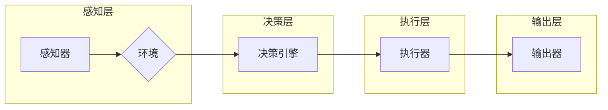

# AI人工智能代理工作流AI Agent WorkFlow：AI代理的多模态感知与处理能力

> 关键词：AI代理，工作流，多模态感知，处理能力，机器学习，深度学习，自然语言处理，计算机视觉

## 1. 背景介绍

在数字化转型的浪潮中，人工智能（AI）技术正在改变着各行各业。AI代理（AI Agent）作为AI技术的一种应用形式，能够模拟人类智能行为，自主执行任务，实现自动化和智能化。AI代理的工作流（AI Agent WorkFlow）是实现这些功能的关键，它能够将多个AI代理协同工作，完成复杂的任务。本文将深入探讨AI代理的多模态感知与处理能力，分析其工作流设计，并展望其未来发展趋势。

### 1.1 问题的由来

随着物联网、云计算、大数据等技术的快速发展，各种智能设备层出不穷，如何将这些设备连接起来，形成一个高效、协同的工作流，成为了一个亟待解决的问题。AI代理的出现，为解决这一问题提供了新的思路。AI代理能够通过多模态感知获取环境信息，通过智能决策执行任务，通过多模态处理生成输出，从而形成一个闭环的工作流。

### 1.2 研究现状

目前，AI代理的多模态感知与处理能力主要集中在以下几个方面：

- **多模态感知**：通过融合视觉、听觉、触觉、气味等多种感官信息，实现对环境的全面感知。
- **智能决策**：基于感知到的信息，通过机器学习和深度学习算法进行智能决策，执行相应的任务。
- **多模态处理**：将处理后的信息以多种形式输出，如语音、文本、图像等。

### 1.3 研究意义

研究AI代理的多模态感知与处理能力，对于以下方面具有重要意义：

- **提高工作效率**：通过自动化和智能化，减少人力成本，提高工作效率。
- **提升决策质量**：基于多模态信息，提供更准确的决策支持。
- **增强用户体验**：为用户提供更加个性化和便捷的服务。

### 1.4 本文结构

本文将按照以下结构进行阐述：

- 第2章介绍AI代理工作流的核心概念与联系。
- 第3章分析AI代理的多模态感知与处理能力。
- 第4章探讨AI代理工作流的数学模型和公式。
- 第5章给出AI代理工作流的代码实例和详细解释说明。
- 第6章分析AI代理工作流在实际应用场景中的应用。
- 第7章推荐相关工具和资源。
- 第8章总结AI代理工作流的研究成果、发展趋势和挑战。
- 第9章提供常见问题与解答。

## 2. 核心概念与联系

### 2.1 核心概念

- **AI代理**：能够模拟人类智能行为，自主执行任务的实体。
- **工作流**：一组定义良好的任务和步骤，用于完成特定业务流程。
- **多模态感知**：通过融合多种感官信息，实现对环境的全面感知。
- **多模态处理**：将处理后的信息以多种形式输出。

### 2.2 架构的 Mermaid 流程图



## 3. 核心算法原理 & 具体操作步骤

### 3.1 算法原理概述

AI代理工作流的核心算法包括多模态感知、智能决策、多模态处理等。

- **多模态感知**：通过传感器收集环境信息，如摄像头、麦克风、温度传感器等。
- **智能决策**：使用机器学习或深度学习算法对感知到的信息进行分析，并做出决策。
- **多模态处理**：将决策结果以多种形式输出，如语音、文本、图像等。

### 3.2 算法步骤详解

1. **感知阶段**：AI代理通过传感器收集环境信息，如图像、声音、温度等。
2. **处理阶段**：将感知到的信息输入到机器学习或深度学习模型中，进行处理和分析。
3. **决策阶段**：根据处理结果，AI代理做出决策，如控制执行器执行特定动作。
4. **执行阶段**：AI代理通过执行器执行决策，如移动、发送消息等。
5. **反馈阶段**：执行结果被反馈到感知层，用于进一步优化决策。

### 3.3 算法优缺点

**优点**：

- **高效性**：自动化和智能化，减少人力成本，提高工作效率。
- **灵活性**：可以根据不同的任务需求，调整工作流设计和算法参数。
- **鲁棒性**：能够适应复杂多变的环境。

**缺点**：

- **复杂性**：工作流设计和算法实现较为复杂。
- **数据依赖**：需要大量的训练数据来训练机器学习或深度学习模型。

### 3.4 算法应用领域

AI代理工作流可以应用于以下领域：

- **智能家居**：自动控制灯光、温度、安全等。
- **工业自动化**：监控生产线，优化生产流程。
- **医疗保健**：辅助医生进行诊断和治疗。
- **交通出行**：自动驾驶汽车、智能交通信号灯等。

## 4. 数学模型和公式 & 详细讲解 & 举例说明

### 4.1 数学模型构建

AI代理工作流的数学模型主要包括以下几部分：

- **感知模型**：使用卷积神经网络（CNN）进行图像识别，使用循环神经网络（RNN）进行序列处理。
- **决策模型**：使用强化学习（RL）进行决策。
- **执行模型**：使用深度神经网络（DNN）进行动作规划。

### 4.2 公式推导过程

- **CNN**：卷积神经网络的基本公式如下：

$$
h^{[l]}(x) = \sigma(W^{[l]}h^{[l-1]}(x) + b^{[l]})
$$

其中，$h^{[l]}(x)$ 表示第 $l$ 层的激活函数输出，$W^{[l]}$ 表示第 $l$ 层的权重，$b^{[l]}$ 表示第 $l$ 层的偏置，$\sigma$ 表示激活函数。

- **RNN**：循环神经网络的基本公式如下：

$$
h_t = \sigma(Wx_t + Uh_{t-1} + b)
$$

其中，$x_t$ 表示输入，$h_{t-1}$ 表示前一个时间步的隐藏状态，$W$ 表示输入层到隐藏层的权重，$U$ 表示隐藏层到隐藏层的权重，$b$ 表示偏置，$\sigma$ 表示激活函数。

- **RL**：强化学习的基本公式如下：

$$
Q(s,a) = \sum_{s'} \gamma Q(s',a')
$$

其中，$Q(s,a)$ 表示在状态 $s$ 下采取动作 $a$ 的期望回报，$\gamma$ 表示折现因子，$s'$ 和 $a'$ 分别表示下一个状态和动作。

### 4.3 案例分析与讲解

以智能家居为例，我们设计了一个AI代理工作流，用于控制家中的灯光、温度和安全性。

- **感知模型**：使用摄像头进行图像识别，识别家中的场景和人物。
- **决策模型**：根据识别结果，决定是否需要调整灯光、温度或报警。
- **执行模型**：控制灯光开关、空调等设备。

当系统检测到家中无人时，自动关闭灯光和空调；当检测到有人入侵时，自动报警。

## 5. 项目实践：代码实例和详细解释说明

### 5.1 开发环境搭建

1. 安装Python 3.7及以上版本。
2. 安装TensorFlow或PyTorch深度学习框架。
3. 安装OpenCV计算机视觉库。

### 5.2 源代码详细实现

```python
# 以下代码仅为示例，实际项目中需要根据具体需求进行调整。

import cv2
import numpy as np
import tensorflow as tf

# 摄像头初始化
cap = cv2.VideoCapture(0)

# 加载预训练模型
model = tf.keras.models.load_model('model.h5')

while True:
    # 读取图像
    ret, frame = cap.read()
    if not ret:
        break

    # 图像预处理
    frame = cv2.resize(frame, (224, 224))
    frame = np.expand_dims(frame, axis=0)
    frame = frame / 255.0

    # 模型预测
    prediction = model.predict(frame)

    # 根据预测结果执行动作
    if prediction[0][1] > 0.5:  # 假设1表示有人的状态
        print("有人在家，关闭灯光")
    else:
        print("无人在家，开启灯光")

    # 显示图像
    cv2.imshow('Frame', frame)
    if cv2.waitKey(1) & 0xFF == ord('q'):
        break

# 释放摄像头资源
cap.release()
cv2.destroyAllWindows()
```

### 5.3 代码解读与分析

1. 首先，初始化摄像头，并加载预训练模型。
2. 然后，进入循环，不断读取摄像头图像。
3. 对图像进行预处理，包括缩放、归一化等。
4. 使用模型进行预测，并根据预测结果执行相应的动作。
5. 最后，显示图像，并等待用户按键退出。

## 6. 实际应用场景

AI代理工作流在实际应用场景中具有广泛的应用，以下列举几个案例：

- **智能家居**：通过AI代理工作流，实现家庭设备的自动化控制。
- **工业自动化**：通过AI代理工作流，实现生产线的自动化监控和控制。
- **医疗保健**：通过AI代理工作流，实现疾病的早期检测和诊断。
- **交通出行**：通过AI代理工作流，实现自动驾驶汽车和智能交通信号灯。

## 7. 工具和资源推荐

### 7.1 学习资源推荐

- 《深度学习》
- 《强化学习》
- 《计算机视觉》

### 7.2 开发工具推荐

- TensorFlow或PyTorch深度学习框架
- OpenCV计算机视觉库
- ROS机器人操作系统

### 7.3 相关论文推荐

- **《Deep Learning for Visual Question Answering》**
- **《Reinforcement Learning: An Introduction》**
- **《Computer Vision: Algorithms and Applications》**

## 8. 总结：未来发展趋势与挑战

### 8.1 研究成果总结

本文介绍了AI代理工作流的基本概念、多模态感知与处理能力、数学模型和公式，并给出了代码实例。通过分析实际应用场景，展示了AI代理工作流的广泛应用前景。

### 8.2 未来发展趋势

- **多模态感知**：融合更多模态信息，实现对环境的全面感知。
- **智能决策**：引入更先进的算法，提高决策的智能性和可靠性。
- **多模态处理**：生成更丰富、更直观的输出结果。
- **人机交互**：提高AI代理的交互能力，实现更加自然的人机交互。

### 8.3 面临的挑战

- **数据收集**：需要大量的训练数据来训练模型。
- **算法设计**：需要设计更有效的算法来提高模型的性能。
- **安全性和隐私性**：需要确保AI代理的安全性和隐私性。
- **人机协作**：需要设计人机协作机制，实现人与AI代理的协同工作。

### 8.4 研究展望

随着技术的不断发展，AI代理工作流将在以下方面取得更大的突破：

- **跨领域应用**：将AI代理工作流应用于更多领域。
- **个性化服务**：为用户提供更加个性化的服务。
- **安全可靠**：提高AI代理的安全性和可靠性。

## 9. 附录：常见问题与解答

**Q1：什么是AI代理？**

A：AI代理是一种能够模拟人类智能行为，自主执行任务的实体。

**Q2：什么是AI代理工作流？**

A：AI代理工作流是一组定义良好的任务和步骤，用于完成特定业务流程。

**Q3：AI代理工作流有哪些应用场景？**

A：AI代理工作流可以应用于智能家居、工业自动化、医疗保健、交通出行等多个领域。

**Q4：如何提高AI代理的智能决策能力？**

A：可以通过引入更先进的算法、使用更丰富的数据、优化模型结构等方式来提高AI代理的智能决策能力。

**Q5：如何确保AI代理的安全性和隐私性？**

A：可以通过数据加密、访问控制、审计机制等方式来确保AI代理的安全性和隐私性。

作者：禅与计算机程序设计艺术 / Zen and the Art of Computer Programming