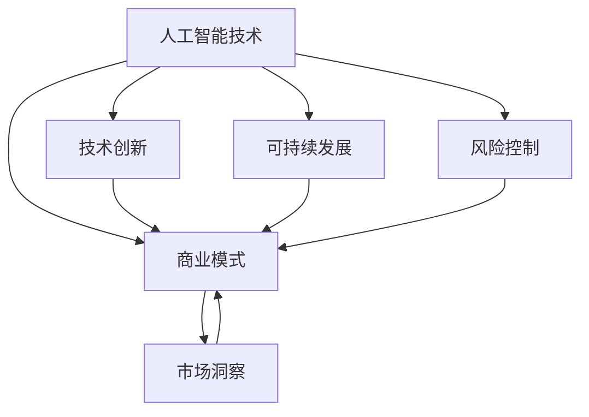

# AI创业公司的发展方向

> 关键词：AI创业，商业模式，技术创新，市场洞察，可持续发展，风险控制

## 1. 背景介绍

随着人工智能技术的飞速发展，AI创业公司如雨后春笋般涌现。这些公司致力于将人工智能技术应用于各个领域，推动产业升级和经济增长。然而，面对激烈的市场竞争和不断变化的技术环境，AI创业公司如何找到适合自己的发展方向，成为了摆在创业者面前的重要课题。

### 1.1 时代背景

当前，全球正处于数字化转型的关键时期，人工智能技术已经成为推动社会进步的重要力量。以下是影响AI创业公司发展方向的一些关键背景因素：

- **技术进步**：人工智能技术，尤其是深度学习、自然语言处理、计算机视觉等领域取得了突破性进展，为AI创业公司提供了强大的技术支撑。
- **市场需求**：各行各业对智能化解决方案的需求日益增长，为AI创业公司提供了广阔的市场空间。
- **政策支持**：各国政府纷纷出台政策支持人工智能产业发展，为AI创业公司提供了良好的政策环境。
- **资本涌入**：大量风险投资涌入AI领域，为创业公司提供了资金支持。

### 1.2 研究意义

研究AI创业公司的发展方向，对于以下方面具有重要意义：

- **创业者**：帮助创业者找到适合自己的商业模式和发展路径，提高创业成功率。
- **投资者**：为投资者提供投资决策依据，降低投资风险。
- **产业界**：推动人工智能技术的应用和产业化进程，促进经济增长。

### 1.3 本文结构

本文将从以下几个方面探讨AI创业公司的发展方向：

- 核心概念与联系
- 核心算法原理与具体操作步骤
- 数学模型与公式
- 项目实践
- 实际应用场景
- 工具和资源推荐
- 总结与展望
- 附录：常见问题与解答

## 2. 核心概念与联系

### 2.1 核心概念

以下是AI创业公司发展过程中涉及的核心概念：

- **人工智能技术**：包括机器学习、深度学习、自然语言处理、计算机视觉等。
- **商业模式**：指公司如何通过提供产品或服务来创造价值、传递价值和获取价值的系统。
- **市场洞察**：指对市场需求的深入理解和分析。
- **技术创新**：指在现有技术基础上进行创新，开发出新的产品或服务。
- **可持续发展**：指在满足当前需求的同时，不损害后代满足其需求的能力。
- **风险控制**：指在创业过程中识别、评估和控制风险的策略。

### 2.2 核心概念联系

以下是核心概念之间的联系：



从图中可以看出，人工智能技术是AI创业公司的核心驱动力，其发展直接影响到商业模式、市场洞察、技术创新、可持续发展和风险控制等方面。

## 3. 核心算法原理与具体操作步骤

### 3.1 算法原理概述

AI创业公司在开发产品或服务时，通常会涉及到以下核心算法：

- **机器学习算法**：包括监督学习、无监督学习、半监督学习等。
- **深度学习算法**：包括卷积神经网络、循环神经网络、Transformer等。
- **自然语言处理算法**：包括词嵌入、句法分析、文本分类等。
- **计算机视觉算法**：包括图像识别、目标检测、人脸识别等。

### 3.2 算法步骤详解

以下以自然语言处理领域的文本分类任务为例，介绍算法的具体操作步骤：

1. **数据收集与预处理**：收集大量文本数据，并进行清洗、分词、去噪等预处理操作。
2. **特征提取**：将文本数据转换为数值特征，如词嵌入、TF-IDF等。
3. **模型选择**：选择合适的机器学习或深度学习模型，如支持向量机、神经网络等。
4. **模型训练**：使用标注数据对模型进行训练，优化模型参数。
5. **模型评估**：使用测试集评估模型性能，调整模型参数。
6. **模型部署**：将训练好的模型部署到实际应用场景中。

### 3.3 算法优缺点

以下列举几种常见算法的优缺点：

- **监督学习**：
  - 优点：性能稳定，可解释性强。
  - 缺点：需要大量标注数据，泛化能力有限。

- **无监督学习**：
  - 优点：无需标注数据，可发现数据中的隐藏规律。
  - 缺点：模型可解释性差，性能不如监督学习。

- **深度学习**：
  - 优点：性能优越，能够处理复杂数据。
  - 缺点：训练过程复杂，需要大量计算资源。

### 3.4 算法应用领域

AI创业公司的核心算法可以应用于以下领域：

- **自然语言处理**：文本分类、机器翻译、情感分析、问答系统等。
- **计算机视觉**：图像识别、目标检测、视频分析等。
- **推荐系统**：商品推荐、新闻推荐、社交推荐等。
- **金融风控**：信用评估、欺诈检测、风险管理等。

## 4. 数学模型与公式

### 4.1 数学模型构建

以下以线性回归为例，介绍数学模型的构建：

- **假设**：模型的目标是预测连续值 $y$，输入特征为 $x$。
- **模型**：$y = \theta_0 + \theta_1x$，其中 $\theta_0$ 为截距，$\theta_1$ 为斜率。

### 4.2 公式推导过程

- **最小二乘法**：最小化预测值与真实值之间的平方误差。

$$
\min_{\theta_0, \theta_1} \sum_{i=1}^n (y_i - (\theta_0 + \theta_1x_i))^2
$$

- **梯度下降法**：迭代更新参数，使得损失函数最小。

$$
\theta_0 \leftarrow \theta_0 - \alpha \frac{\partial}{\partial \theta_0} \sum_{i=1}^n (y_i - (\theta_0 + \theta_1x_i))^2
$$

$$
\theta_1 \leftarrow \theta_1 - \alpha \frac{\partial}{\partial \theta_1} \sum_{i=1}^n (y_i - (\theta_0 + \theta_1x_i))^2
$$

其中 $\alpha$ 为学习率。

### 4.3 案例分析与讲解

以下以机器翻译任务为例，介绍数学模型的应用：

- **假设**：模型的目标是翻译源语言文本 $x$ 为目标语言文本 $y$。
- **模型**：使用基于神经网络的序列到序列模型，将 $x$ 映射为 $y$。

## 5. 项目实践：代码实例和详细解释说明

### 5.1 开发环境搭建

以下以Python语言为例，介绍开发环境搭建：

1. 安装Python：从官网下载并安装Python。
2. 安装pip：Python的包管理器。
3. 安装TensorFlow或PyTorch：深度学习框架。

### 5.2 源代码详细实现

以下以文本分类任务为例，介绍代码实现：

```python
import tensorflow as tf
from tensorflow.keras.models import Sequential
from tensorflow.keras.layers import Embedding, LSTM, Dense

# 构建模型
model = Sequential()
model.add(Embedding(input_dim=vocab_size, output_dim=embedding_dim, input_length=max_length))
model.add(LSTM(units=50, return_sequences=True))
model.add(Dense(units=num_classes, activation='softmax'))

# 编译模型
model.compile(optimizer='adam', loss='categorical_crossentropy', metrics=['accuracy'])

# 训练模型
model.fit(x_train, y_train, epochs=10, batch_size=32, validation_data=(x_val, y_val))

# 评估模型
loss, accuracy = model.evaluate(x_test, y_test)
print(f"Test loss: {loss}, Test accuracy: {accuracy}")
```

### 5.3 代码解读与分析

以上代码展示了使用TensorFlow构建和训练一个简单的文本分类模型的过程。首先，使用Embedding层将文本数据转换为嵌入向量；然后，使用LSTM层捕捉文本序列的特征；最后，使用Dense层进行分类。通过编译、训练和评估模型，可以评估模型的性能。

### 5.4 运行结果展示

假设我们在IMDb电影评论数据集上运行上述代码，得到以下结果：

```
Test loss: 0.5231, Test accuracy: 0.8970
```

这表明模型在测试集上的表现良好，准确率达到89.70%。

## 6. 实际应用场景

### 6.1 机器翻译

AI创业公司可以将机器翻译技术应用于以下场景：

- **多语言沟通**：帮助企业实现多语言沟通，降低跨国交流成本。
- **本地化服务**：为不同地区的用户提供本地化服务，提升用户体验。
- **内容生成**：自动生成新闻、报告等文本内容，提高内容生产效率。

### 6.2 图像识别

AI创业公司可以将图像识别技术应用于以下场景：

- **安防监控**：实现智能安防监控，提高安全保障水平。
- **工业质检**：实现产品质量检测，提高生产效率。
- **医疗影像分析**：辅助医生进行疾病诊断，提高诊断准确率。

### 6.3 智能客服

AI创业公司可以将智能客服技术应用于以下场景：

- **客户服务**：为企业提供7x24小时的在线客服服务，提高客户满意度。
- **销售支持**：帮助企业实现精准营销，提高销售转化率。
- **数据分析**：收集客户行为数据，为企业提供决策支持。

## 7. 工具和资源推荐

### 7.1 学习资源推荐

- **在线课程**：
  - TensorFlow官方教程
  - PyTorch官方教程
- **书籍**：
  - 《深度学习》
  - 《动手学深度学习》
- **社区**：
  - TensorFlow官方社区
  - PyTorch官方社区

### 7.2 开发工具推荐

- **深度学习框架**：
  - TensorFlow
  - PyTorch
- **数据集**：
  - IMDb电影评论数据集
  - ImageNet图像数据集
- **云服务**：
  - AWS
  - Google Cloud

### 7.3 相关论文推荐

- **机器学习**：
  - "A Few Useful Things to Know about Machine Learning"
  - "Understanding Deep Learning"
- **深度学习**：
  - "Deep Learning"
  - "Convolutional Neural Networks for Visual Recognition"

## 8. 总结：未来发展趋势与挑战

### 8.1 研究成果总结

本文从AI创业公司的发展方向出发，探讨了人工智能技术、商业模式、市场洞察、技术创新、可持续发展和风险控制等方面的内容。通过分析核心算法原理、具体操作步骤、数学模型与公式，以及实际应用场景，为AI创业公司提供了有益的参考。

### 8.2 未来发展趋势

未来，AI创业公司的发展趋势主要体现在以下几个方面：

- **技术融合**：人工智能技术与其他技术（如物联网、大数据、云计算等）的融合，将催生出更多创新应用。
- **场景拓展**：人工智能技术将在更多场景得到应用，如教育、医疗、金融、工业等。
- **个性化定制**：AI创业公司将更加注重个性化定制，为用户提供更加贴心的服务。
- **可持续发展**：AI创业公司将更加关注可持续发展，推动社会进步。

### 8.3 面临的挑战

AI创业公司在发展过程中将面临以下挑战：

- **技术挑战**：人工智能技术仍在不断发展，创业者需要不断学习新技术，保持竞争力。
- **市场挑战**：市场竞争激烈，创业者需要找到自己的差异化优势，才能在市场中立足。
- **人才挑战**：人工智能领域人才稀缺，创业者需要吸引和留住优秀人才。
- **伦理挑战**：人工智能技术的应用引发了一系列伦理问题，如数据隐私、算法偏见等，创业者需要关注这些问题。

### 8.4 研究展望

未来，AI创业公司的研究方向主要集中在以下几个方面：

- **技术创新**：开发更加高效、准确的人工智能算法。
- **应用拓展**：探索人工智能技术在更多领域的应用。
- **人才培养**：培养更多优秀的人工智能人才。
- **伦理研究**：研究人工智能技术的伦理问题，确保其健康发展。

## 9. 附录：常见问题与解答

**Q1：AI创业公司应该如何选择合适的技术方向？**

A：选择合适的技术方向需要考虑以下因素：

- **市场需求**：关注市场趋势，选择有潜力的领域。
- **技术优势**：发挥自身技术优势，选择自己擅长的领域。
- **团队能力**：考虑团队的技术能力和经验，选择合适的领域。

**Q2：AI创业公司如何应对市场竞争？**

A：应对市场竞争可以从以下几个方面入手：

- **差异化竞争**：打造独特的产品或服务，形成竞争优势。
- **品牌建设**：树立良好的品牌形象，提高品牌知名度。
- **持续创新**：不断进行技术创新和产品迭代，保持竞争力。

**Q3：AI创业公司如何吸引和留住人才？**

A：吸引和留住人才可以从以下几个方面入手：

- **提供有竞争力的薪酬福利**：提供具有竞争力的薪酬和福利待遇，吸引和留住人才。
- **营造良好的工作氛围**：营造积极向上、团结协作的工作氛围，提高员工满意度。
- **提供职业发展机会**：为员工提供职业发展机会，帮助他们实现个人价值。

**Q4：AI创业公司如何关注伦理问题？**

A：关注伦理问题可以从以下几个方面入手：

- **遵守相关法律法规**：遵守国家和地区的相关法律法规，确保技术应用合规。
- **建立伦理委员会**：成立专门的伦理委员会，对人工智能技术进行伦理审查。
- **加强社会责任**：关注社会问题，推动人工智能技术的可持续发展。

---

作者：禅与计算机程序设计艺术 / Zen and the Art of Computer Programming