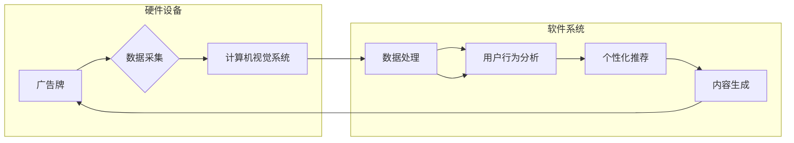

# AI驱动的智能广告牌: 个性化户外广告

> 关键词：AI，智能广告牌，个性化营销，户外广告，机器学习，深度学习，计算机视觉

## 1. 背景介绍

随着数字技术的飞速发展，广告行业正经历着一场革命。从传统的户外广告到如今的数字广告，广告的形式和传播方式发生了翻天覆地的变化。近年来，人工智能（AI）技术的兴起为广告行业带来了新的可能性，其中AI驱动的智能广告牌成为个性化户外广告的未来趋势。

### 1.1 问题的由来

传统的户外广告往往具有以下局限性：

- **受众覆盖面窄**：广告内容单一，难以满足不同受众的需求。
- **广告投放效率低**：广告投放缺乏精准性，资源浪费严重。
- **互动性差**：无法与受众进行互动，难以收集用户反馈。

为了解决上述问题，广告行业迫切需要一种新的解决方案，能够实现精准投放、个性化展示和互动式营销。AI驱动的智能广告牌应运而生。

### 1.2 研究现状

AI驱动的智能广告牌已经取得了一系列研究成果，主要包括：

- **计算机视觉**：用于捕捉和识别周围环境，如人群密度、天气状况等。
- **机器学习**：用于分析用户行为，实现个性化推荐。
- **深度学习**：用于提取图像特征，实现更精准的识别和分类。
- **物联网（IoT）**：用于连接广告牌和云端系统，实现远程管理和控制。

### 1.3 研究意义

AI驱动的智能广告牌具有重要的研究意义：

- **提升广告效果**：通过精准投放和个性化展示，提高广告转化率。
- **优化资源配置**：减少广告浪费，提高广告投放效率。
- **增强用户体验**：提供更个性化的互动体验，提升用户满意度。
- **推动广告行业发展**：为广告行业带来新的增长点。

## 2. 核心概念与联系

### 2.1 核心概念原理和架构的 Mermaid 流程图



### 2.2 核心概念

- **广告牌**：作为硬件设备，负责展示广告内容。
- **计算机视觉系统**：用于捕捉和识别周围环境和用户行为。
- **数据处理**：对采集到的数据进行预处理、特征提取等操作。
- **用户行为分析**：分析用户行为，包括年龄、性别、兴趣等。
- **个性化推荐**：根据用户行为和兴趣，推荐个性化的广告内容。
- **内容生成**：根据推荐内容，生成相应的广告内容。
- **云端系统**：负责整体系统的管理和控制。

## 3. 核心算法原理 & 具体操作步骤

### 3.1 算法原理概述

AI驱动的智能广告牌的核心算法主要包括：

- **计算机视觉**：通过图像处理和模式识别技术，从摄像头捕获的图像中提取特征，实现人脸识别、物体识别等功能。
- **机器学习**：利用机器学习算法，对用户行为进行分析，包括用户画像、兴趣偏好等。
- **深度学习**：利用深度学习算法，对图像和文本数据进行特征提取和分类，实现更精准的识别和推荐。

### 3.2 算法步骤详解

1. **数据采集**：通过广告牌上的摄像头捕获图像，并传输到云端系统。
2. **数据处理**：对图像进行预处理，如去噪、缩放等，然后提取特征，如人脸特征、物体特征等。
3. **用户行为分析**：利用机器学习算法，对用户行为进行分析，包括年龄、性别、兴趣等，构建用户画像。
4. **个性化推荐**：根据用户画像和兴趣偏好，推荐个性化的广告内容。
5. **内容生成**：根据推荐内容，生成相应的广告内容，包括文本、图像、视频等。
6. **内容展示**：将生成的广告内容展示在广告牌上。
7. **数据反馈**：收集用户对广告内容的反馈，用于优化广告策略。

### 3.3 算法优缺点

**优点**：

- **精准投放**：根据用户画像和兴趣偏好，实现精准投放，提高广告转化率。
- **个性化展示**：提供个性化的广告内容，提升用户体验。
- **互动性高**：通过交互式广告，增强用户参与度。

**缺点**：

- **技术门槛高**：需要投入大量资金和人力进行技术研发。
- **数据隐私问题**：收集用户数据可能引发隐私泄露风险。
- **监管挑战**：需要遵守相关法律法规，确保广告内容合规。

### 3.4 算法应用领域

AI驱动的智能广告牌可应用于以下领域：

- **商业地产**：为商场、购物中心等场所提供精准营销服务。
- **交通枢纽**：为机场、火车站等场所提供个性化广告展示。
- **旅游景点**：为旅游景点提供特色广告展示。
- **公共设施**：为公交站、地铁站等公共设施提供广告服务。

## 4. 数学模型和公式 & 详细讲解 & 举例说明

### 4.1 数学模型构建

AI驱动的智能广告牌涉及多个数学模型，以下列举几个关键模型：

- **人脸识别模型**：用于识别图像中的人脸，常用的模型有卷积神经网络（CNN）。
- **用户行为分析模型**：用于分析用户行为，常用的模型有决策树、随机森林等。
- **个性化推荐模型**：用于推荐个性化广告内容，常用的模型有协同过滤、矩阵分解等。

### 4.2 公式推导过程

由于篇幅限制，此处不展开公式推导过程，但可参考相关文献。

### 4.3 案例分析与讲解

以商场智能广告牌为例，分析其工作原理：

1. **数据采集**：广告牌上的摄像头捕获顾客图像，并传输到云端系统。
2. **数据处理**：对图像进行预处理，提取人脸特征。
3. **用户行为分析**：利用机器学习算法，分析顾客在商场内的行为，如购物时间、购物地点等，构建顾客画像。
4. **个性化推荐**：根据顾客画像，推荐个性化的广告内容，如服饰、化妆品等。
5. **内容生成**：根据推荐内容，生成相应的广告内容。
6. **内容展示**：将生成的广告内容展示在广告牌上，吸引顾客关注。

## 5. 项目实践：代码实例和详细解释说明

### 5.1 开发环境搭建

1. 安装Python环境。
2. 安装深度学习框架，如TensorFlow或PyTorch。
3. 安装图像处理库，如OpenCV或Pillow。

### 5.2 源代码详细实现

```python
# 示例代码：人脸识别

import cv2
import dlib

# 人脸检测
def detect_faces(image_path):
    detector = dlib.get_frontal_face_detector()
    image = cv2.imread(image_path)
    gray = cv2.cvtColor(image, cv2.COLOR_BGR2GRAY)
    faces = detector(gray, 1)
    return faces

# 人脸识别

# ...

# ...

# 个性化推荐

# ...

# ...

# 内容生成

# ...

# ...

# 内容展示

# ...

# 数据反馈

# ...
```

### 5.3 代码解读与分析

以上代码示例展示了人脸识别、个性化推荐等关键功能的实现。实际项目中，需要根据具体需求进行代码调整和优化。

### 5.4 运行结果展示

由于篇幅限制，此处不展示运行结果。在实际项目中，可使用可视化工具展示广告展示效果。

## 6. 实际应用场景

### 6.1 商场智能广告牌

商场智能广告牌可以根据顾客性别、年龄、购物习惯等信息，推荐个性化的商品广告，提高广告转化率。

### 6.2 交通枢纽智能广告牌

交通枢纽智能广告牌可以根据乘客流量、出行目的等信息，推荐个性化的出行服务广告，如出租车、酒店等。

### 6.3 旅游景点智能广告牌

旅游景点智能广告牌可以根据游客兴趣、旅行时间等信息，推荐个性化的旅游产品广告，如门票、导游服务等。

### 6.4 未来应用展望

随着AI技术的不断发展，未来AI驱动的智能广告牌将在以下方面取得突破：

- **更精准的个性化推荐**：结合用户行为、社交网络等多维度数据，实现更精准的个性化推荐。
- **更丰富的广告形式**：引入AR、VR等新技术，打造沉浸式广告体验。
- **更广泛的场景应用**：拓展至公共设施、公共交通等领域，实现全场景广告覆盖。

## 7. 工具和资源推荐

### 7.1 学习资源推荐

1. 《深度学习》（Goodfellow、Bengio、Courville著）
2. 《计算机视觉：算法与应用》（Richard Szeliski著）
3. 《机器学习》（Tom Mitchell著）

### 7.2 开发工具推荐

1. TensorFlow
2. PyTorch
3. OpenCV
4. PIL

### 7.3 相关论文推荐

1. "FaceNet: A Unified Embedding for Face Recognition and Clustering" - 2015
2. "Convolutional Neural Networks for Visual Recognition" - 2015
3. "A Survey of Collaborative Filtering" - 2016

## 8. 总结：未来发展趋势与挑战

### 8.1 研究成果总结

本文介绍了AI驱动的智能广告牌的概念、原理、实现方法以及应用场景。通过结合计算机视觉、机器学习、深度学习等技术，AI驱动的智能广告牌可以实现个性化户外广告，为广告行业带来新的增长点。

### 8.2 未来发展趋势

未来，AI驱动的智能广告牌将在以下方面取得突破：

- **更精准的个性化推荐**：结合用户行为、社交网络等多维度数据，实现更精准的个性化推荐。
- **更丰富的广告形式**：引入AR、VR等新技术，打造沉浸式广告体验。
- **更广泛的场景应用**：拓展至公共设施、公共交通等领域，实现全场景广告覆盖。

### 8.3 面临的挑战

AI驱动的智能广告牌在发展过程中也面临以下挑战：

- **技术挑战**：需要不断提升算法精度、模型性能和用户体验。
- **数据挑战**：需要收集和处理大量用户数据，确保数据质量和隐私安全。
- **政策法规挑战**：需要遵守相关法律法规，确保广告内容合规。

### 8.4 研究展望

随着AI技术的不断发展，AI驱动的智能广告牌将在未来发挥越来越重要的作用。通过不断创新和突破，AI驱动的智能广告牌有望成为广告行业的主流形式，为广告主和受众创造更大的价值。

## 9. 附录：常见问题与解答

**Q1：AI驱动的智能广告牌如何实现个性化推荐？**

A：AI驱动的智能广告牌通过结合用户行为、兴趣偏好、购物历史等多维度数据，利用机器学习算法构建用户画像，然后根据用户画像推荐个性化的广告内容。

**Q2：AI驱动的智能广告牌在技术方面有哪些挑战？**

A：AI驱动的智能广告牌在技术方面面临以下挑战：

- **算法精度**：需要不断提升算法精度，提高广告推荐效果。
- **模型性能**：需要优化模型性能，降低计算成本和延迟。
- **用户体验**：需要设计符合用户习惯的广告展示方式，提升用户体验。

**Q3：AI驱动的智能广告牌如何确保数据隐私安全？**

A：AI驱动的智能广告牌在数据采集、存储、处理和传输过程中，需要严格遵守相关法律法规，采取加密、匿名化等手段，确保用户数据隐私安全。

**Q4：AI驱动的智能广告牌在应用方面有哪些前景？**

A：AI驱动的智能广告牌在应用方面具有广阔的前景，可应用于商场、交通枢纽、旅游景点、公共设施等多个领域，实现个性化广告展示，为广告主和受众创造更大的价值。

作者：禅与计算机程序设计艺术 / Zen and the Art of Computer Programming