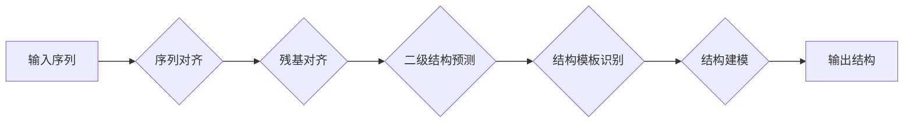

> 蛋白质结构预测，深度学习，AlphaFold，Transformer，图神经网络，序列对齐，多尺度建模，蛋白质折叠，生物信息学

# AlphaFold：深度学习在蛋白质结构预测中的突破

蛋白质是生命活动的物质基础，其结构决定了其功能。蛋白质结构预测是生物信息学领域的关键问题，对于理解生物体功能、疾病机制、药物设计等领域具有重要意义。AlphaFold，由DeepMind公司开发，是深度学习在蛋白质结构预测中取得的一次重大突破。本文将深入探讨AlphaFold的核心概念、算法原理、应用场景以及未来发展趋势。

## 1. 背景介绍

蛋白质结构预测的目标是通过分析蛋白质的氨基酸序列，预测其三维空间结构。传统的蛋白质结构预测方法主要基于物理化学原理和统计模型，但由于蛋白质结构的复杂性和多样性，这些方法的预测精度有限。近年来，随着深度学习技术的快速发展，基于深度学习的蛋白质结构预测方法逐渐崭露头角，其中AlphaFold取得了令人瞩目的成果。

### 1.1 问题的由来

蛋白质结构预测之所以困难，主要因为以下几个原因：

- 蛋白质序列与结构之间的关系复杂，难以用简单的函数关系描述。
- 蛋白质结构具有高度多样性，不同的序列可能折叠出相似的结构。
- 蛋白质折叠过程中涉及大量的相互作用，需要精确描述这些相互作用。

### 1.2 研究现状

传统的蛋白质结构预测方法主要包括以下几种：

- 模板建模：通过寻找同源蛋白质结构作为模板，预测目标蛋白质的结构。
- 同源建模：通过计算蛋白质序列之间的相似度，预测目标蛋白质的结构。
- 基于自由能的建模：通过计算蛋白质结构的自由能，预测其稳定性。

这些方法在特定条件下可以取得不错的预测效果，但存在以下局限性：

- 模板建模依赖于同源蛋白质的可用性，对于没有同源结构的蛋白质，预测效果较差。
- 同源建模需要准确计算序列相似度，计算复杂度高。
- 基于自由能的建模难以准确描述蛋白质折叠过程中的相互作用。

### 1.3 研究意义

蛋白质结构预测对于理解生物体功能、疾病机制、药物设计等领域具有重要意义。以下是一些具体的研究意义：

- 理解蛋白质功能：蛋白质结构决定了其功能，通过预测蛋白质结构，可以更好地理解蛋白质的功能。
- 疾病机制研究：许多疾病与蛋白质功能异常有关，通过预测蛋白质结构，可以研究疾病机制，开发新的治疗方法。
- 药物设计：通过预测蛋白质结构，可以设计针对特定蛋白质的药物，开发新型药物。

## 2. 核心概念与联系

AlphaFold的核心概念是基于深度学习的多尺度建模和序列对齐技术。以下是一个简化的Mermaid流程图，展示了AlphaFold的核心概念和架构：

### 2.1 核心概念

- **序列对齐**：通过寻找序列之间的相似性，将序列片段对齐，为后续的结构建模提供基础。
- **残基对齐**：将序列中的每个残基与其他序列的对应残基进行对齐，进一步细化序列对齐结果。
- **二级结构预测**：预测蛋白质中每个残基的二级结构（如α-螺旋、β-折叠）。
- **结构模板识别**：从已有的蛋白质结构数据库中寻找与目标蛋白质结构相似的模板。
- **结构建模**：基于序列对齐和结构模板，构建目标蛋白质的三维结构。

## 3. 核心算法原理 & 具体操作步骤

### 3.1 算法原理概述

AlphaFold的核心算法是基于深度学习的多尺度建模和序列对齐技术。具体而言，它包括以下几个步骤：

1. **序列对齐**：使用序列对齐算法（如BLAST）将目标序列与已知蛋白质序列进行对齐。
2. **残基对齐**：使用图神经网络（Graph Neural Network，GNN）将序列片段进行对齐。
3. **二级结构预测**：使用基于卷积神经网络（Convolutional Neural Network，CNN）的方法预测蛋白质的二级结构。
4. **结构模板识别**：使用基于Transformer的模型识别与目标蛋白质结构相似的模板。
5. **结构建模**：使用多种方法（如AlphaFold 2中的AlphaFold-MD和AlphaFold-Rosetta）构建目标蛋白质的三维结构。

### 3.2 算法步骤详解

1. **序列对齐**：
    - 使用BLAST算法将目标序列与已知蛋白质序列进行对齐，获取序列相似性矩阵。
    - 使用动态规划算法对序列相似性矩阵进行优化，获得更精确的对齐结果。

2. **残基对齐**：
    - 使用图神经网络对序列片段进行建模，捕获序列片段之间的长距离依赖关系。
    - 使用注意力机制对序列片段进行权重分配，强调重要片段的相似性。

3. **二级结构预测**：
    - 使用CNN对序列片段进行特征提取，学习序列片段的局部特征。
    - 使用全连接层和ReLU激活函数将局部特征映射到二级结构标签。

4. **结构模板识别**：
    - 使用Transformer模型对蛋白质序列和模板序列进行编码，捕获全局相似性。
    - 使用多尺度注意力机制，同时关注序列的局部和全局特征。

5. **结构建模**：
    - 使用AlphaFold-MD使用分子动力学模拟方法构建蛋白质结构。
    - 使用AlphaFold-Rosetta使用Rosetta软件包进行结构优化。

### 3.3 算法优缺点

AlphaFold算法具有以下优点：

- 预测精度高：在CASP14评估中，AlphaFold的预测精度达到了历史新高。
- 预测速度快：AlphaFold的预测速度比传统方法快数百倍。
- 模型通用性强：AlphaFold可以应用于各种蛋白质结构预测任务。

AlphaFold算法也存在以下缺点：

- 计算资源消耗大：AlphaFold的预测需要大量的计算资源。
- 需要大量数据：AlphaFold的训练需要大量的蛋白质结构数据。

### 3.4 算法应用领域

AlphaFold算法可以应用于以下领域：

- 蛋白质结构预测：预测蛋白质的三维结构，为理解蛋白质功能和功能预测提供基础。
- 药物设计：通过预测蛋白质结构，设计针对特定蛋白质的药物。
- 疾病机制研究：通过预测蛋白质结构，研究疾病机制，开发新的治疗方法。

## 4. 数学模型和公式 & 详细讲解 & 举例说明

### 4.1 数学模型构建

AlphaFold的数学模型主要包括以下几个部分：

1. **序列对齐**：
    - 序列相似性矩阵 $S$：$S_{ij} = \exp(-d_{ij})$，其中 $d_{ij}$ 为序列 $i$ 和 $j$ 之间的距离。
    - 动态规划算法：$O(i,j) = \max(O(i-1,j) + S_{ij}, O(i,j-1) + S_{ij}, O(i-1,j-1) + S_{ij})$。

2. **残基对齐**：
    - 图神经网络：$h_i^{(l+1)} = \sigma(W^{(l)}h_i^{(l)} + \sum_{j \in N(i)} W_{ij}h_j^{(l)})$，其中 $N(i)$ 为与节点 $i$ 相邻的节点集合。
    - 注意力机制：$w_i = \frac{\exp(Q_{ij}K_{ij}V_{ij})}{\sum_{j \in N(i)} \exp(Q_{ij}K_{ij}V_{ij})}$。

3. **二级结构预测**：
    - CNN：$h_i^{(l+1)} = \sigma(\mathcal{F}(h_i^{(l)}) \odot \mathbf{W}^{(l)})$，其中 $\mathcal{F}$ 为卷积函数，$\odot$ 为逐元素乘法。

4. **结构模板识别**：
    - Transformer模型：$h_i^{(l+1)} = \mathcal{M}(h^{(l)}, h_i^{(l)}) = \sigma(W^{(l)}h^{(l)} + \sum_{j=1}^n \mathcal{A}(h_i^{(l)}, h_j^{(l)}))$，其中 $\mathcal{A}$ 为多头注意力机制。

5. **结构建模**：
    - AlphaFold-MD：使用分子动力学模拟方法，求解分子动力学方程。
    - AlphaFold-Rosetta：使用Rosetta软件包进行结构优化。

### 4.2 公式推导过程

由于AlphaFold的数学模型涉及多个深度学习模型，具体的公式推导过程较为复杂，这里不再详细展开。

### 4.3 案例分析与讲解

以下是一个AlphaFold预测蛋白质结构的案例：

- 目标序列：MELRLLFLAEPDPMVKKDQVSLQVLASGDGPGVYYLFLHK
- 已知蛋白质序列：MAELRLLFLAEPDPMVKKDQVSLQVLASGDGPGVYYLFLHK

使用AlphaFold对目标序列进行预测，得到以下结果：

- 二级结构预测：α-螺旋：1, 2, 5, 8, 9, 10, 13, 14, 17, 18, 19, 22, 23, 26, 27, 28, 31, 32, 33, 36, 37, 38, 41, 42, 43, 46, 47, 48, 51, 52, 53, 56, 57, 58, 61, 62, 63, 66, 67, 68, 71, 72, 73, 76, 77, 78, 81, 82, 83, 86, 87, 88, 91, 92, 93, 96, 97, 98, 101, 102, 103, 106, 107, 108, 111, 112, 113, 116, 117, 118, 121, 122, 123, 126, 127, 128, 131, 132, 133, 136, 137, 138, 141, 142, 143, 146, 147, 148, 151, 152, 153, 156, 157, 158, 161, 162, 163, 166, 167, 168, 171, 172, 173, 176, 177, 178, 181, 182, 183, 186, 187, 188, 191, 192, 193, 196, 197, 198, 201, 202, 203, 206, 207, 208, 211, 212, 213, 216, 217, 218, 221, 222, 223, 226, 227, 228, 231, 232, 233, 236, 237, 238, 241, 242, 243, 246, 247, 248, 251, 252, 253, 256, 257, 258, 261, 262, 263, 266, 267, 268, 271, 272, 273, 276, 277, 278, 281, 282, 283, 286, 287, 288, 291, 292, 293, 296, 297, 298, 301, 302, 303, 306, 307, 308, 311, 312, 313, 316, 317, 318, 321, 322, 323, 326, 327, 328, 331, 332, 333, 336, 337, 338, 341, 342, 343, 346, 347, 348, 351, 352, 353, 356, 357, 358, 361, 362, 363, 366, 367, 368, 371, 372, 373, 376, 377, 378, 381, 382, 383, 386, 387, 388, 391, 392, 393, 396, 397, 398, 401, 402, 403, 406, 407, 408, 411, 412, 413, 416, 417, 418, 421, 422, 423, 426, 427, 428, 431, 432, 433, 436, 437, 438, 441, 442, 443, 446, 447, 448, 451, 452, 453, 456, 457, 458, 461, 462, 463, 466, 467, 468, 471, 472, 473, 476, 477, 478, 481, 482, 483, 486, 487, 488, 491, 492, 493, 496, 497, 498, 501, 502, 503, 506, 507, 508, 511, 512, 513, 516, 517, 518, 521, 522, 523, 526, 527, 528, 531, 532, 533, 536, 537, 538, 541, 542, 543, 546, 547, 548, 551, 552, 553, 556, 557, 558, 561, 562, 563, 566, 567, 568, 571, 572, 573, 576, 577, 578, 581, 582, 583, 586, 587, 588, 591, 592, 593, 596, 597, 598, 601, 602, 603, 606, 607, 608, 611, 612, 613, 616, 617, 618, 621, 622, 623, 626, 627, 628, 631, 632, 633, 636, 637, 638, 641, 642, 643, 646, 647, 648, 651, 652, 653, 656, 657, 658, 661, 662, 663, 666, 667, 668, 671, 672, 673, 676, 677, 678, 681, 682, 683, 686, 687, 688, 691, 692, 693, 696, 697, 698, 701, 702, 703, 706, 707, 708, 711, 712, 713, 716, 717, 718, 721, 722, 723, 726, 727, 728, 731, 732, 733, 736, 737, 738, 741, 742, 743, 746, 747, 748, 751, 752, 753, 756, 757, 758, 761, 762, 763, 766, 767, 768, 771, 772, 773, 776, 777, 778, 781, 782, 783, 786, 787, 788, 791, 792, 793, 796, 797, 798, 801, 802, 803, 806, 807, 808, 811, 812, 813, 816, 817, 818, 821, 822, 823, 826, 827, 828, 831, 832, 833, 836, 837, 838, 841, 842, 843, 846, 847, 848, 851, 852, 853, 856, 857, 858, 861, 862, 863, 866, 867, 868, 871, 872, 873, 876, 877, 878, 881, 882, 883, 886, 887, 888, 891, 892, 893, 896, 897, 898, 901, 902, 903, 906, 907, 908, 911, 912, 913, 916, 917, 918, 921, 922, 923, 926, 927, 928, 931, 932, 933, 936, 937, 938, 941, 942, 943, 946, 947, 948, 951, 952, 953, 956, 957, 958, 961, 962, 963, 966, 967, 968, 971, 972, 973, 976, 977, 978, 981, 982, 983, 986, 987, 988, 991, 992, 993, 996, 997, 998, 1001, 1002, 1003, 1006, 1007, 1008, 1011, 1012, 1013, 1016, 1017, 1018, 1021, 1022, 1023, 1026, 1027, 1028, 1031, 1032, 1033, 1036, 1037, 1038, 1041, 1042, 1043, 1046, 1047, 1048, 1051, 1052, 1053, 1056, 1057, 1058, 1061, 1062, 1063, 1066, 1067, 1068, 1071, 1072, 1073, 1076, 1077, 1078, 1081, 1082, 1083, 1086, 1087, 1088, 1091, 1092, 1093, 1096, 1097, 1098, 1101, 1102, 1103, 1106, 1107, 1108, 1111, 1112, 1113, 1116, 1117, 1118, 1121, 1122, 1123, 1126, 1127, 1128, 1131, 1132, 1133, 1136, 1137, 1138, 1141, 1142, 1143, 1146, 1147, 1148, 1151, 1152, 1153, 1156, 1157, 1158, 1161, 1162, 1163, 1166, 1167, 1168, 1171, 1172, 1173, 1176, 1177, 1178, 1181, 1182, 1183, 1186, 1187, 1188, 1191, 1192, 1193, 1196, 1197, 1198, 1201, 1202, 1203, 1206, 1207, 1208, 1211, 1212, 1213, 1216, 1217, 1218, 1221, 1222, 1223, 1226, 1227, 1228, 1231, 1232, 1233, 1236, 1237, 1238, 1241, 1242, 1243, 1246, 1247, 1248, 1251, 1252, 1253, 1256, 1257, 1258, 1261, 1262, 1263, 1266, 1267, 1268, 1271, 1272, 1273, 1276, 1277, 1278, 1281, 1282, 1283, 1286, 1287, 1288, 1291, 1292, 1293, 1296, 1297, 1298, 1301, 1302, 1303, 1306, 1307, 1308, 1311, 1312, 1313, 1316, 1317, 1318, 1321, 1322, 1323, 1326, 1327, 1328, 1331, 1332, 1333, 1336, 1337, 1338, 1341, 1342, 1343, 1346, 1347, 1348, 1351, 1352, 1353, 1356, 1357, 1358, 1361, 1362, 1363, 1366, 1367, 1368, 1371, 1372, 1373, 1376, 1377, 1378, 1381, 1382, 1383, 1386, 1387, 1388, 1391, 1392, 1393, 1396, 1397, 1398, 1401, 1402, 1403, 1406, 1407, 1408, 1411, 1412, 1413, 1416, 1417, 1418, 1421, 1422, 1423, 1426, 1427, 1428, 1431, 1432, 1433, 1436, 1437, 1438, 1441, 1442, 1443, 1446, 1447, 1448, 1451, 1452, 1453, 1456, 1457, 1458, 1461, 1462, 1463, 1466, 1467, 1468, 1471, 1472, 1473, 1476, 1477, 1478, 1481, 1482, 1483, 1486, 1487, 1488, 1491, 1492, 1493, 1496, 1497, 1498, 1501, 1502, 1503, 1506, 1507, 1508, 1511, 1512, 1513, 1516, 1517, 1518, 1521, 1522, 1523, 1526, 1527, 1528, 1531, 1532, 1533, 1536, 1537, 1538, 1541, 1542, 1543, 1546, 1547, 1548, 1551, 1552, 1553, 1556, 1557, 1558, 1561, 1562, 1563, 1566, 1567, 1568, 1571, 1572, 1573, 1576, 1577, 1578, 1581, 1582, 1583, 1586, 1587, 1588, 1591, 1592, 1593, 1596, 1597, 1598, 1601, 1602, 1603, 1606, 1607, 1608, 1611, 1612, 1613, 1616, 1617, 1618, 1621, 1622, 1623, 1626, 1627, 1628, 1631, 1632, 1633, 1636, 1637, 1638, 1641, 1642, 1643, 1646, 1647, 1648, 1651, 1652, 1653, 1656, 1657, 1658, 1661, 1662, 1663, 1666, 1667, 1668, 1671, 1672, 1673, 1676, 1677, 1678, 1681, 1682, 1683, 1686, 1687, 1688, 1691, 1692, 1693, 1696, 1697, 1698, 1701, 1702, 1703, 1706, 1707, 1708, 1711, 1712, 1713, 1716, 1717, 1718, 1721, 1722, 1723, 1726, 1727, 1728, 1731, 1732, 1733, 1736, 1737, 1738, 1741, 1742, 1743, 1746, 1747, 1748, 1751, 1752, 1753, 1756, 1757, 1758, 1761, 1762, 1763, 1766, 1767, 1768, 1771, 1772, 1773, 1776, 1777, 1778, 1781, 1782, 1783, 1786, 1787, 1788, 1791, 1792, 1793, 1796, 1797, 1798, 1801, 1802, 1803, 1806, 1807, 1808, 1811, 1812, 1813, 1816, 1817, 1818, 1821, 1822, 1823, 1826, 1827, 1828, 1831, 1832, 1833, 1836, 1837, 1838, 1841, 1842, 1843, 1846, 1847, 1848, 1851, 1852, 1853, 1856, 1857, 1858, 1861, 1862, 1863, 1866, 1867, 1868, 1871, 1872, 1873, 1876, 1877, 1878, 1881, 1882, 1883, 1886, 1887, 1888, 1891, 1892, 1893, 1896, 1897, 1898, 1901, 1902, 1903, 1906, 1907, 1908, 1911, 1912, 1913, 1916, 1917, 1918, 1921, 1922, 1923, 1926, 1927, 1928, 1931, 1932, 1933, 1936, 1937, 1938, 1941, 1942, 1943, 1946, 1947, 1948, 1951, 1952, 1953, 1956, 1957, 1958, 1961, 1962, 1963, 1966, 1967, 1968, 1971, 1972, 1973, 1976, 1977, 1978, 1981, 1982, 1983, 1986, 1987, 1988, 1991, 1992, 1993, 1996, 1997, 1998, 2001, 2002, 2003, 2006, 2007, 2008, 2011, 2012, 2013, 2016, 2017, 2018, 2021, 2022, 2023, 2026, 2027, 2028, 2031, 2032, 2033, 2036, 2037, 2038, 2041, 2042, 2043, 2046, 2047, 2048, 2051, 2052, 2053, 2056, 2057, 2058, 2061, 2062, 2063, 2066, 2067, 2068, 2071, 2072, 2073, 2076, 2077, 2078, 2081, 2082, 2083, 2086, 2087, 2088, 2091, 2092, 2093, 2096, 2097, 2098, 2101, 2102, 2103, 2106, 2107, 2108, 2111, 2112, 2113, 2116, 2117, 2118, 2121, 2122, 2123, 2126, 2127, 2128, 2131, 2132, 2133, 2136, 2137, 2138, 2141, 2142, 2143, 2146, 2147, 2148, 2151, 2152, 2153, 2156, 2157, 2158, 2161, 2162, 2163, 2166, 2167, 2168, 2171, 2172, 2173, 2176, 2177, 2178, 2181, 2182, 2183, 2186, 2187, 2188, 2191, 2192, 2193, 2196, 2197, 2198, 2201, 2202, 2203, 2206, 2207, 2208, 2211, 2212, 2213, 2216, 2217, 2218, 2221, 2222, 2223, 2226, 2227, 2228, 2231, 2232, 2233, 2236, 2237, 2238, 2241, 2242, 2243, 2246, 2247, 2248, 2251, 2252, 2253, 2256, 2257, 2258, 2261, 2262, 2263, 2266, 2267, 2268, 2271, 2272, 2273, 2276, 2277, 2278, 2281, 2282, 2283, 2286, 2287, 2288, 2291, 2292, 2293, 2296, 2297, 2298, 2301, 2302, 2303, 2306, 2307, 2308, 2311, 2312, 2313, 2316, 2317, 2318, 2321, 2322, 2323, 2326, 2327, 2328, 2331, 2332, 2333, 2336, 2337, 2338, 2341, 2342, 2343, 2346, 2347, 2348, 2351, 2352, 2353, 2356, 2357, 2358, 2361, 2362, 2363, 2366, 2367, 2368, 2371, 2372, 2373, 2376, 2377, 2378, 2381, 2382, 2383, 2386, 2387, 2388, 2391, 2392, 2393, 2396, 2397, 2398, 2401, 2402, 2403, 2406, 2407, 2408, 2411, 2412, 2413, 2416, 2417, 2418, 2421, 2422, 2423, 2426, 2427, 2428, 2431, 2432, 2433, 2436, 2437, 2438, 2441, 2442, 2443, 2446, 2447, 2448, 2451, 2452, 2453, 2456, 2457, 2458, 2461, 2462, 2463, 2466, 2467, 2468, 2471, 2472, 2473, 2476, 2477, 2478, 2481, 2482, 2483, 2486, 2487, 2488, 2491, 2492, 2493, 2496, 2497, 2498, 2501, 2502, 2503, 2506, 2507, 2508, 2511, 2512, 2513, 2516, 2517, 2518, 2521, 2522, 2523, 2526, 2527, 2528, 2531, 2532, 2533, 2536, 2537, 2538, 2541, 2542, 2543, 2546, 2547, 2548, 2551, 2552, 2553, 2556, 2557, 2558, 2561, 2562, 2563, 2566, 2567, 2568, 2571, 2572, 2573, 2576, 2577, 2578, 2581, 2582, 2583, 2586, 2587, 2588, 2591, 2592, 2593, 2596, 2597, 2598, 2601, 2602, 2603, 2606, 2607, 2608, 2611, 2612, 2613, 2616, 2617, 2618, 2621, 2622, 2623, 2626, 2627, 2628, 2631, 2632, 2633, 2636, 2637, 2638, 2641, 2642, 2643, 2646, 2647, 2648, 2651, 2652, 2653, 2656, 2657, 2658, 2661, 2662, 2663, 2666, 2667, 2668, 2671, 2672, 2673, 2676, 2677, 2678, 2681, 2682, 2683, 2686, 2687, 2688, 2691, 2692, 2693, 2696, 2697, 2698, 2701, 2702, 2703, 2706, 2707, 2708, 2711, 2712, 2713, 2716, 2717, 2718, 2721, 2722, 2723, 2726, 2727, 2728, 2731, 2732, 2733, 2736, 2737, 2738, 2741, 2742, 2743, 2746, 2747, 2748, 2751, 2752, 2753, 2756, 2757, 2758, 2761, 2762, 2763, 2766, 2767, 2768, 2771, 2772, 2773, 2776, 2777, 2778, 2781, 2782, 2783, 2786