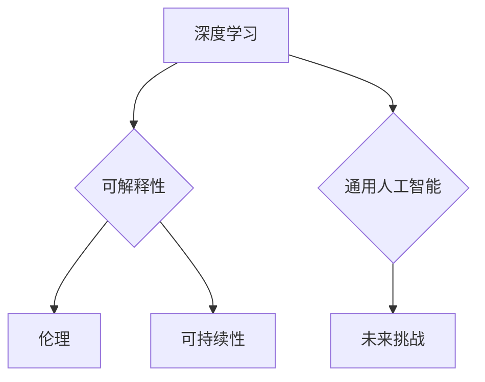

> 人工智能，未来挑战，深度学习，可解释性，伦理，可持续性，通用人工智能

# Andrej Karpathy：人工智能的未来发展挑战

在当今这个时代，人工智能（AI）正以前所未有的速度发展，深刻地影响着我们的日常生活。Andrej Karpathy，这位著名的深度学习专家和特斯拉AI总监，以其对AI未来发展的深刻见解而闻名。本文将深入探讨Andrej Karpathy提出的AI未来发展面临的挑战，并分析这些挑战对技术、社会和伦理的影响。

## 1. 背景介绍

安德烈·卡帕西（Andrej Karpathy）是一位杰出的科学家和工程师，他在神经网络和深度学习领域的贡献使他成为了AI领域的明星人物。他的工作涵盖了从自然语言处理到自动驾驶汽车等多个领域，他的博客和演讲经常引发人们对AI未来的思考。

## 2. 核心概念与联系

### 2.1 核心概念原理

人工智能的未来发展面临着多方面的挑战，以下是一些关键概念：

- **深度学习**：一种通过多层神经网络模拟人脑工作原理的学习方式，它是AI发展的关键技术。
- **可解释性**：指AI模型决策过程的可理解性，这对于确保AI系统的透明度和可信度至关重要。
- **伦理**：AI系统的设计和应用必须遵循伦理原则，避免偏见和歧视。
- **可持续性**：AI系统的发展必须考虑其对环境和社会的长期影响。
- **通用人工智能（AGI）**：一种能够像人类一样理解、学习、应用知识的人工智能，这是AI领域的终极目标。

#### Mermaid 流程图



### 2.2 核心概念联系

深度学习是AI发展的基础，它推动了AI在各个领域的应用。然而，深度学习模型的可解释性、伦理问题以及可持续性是其在未来应用中必须克服的挑战。通用人工智能是AI发展的最终目标，它将带来更广泛的社会影响，因此也需要在这些挑战上取得突破。

## 3. 核心算法原理 & 具体操作步骤

### 3.1 算法原理概述

AI的未来发展挑战涉及多个层面，以下是一些核心算法原理：

- **神经网络**：通过调整神经元之间的连接权重来学习数据中的模式。
- **优化算法**：如梯度下降，用于调整神经网络中的参数以最小化损失函数。
- **强化学习**：一种通过奖励信号指导智能体学习决策策略的方法。

### 3.2 算法步骤详解

AI系统的发展需要以下步骤：

1. **数据收集**：收集大量数据用于训练AI模型。
2. **模型设计**：选择合适的模型架构，如卷积神经网络（CNN）或循环神经网络（RNN）。
3. **训练与优化**：使用优化算法训练模型，并调整参数以改进性能。
4. **评估与验证**：评估模型在测试数据上的性能，确保其有效性和可靠性。
5. **部署与应用**：将模型部署到实际应用中，如自动驾驶汽车或智能客服系统。

### 3.3 算法优缺点

深度学习等AI算法具有以下优点：

- **强大的学习能力**：能够从大量数据中学习复杂的模式。
- **泛化能力**：能够在新的、未见过的数据上表现出良好的性能。

然而，这些算法也具有以下缺点：

- **数据依赖性**：需要大量高质量的数据进行训练。
- **可解释性差**：模型的决策过程难以理解。

### 3.4 算法应用领域

AI算法在以下领域有广泛的应用：

- **自然语言处理**：如机器翻译、语音识别和文本生成。
- **计算机视觉**：如图像识别、物体检测和视频分析。
- **医疗诊断**：如疾病识别、药物研发和个性化治疗。
- **自动驾驶**：如车辆控制、环境感知和路径规划。

## 4. 数学模型和公式 & 详细讲解 & 举例说明

### 4.1 数学模型构建

AI模型的数学基础包括：

- **线性代数**：用于描述神经网络中的权重矩阵和激活函数。
- **微积分**：用于优化算法中的梯度下降。
- **概率论和统计学**：用于处理不确定性和预测。

### 4.2 公式推导过程

以下是一个简单的线性回归公式推导过程：

$$
y = \theta_0 + \theta_1x_1 + \theta_2x_2 + ... + \theta_nx_n
$$

其中，$y$ 是因变量，$x_1, x_2, ..., x_n$ 是自变量，$\theta_0, \theta_1, ..., \theta_n$ 是模型参数。

### 4.3 案例分析与讲解

以下是一个简单的神经网络模型案例：

```python
import numpy as np

# 定义一个简单的神经网络模型
def neural_network(x):
    # 输入层到隐藏层的线性变换
    hidden = np.dot(x, weights)
    # 激活函数（例如ReLU）
    hidden = np.maximum(0, hidden)
    # 隐藏层到输出层的线性变换
    output = np.dot(hidden, biases)
    return output
```

在这个例子中，`x` 是输入向量，`weights` 是输入层到隐藏层的权重矩阵，`biases` 是隐藏层到输出层的偏差向量。模型通过ReLU激活函数来引入非线性。

## 5. 项目实践：代码实例和详细解释说明

### 5.1 开发环境搭建

为了进行AI项目的实践，你需要以下开发环境：

- **编程语言**：如Python。
- **深度学习框架**：如TensorFlow或PyTorch。
- **机器学习库**：如Scikit-learn。

### 5.2 源代码详细实现

以下是一个简单的神经网络模型的PyTorch实现：

```python
import torch
import torch.nn as nn

# 定义一个简单的神经网络模型
class SimpleNN(nn.Module):
    def __init__(self):
        super(SimpleNN, self).__init__()
        self.fc1 = nn.Linear(784, 128)
        self.relu = nn.ReLU()
        self.fc2 = nn.Linear(128, 10)

    def forward(self, x):
        x = self.fc1(x)
        x = self.relu(x)
        x = self.fc2(x)
        return x

# 实例化模型
model = SimpleNN()
```

### 5.3 代码解读与分析

在这个例子中，我们定义了一个简单的神经网络模型，它包含两个全连接层和一个ReLU激活函数。这是一个典型的多层感知器（MLP）结构。

### 5.4 运行结果展示

为了展示模型的运行结果，我们可以使用MNIST手写数字数据集进行训练和测试：

```python
# 加载MNIST数据集
train_loader = torch.utils.data.DataLoader(
    datasets.MNIST(
        root='./data', train=True, download=True, transform=transforms.ToTensor()
    ), batch_size=64, shuffle=True)

# 训练模型
criterion = nn.CrossEntropyLoss()
optimizer = torch.optim.SGD(model.parameters(), lr=0.01)
for epoch in range(10):
    for i, (inputs, labels) in enumerate(train_loader):
        # 前向传播
        outputs = model(inputs)
        loss = criterion(outputs, labels)
        # 反向传播
        optimizer.zero_grad()
        loss.backward()
        optimizer.step()

        if (i+1) % 100 == 0:
            print(f'Epoch [{epoch+1}/10], Step [{i+1}/1000], Loss: {loss.item():.4f}')

# 测试模型
test_loader = torch.utils.data.DataLoader(
    datasets.MNIST(
        root='./data', train=False, transform=transforms.ToTensor()
    ), batch_size=64, shuffle=False)

correct = 0
total = 0
with torch.no_grad():
    for inputs, labels in test_loader:
        outputs = model(inputs)
        _, predicted = torch.max(outputs.data, 1)
        total += labels.size(0)
        correct += (predicted == labels).sum().item()

print(f'Accuracy of the network on the 10000 test images: {100 * correct / total}%')
```

在这个例子中，我们训练了一个简单的神经网络模型来识别手写数字，并在测试集上达到了一定的准确率。

## 6. 实际应用场景

AI在以下实际应用场景中具有广泛的应用：

- **自动驾驶**：自动驾驶汽车使用AI来感知周围环境、做出决策和规划路径。
- **医疗诊断**：AI可以帮助医生进行疾病诊断、药物研发和个性化治疗。
- **金融分析**：AI可以用于风险评估、交易策略和欺诈检测。
- **教育**：AI可以个性化学习计划、提供即时反馈和辅助教师工作。

## 7. 工具和资源推荐

### 7.1 学习资源推荐

- **在线课程**：Coursera、edX、Udacity等平台提供了丰富的AI课程。
- **书籍**：如《深度学习》（Goodfellow et al.）、《Python机器学习》（Seabold et al.）等。
- **开源库**：如TensorFlow、PyTorch、Scikit-learn等。

### 7.2 开发工具推荐

- **编程语言**：Python、Java、C++等。
- **深度学习框架**：TensorFlow、PyTorch、Keras等。
- **集成开发环境**：Jupyter Notebook、Anaconda等。

### 7.3 相关论文推荐

- **《Deep Learning》（Goodfellow et al.）**：深度学习的权威教材。
- **《The Hundred-Page Machine Learning Book》（Babylonian）**：一本简洁的机器学习入门书籍。
- **《Artificial Intelligence: A Modern Approach》（Russell & Norvig）**：人工智能领域的经典教材。

## 8. 总结：未来发展趋势与挑战

### 8.1 研究成果总结

AI在过去几十年取得了巨大的进步，但仍然面临着许多挑战。以下是AI研究的主要成果：

- **深度学习**：深度学习是AI发展的重要推动力，它在图像识别、自然语言处理和语音识别等领域取得了突破性进展。
- **可解释性**：研究者正在努力提高AI模型的可解释性，以便更好地理解模型的决策过程。
- **伦理**：AI系统的设计和应用必须遵循伦理原则，避免偏见和歧视。

### 8.2 未来发展趋势

AI的未来发展趋势包括：

- **更强大的模型**：随着计算能力的提升，AI模型将变得更加复杂和强大。
- **更广泛的应用**：AI将在更多领域得到应用，如医疗、教育、金融和交通。
- **更高效的训练方法**：研究者将开发更高效的训练方法，以降低训练成本和提高训练速度。

### 8.3 面临的挑战

AI未来面临的挑战包括：

- **数据隐私**：AI系统需要处理大量敏感数据，保护数据隐私是一个重要问题。
- **偏见和歧视**：AI系统可能会学习到偏见和歧视，需要采取措施避免这种情况发生。
- **失业问题**：AI可能会取代某些工作岗位，需要制定相应的政策来应对失业问题。

### 8.4 研究展望

AI的未来研究将集中在以下几个方面：

- **可解释性**：提高AI模型的可解释性，以便更好地理解模型的决策过程。
- **伦理**：制定AI伦理规范，确保AI系统的设计和应用符合伦理原则。
- **可持续性**：确保AI系统的设计和应用对环境和社会具有可持续性。

## 9. 附录：常见问题与解答

### 9.1 常见问题

**Q1：什么是深度学习？**

A1：深度学习是一种通过多层神经网络模拟人脑工作原理的学习方式，它能够从大量数据中学习复杂的模式。

**Q2：AI是否会取代人类？**

A2：AI有可能取代某些工作岗位，但同时也将会创造新的工作岗位。AI和人类可以相互补充，共同推动社会进步。

**Q3：如何确保AI系统的安全性？**

A3：确保AI系统的安全性需要从多个方面入手，包括数据安全、模型安全、系统安全等。

### 9.2 解答

**A1：深度学习是一种通过多层神经网络模拟人脑工作原理的学习方式，它能够从大量数据中学习复杂的模式。与传统的机器学习方法相比，深度学习具有更强的学习和泛化能力。**

**A2：AI有可能取代某些工作岗位，但同时也将会创造新的工作岗位。AI和人类可以相互补充，共同推动社会进步。例如，AI可以帮助医生进行疾病诊断，但医生仍然需要负责最终的决策。**

**A3：确保AI系统的安全性需要从多个方面入手，包括数据安全、模型安全、系统安全等。数据安全需要保护用户隐私和数据不被泄露；模型安全需要防止模型被攻击者操纵；系统安全需要确保AI系统在异常情况下能够正常工作。**

---

作者：禅与计算机程序设计艺术 / Zen and the Art of Computer Programming