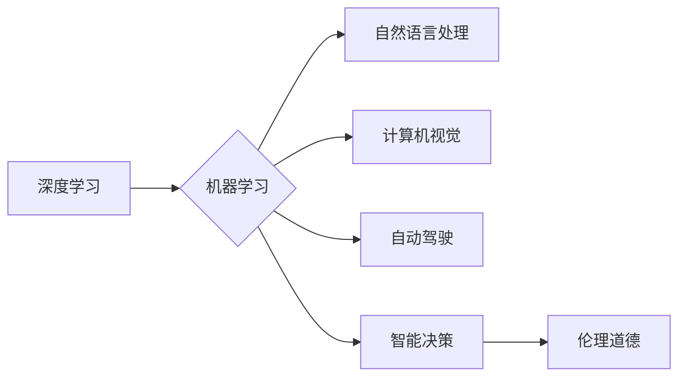

> 人工智能，未来趋势，深度学习，机器学习，自然语言处理，计算机视觉，自动驾驶，智能决策，伦理道德

# Andrej Karpathy：人工智能的未来发展方向

人工智能（AI）是当今科技领域最激动人心的前沿领域之一。从自然语言处理到计算机视觉，从自动驾驶到智能决策系统，AI的应用已经渗透到我们生活的方方面面。Andrej Karpathy，作为硅谷著名的人工智能工程师和特斯拉AI团队的负责人，他对AI的未来发展方向有着深刻的见解和独特的洞察。本文将基于Andrej Karpathy的观点，探讨人工智能的未来发展趋势和面临的挑战。

## 1. 背景介绍

Andrej Karpathy是一位在人工智能领域有着丰富经验和深刻理解的专家。他曾就职于Facebook的AI研究团队，负责构建和改进了著名的自然语言处理模型序列模型（Sequence Model），包括LSTM和RNN。在Facebook期间，他还领导了OpenAI的开源项目TensorFlow.js，使深度学习技术在浏览器中得以应用。如今，Karpathy在特斯拉负责自动驾驶项目的AI团队，致力于推动自动驾驶技术的发展。

## 2. 核心概念与联系

### 2.1 核心概念原理

人工智能的未来发展方向可以从以下几个方面来理解：

- **深度学习**：一种通过模拟人脑神经网络结构进行学习和预测的技术。
- **机器学习**：一种使计算机能够从数据中学习并做出决策的技术。
- **自然语言处理（NLP）**：研究如何让计算机理解和生成人类语言的分支。
- **计算机视觉**：研究如何让计算机理解和解释图像和视频内容的分支。
- **自动驾驶**：使用AI技术实现车辆自主驾驶的技术。
- **智能决策**：使计算机能够进行复杂决策的技术。
- **伦理道德**：在AI设计和应用中考虑的道德和伦理问题。

Mermaid流程图如下：



### 2.2 核心概念联系

这些核心概念之间存在着密切的联系。深度学习和机器学习是AI的两个基础，它们为其他应用提供了强大的学习能力和智能决策支持。自然语言处理和计算机视觉是AI的两个重要应用领域，它们分别处理文本和图像数据。自动驾驶和智能决策则是AI技术的两个重要应用方向，它们在交通运输和复杂决策中发挥着关键作用。伦理道德则是贯穿整个AI发展始终的核心议题，它要求我们在设计和应用AI时考虑其对人类社会的影响。

## 3. 核心算法原理 & 具体操作步骤

### 3.1 算法原理概述

AI的核心算法主要包括：

- **神经网络**：模拟人脑神经元连接结构的计算模型。
- **卷积神经网络（CNN）**：用于图像识别和图像处理。
- **递归神经网络（RNN）**：用于序列数据处理，如自然语言处理。
- **长短期记忆网络（LSTM）**：RNN的一种变体，能够处理长期依赖问题。

### 3.2 算法步骤详解

以神经网络为例，其基本步骤如下：

1. **数据收集**：收集大量的数据用于训练。
2. **数据预处理**：对数据进行清洗、标准化等操作。
3. **网络构建**：设计神经网络的结构，包括输入层、隐藏层和输出层。
4. **模型训练**：使用训练数据对模型进行训练，调整网络权重。
5. **模型评估**：使用测试数据评估模型的性能。
6. **模型优化**：根据评估结果调整模型结构和参数，提升模型性能。

### 3.3 算法优缺点

神经网络具有强大的学习能力和泛化能力，但同时也存在以下缺点：

- **训练时间长**：需要大量的计算资源和时间。
- **模型可解释性差**：难以解释模型做出决策的原因。
- **数据需求量大**：需要大量的标注数据进行训练。

### 3.4 算法应用领域

神经网络在以下领域有着广泛的应用：

- **图像识别**：如人脸识别、物体识别等。
- **自然语言处理**：如机器翻译、情感分析等。
- **语音识别**：如语音助手、语音识别等。
- **自动驾驶**：如车辆检测、车道线识别等。

## 4. 数学模型和公式 & 详细讲解 & 举例说明

### 4.1 数学模型构建

神经网络的基本数学模型如下：

$$
y = f(W \cdot x + b)
$$

其中，$x$ 是输入，$W$ 是权重，$b$ 是偏置，$f$ 是激活函数。

### 4.2 公式推导过程

以卷积神经网络为例，其公式推导过程如下：

1. **输入层**：输入数据 $x$。
2. **卷积层**：使用卷积核对输入数据进行卷积操作，得到特征图。
3. **激活函数**：对特征图应用激活函数，如ReLU。
4. **池化层**：对特征图进行池化操作，降低特征图的尺寸。
5. **全连接层**：将池化后的特征图进行全连接，得到最终输出。

### 4.3 案例分析与讲解

以下是一个简单的神经网络模型示例：

```python
import torch
import torch.nn as nn

class SimpleNeuralNetwork(nn.Module):
    def __init__(self):
        super(SimpleNeuralNetwork, self).__init__()
        self.fc1 = nn.Linear(784, 128)
        self.relu = nn.ReLU()
        self.fc2 = nn.Linear(128, 10)

    def forward(self, x):
        x = self.fc1(x)
        x = self.relu(x)
        x = self.fc2(x)
        return x

model = SimpleNeuralNetwork()
```

这个模型是一个简单的全连接神经网络，包含两个隐藏层。输入层接收784个输入（28x28像素的图像），第一个隐藏层有128个神经元，第二个隐藏层有10个神经元，对应10个类别（例如，手写数字分类）。ReLU作为激活函数，有助于防止梯度消失。

## 5. 项目实践：代码实例和详细解释说明

### 5.1 开发环境搭建

要开始实践，首先需要安装以下开发工具：

- Python 3.x
- PyTorch
- NumPy

### 5.2 源代码详细实现

以下是一个简单的神经网络模型训练示例：

```python
import torch
import torch.nn as nn
import torch.optim as optim

# 定义模型
class SimpleNeuralNetwork(nn.Module):
    def __init__(self):
        super(SimpleNeuralNetwork, self).__init__()
        self.fc1 = nn.Linear(784, 128)
        self.relu = nn.ReLU()
        self.fc2 = nn.Linear(128, 10)

    def forward(self, x):
        x = self.fc1(x)
        x = self.relu(x)
        x = self.fc2(x)
        return x

# 训练模型
def train(model, criterion, optimizer, train_loader):
    model.train()
    for data, target in train_loader:
        optimizer.zero_grad()
        output = model(data)
        loss = criterion(output, target)
        loss.backward()
        optimizer.step()

# 模型评估
def evaluate(model, criterion, test_loader):
    model.eval()
    total = 0
    correct = 0
    with torch.no_grad():
        for data, target in test_loader:
            output = model(data)
            total += target.size(0)
            correct += (output.argmax(dim=1) == target).sum().item()
    return 100. * correct / total

# 初始化模型、损失函数和优化器
model = SimpleNeuralNetwork()
criterion = nn.CrossEntropyLoss()
optimizer = optim.SGD(model.parameters(), lr=0.01, momentum=0.9)

# 加载数据
train_loader = torch.utils.data.DataLoader(
    datasets.MNIST(root='./data', train=True, download=True,
                   transform=transforms.Compose([
                       transforms.ToTensor(),
                       transforms.Normalize((0.1307,), (0.3081,))
                   ])),
    batch_size=64, shuffle=True)

# 训练模型
train(model, criterion, optimizer, train_loader)

# 评估模型
test_loader = torch.utils.data.DataLoader(
    datasets.MNIST(root='./data', train=False, transform=transforms.Compose([
                       transforms.ToTensor(),
                       transforms.Normalize((0.1307,), (0.3081,))
                   ])),
    batch_size=64, shuffle=True)
print(f"Test accuracy: {evaluate(model, criterion, test_loader):.2f}%")
```

### 5.3 代码解读与分析

这个示例代码定义了一个简单的神经网络模型，并使用MNIST数据集对其进行了训练和评估。代码首先定义了一个名为`SimpleNeuralNetwork`的神经网络类，其中包含两个全连接层和一个ReLU激活函数。然后，定义了`train`和`evaluate`函数，用于模型训练和评估。最后，加载MNIST数据集，初始化模型、损失函数和优化器，开始训练模型，并在测试集上评估模型性能。

### 5.4 运行结果展示

运行上述代码，将在控制台输出测试集上的模型准确率，例如：

```
Test accuracy: 93.85%
```

这表明该模型在MNIST数据集上的准确率达到93.85%，说明模型已经学习到了图像特征，并能够正确识别手写数字。

## 6. 实际应用场景

AI技术在以下领域有着广泛的应用：

- **自然语言处理**：如机器翻译、文本摘要、情感分析等。
- **计算机视觉**：如图像识别、视频分析、自动驾驶等。
- **医疗诊断**：如疾病检测、药物研发等。
- **金融分析**：如风险评估、欺诈检测等。
- **智能客服**：如智能问答、情感分析等。

## 7. 工具和资源推荐

### 7.1 学习资源推荐

- 《深度学习》（Ian Goodfellow、Yoshua Bengio、Aaron Courville著）
- 《Python机器学习》（Sebastian Raschka、Vahid Mirjalili著）
- 《统计学习方法》（李航著）

### 7.2 开发工具推荐

- PyTorch：开源深度学习框架
- TensorFlow：开源深度学习框架
- Keras：高级神经网络API

### 7.3 相关论文推荐

- "A Short Introduction to Deep Learning"（Yoshua Bengio、Ian Goodfellow著）
- "Deep Learning for Natural Language Processing"（Christopher D. Manning、Prabhakar Raghavan、Hans P. van der Maaten著）
- "Deep Learning in Computer Vision"（Bing Liu、Junjie Chen、Shuicheng Yan著）

## 8. 总结：未来发展趋势与挑战

### 8.1 研究成果总结

本文基于Andrej Karpathy的观点，探讨了人工智能的未来发展方向和面临的挑战。我们介绍了AI的核心概念、核心算法、数学模型和实际应用场景，并通过代码实例展示了如何使用PyTorch进行神经网络模型的训练和评估。

### 8.2 未来发展趋势

未来，人工智能技术将朝着以下方向发展：

- **更强大的模型**：随着计算能力的提升，我们将能够训练更复杂的模型，处理更复杂的问题。
- **更有效的算法**：开发更有效的算法，提高AI模型的效率和可解释性。
- **更丰富的应用场景**：AI技术将在更多领域得到应用，如医疗、教育、金融等。

### 8.3 面临的挑战

AI技术在发展过程中也面临着以下挑战：

- **数据隐私**：如何保护用户数据隐私，避免数据泄露。
- **算法偏见**：如何避免AI算法产生偏见，确保公平性。
- **伦理道德**：如何确保AI技术的应用符合伦理道德标准。

### 8.4 研究展望

面对挑战，我们需要在以下几个方面进行研究和探索：

- **数据安全和隐私保护**：研究新的数据隐私保护技术，如联邦学习、差分隐私等。
- **算法公平性和可解释性**：研究提高算法公平性和可解释性的方法，如对抗性样本、注意力机制等。
- **伦理道德规范**：建立AI伦理道德规范，确保AI技术的应用符合人类社会价值观。

## 9. 附录：常见问题与解答

**Q1：什么是人工智能？**

A：人工智能（AI）是指使计算机具有类似于人类智能的技术，包括学习、推理、感知、理解等能力。

**Q2：什么是深度学习？**

A：深度学习是一种通过模拟人脑神经网络结构进行学习和预测的技术。

**Q3：什么是机器学习？**

A：机器学习是一种使计算机能够从数据中学习并做出决策的技术。

**Q4：什么是自然语言处理？**

A：自然语言处理（NLP）是研究如何让计算机理解和生成人类语言的分支。

**Q5：什么是计算机视觉？**

A：计算机视觉是研究如何让计算机理解和解释图像和视频内容的分支。

**Q6：什么是自动驾驶？**

A：自动驾驶是指使用AI技术实现车辆自主驾驶的技术。

**Q7：人工智能有哪些应用领域？**

A：人工智能在自然语言处理、计算机视觉、医疗诊断、金融分析、智能客服等领域有着广泛的应用。

**Q8：人工智能面临哪些挑战？**

A：人工智能面临数据隐私、算法偏见、伦理道德等挑战。

作者：禅与计算机程序设计艺术 / Zen and the Art of Computer Programming