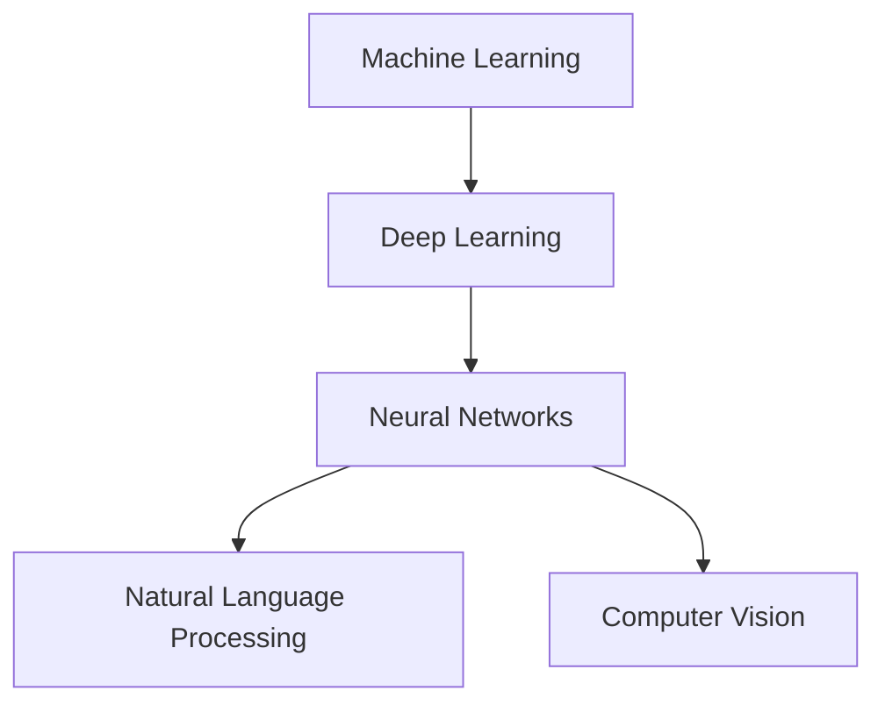

> 人工智能，机器学习，深度学习，神经网络，自然语言处理，计算机视觉，未来趋势

# Andrej Karpathy：人工智能的未来发展方向

人工智能（AI）正以前所未有的速度发展，从自然语言处理到计算机视觉，从自动驾驶到智能医疗，AI技术正在深刻地改变着我们的世界。Andrej Karpathy，作为一位在人工智能领域具有重要影响力的专家，他的观点和见解对于理解AI的未来发展方向至关重要。本文将基于Andrej Karpathy的演讲和论文，探讨人工智能的未来发展趋势与挑战。

## 1. 背景介绍

### 1.1 AI发展的历史与现状

人工智能的概念最早可以追溯到20世纪50年代，但直到近年来，随着计算能力的提升和大数据的出现，AI才真正迎来了爆炸式发展。深度学习作为AI的一个重要分支，在图像识别、语音识别、自然语言处理等领域取得了显著的成果。

### 1.2 Andrej Karpathy的贡献

Andrej Karpathy是Google Brain团队的早期成员，他在深度学习，尤其是自然语言处理领域做出了重要贡献。他的博客和文章，如《The Unreasonable Effectiveness of Neural Networks》等，对于普及深度学习知识产生了深远影响。

## 2. 核心概念与联系

### 2.1 AI的核心概念

- **机器学习（Machine Learning）**：机器学习是AI的一个分支，它使计算机能够从数据中学习，而不是通过编程来指定每一步操作。
- **深度学习（Deep Learning）**：深度学习是机器学习的一个子集，它使用深层神经网络来学习和提取数据中的特征。
- **神经网络（Neural Networks）**：神经网络是一种模仿人脑工作原理的计算模型，由大量的简单单元（神经元）组成。
- **自然语言处理（Natural Language Processing，NLP）**：自然语言处理是AI的一个分支，它使计算机能够理解和处理人类语言。
- **计算机视觉（Computer Vision）**：计算机视觉是AI的一个分支，它使计算机能够从图像和视频中理解和获取信息。

### 2.2 Mermaid流程图



## 3. 核心算法原理 & 具体操作步骤

### 3.1 算法原理概述

深度学习的核心是神经网络，它通过多层非线性变换来提取数据中的特征。训练过程中，模型通过不断调整参数来最小化损失函数，从而学习数据的内在规律。

### 3.2 算法步骤详解

1. **数据收集**：收集大量相关数据，用于训练和测试模型。
2. **数据处理**：对数据进行清洗、预处理，以便模型能够有效地学习。
3. **模型选择**：选择合适的神经网络架构。
4. **模型训练**：通过梯度下降等优化算法训练模型参数。
5. **模型评估**：使用测试数据评估模型的性能。
6. **模型优化**：根据评估结果调整模型结构或参数。

### 3.3 算法优缺点

**优点**：
- 高效的学习能力：深度学习模型能够从大量数据中自动学习复杂的特征。
- 强大的泛化能力：深度学习模型在多个任务上表现出色。
- 自动特征提取：深度学习模型能够自动提取数据中的特征，无需人工设计。

**缺点**：
- 计算成本高：训练深度学习模型需要大量的计算资源。
- 难以解释：深度学习模型的学习过程难以解释，也被称为“黑盒”模型。
- 数据依赖性：深度学习模型的性能很大程度上取决于数据的质量和数量。

### 3.4 算法应用领域

深度学习在多个领域都有广泛的应用，包括：
- 图像识别
- 语音识别
- 自然语言处理
- 自动驾驶
- 智能医疗
- 金融分析

## 4. 数学模型和公式 & 详细讲解 & 举例说明

### 4.1 数学模型构建

深度学习的数学基础主要包括线性代数、概率论和微积分。以下是一些核心的数学模型和公式：

- **神经网络**：神经网络由多个层组成，每层由多个神经元构成。每个神经元接收来自前一层的输入，并输出一个激活值。

$$
y_i = f(W_i \cdot x + b_i)
$$

其中，$W_i$ 是权重，$x$ 是输入，$b_i$ 是偏置，$f$ 是激活函数。

- **损失函数**：损失函数用于衡量模型的预测值和真实值之间的差异。常见的损失函数包括均方误差（MSE）、交叉熵（CE）等。

$$
L = \frac{1}{2} \sum_{i=1}^{N} (y_i - \hat{y}_i)^2
$$

其中，$y_i$ 是真实值，$\hat{y}_i$ 是预测值，$N$ 是样本数量。

### 4.2 公式推导过程

以下以均方误差（MSE）为例，介绍公式推导过程：

1. **计算预测值和真实值之间的差异**：

$$
e_i = y_i - \hat{y}_i
$$

2. **计算差异的平方**：

$$
e_i^2 = (y_i - \hat{y}_i)^2
$$

3. **求和**：

$$
L = \sum_{i=1}^{N} e_i^2
$$

4. **除以样本数量**：

$$
L = \frac{1}{N} \sum_{i=1}^{N} e_i^2
$$

### 4.3 案例分析与讲解

以图像识别任务为例，我们可以使用卷积神经网络（CNN）来识别图像中的物体。以下是一个简单的CNN模型示例：

1. **输入层**：输入图像数据。
2. **卷积层**：提取图像特征。
3. **池化层**：降低特征维度。
4. **全连接层**：分类图像内容。
5. **输出层**：输出预测结果。

通过训练这个模型，我们可以让计算机自动识别图像中的物体。

## 5. 项目实践：代码实例和详细解释说明

### 5.1 开发环境搭建

为了进行深度学习项目实践，我们需要以下开发环境：

- Python编程语言
- TensorFlow或PyTorch深度学习框架
- Jupyter Notebook或Python脚本

### 5.2 源代码详细实现

以下是一个简单的CNN模型示例，使用PyTorch实现：

```python
import torch
import torch.nn as nn

class SimpleCNN(nn.Module):
    def __init__(self):
        super(SimpleCNN, self).__init__()
        self.conv1 = nn.Conv2d(1, 20, 5)
        self.pool = nn.MaxPool2d(2, 2)
        self.conv2 = nn.Conv2d(20, 50, 5)
        self.fc1 = nn.Linear(50 * 4 * 4, 500)
        self.fc2 = nn.Linear(500, 10)

    def forward(self, x):
        x = self.pool(torch.nn.functional.relu(self.conv1(x)))
        x = self.pool(torch.nn.functional.relu(self.conv2(x)))
        x = x.view(-1, 50 * 4 * 4)
        x = torch.nn.functional.relu(self.fc1(x))
        x = self.fc2(x)
        return x

model = SimpleCNN()
```

### 5.3 代码解读与分析

- `SimpleCNN` 类定义了一个简单的CNN模型。
- `__init__` 方法初始化模型的层。
- `forward` 方法定义了数据流过网络的过程。

### 5.4 运行结果展示

运行上述代码，我们可以训练和测试模型，观察模型的性能。

## 6. 实际应用场景

### 6.1 图像识别

深度学习在图像识别领域取得了显著成果，例如，通过训练深度学习模型，我们可以让计算机自动识别图像中的物体、场景等。

### 6.2 自然语言处理

深度学习在自然语言处理领域也取得了重大突破，例如，我们可以使用深度学习模型进行机器翻译、情感分析、问答系统等。

### 6.3 自动驾驶

深度学习在自动驾驶领域发挥着重要作用，例如，通过训练深度学习模型，我们可以让汽车自动识别道路、行人、车辆等。

## 7. 工具和资源推荐

### 7.1 学习资源推荐

- 《深度学习》（Goodfellow, Bengio, Courville）
- 《神经网络与深度学习》（邱锡鹏）
- Hugging Face：https://huggingface.co/
- TensorFlow：https://www.tensorflow.org/
- PyTorch：https://pytorch.org/

### 7.2 开发工具推荐

- Jupyter Notebook：https://jupyter.org/
- PyCharm：https://www.jetbrains.com/pycharm/
- Google Colab：https://colab.research.google.com/

### 7.3 相关论文推荐

- "ImageNet Classification with Deep Convolutional Neural Networks" (Alex Krizhevsky, Ilya Sutskever, Geoffrey Hinton)
- "A Neural Conversation Model" (Noam Shazeer, Ashish Vaswani, Quoc V. Le, Jeff Dean)
- "BERT: Pre-training of Deep Bidirectional Transformers for Language Understanding" (Jacob Devlin, Ming-Wei Chang, Kenton Lee, Kristina Toutanova)

## 8. 总结：未来发展趋势与挑战

### 8.1 研究成果总结

深度学习作为AI的一个重要分支，在多个领域都取得了显著成果。然而，深度学习仍然面临着许多挑战，例如模型的可解释性、计算效率、数据隐私等。

### 8.2 未来发展趋势

未来，深度学习将朝着以下方向发展：

- 模型轻量化：开发更加轻量级的模型，降低计算成本。
- 可解释性：提高模型的可解释性，增强用户信任。
- 跨模态学习：融合不同模态的数据，提高模型的泛化能力。
- 安全性：提高模型的安全性，防止恶意攻击。

### 8.3 面临的挑战

深度学习面临的挑战包括：

- 计算资源：深度学习需要大量的计算资源，这限制了其应用范围。
- 数据隐私：深度学习模型需要大量的数据，这引发了数据隐私问题。
- 模型可解释性：深度学习模型的学习过程难以解释，这限制了其在某些领域的应用。

### 8.4 研究展望

未来，深度学习将在以下方面取得更多突破：

- 新的模型架构：开发更加高效、鲁棒的模型架构。
- 新的训练方法：开发更加高效、鲁棒的训练方法。
- 新的应用领域：将深度学习应用于新的领域，如医疗、教育、金融等。

## 9. 附录：常见问题与解答

**Q1：什么是深度学习？**

A1：深度学习是机器学习的一个分支，它使用多层神经网络来学习和提取数据中的特征。

**Q2：深度学习有哪些应用？**

A2：深度学习在图像识别、语音识别、自然语言处理、自动驾驶、智能医疗等多个领域都有广泛的应用。

**Q3：深度学习有哪些挑战？**

A3：深度学习面临的挑战包括计算资源、数据隐私、模型可解释性等。

**Q4：深度学习的未来发展趋势是什么？**

A4：深度学习的未来发展趋势包括模型轻量化、可解释性、跨模态学习、安全性等。

作者：禅与计算机程序设计艺术 / Zen and the Art of Computer Programming