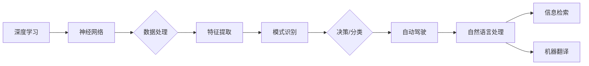

# Andrej Karpathy：人工智能的未来发展机遇

> 关键词：人工智能，深度学习，自动驾驶，自然语言处理，机器学习，神经网络，未来趋势，Andrej Karpathy

## 1. 背景介绍

安德烈·卡尔帕希（Andrej Karpathy）是一位杰出的计算机科学家和工程师，以其在自然语言处理（NLP）和深度学习领域的贡献而闻名。他在Google DeepMind工作，并在那里参与了诸如GPT和LaMDA等开创性项目。本文将探讨Andrej Karpathy的观点和预测，以及他对人工智能（AI）未来发展的看法。

### 1.1 Andrej Karpathy的贡献

Karpathy的工作涵盖了从神经网络架构到机器学习实践等多个方面。他的博客文章和代码示例在AI社区中广受欢迎，为许多深度学习实践者提供了宝贵的见解。

### 1.2 人工智能的现状

尽管人工智能在过去几十年取得了巨大进步，但仍然面临着许多挑战。从技术到伦理，人工智能的发展需要跨学科的合作和创新。

## 2. 核心概念与联系

为了理解Andrej Karpathy对人工智能未来的看法，我们需要探讨几个核心概念：

- **深度学习**：一种机器学习方法，它通过模拟人脑中的神经网络来学习数据中的复杂模式。
- **神经网络**：由相互连接的节点（或“神经元”）组成的计算模型，能够学习从数据中提取特征。
- **自然语言处理（NLP）**：使计算机能够理解和生成人类语言的技术。
- **自动驾驶**：使用人工智能技术使汽车能够在没有人类司机的情况下行驶。

以下是这些概念之间的Mermaid流程图：



## 3. 核心算法原理 & 具体操作步骤

### 3.1 算法原理概述

深度学习算法，如卷积神经网络（CNN）和循环神经网络（RNN），是Karpathy研究的主要对象。这些算法通过多层神经网络来学习数据中的复杂模式。

### 3.2 算法步骤详解

深度学习算法的基本步骤包括：

1. **数据预处理**：清洗和格式化数据，使其适合输入神经网络。
2. **模型设计**：选择合适的神经网络架构，如CNN或RNN。
3. **训练**：使用大量数据进行训练，调整网络权重以最小化预测误差。
4. **评估**：使用验证集评估模型性能，调整超参数以优化性能。

### 3.3 算法优缺点

深度学习算法的优点包括：

- **强大的特征提取能力**：能够从复杂数据中提取特征。
- **自动学习**：无需手动设计特征。

缺点包括：

- **计算成本高**：需要大量的计算资源进行训练。
- **数据依赖性**：性能很大程度上取决于数据的质量和数量。

### 3.4 算法应用领域

深度学习算法广泛应用于以下领域：

- **图像识别**：如面部识别和物体检测。
- **语音识别**：如语音助手和语音翻译。
- **自然语言处理**：如机器翻译和文本摘要。

## 4. 数学模型和公式 & 详细讲解 & 举例说明

### 4.1 数学模型构建

深度学习中的数学模型通常涉及以下概念：

- **激活函数**：如ReLU和Sigmoid，用于引入非线性。
- **损失函数**：如均方误差（MSE）和交叉熵，用于评估模型性能。
- **优化算法**：如梯度下降和Adam，用于更新模型参数。

### 4.2 公式推导过程

以下是一个简单的神经网络模型公式推导示例：

$$
\hat{y} = f(W \cdot z + b)
$$

其中：

- $\hat{y}$ 是预测值。
- $W$ 是权重矩阵。
- $z$ 是输入向量。
- $b$ 是偏置向量。
- $f$ 是激活函数。

### 4.3 案例分析与讲解

以图像分类任务为例，我们可以使用卷积神经网络（CNN）来识别图像中的对象。CNN通过卷积层、池化层和全连接层来提取图像特征并进行分类。

## 5. 项目实践：代码实例和详细解释说明

### 5.1 开发环境搭建

要开始深度学习项目，你需要安装以下软件：

- Python
- NumPy
- TensorFlow或PyTorch
- Matplotlib

### 5.2 源代码详细实现

以下是一个使用PyTorch实现的简单神经网络示例：

```python
import torch
import torch.nn as nn
import torch.optim as optim

# 定义模型
class SimpleNN(nn.Module):
    def __init__(self):
        super(SimpleNN, self).__init__()
        self.fc1 = nn.Linear(784, 500)
        self.relu = nn.ReLU()
        self.fc2 = nn.Linear(500, 10)

    def forward(self, x):
        x = self.fc1(x)
        x = self.relu(x)
        x = self.fc2(x)
        return x

# 初始化模型、损失函数和优化器
model = SimpleNN()
criterion = nn.CrossEntropyLoss()
optimizer = optim.SGD(model.parameters(), lr=0.01)

# 模拟训练过程
for epoch in range(2):  # 训练2个epoch
    optimizer.zero_grad()  # 清除梯度
    output = model(x_train)  # 前向传播
    loss = criterion(output, y_train)  # 计算损失
    loss.backward()  # 反向传播
    optimizer.step()  # 更新参数

    if (epoch+1) % 100 == 0:
        print(f'Epoch {epoch+1}, Loss: {loss.item()}')
```

### 5.3 代码解读与分析

这段代码定义了一个简单的神经网络，包含两个全连接层和ReLU激活函数。使用SGD优化器和交叉熵损失函数进行训练。每个epoch后打印出损失值，以便跟踪训练过程。

### 5.4 运行结果展示

在运行上述代码后，你将看到每个epoch的损失值逐渐降低，这表明模型正在学习数据中的模式。

## 6. 实际应用场景

Andrej Karpathy的研究和见解在多个领域都有实际应用，以下是一些例子：

- **自动驾驶**：深度学习在自动驾驶领域中扮演着关键角色，用于处理图像识别、路径规划和决策制定。
- **自然语言处理**：深度学习在NLP中的应用包括机器翻译、情感分析和文本生成。
- **医疗诊断**：深度学习可以帮助医生进行疾病诊断，提高诊断的准确性和效率。

## 6.4 未来应用展望

Andrej Karpathy对人工智能未来的展望包括：

- **更加智能的交互**：通过深度学习，机器将能够更好地理解人类语言和行为，提供更加智能的交互体验。
- **自动化和优化**：深度学习将使自动化和优化变得更加普遍，从而提高生产效率和降低成本。
- **个性化服务**：深度学习将使个性化服务变得更加普及，满足用户个性化需求。

## 7. 工具和资源推荐

### 7.1 学习资源推荐

- 《深度学习》（Ian Goodfellow、Yoshua Bengio和Aaron Courville著）
- 《Python机器学习》（Sebastian Raschka和Vahid Mirjalili著）
- 《神经网络与深度学习》（邱锡鹏著）

### 7.2 开发工具推荐

- TensorFlow
- PyTorch
- Keras

### 7.3 相关论文推荐

- "ImageNet Classification with Deep Convolutional Neural Networks"（Alex Krizhevsky、Ilya Sutskever和Geoffrey Hinton著）
- "Sequence to Sequence Learning with Neural Networks"（Ilya Sutskever、 Oriol Vinyals和Quoc V. Le著）
- "BERT: Pre-training of Deep Bidirectional Transformers for Language Understanding"（Jacob Devlin、Meredith Chang、Kaiming He和Chris D. Manning著）

## 8. 总结：未来发展趋势与挑战

### 8.1 研究成果总结

Andrej Karpathy的研究为深度学习和人工智能领域做出了重要贡献。他的工作推动了NLP和自动驾驶等领域的发展，并为AI技术的未来发展提供了宝贵的见解。

### 8.2 未来发展趋势

未来，人工智能将朝着更加智能、通用和可解释的方向发展。深度学习将继续在各个领域发挥关键作用，推动AI技术的进步。

### 8.3 面临的挑战

尽管人工智能有着巨大的潜力，但仍然面临着许多挑战，包括数据隐私、算法偏见、可解释性和安全性等。

### 8.4 研究展望

为了克服这些挑战，需要跨学科的合作和创新。通过结合计算机科学、心理学、社会学和伦理学等领域的知识，我们可以构建更加智能、安全和可信赖的人工智能系统。

## 9. 附录：常见问题与解答

**Q1：深度学习与机器学习的区别是什么？**

A：深度学习是机器学习的一个子集，它使用神经网络来学习数据中的复杂模式。机器学习是一个更广泛的概念，包括深度学习、支持向量机、决策树等多种算法。

**Q2：什么是神经网络的激活函数？**

A：激活函数是神经网络中的一个非线性变换，它用于引入非线性，使模型能够学习更复杂的模式。

**Q3：为什么深度学习在自然语言处理中如此重要？**

A：深度学习能够从大量文本数据中学习到丰富的语言知识，从而在自然语言处理任务中取得优异的性能。

**Q4：深度学习在自动驾驶中是如何应用的？**

A：深度学习在自动驾驶中用于处理图像和传感器数据，以识别道路标志、车辆和行人，并做出相应的决策。

**Q5：如何确保人工智能系统的可解释性？**

A：确保人工智能系统的可解释性需要开发新的方法和技术，如注意力机制、可解释人工智能（XAI）等。通过这些方法，我们可以更好地理解模型的决策过程，并提高系统的透明度和可信度。

---

作者：禅与计算机程序设计艺术 / Zen and the Art of Computer Programming