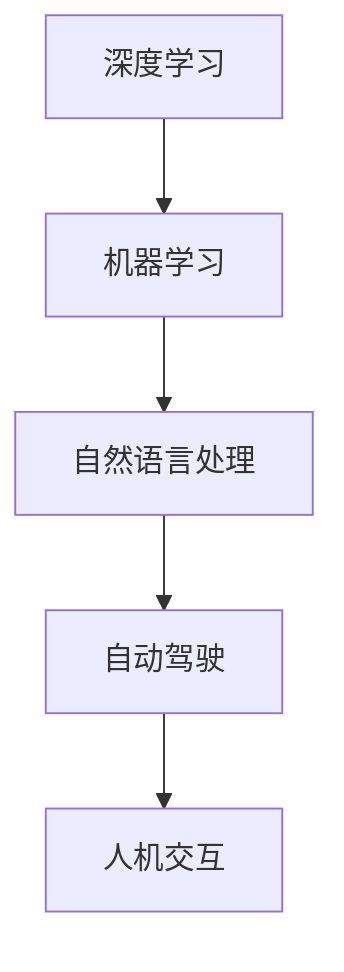

# Andrej Karpathy：人工智能的未来发展策略

> 关键词：安德烈·卡帕西，人工智能，深度学习，神经网络，机器学习，自然语言处理，自动驾驶，未来展望

---

## 1. 背景介绍

在当今世界，人工智能（AI）正以前所未有的速度发展，改变着我们的工作、生活和思维方式。安德烈·卡帕西（Andrej Karpathy），一位著名的AI研究者和工程师，以其在深度学习、神经网络和自然语言处理（NLP）领域的开创性工作而闻名。在这篇文章中，我们将探讨卡帕西的观点，分析人工智能的未来发展策略。

## 2. 核心概念与联系

### 2.1 核心概念

#### 2.1.1 深度学习
深度学习是一种机器学习技术，它通过模拟人脑神经网络的结构和功能，使计算机能够学习和处理复杂的模式。

#### 2.1.2 机器学习
机器学习是AI的一个分支，它使计算机系统能够从数据中学习并做出决策或预测，而无需进行明确的编程。

#### 2.1.3 自然语言处理
自然语言处理是AI的一个领域，它使计算机能够理解、解释和生成人类语言。

#### 2.1.4 自动驾驶
自动驾驶技术利用AI来控制车辆，使其能够在没有人类司机的情况下行驶。

### 2.2 Mermaid 流程图



### 2.3 核心概念联系

深度学习是机器学习的一种实现方式，而自然语言处理和自动驾驶则是机器学习的具体应用。这些概念相互联系，共同推动着人工智能的发展。

## 3. 核心算法原理 & 具体操作步骤

### 3.1 算法原理概述

卡帕西的工作主要集中在深度学习和自然语言处理领域。他的核心算法原理涉及神经网络架构的改进和优化，以及如何使这些网络更好地理解和处理自然语言。

### 3.2 算法步骤详解

#### 3.2.1 神经网络架构

卡帕西在神经网络架构方面的贡献包括RNN（循环神经网络）的改进，如LSTM（长短期记忆网络）和GRU（门控循环单元）。

#### 3.2.2 自然语言处理

在NLP领域，卡帕西的工作主要集中在如何使神经网络更好地处理和理解自然语言，包括词汇嵌入、序列建模和语言生成。

### 3.3 算法优缺点

#### 3.3.1 优点

- 提高了神经网络处理自然语言的能力。
- 促进了自动驾驶和机器翻译等领域的发展。

#### 3.3.2 缺点

- 计算资源需求高。
- 对数据质量要求严格。

### 3.4 算法应用领域

- 自然语言处理
- 自动驾驶
- 机器翻译
- 图像识别

## 4. 数学模型和公式 & 详细讲解 & 举例说明

### 4.1 数学模型构建

卡帕西在神经网络和NLP方面的数学模型主要包括：

- 激活函数
- 梯度下降算法
- 词汇嵌入

### 4.2 公式推导过程

以下是梯度下降算法的简要推导：

$$
\theta_{\text{new}} = \theta_{\text{current}} - \alpha \cdot \nabla_{\theta} J(\theta)
$$

其中，$\theta$ 是模型参数，$J(\theta)$ 是损失函数，$\alpha$ 是学习率。

### 4.3 案例分析与讲解

以机器翻译为例，卡帕西的团队使用神经网络和深度学习技术，将一种语言翻译成另一种语言。他们使用大量的双语文本进行训练，使模型学习语言之间的对应关系。

## 5. 项目实践：代码实例和详细解释说明

### 5.1 开发环境搭建

卡帕西的项目通常使用Python编程语言和TensorFlow或PyTorch框架进行开发。

### 5.2 源代码详细实现

以下是使用PyTorch构建神经网络的基本代码示例：

```python
import torch
import torch.nn as nn
import torch.optim as optim

class NeuralNetwork(nn.Module):
    def __init__(self):
        super(NeuralNetwork, self).__init__()
        self.fc1 = nn.Linear(784, 128)
        self.relu = nn.ReLU()
        self.fc2 = nn.Linear(128, 10)

    def forward(self, x):
        x = self.fc1(x)
        x = self.relu(x)
        x = self.fc2(x)
        return x

model = NeuralNetwork()
criterion = nn.CrossEntropyLoss()
optimizer = optim.SGD(model.parameters(), lr=0.01)

# 训练模型
for epoch in range(10):
    optimizer.zero_grad()
    outputs = model(x_train)
    loss = criterion(outputs, y_train)
    loss.backward()
    optimizer.step()
```

### 5.3 代码解读与分析

这段代码定义了一个简单的神经网络，包括两个全连接层和ReLU激活函数。然后，使用交叉熵损失函数和SGD优化器进行模型训练。

### 5.4 运行结果展示

运行上述代码后，模型将在训练数据上进行训练，并在验证集上进行评估。最终，模型将输出训练损失和验证准确率。

## 6. 实际应用场景

卡帕西的工作在多个领域有着广泛的应用，以下是一些具体的例子：

- **自然语言处理**：使用神经网络进行机器翻译、文本摘要和情感分析。
- **自动驾驶**：使用神经网络进行图像识别和场景理解，辅助自动驾驶车辆的决策。
- **医疗诊断**：使用神经网络分析医学影像，辅助医生进行疾病诊断。

## 7. 工具和资源推荐

### 7.1 学习资源推荐

- 《深度学习》（Ian Goodfellow、Yoshua Bengio和Aaron Courville著）
- 《Python机器学习》（Sebastian Raschka和Vahid Mirjalili著）
- 《自然语言处理实战》（Sahil Chopra、Vikas Rawat和Mohit Gupta著）

### 7.2 开发工具推荐

- TensorFlow
- PyTorch
- Keras

### 7.3 相关论文推荐

- "A Neural Algorithm of Artistic Style"（GANs）
- "ImageNet Classification with Deep Convolutional Neural Networks"（AlexNet）
- "A Few Useful Things to Know about Machine Learning"（Karpathy等）

## 8. 总结：未来发展趋势与挑战

### 8.1 研究成果总结

安德烈·卡帕西在深度学习、神经网络和自然语言处理领域做出了杰出的贡献，推动了人工智能技术的发展。

### 8.2 未来发展趋势

- 神经网络架构的进一步优化和改进。
- 自然语言处理的突破，如多语言理解、跨语言翻译和情感分析。
- 自动驾驶技术的成熟和应用。

### 8.3 面临的挑战

- 数据隐私和安全问题。
- 模型可解释性和透明度。
- AI伦理和道德问题。

### 8.4 研究展望

人工智能的未来发展充满挑战和机遇。通过不断的研究和创新，我们有理由相信，人工智能将为人类社会带来更多的福祉。

---

作者：禅与计算机程序设计艺术 / Zen and the Art of Computer Programming