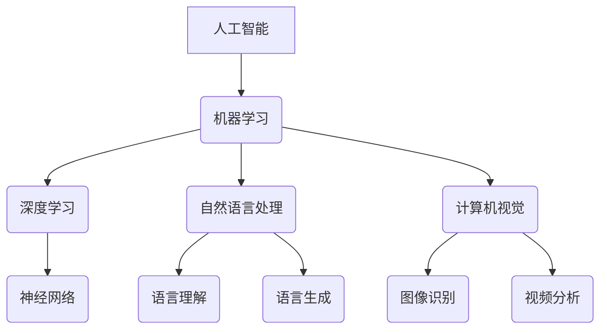

> 人工智能，深度学习，机器学习，未来趋势，挑战，策略，Andrej Karpathy，神经网络，自然语言处理，计算机视觉

# Andrej Karpathy：人工智能的未来发展策略

> 关键词：人工智能，深度学习，机器学习，未来趋势，挑战，策略，Andrej Karpathy，神经网络，自然语言处理，计算机视觉

## 1. 背景介绍

在当今的世界中，人工智能（AI）已经从科幻小说的页面步入了现实生活，深刻地改变着我们的工作和生活方式。Andrej Karpathy，一位在人工智能领域有着深刻见解和丰富经验的专家，他的工作不仅在技术层面推动了AI的发展，也在战略层面为AI的未来指明了方向。本文将基于Andrej Karpathy的研究和观点，探讨人工智能的未来发展策略。

## 2. 核心概念与联系

### 2.1 人工智能的核心概念

人工智能，顾名思义，是使机器能够模拟人类智能行为的技术。它涉及多个领域，包括机器学习、深度学习、自然语言处理、计算机视觉等。以下是人工智能的一些核心概念：

- **机器学习（Machine Learning）**：机器学习是AI的一个子领域，它使计算机能够通过数据学习并做出决策或预测。
- **深度学习（Deep Learning）**：深度学习是机器学习的一个分支，它使用类似于人脑的神经网络结构来学习复杂的模式。
- **自然语言处理（Natural Language Processing, NLP）**：NLP是AI的一个分支，专注于使计算机能够理解和生成人类语言。
- **计算机视觉（Computer Vision）**：计算机视觉是AI的一个分支，使计算机能够理解和解析视觉信息。

以下是基于这些核心概念的Mermaid流程图：



### 2.2 关联性

这些核心概念相互关联，共同构成了人工智能的生态系统。例如，深度学习为机器学习提供了强大的工具，而自然语言处理和计算机视觉则是深度学习的典型应用领域。

## 3. 核心算法原理 & 具体操作步骤

### 3.1 算法原理概述

人工智能的核心是算法。以下是几个关键算法的概述：

- **神经网络（Neural Networks）**：神经网络模仿人脑的工作方式，通过调整连接权重来学习和识别复杂模式。
- **卷积神经网络（Convolutional Neural Networks, CNNs）**：CNNs是用于计算机视觉任务的神经网络，特别擅长处理图像和视频数据。
- **循环神经网络（Recurrent Neural Networks, RNNs）**：RNNs是用于处理序列数据的神经网络，如时间序列数据或文本。

### 3.2 算法步骤详解

以下是使用神经网络进行图像识别的基本步骤：

1. **数据收集**：收集大量的图像数据，并进行预处理，如归一化、裁剪等。
2. **模型设计**：设计神经网络结构，包括输入层、隐藏层和输出层。
3. **训练模型**：使用训练数据对模型进行训练，调整连接权重。
4. **验证模型**：使用验证数据集评估模型性能，调整模型参数。
5. **测试模型**：使用测试数据集测试模型性能。

### 3.3 算法优缺点

- **优点**：神经网络能够处理复杂的数据，并自动学习特征。
- **缺点**：神经网络需要大量的数据和时间来训练，且模型的解释性较差。

### 3.4 算法应用领域

神经网络在多个领域都有广泛应用，包括：

- **图像识别**：识别照片、视频中的对象和场景。
- **语音识别**：将语音转换为文本。
- **自然语言处理**：理解、生成和翻译语言。

## 4. 数学模型和公式 & 详细讲解 & 举例说明

### 4.1 数学模型构建

神经网络中的数学模型主要包括：

- **激活函数（Activation Functions）**：如Sigmoid、ReLU等，用于引入非线性。
- **损失函数（Loss Functions）**：如交叉熵、均方误差等，用于衡量预测结果与真实值之间的差异。
- **反向传播算法（Backpropagation Algorithm）**：用于计算梯度并更新模型参数。

### 4.2 公式推导过程

以下是一个简单的反向传播算法的公式推导过程：

- **损失函数**：假设损失函数为 $L = (y - \hat{y})^2$，其中 $y$ 是真实值，$\hat{y}$ 是预测值。
- **梯度**：损失函数对预测值的梯度为 $\frac{\partial L}{\partial \hat{y}} = 2(y - \hat{y})$。
- **反向传播**：通过链式法则，可以计算出损失函数对输入的梯度。

### 4.3 案例分析与讲解

以下是一个简单的神经网络图像识别案例：

- **数据集**：MNIST手写数字数据集。
- **模型**：一个简单的卷积神经网络。
- **训练**：使用训练数据训练模型。
- **测试**：使用测试数据测试模型性能。

## 5. 项目实践：代码实例和详细解释说明

### 5.1 开发环境搭建

为了进行AI项目实践，需要以下开发环境：

- **编程语言**：Python
- **框架**：TensorFlow或PyTorch
- **库**：NumPy、Pandas、Scikit-learn等

### 5.2 源代码详细实现

以下是一个简单的图像识别项目的代码实现：

```python
import tensorflow as tf
from tensorflow.keras import layers

# 构建模型
model = tf.keras.Sequential([
    layers.Conv2D(32, (3, 3), activation='relu', input_shape=(28, 28, 1)),
    layers.MaxPooling2D((2, 2)),
    layers.Flatten(),
    layers.Dense(10, activation='softmax')
])

# 编译模型
model.compile(optimizer='adam',
              loss='sparse_categorical_crossentropy',
              metrics=['accuracy'])

# 训练模型
model.fit(x_train, y_train, epochs=5)

# 测试模型
model.evaluate(x_test,  y_test)
```

### 5.3 代码解读与分析

上述代码使用TensorFlow构建了一个简单的卷积神经网络，用于识别MNIST手写数字数据集中的数字。

### 5.4 运行结果展示

运行上述代码后，模型会在训练集和测试集上评估其性能。

## 6. 实际应用场景

人工智能在多个领域都有实际应用，以下是一些典型的应用场景：

- **医疗**：用于疾病诊断、药物研发等。
- **金融**：用于信用评分、欺诈检测等。
- **交通**：用于自动驾驶、交通流量预测等。
- **教育**：用于个性化学习、智能辅导等。

## 7. 工具和资源推荐

### 7.1 学习资源推荐

- **书籍**：《深度学习》（Goodfellow et al.）
- **在线课程**：Coursera上的《机器学习》课程
- **网站**：TensorFlow官网、PyTorch官网

### 7.2 开发工具推荐

- **框架**：TensorFlow、PyTorch
- **库**：NumPy、Pandas、Scikit-learn

### 7.3 相关论文推荐

- **《Deep Learning》（Goodfellow et al.）**：深度学习的经典教材
- **《ImageNet Classification with Deep Convolutional Neural Networks》（Krizhevsky et al.）**：AlexNet论文
- **《Sequence to Sequence Learning with Neural Networks》（Sutskever et al.）**： seq2seq论文

## 8. 总结：未来发展趋势与挑战

### 8.1 研究成果总结

人工智能在过去几十年中取得了显著的进展，特别是在深度学习领域。然而，AI仍然面临着许多挑战，需要进一步的研究和开发。

### 8.2 未来发展趋势

- **更强大的模型**：未来的AI模型将更加复杂和强大，能够处理更加复杂的问题。
- **更加高效的方法**：开发更加高效的学习和推理方法，减少计算资源的需求。
- **更加通用的AI**：开发能够应用于不同领域的通用AI。

### 8.3 面临的挑战

- **数据质量**：高质量的数据是AI训练的关键，但获取高质量的数据仍然是一个挑战。
- **算法可解释性**：目前的AI模型往往缺乏可解释性，需要开发更加可解释的算法。
- **伦理和安全**：AI的应用需要考虑到伦理和安全问题。

### 8.4 研究展望

人工智能的未来充满了机遇和挑战。我们需要继续推动AI技术的发展，同时也要关注其伦理和安全问题，以确保AI技术能够造福人类。

## 9. 附录：常见问题与解答

**Q1：什么是人工智能？**

A1：人工智能是使机器能够模拟人类智能行为的技术。

**Q2：深度学习与机器学习有什么区别？**

A2：深度学习是机器学习的一个分支，它使用类似于人脑的神经网络结构来学习复杂的模式。

**Q3：人工智能有哪些应用？**

A3：人工智能在医疗、金融、交通、教育等多个领域都有广泛应用。

**Q4：人工智能的未来发展趋势是什么？**

A4：未来的AI模型将更加复杂和强大，能够处理更加复杂的问题。

**Q5：人工智能有哪些挑战？**

A5：人工智能面临的挑战包括数据质量、算法可解释性和伦理安全等问题。

作者：禅与计算机程序设计艺术 / Zen and the Art of Computer Programming