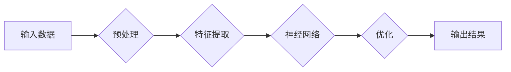

# Andrej Karpathy：人工智能的未来发展规划

> 关键词：Andrej Karpathy，人工智能，未来发展趋势，技术挑战，机器学习，深度学习，神经网络，自然语言处理，计算机视觉

## 1. 背景介绍

在当今时代，人工智能（AI）正迅速发展，成为推动科技进步和社会变革的关键力量。Andrej Karpathy，作为一位杰出的AI研究员和工程师，以其在深度学习、自然语言处理（NLP）和计算机视觉领域的贡献而闻名。本文将探讨Andrej Karpathy对未来人工智能发展规划的见解，分析其核心概念、算法原理、实际应用以及面临的挑战。

## 2. 核心概念与联系

### 2.1 核心概念

#### 深度学习
深度学习是机器学习的一个子领域，它使用多层神经网络来学习数据的复杂模式。这些网络由大量的节点或“神经元”组成，它们通过调整连接权重来优化数据表示。

#### 自然语言处理（NLP）
NLP是AI的一个分支，致力于使计算机能够理解、解释和生成人类语言。NLP在机器翻译、情感分析、问答系统等领域有着广泛的应用。

#### 计算机视觉
计算机视觉是AI的一个分支，旨在使计算机能够“看”和“理解”图像和视频。它在自动驾驶、图像识别、视频监控等领域发挥着重要作用。

### 2.2 Mermaid 流程图



在这个流程图中，数据首先经过预处理，然后特征提取，接着通过神经网络进行处理，并通过优化算法调整模型参数，最终得到输出结果。

## 3. 核心算法原理 & 具体操作步骤

### 3.1 算法原理概述

AI系统的核心是算法，它们决定了模型如何学习、如何处理数据以及如何生成结果。Andrej Karpathy在深度学习和NLP领域的工作主要集中在以下算法：

#### 深度学习
- 神经网络架构设计，如卷积神经网络（CNN）和循环神经网络（RNN）。
- 损失函数选择，如交叉熵损失和均方误差。
- 优化算法，如梯度下降和Adam。

#### 自然语言处理
- 词嵌入技术，如Word2Vec和BERT。
- 上下文理解，如注意力机制和Transformer模型。

### 3.2 算法步骤详解

#### 深度学习步骤
1. 数据收集和预处理：从各种来源收集数据，并进行清洗、转换和标准化。
2. 特征提取：使用预处理后的数据训练特征提取器，如CNN或RNN。
3. 构建神经网络：设计网络架构，包括输入层、隐藏层和输出层。
4. 训练模型：使用训练数据训练模型，并调整网络参数以最小化损失函数。
5. 测试和评估：使用测试数据评估模型性能，并进行调整和优化。

#### 自然语言处理步骤
1. 词嵌入：将文本数据转换为词向量表示。
2. 构建模型：使用词向量构建神经网络模型，如BERT。
3. 训练模型：使用标注数据训练模型，并调整参数。
4. 推理：使用训练好的模型对新的文本数据进行处理和生成。

### 3.3 算法优缺点

#### 深度学习优点
- 能够学习复杂的数据模式。
- 在图像识别、语音识别等领域取得了显著成果。
- 能够自动学习特征，减少人工设计特征的需求。

#### 深度学习缺点
- 需要大量数据和计算资源。
- 模型的可解释性较差。
- 容易受到过拟合的影响。

#### 自然语言处理优点
- 能够理解和生成人类语言。
- 在问答系统、机器翻译等领域取得了显著成果。
- 能够处理大量的自然语言数据。

#### 自然语言处理缺点
- 对数据质量要求较高。
- 模型的训练和推理速度较慢。
- 模型的可解释性较差。

### 3.4 算法应用领域

深度学习和自然语言处理在以下领域有着广泛的应用：

- 图像和视频分析
- 语音识别和生成
- 自然语言处理
- 推荐系统
- 游戏
- 医疗诊断
- 自动驾驶

## 4. 数学模型和公式 & 详细讲解 & 举例说明

### 4.1 数学模型构建

在深度学习中，常见的数学模型包括：

- 激活函数：如ReLU、Sigmoid和Tanh。
- 损失函数：如交叉熵和均方误差。
- 优化算法：如梯度下降和Adam。

以下是一个简单的神经网络数学模型：

$$
y = f(W \cdot x + b)
$$

其中，$y$ 是输出，$W$ 是权重矩阵，$x$ 是输入，$b$ 是偏置项，$f$ 是激活函数。

### 4.2 公式推导过程

以下是一个简单的梯度下降公式推导过程：

$$
\theta_{t+1} = \theta_t - \alpha \nabla_{\theta} J(\theta_t)
$$

其中，$\theta_t$ 是第 $t$ 次迭代的参数，$\alpha$ 是学习率，$J(\theta_t)$ 是损失函数。

### 4.3 案例分析与讲解

以下是一个简单的图像分类任务案例：

- 输入：一幅彩色图像
- 输出：图像的类别标签（如猫、狗、汽车等）
- 模型：卷积神经网络（CNN）

在这个案例中，CNN通过学习图像的特征，将输入图像分类到相应的类别。

## 5. 项目实践：代码实例和详细解释说明

### 5.1 开发环境搭建

为了进行AI项目实践，需要以下开发环境：

- 操作系统：Linux或MacOS
- 编程语言：Python
- 深度学习框架：TensorFlow或PyTorch
- 代码编辑器：Jupyter Notebook或Visual Studio Code

### 5.2 源代码详细实现

以下是一个简单的CNN图像分类器的PyTorch代码实例：

```python
import torch
import torch.nn as nn
import torchvision.transforms as transforms
import torchvision.datasets as datasets
import torch.optim as optim

# 定义CNN模型
class CNN(nn.Module):
    def __init__(self):
        super(CNN, self).__init__()
        self.conv1 = nn.Conv2d(3, 32, kernel_size=3, stride=1, padding=1)
        self.pool = nn.MaxPool2d(kernel_size=2, stride=2)
        self.fc1 = nn.Linear(32 * 32 * 32, 128)
        self.fc2 = nn.Linear(128, 10)

    def forward(self, x):
        x = self.pool(torch.relu(self.conv1(x)))
        x = x.view(-1, 32 * 32 * 32)
        x = torch.relu(self.fc1(x))
        x = self.fc2(x)
        return x

# 加载数据
transform = transforms.Compose([
    transforms.Resize((32, 32)),
    transforms.ToTensor(),
])

train_dataset = datasets.CIFAR10(root='./data', train=True, download=True, transform=transform)
train_loader = torch.utils.data.DataLoader(train_dataset, batch_size=4, shuffle=True)

# 初始化模型和优化器
model = CNN()
criterion = nn.CrossEntropyLoss()
optimizer = optim.SGD(model.parameters(), lr=0.001, momentum=0.9)

# 训练模型
for epoch in range(2):  # loop over the dataset multiple times

    running_loss = 0.0
    for i, data in enumerate(train_loader, 0):
        inputs, labels = data

        # zero the parameter gradients
        optimizer.zero_grad()

        # forward + backward + optimize
        outputs = model(inputs)
        loss = criterion(outputs, labels)
        loss.backward()
        optimizer.step()

        # print statistics
        running_loss += loss.item()
        if i % 2000 == 1999:    # print every 2000 mini-batches
            print(f'[{epoch + 1}, {i + 1:5d}] loss: {running_loss / 2000:.3f}')
            running_loss = 0.0

print('Finished Training')

# 保存模型
torch.save(model.state_dict(), 'cnn.pth')

# 加载模型
model.load_state_dict(torch.load('cnn.pth'))
```

### 5.3 代码解读与分析

以上代码定义了一个简单的CNN模型，用于CIFAR-10数据集上的图像分类任务。代码的主要步骤如下：

1. 导入必要的库和模块。
2. 定义CNN模型类。
3. 加载数据集，并创建数据加载器。
4. 初始化模型、损失函数和优化器。
5. 训练模型，包括前向传播、反向传播和优化参数。
6. 保存训练好的模型。

### 5.4 运行结果展示

运行上述代码后，模型将在CIFAR-10数据集上训练，并在每个epoch结束时打印平均损失。训练完成后，模型将被保存到`cnn.pth`文件中。

## 6. 实际应用场景

AI技术在各个领域都有广泛的应用，以下是一些典型的应用场景：

### 6.1 医疗诊断

AI可以帮助医生分析医学图像，如X光片、CT扫描和MRI图像，以更准确地诊断疾病。此外，AI还可以用于药物发现和个性化医疗。

### 6.2 自动驾驶

自动驾驶汽车使用AI来感知周围环境、做出决策和执行操作。这包括识别道路标志、检测行人和车辆以及控制车辆行驶。

### 6.3 金融分析

AI可以用于股票市场分析、欺诈检测和风险评估。此外，AI还可以用于个性化金融推荐和客户服务。

### 6.4 自然语言处理

AI在自然语言处理领域的应用包括机器翻译、语音识别、情感分析和问答系统。

## 7. 工具和资源推荐

### 7.1 学习资源推荐

- 《深度学习》（Ian Goodfellow，Yoshua Bengio和Aaron Courville著）
- 《Python深度学习》（François Chollet著）
- 《深度学习实践指南》（Aurélien Géron著）

### 7.2 开发工具推荐

- TensorFlow
- PyTorch
- Keras

### 7.3 相关论文推荐

- "A Neural Algorithm of Artistic Style"（Gatys, Ecker, and Bethge）
- "Attention Is All You Need"（Vaswani et al.）
- "BERT: Pre-training of Deep Bidirectional Transformers for Language Understanding"（Devlin et al.）

## 8. 总结：未来发展趋势与挑战

### 8.1 研究成果总结

近年来，AI领域取得了显著的进展，包括深度学习、自然语言处理和计算机视觉等方面。这些进展使得AI在各个领域都有广泛的应用，并推动了社会和经济的变革。

### 8.2 未来发展趋势

未来，AI技术将朝着以下方向发展：

- 更强大的模型和算法：随着计算能力的提升，将出现更强大的模型和算法，能够处理更复杂的数据和分析更复杂的任务。
- 多模态学习：AI将能够整合来自不同模态的数据，如文本、图像和声音，以提供更全面的理解和更准确的预测。
- 解释性和可解释性：AI模型将更加透明和可解释，以便人类用户能够理解它们的决策过程。

### 8.3 面临的挑战

尽管AI技术取得了显著的进展，但仍然面临以下挑战：

- 数据隐私和安全：AI模型需要处理大量敏感数据，因此保护数据隐私和安全至关重要。
- 伦理和公平性：AI模型的决策过程需要符合伦理和公平性原则，以避免歧视和偏见。
- 可解释性和透明度：AI模型的决策过程需要更加透明和可解释，以便人类用户能够理解它们的决策过程。

### 8.4 研究展望

未来，AI研究将致力于解决以下问题：

- 开发更有效的算法和模型，以处理更复杂的数据和任务。
- 提高AI模型的解释性和透明度，以增强人类用户对AI的信任。
- 探索AI在各个领域的应用，以推动社会和经济的变革。

## 9. 附录：常见问题与解答

**Q1：什么是深度学习？**

A：深度学习是一种机器学习方法，它使用多层神经网络来学习数据的复杂模式。深度学习在图像识别、语音识别和自然语言处理等领域取得了显著的成果。

**Q2：什么是自然语言处理？**

A：自然语言处理是AI的一个分支，致力于使计算机能够理解、解释和生成人类语言。NLP在机器翻译、情感分析和问答系统等领域有着广泛的应用。

**Q3：什么是计算机视觉？**

A：计算机视觉是AI的一个分支，旨在使计算机能够“看”和“理解”图像和视频。计算机视觉在自动驾驶、图像识别和视频监控等领域发挥着重要作用。

**Q4：AI的伦理问题有哪些？**

A：AI的伦理问题包括数据隐私和安全、歧视和偏见、以及机器决策的可解释性和透明度。

**Q5：AI的未来发展趋势是什么？**

A：AI的未来发展趋势包括更强大的模型和算法、多模态学习、以及更透明和可解释的AI模型。

---

作者：禅与计算机程序设计艺术 / Zen and the Art of Computer Programming