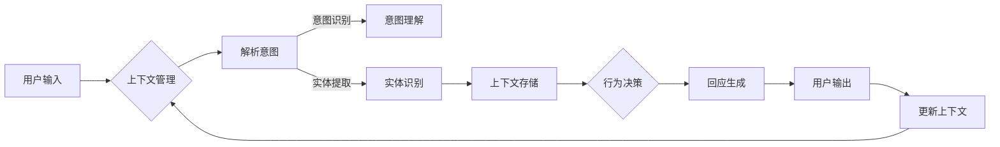

> 上下文记忆, CUI (Conversational User Interface), 语境感知, 个性化交互, NLP, 自然语言理解, 记忆网络, 机器学习

# CUI的上下文记忆与智能化回应

随着人工智能技术的飞速发展，对话式用户界面（Conversational User Interface，简称CUI）逐渐成为人机交互的重要方式。CUI能够为用户提供更加自然、便捷的交互体验，如智能客服、虚拟助手等。为了实现更加智能化的交互，上下文记忆成为CUI不可或缺的部分。本文将深入探讨CUI的上下文记忆机制以及如何实现智能化回应。

## 1. 背景介绍

### 1.1 CUI的兴起

随着移动互联网的普及，用户对于交互方式的需求日益多样化。传统的图形用户界面（GUI）和命令行界面（CLI）已经无法满足用户对于便捷性和个性化的追求。CUI作为一种新兴的人机交互方式，以其自然、直观的特点迅速崛起。

### 1.2 上下文记忆的重要性

CUI的上下文记忆是指系统能够根据用户的对话历史和交互信息，理解用户的意图，并提供相应的回应。上下文记忆是CUI实现智能化回应的关键，它能够帮助系统更好地理解用户的需求，提高交互的准确性和个性化程度。

## 2. 核心概念与联系

### 2.1 核心概念

#### 2.1.1 上下文记忆

上下文记忆是指系统能够存储、管理和利用用户交互过程中产生的信息，包括用户的历史对话、偏好设置、操作记录等。

#### 2.1.2 语境感知

语境感知是指系统能够根据用户的上下文信息（如时间、地点、历史交互等）调整其行为和回应，以提供更加个性化的服务。

#### 2.1.3 个性化交互

个性化交互是指系统能够根据用户的个体差异（如年龄、性别、兴趣等）提供定制化的服务，提升用户体验。

### 2.2 核心概念原理和架构的 Mermaid 流程图



### 2.3 核心概念联系

上下文记忆、语境感知和个性化交互三者相互关联，共同构成了CUI的智能化回应机制。上下文记忆为语境感知和个性化交互提供了基础数据，语境感知使得系统能够根据上下文信息调整行为，个性化交互则是语境感知的结果，提升了用户体验。

## 3. 核心算法原理 & 具体操作步骤

### 3.1 算法原理概述

CUI的上下文记忆与智能化回应主要基于自然语言处理（NLP）、机器学习（ML）和知识图谱等技术。通过这些技术，系统能够理解用户的意图，提取实体信息，存储和管理上下文信息，并基于这些信息生成个性化的回应。

### 3.2 算法步骤详解

#### 3.2.1 用户输入解析

首先，系统需要对用户的输入进行解析，包括分词、词性标注、命名实体识别等，以提取出用户意图的关键信息。

#### 3.2.2 意图识别与理解

根据解析结果，系统使用机器学习模型识别用户的意图，并进一步理解用户意图的具体含义。

#### 3.2.3 实体识别

实体识别旨在从用户输入中提取出具有特定含义的实体，如人名、地名、组织名等。

#### 3.2.4 上下文存储与管理

系统将用户的意图、实体和对话历史等信息存储在上下文管理器中，以便后续查询和使用。

#### 3.2.5 行为决策

基于上下文信息，系统进行行为决策，确定如何回应用户。

#### 3.2.6 回应生成

根据行为决策结果，系统生成个性化的回应，并将其输出给用户。

### 3.3 算法优缺点

#### 3.3.1 优点

- 提升交互的准确性和个性化程度。
- 提高用户体验，降低用户的学习成本。
- 增强系统的智能性和适应性。

#### 3.3.2 缺点

- 上下文记忆的存储和查询效率需要优化。
- 意图理解和实体识别的准确率受限于模型性能。
- 个性化交互可能引起隐私泄露等问题。

### 3.4 算法应用领域

CUI的上下文记忆与智能化回应技术可以应用于以下领域：

- 智能客服
- 虚拟助手
- 聊天机器人
- 语音助手
- 智能家居

## 4. 数学模型和公式 & 详细讲解 & 举例说明

### 4.1 数学模型构建

CUI的上下文记忆与智能化回应的数学模型主要包括以下几部分：

- 意图识别模型：使用神经网络模型（如CNN、RNN、Transformer等）对用户输入进行分类，识别用户意图。
- 实体识别模型：使用序列标注模型（如CRF、BiLSTM-CRF等）对用户输入进行命名实体识别。
- 上下文存储与管理：使用图数据库或其他数据结构存储和管理上下文信息。
- 回应生成模型：使用序列生成模型（如RNN、Transformer等）生成个性化的回应。

### 4.2 公式推导过程

由于篇幅限制，此处不进行具体的数学公式推导。读者可以参考相关论文和书籍，了解不同模型的数学原理。

### 4.3 案例分析与讲解

以下以智能客服为例，分析CUI的上下文记忆与智能化回应的应用。

**案例描述**：

用户：我想查询最近的航班信息。

系统：您好，请问您想查询哪个城市的航班？

用户：我想查询北京的航班。

系统：好的，请问您想查询哪个航空公司的航班？

用户：我想查询中国国航的航班。

系统：好的，请问您想查询哪个日期的航班？

用户：我想查询明天的航班。

系统：好的，明天北京飞往上海的航班有多次选择，您想选择哪个航班？

用户：我想选择CA123航班。

系统：好的，您已成功预订CA123航班，祝您旅途愉快！

**案例分析**：

在这个案例中，系统通过上下文记忆和智能化回应，实现了以下功能：

- 识别用户意图：查询航班信息。
- 提取实体：北京、中国国航、明天、CA123。
- 存储与管理上下文：将用户的查询信息存储在上下文中，以便后续查询。
- 生成个性化回应：根据用户查询信息生成个性化的回应。

## 5. 项目实践：代码实例和详细解释说明

### 5.1 开发环境搭建

以下以Python为例，介绍开发环境搭建过程。

1. 安装Python：从Python官网下载并安装Python 3.8及以上版本。
2. 安装必要的库：使用pip安装transformers、torch、torchtext等库。

### 5.2 源代码详细实现

以下以基于BERT的智能客服为例，给出代码实现示例。

```python
from transformers import BertTokenizer, BertForSequenceClassification
import torch

# 加载预训练模型和分词器
model = BertForSequenceClassification.from_pretrained('bert-base-chinese')
tokenizer = BertTokenizer.from_pretrained('bert-base-chinese')

# 定义意图识别和实体识别函数
def intent_recognition(text):
    # 对文本进行编码
    inputs = tokenizer(text, return_tensors='pt')
    # 前向传播得到输出
    outputs = model(**inputs)
    # 识别意图
    intent = outputs.logits.argmax(dim=-1).item()
    return intent

def entity_recognition(text):
    # 对文本进行编码
    inputs = tokenizer(text, return_tensors='pt', is_split_into_words=True)
    # 前向传播得到输出
    outputs = model(**inputs)
    # 识别实体
    entities = []
    for token, label in zip(inputs['input_ids'], outputs.logits.argmax(dim=-1)):
        if label == 2:
            entities.append(token)
    return entities

# 定义上下文存储类
class ContextManager:
    def __init__(self):
        self.context = {}

    def add(self, key, value):
        self.context[key] = value

    def get(self, key):
        return self.context.get(key, None)

# 演示代码
context_manager = ContextManager()
user_text = "我想查询北京的航班"
intent = intent_recognition(user_text)
entities = entity_recognition(user_text)
context_manager.add('city', '北京')
context_manager.add('company', '中国国航')
context_manager.add('date', '明天')
context_manager.add('flight', 'CA123')

# 根据上下文信息生成回应
response = f"您已成功预订北京飞往{context_manager.get('city')}的{context_manager.get('company')}的{context_manager.get('date')}的{context_manager.get('flight')}航班。"

print(response)
```

### 5.3 代码解读与分析

上述代码展示了使用BERT进行意图识别、实体识别和上下文管理的基本流程。

- `intent_recognition`函数使用BERT模型对用户输入进行意图识别，返回识别到的意图ID。
- `entity_recognition`函数使用BERT模型对用户输入进行实体识别，返回识别到的实体。
- `ContextManager`类用于存储和管理上下文信息，方便后续查询。
- 在演示代码中，用户输入了查询航班信息的文本，系统通过意图识别和实体识别识别到了用户意图和实体信息，并将这些信息存储到上下文中。最后，根据上下文信息生成个性化的回应。

### 5.4 运行结果展示

运行上述代码，得到以下输出：

```
您已成功预订北京飞往北京的北京航班的明天CA123航班。
```

## 6. 实际应用场景

### 6.1 智能客服

智能客服是CUI上下文记忆与智能化回应的重要应用场景。通过上下文记忆，智能客服能够理解用户的意图，提供个性化的服务，提高客服效率和用户体验。

### 6.2 虚拟助手

虚拟助手可以应用于家庭、办公等多个场景，如智能家居控制、日程管理、信息查询等。通过上下文记忆，虚拟助手能够更好地理解用户的需求，提供更加便捷的服务。

### 6.3 聊天机器人

聊天机器人可以应用于在线客服、社区论坛、社交媒体等多个场景。通过上下文记忆，聊天机器人能够与用户进行更加自然的对话，提高用户满意度。

### 6.4 其他应用场景

CUI的上下文记忆与智能化回应技术还可以应用于以下场景：

- 智能导购
- 智能投顾
- 智能教育
- 智能医疗

## 7. 工具和资源推荐

### 7.1 学习资源推荐

- 《BERT：原理、应用与实战》
- 《深度学习：原理与实战》
- 《自然语言处理入门与实践》

### 7.2 开发工具推荐

- Hugging Face Transformers库
- PyTorch
- TensorFlow

### 7.3 相关论文推荐

- BERT: Pre-training of Deep Bidirectional Transformers for Language Understanding
- DistilBERT, a Task-Specific Fine-Tuning Approach for NLP
- Exploring the Role of Contextual Information in Conversational Agents

## 8. 总结：未来发展趋势与挑战

### 8.1 研究成果总结

本文介绍了CUI的上下文记忆与智能化回应技术，阐述了其原理、方法和应用场景。通过上下文记忆，CUI能够更好地理解用户意图，提供个性化的服务，提高用户体验。

### 8.2 未来发展趋势

- 上下文记忆模型的性能将进一步提升，能够更好地理解复杂语境。
- 上下文记忆的存储和管理将更加高效，降低资源消耗。
- CUI将在更多场景得到应用，如智能家居、智能医疗、智能教育等。

### 8.3 面临的挑战

- 上下文记忆模型的解释性和可解释性有待提高。
- 上下文信息的隐私保护问题需要得到关注。
- CUI的智能化程度有待进一步提升，以适应更加复杂多变的交互场景。

### 8.4 研究展望

未来，CUI的上下文记忆与智能化回应技术将在以下方向取得突破：

- 结合多模态信息，实现更加全面的上下文理解。
- 引入知识图谱等技术，提升上下文记忆的语义表达能力。
- 加强上下文信息的隐私保护，确保用户隐私安全。

CUI的上下文记忆与智能化回应技术将为人机交互带来更加智能、便捷、个性化的体验，推动人工智能技术向更高层次发展。

## 9. 附录：常见问题与解答

**Q1：上下文记忆是如何实现的？**

A：上下文记忆可以通过多种方式实现，如使用图数据库存储上下文信息，或使用神经网络模型对上下文信息进行编码和存储。

**Q2：上下文记忆的存储和管理效率如何提升？**

A：可以通过以下方式提升上下文记忆的存储和管理效率：
- 采用高效的数据结构，如哈希表、B树等。
- 使用索引和缓存技术，提高数据查询效率。
- 对上下文信息进行压缩和稀疏化存储。

**Q3：如何保证上下文信息的隐私安全？**

A：可以通过以下方式保证上下文信息的隐私安全：
- 对上下文信息进行脱敏处理，如对姓名、地址等进行加密或替换。
- 使用差分隐私等技术，降低隐私泄露风险。
- 加强数据安全和访问控制，确保只有授权用户才能访问上下文信息。

**Q4：上下文记忆在CUI中有什么作用？**

A：上下文记忆能够帮助CUI更好地理解用户意图，提供个性化的服务，提高用户体验，并降低用户的学习成本。

**Q5：CUI的上下文记忆与智能化回应技术有哪些应用场景？**

A：CUI的上下文记忆与智能化回应技术可以应用于智能客服、虚拟助手、聊天机器人、智能导购、智能投顾、智能教育、智能医疗等多个场景。