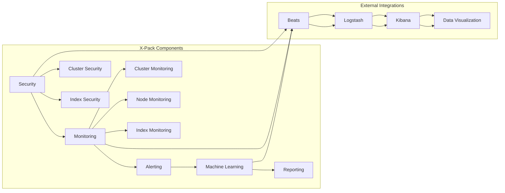

# ElasticSearch X-Pack原理与代码实例讲解

> 关键词：ElasticSearch, X-Pack, 分布式搜索，安全，监控，分析，机器学习，日志管理，数据可视化

## 1. 背景介绍

Elasticsearch 是一个基于 Lucene 构建的分布式搜索引擎，它允许用户快速地存储、搜索和分析大量数据。Elasticsearch 的强大之处在于其灵活的查询语言和扩展性，能够处理复杂的搜索需求。X-Pack 是 Elasticsearch 的一个功能增强包，它为 Elasticsearch 增加了一系列的安全、监控、分析、机器学习和日志管理功能，使得 Elasticsearch 成为一个功能丰富的数据分析平台。

### 1.1 问题的由来

随着大数据时代的到来，数据量呈爆炸式增长，如何高效地存储、搜索和分析这些数据成为了一个重要的挑战。Elasticsearch 的出现解决了这一问题，而 X-Pack 的加入则使得 Elasticsearch 成为一个更加全面的解决方案。

### 1.2 研究现状

X-Pack 是 Elasticsearch 的一个官方扩展，它提供了以下功能：

- 安全：通过身份验证、授权和加密，保护 Elasticsearch 的数据。
- 监控：提供集群监控、节点监控和索引监控，帮助用户了解集群的健康状况和性能。
- 分析：集成 Logstash、Kibana 和 Beats，支持日志管理、数据可视化和分析。
- 机器学习：使用 Elasticsearch 的机器学习 API 进行预测分析和异常检测。

### 1.3 研究意义

X-Pack 的引入使得 Elasticsearch 成为一个功能强大的数据分析平台，它可以帮助用户：

- 保护敏感数据，确保数据安全。
- 了解集群状态，及时发现和解决问题。
- 快速处理和分析大量数据，提取有价值的信息。
- 利用机器学习进行预测分析，为业务决策提供支持。

### 1.4 本文结构

本文将分为以下几个部分：

- 介绍 X-Pack 的核心概念和架构。
- 解释 X-Pack 的核心算法原理和操作步骤。
- 通过代码实例展示如何使用 X-Pack 进行数据分析和日志管理。
- 讨论 X-Pack 的实际应用场景和未来发展趋势。
- 推荐学习资源和开发工具。

## 2. 核心概念与联系

### 2.1 核心概念原理和架构的 Mermaid 流程图



图中展示了 X-Pack 的主要组件及其相互关系。X-Pack 的核心组件包括安全、监控、分析、机器学习和报告，而外部集成则包括 Beats、Logstash 和 Kibana，它们共同构成了一个强大的数据分析平台。

## 3. 核心算法原理 & 具体操作步骤

### 3.1 算法原理概述

X-Pack 的核心算法原理主要涉及以下几个方面：

- 安全：使用 SSL/TLS 加密通信，实现用户认证和授权。
- 监控：使用 JMX 和 API 提供集群和节点监控。
- 分析：使用 Logstash 和 Kibana 进行数据采集、索引和可视化。
- 机器学习：使用 Elasticsearch 的机器学习 API 进行预测分析和异常检测。

### 3.2 算法步骤详解

#### 3.2.1 安全

1. 配置 Elasticsearch 集群的 SSL/TLS 加密。
2. 创建用户和角色，并分配适当的权限。
3. 使用 Kibana 的身份验证和授权功能。

#### 3.2.2 监控

1. 启用 Elasticsearch 的监控功能。
2. 使用 Kibana 的监控仪表板查看集群和节点状态。
3. 设置告警规则，以便在出现问题时及时通知管理员。

#### 3.2.3 分析

1. 使用 Logstash 收集日志数据。
2. 将数据索引到 Elasticsearch。
3. 使用 Kibana 的可视化功能分析数据。

#### 3.2.4 机器学习

1. 使用 Elasticsearch 的机器学习 API 创建分析作业。
2. 分析数据并生成预测模型。
3. 使用模型进行预测分析。

### 3.3 算法优缺点

#### 3.3.1 优点

- 安全性高：X-Pack 提供了全面的安全功能，可以保护 Elasticsearch 的数据。
- 易于使用：X-Pack 的集成非常方便，用户可以轻松地配置和使用其功能。
- 功能强大：X-Pack 提供了丰富的功能，可以满足各种数据分析需求。

#### 3.3.2 缺点

- 学习曲线陡峭：X-Pack 的功能非常强大，但同时也意味着学习曲线较为陡峭。
- 成本较高：X-Pack 是一个付费功能，需要订阅才能使用。

### 3.4 算法应用领域

X-Pack 可以应用于以下领域：

- 日志管理：收集、索引和搜索日志数据。
- 应用性能监控：监控应用程序的性能和健康状况。
- 安全监控：监控网络安全事件和异常行为。
- 机器学习：使用机器学习进行预测分析和异常检测。

## 4. 数学模型和公式 & 详细讲解 & 举例说明

### 4.1 数学模型构建

X-Pack 中的机器学习功能使用了一些数学模型，例如：

- 决策树
- 逻辑回归
- 支持向量机

### 4.2 公式推导过程

由于 X-Pack 中的数学模型较为复杂，这里不进行详细的公式推导。

### 4.3 案例分析与讲解

假设我们要使用 Elasticsearch 的机器学习 API 对网站点击数据进行分析，以预测用户是否会点击某个链接。

1. 使用 Logstash 收集网站点击数据。
2. 将数据索引到 Elasticsearch。
3. 使用 Kibana 创建一个分析作业，选择逻辑回归模型。
4. 将数据导入到分析作业中，训练模型。
5. 使用模型进行预测。

## 5. 项目实践：代码实例和详细解释说明

### 5.1 开发环境搭建

为了使用 X-Pack，你需要安装以下软件：

- Elasticsearch
- Kibana
- Logstash

### 5.2 源代码详细实现

以下是使用 Python 和 Elasticsearch 客户端库进行数据索引的示例代码：

```python
from elasticsearch import Elasticsearch

# 创建 Elasticsearch 客户端实例
es = Elasticsearch("http://localhost:9200")

# 创建索引
if not es.indices.exists(index="website_clicks"):
    es.indices.create(index="website_clicks")

# 索引文档
doc1 = {
    "url": "http://example.com/page1",
    "user": "user1",
    "click": 1
}

es.index(index="website_clicks", id=1, document=doc1)

# 索引文档
doc2 = {
    "url": "http://example.com/page2",
    "user": "user1",
    "click": 0
}

es.index(index="website_clicks", id=2, document=doc2)
```

### 5.3 代码解读与分析

上述代码展示了如何使用 Python 和 Elasticsearch 客户端库创建索引和索引文档。首先，我们创建了一个 Elasticsearch 客户端实例，然后检查是否存在名为 "website_clicks" 的索引。如果不存在，则创建该索引。接下来，我们索引了两个文档，分别表示用户 user1 在两个页面上的点击情况。

### 5.4 运行结果展示

运行上述代码后，你可以在 Elasticsearch 中找到名为 "website_clicks" 的索引，其中包含两个文档。

## 6. 实际应用场景

### 6.1 日志管理

X-Pack 可以用于收集、索引和搜索来自各种来源的日志数据，例如：

- 应用程序日志
- 系统日志
- 网络日志

这可以帮助企业更好地理解和分析日志数据，发现潜在的问题和异常。

### 6.2 应用性能监控

X-Pack 可以用于监控应用程序的性能，例如：

- 请求响应时间
- 错误率
- 数据库连接数

这可以帮助开发人员及时发现和解决性能问题。

### 6.3 安全监控

X-Pack 可以用于监控网络安全事件，例如：

- 漏洞扫描
- 入侵检测
- 安全事件响应

这可以帮助企业确保网络安全。

### 6.4 机器学习

X-Pack 可以用于使用机器学习进行预测分析和异常检测，例如：

- 预测用户行为
- 发现异常交易
- 预测设备故障

这可以帮助企业做出更好的决策。

## 7. 工具和资源推荐

### 7.1 学习资源推荐

- [Elasticsearch 官方文档](https://www.elastic.co/guide/en/elasticsearch/reference/current/index.html)
- [Elasticsearch: The Definitive Guide](https://www.elastic.co/guide/en/elasticsearch/guide/current/index.html)
- [X-Pack 官方文档](https://www.elastic.co/guide/en/x-pack/current/index.html)

### 7.2 开发工具推荐

- [Elasticsearch Python 客户端库](https://elasticsearch-py.readthedocs.io/en/master/)
- [Beats](https://www.elastic.co/beats)
- [Kibana](https://www.elastic.co/kibana)

### 7.3 相关论文推荐

- [Elasticsearch: The Definitive Guide](https://www.elastic.co/guide/en/elasticsearch/guide/current/index.html)
- [The Elastic Stack](https://www.elastic.co/guide/en/stack/current/index.html)

## 8. 总结：未来发展趋势与挑战

### 8.1 研究成果总结

X-Pack 是 Elasticsearch 的一个功能丰富的扩展，它为 Elasticsearch 增加了一系列的安全、监控、分析、机器学习和日志管理功能。X-Pack 的引入使得 Elasticsearch 成为一个更加全面的解决方案，可以满足各种数据分析需求。

### 8.2 未来发展趋势

X-Pack 的未来发展趋势包括：

- 持续集成和部署：X-Pack 将与其他 Elastic Stack 产品更加紧密地集成，以便更好地支持持续集成和持续部署。
- 人工智能：X-Pack 将集成更多的人工智能功能，例如自动化的监控和异常检测。
- 多云支持：X-Pack 将支持多云环境，以便用户可以将其部署到任何云平台。

### 8.3 面临的挑战

X-Pack 面临的挑战包括：

- 安全性：随着攻击手段的不断演变，X-Pack 需要不断更新和改进其安全功能。
- 可扩展性：随着数据量的增长，X-Pack 需要提供更好的可扩展性。
- 易用性：X-Pack 的功能非常强大，但同时也意味着学习曲线较为陡峭。

### 8.4 研究展望

X-Pack 的未来将更加注重安全性、可扩展性和易用性。X-Pack 将与其他 Elastic Stack 产品更加紧密地集成，以提供更好的数据分析解决方案。

## 9. 附录：常见问题与解答

**Q1：什么是 X-Pack？**

A1：X-Pack 是 Elasticsearch 的一个功能增强包，它为 Elasticsearch 增加了一系列的安全、监控、分析、机器学习和日志管理功能。

**Q2：X-Pack 是否免费？**

A2：X-Pack 的某些功能是免费的，但某些高级功能需要订阅才能使用。

**Q3：如何安装 X-Pack？**

A3：可以从 Elastic Stack 的官方网站下载 X-Pack，并将其安装到 Elasticsearch 中。

**Q4：X-Pack 支持哪些语言？**

A4：X-Pack 支持多种编程语言，包括 Java、Python、Go、PHP、Ruby 和 JavaScript。

**Q5：X-Pack 有哪些优势？**

A5：X-Pack 提供了以下优势：

- 安全性：X-Pack 提供了全面的安全功能，可以保护 Elasticsearch 的数据。
- 易于使用：X-Pack 的集成非常方便，用户可以轻松地配置和使用其功能。
- 功能强大：X-Pack 提供了丰富的功能，可以满足各种数据分析需求。

作者：禅与计算机程序设计艺术 / Zen and the Art of Computer Programming