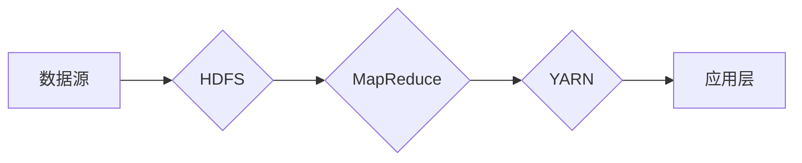

# Hadoop原理与代码实例讲解

> 关键词：Hadoop, 分布式计算, HDFS, MapReduce, YARN, 数据处理, 大数据

## 1. 背景介绍

随着互联网和物联网技术的快速发展，数据量呈爆炸式增长。传统的数据处理方法已无法满足大规模数据存储和分析的需求。为了解决这一问题，Hadoop应运而生。Hadoop是一个开源的分布式计算框架，用于处理大规模数据集，它由Apache软件基金会维护。本文将深入讲解Hadoop的原理及其代码实例，帮助读者全面了解Hadoop技术。

## 2. 核心概念与联系

### 2.1 核心概念

Hadoop框架的核心概念包括：

- **Hadoop分布式文件系统（HDFS）**：一个分布式文件系统，用于存储大量数据。
- **MapReduce**：一个用于并行处理大规模数据集的计算模型。
- **Yet Another Resource Negotiator（YARN）**：一个资源管理器，负责在集群中分配计算资源。

### 2.2 Mermaid流程图



### 2.3 核心概念联系

- HDFS负责存储大量数据，为MapReduce提供数据输入和输出。
- MapReduce利用HDFS存储的数据进行并行计算。
- YARN负责管理集群资源，为MapReduce和其他应用程序分配资源。

## 3. 核心算法原理 & 具体操作步骤

### 3.1 算法原理概述

**HDFS**：

HDFS采用主从结构，包括一个NameNode和多个DataNode。NameNode负责管理文件系统的命名空间和客户端对文件的访问，而DataNode负责存储实际的数据块。

**MapReduce**：

MapReduce将大规模数据集分成小块，在集群的多个节点上并行处理。每个节点执行Map和Reduce两个阶段，将原始数据转换为键值对，并最终输出结果。

**YARN**：

YARN将集群资源管理权从Hadoop 1.x的MapReduce框架中分离出来，使集群可以同时运行多种类型的计算任务。

### 3.2 算法步骤详解

**HDFS**：

1. 客户端通过NameNode访问HDFS。
2. NameNode返回DataNode的信息。
3. 客户端向DataNode发送读写请求。
4. DataNode响应请求并处理数据。

**MapReduce**：

1. InputFormat将输入数据分解成多个小文件。
2. MapTask将数据映射成键值对。
3. Shuffle阶段对MapTask输出的键值对进行排序和合并。
4. ReduceTask对Shuffle后的数据进行聚合，生成最终结果。

**YARN**：

1. ResourceManager监听来自客户端的资源请求。
2. ResourceManager将资源分配给NodeManager。
3. NodeManager管理所属节点的资源并执行任务。
4. ResourceManager监控资源使用情况，必要时进行资源调整。

### 3.3 算法优缺点

**HDFS**：

优点：高可靠、高吞吐、适合大数据存储。
缺点：单点故障、扩展性有限。

**MapReduce**：

优点：简单易用、高效并行。
缺点：编程复杂、不适合迭代计算。

**YARN**：

优点：灵活、支持多种计算模型。
缺点：资源管理相对复杂。

### 3.4 算法应用领域

Hadoop及其组件在以下领域得到广泛应用：

- 大数据分析
- 机器学习
- 数据挖掘
- 实时计算

## 4. 数学模型和公式 & 详细讲解 & 举例说明

### 4.1 数学模型构建

Hadoop框架的数学模型可以简化为以下公式：

- 数据量 = MapTask数量 × 输入数据量
- 计算资源 = NodeManager数量 × 节点资源

### 4.2 公式推导过程

- 数据量：每个MapTask处理输入数据的一部分，因此数据量与MapTask数量成正比。
- 计算资源：每个NodeManager负责管理一个节点的资源，因此计算资源与NodeManager数量成正比。

### 4.3 案例分析与讲解

假设我们有一个包含1000万条记录的数据集，每条记录包含一个键和一个值。我们希望在10个节点上并行处理这个数据集。

- 数据量 = 10 × 1000万 = 1亿
- 计算资源 = 10 × 节点资源

在这个例子中，我们将数据量分成10份，每个MapTask处理100万条记录。每个NodeManager负责管理一个节点的资源，如CPU和内存。

## 5. 项目实践：代码实例和详细解释说明

### 5.1 开发环境搭建

为了实践Hadoop，我们需要以下环境：

- Java开发环境
- Hadoop安装包
- Hadoop命令行工具

### 5.2 源代码详细实现

以下是一个简单的MapReduce程序，用于计算单词出现频率：

```java
import org.apache.hadoop.conf.Configuration;
import org.apache.hadoop.fs.Path;
import org.apache.hadoop.io.IntWritable;
import org.apache.hadoop.io.Text;
import org.apache.hadoop.mapreduce.Job;
import org.apache.hadoop.mapreduce.Mapper;
import org.apache.hadoop.mapreduce.Reducer;
import org.apache.hadoop.mapreduce.lib.input.FileInputFormat;
import org.apache.hadoop.mapreduce.lib.output.FileOutputFormat;

public class WordCount {

  public static class TokenizerMapper
       extends Mapper<Object, Text, Text, IntWritable>{

    private final static IntWritable one = new IntWritable(1);
    private Text word = new Text();

    public void map(Object key, Text value, Context context) throws IOException, InterruptedException {
      String[] tokens = value.toString().split("\\s+");
      for (String token : tokens) {
        word.set(token);
        context.write(word, one);
      }
    }
  }

  public static class IntSumReducer
       extends Reducer<Text,IntWritable,Text,IntWritable> {
    private IntWritable result = new IntWritable();

    public void reduce(Text key, Iterable<IntWritable> values,
                       Context context
                       ) throws IOException, InterruptedException {
      int sum = 0;
      for (IntWritable val : values) {
        sum += val.get();
      }
      result.set(sum);
      context.write(key, result);
    }
  }

  public static void main(String[] args) throws Exception {
    Configuration conf = new Configuration();
    Job job = Job.getInstance(conf, "word count");
    job.setJarByClass(WordCount.class);
    job.setMapperClass(TokenizerMapper.class);
    job.setCombinerClass(IntSumReducer.class);
    job.setReducerClass(IntSumReducer.class);
    job.setOutputKeyClass(Text.class);
    job.setOutputValueClass(IntWritable.class);
    FileInputFormat.addInputPath(job, new Path(args[0]));
    FileOutputFormat.setOutputPath(job, new Path(args[1]));
    System.exit(job.waitForCompletion(true) ? 0 : 1);
  }
}
```

### 5.3 代码解读与分析

- TokenizerMapper：Mapper类负责读取输入文件，将每行文本分割成单词，并输出单词及其计数。
- IntSumReducer：Reducer类负责聚合Mapper输出的键值对，计算单词的总出现次数。
- main方法：设置作业配置、输入输出路径等，并提交作业。

### 5.4 运行结果展示

假设我们将上述程序编译成jar文件，并在包含Hadoop集群的机器上运行：

```bash
hadoop jar wordcount.jar WordCount /input /output
```

运行完成后，输出文件output会包含单词及其出现次数，例如：

```
hello 1
world 1
hadoop 1
mapreduce 1
```

## 6. 实际应用场景

Hadoop及其组件在以下场景中得到广泛应用：

- 大数据分析：处理和分析海量数据，如社交网络数据、电子商务数据、物联网数据等。
- 机器学习：训练大规模机器学习模型，如深度学习模型、线性回归模型等。
- 数据挖掘：从大量数据中挖掘有价值的信息，如用户行为分析、异常检测等。
- 实时计算：处理和分析实时数据，如股票交易、网络流量监控等。

## 7. 工具和资源推荐

### 7.1 学习资源推荐

- 《Hadoop权威指南》
- 《Hadoop技术内幕》
- Apache Hadoop官方文档

### 7.2 开发工具推荐

- IntelliJ IDEA
- Eclipse
- Apache Hadoop命令行工具

### 7.3 相关论文推荐

- Hadoop: The Definitive Guide
- The Google File System
- MapReduce: Simplifying Data Processing on Large Clusters

## 8. 总结：未来发展趋势与挑战

### 8.1 研究成果总结

Hadoop作为一个开源的分布式计算框架，在处理大规模数据集方面取得了显著成果。它为大数据处理提供了高效、可靠的解决方案。

### 8.2 未来发展趋势

- Hadoop将继续与其他大数据技术（如Spark、Flink等）进行融合，提供更加丰富的功能和更好的性能。
- Hadoop将朝着更加易用、高效、可扩展的方向发展。
- Hadoop将更加注重数据安全性和隐私保护。

### 8.3 面临的挑战

- Hadoop的生态系统庞大，学习曲线陡峭，需要更多的培训和文档支持。
- Hadoop的安全性和隐私保护需要进一步加强。
- Hadoop的扩展性和可伸缩性需要进一步提升。

### 8.4 研究展望

Hadoop将继续作为大数据处理的重要框架，为各个领域提供强大的支持。未来，Hadoop将与其他大数据技术、云计算技术等紧密结合，为构建更加智能、高效的大数据生态系统贡献力量。

## 9. 附录：常见问题与解答

**Q1：Hadoop适用于哪些类型的数据？**

A：Hadoop适用于处理大规模结构化数据、半结构化数据和非结构化数据。

**Q2：Hadoop与其他大数据技术有何区别？**

A：Hadoop是一个开源的分布式计算框架，而Spark和Flink是大数据计算引擎。Hadoop主要用于数据存储和处理，而Spark和Flink主要用于数据处理和实时计算。

**Q3：如何提高Hadoop的性能？**

A：提高Hadoop性能的方法包括：优化HDFS存储、优化MapReduce任务、使用更高效的计算引擎等。

**Q4：Hadoop的安全性和隐私保护如何实现？**

A：Hadoop提供了一系列安全性和隐私保护机制，如Kerberos认证、数据加密、访问控制等。

**Q5：Hadoop在哪些行业得到广泛应用？**

A：Hadoop在金融、医疗、零售、政府、电信等多个行业得到广泛应用。

---

作者：禅与计算机程序设计艺术 / Zen and the Art of Computer Programming