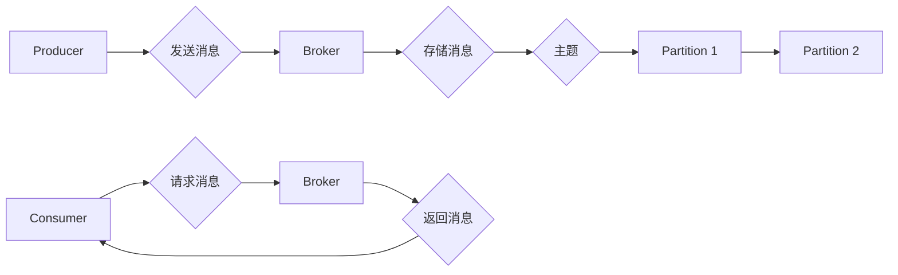

# Kafka Consumer原理与代码实例讲解

> 关键词：Kafka, 消费者, 消息队列, 分布式系统, 实时处理, 拉模式, 推模式, 事件驱动, 消息传递

## 1. 背景介绍

Apache Kafka是一款分布式流处理平台，它提供了高性能、可扩展、容错性强、高吞吐量的消息队列服务。Kafka在金融、社交网络、电商等多个领域都有广泛应用，成为了构建实时数据管道和流式应用的重要工具。Kafka中的Consumer是核心组件之一，它负责从Kafka主题中消费消息。本文将深入讲解Kafka Consumer的原理，并通过代码实例展示其使用方法。

## 2. 核心概念与联系

### 2.1 Kafka架构

Kafka的架构主要包括以下组件：

- **Producer**：生产者，负责将消息发送到Kafka主题。
- **Broker**：代理服务器，存储主题的数据，并处理生产者和消费者的请求。
- **Topic**：主题，一个命名空间，用于存储和生产消息。
- **Partition**：分区，主题内的数据分割，可以并行处理。


### 2.2 Consumer概念

Consumer是Kafka中的一个客户端组件，它负责从Kafka主题中读取消息。Consumer可以以拉模式(Lazy Pull)或推模式(Active Push)读取消息。

- **拉模式**：Consumer主动从Kafka请求消息，适用于不需要实时处理消息的场景。
- **推模式**：Kafka主动推送消息给Consumer，适用于需要实时处理消息的场景。

### 2.3 Mermaid流程图



## 3. 核心算法原理 & 具体操作步骤

### 3.1 算法原理概述

Kafka Consumer的核心原理是通过消费者组（Consumer Group）的概念，实现多个Consumer实例之间的负载均衡和故障转移。

- **消费者组**：一组Consumer实例组成的集合，共同消费同一个主题的消息。
- **负载均衡**：Consumer Group内的Consumer实例均匀分配Partition，实现并行消费。
- **故障转移**：当Consumer实例故障时，其他实例接管其分配的Partition。

### 3.2 算法步骤详解

1. **创建消费者组**：Consumer连接到Kafka时，会向Kafka注册自己的消费者组。
2. **分配分区**：Kafka根据消费者组的规模，将主题的Partition分配给Consumer实例。
3. **拉取消息**：Consumer从分配的Partition中拉取消息。
4. **处理消息**：Consumer处理拉取到的消息。
5. **提交偏移量**：Consumer提交处理消息后的偏移量，告知Kafka哪些消息已经消费。

### 3.3 算法优缺点

**优点**：

- 高效：通过消费者组实现负载均衡和故障转移，提高消费效率。
- 容错：Consumer实例故障时，其他实例可以接管其分配的Partition，保证数据不丢失。
- 易用：Kafka客户端库提供丰富的API，方便开发人员使用。

**缺点**：

- 资源消耗：每个Consumer实例都需要连接到Kafka，可能会消耗大量资源。
- 配置复杂：需要合理配置消费者组、分区分配策略等参数。

### 3.4 算法应用领域

Kafka Consumer适用于以下场景：

- 实时数据处理：如实时日志收集、实时监控等。
- 消息队列：如订单处理、消息通知等。
- 分布式系统：如分布式计算、微服务通信等。

## 4. 数学模型和公式 & 详细讲解 & 举例说明

### 4.1 数学模型构建

Kafka Consumer的数学模型可以表示为以下公式：

$$
\text{消费效率} = \frac{\text{处理消息数}}{\text{消费时间}}
$$

### 4.2 公式推导过程

消费效率是衡量Consumer性能的重要指标。其中，处理消息数是Consumer在单位时间内处理的消息数量，消费时间是Consumer处理这些消息所需的时间。

### 4.3 案例分析与讲解

假设一个Consumer在1小时内处理了10000条消息，则其消费效率为：

$$
\text{消费效率} = \frac{10000}{3600} \approx 2.78
$$

这意味着该Consumer平均每秒处理约2.78条消息。

## 5. 项目实践：代码实例和详细解释说明

### 5.1 开发环境搭建

1. 安装Java环境。
2. 安装Kafka客户端库：`kafka-clients`。
3. 运行Kafka服务器。

### 5.2 源代码详细实现

以下是一个使用Java实现的Kafka Consumer示例：

```java
import org.apache.kafka.clients.consumer.ConsumerRecord;
import org.apache.kafka.clients.consumer.ConsumerRecords;
import org.apache.kafka.clients.consumer.KafkaConsumer;

import java.time.Duration;
import java.util.Collections;
import java.util.Properties;

public class KafkaConsumerExample {
    public static void main(String[] args) {
        Properties props = new Properties();
        props.put("bootstrap.servers", "localhost:9092");
        props.put("group.id", "test-group");
        props.put("key.deserializer", "org.apache.kafka.common.serialization.StringDeserializer");
        props.put("value.deserializer", "org.apache.kafka.common.serialization.StringDeserializer");

        KafkaConsumer<String, String> consumer = new KafkaConsumer<>(props);
        consumer.subscribe(Collections.singletonList("test-topic"));

        try {
            while (true) {
                ConsumerRecords<String, String> records = consumer.poll(Duration.ofMillis(100));
                for (ConsumerRecord<String, String> record : records) {
                    System.out.printf("offset = %d, key = %s, value = %s%n", record.offset(), record.key(), record.value());
                }
            }
        } finally {
            consumer.close();
        }
    }
}
```

### 5.3 代码解读与分析

- 首先，配置Kafka客户端参数，包括Kafka服务器地址、消费者组ID、key和value的反序列化器等。
- 然后，创建KafkaConsumer实例，并订阅需要消费的主题。
- 在while循环中，使用poll方法从Kafka拉取消息，并遍历记录打印消息内容。
- 最后，关闭KafkaConsumer实例。

### 5.4 运行结果展示

运行上述代码，可以看到控制台打印出从Kafka主题中拉取到的消息内容。

## 6. 实际应用场景

Kafka Consumer在实际应用中可以用于以下场景：

- **实时日志收集**：从各个服务器收集日志，并进行实时监控和分析。
- **消息队列**：实现订单处理、消息通知等功能。
- **分布式系统**：实现分布式计算、微服务通信等功能。

## 7. 工具和资源推荐

### 7.1 学习资源推荐

- [Apache Kafka官方文档](https://kafka.apache.org/documentation/)
- [Kafka实战](https://github.com/dennyllin/kafka-in-action)
- [Kafka技术内幕](https://github.com/wuchong/kafka-analysis)

### 7.2 开发工具推荐

- [Kafka Manager](https://github.com/yahoo/kafka-manager)：Kafka集群管理工具。
- [Kafka Tools](https://github.com/LinkedIn/kafka-tools)：Kafka监控和管理工具。
- [Confluent Platform](https://www.confluent.io/platform/)：基于Kafka的完整平台，包括Kafka、Kafka Streams、Kafka Connect等。

### 7.3 相关论文推荐

- [The Design of the Apache Kafka System](https://www.usenix.org/system/files/conference/hotcloud15/hotcloud15-paper-rodionov.pdf)
- [Kafka: A Distributed Streaming Platform](https://www.slideshare.net/ct0/kafka-a-distributed-streaming-platform-by-nathanmarz)

## 8. 总结：未来发展趋势与挑战

### 8.1 研究成果总结

Kafka Consumer作为Kafka的核心组件之一，在实时数据处理、消息队列、分布式系统等领域发挥了重要作用。本文介绍了Kafka Consumer的原理、使用方法以及实际应用场景，并通过代码实例进行了详细讲解。

### 8.2 未来发展趋势

1. **高可用性**：Kafka会进一步提升Consumer的高可用性，提高系统的容错能力。
2. **性能优化**：Kafka会持续优化Consumer的性能，提高消息吞吐量。
3. **功能增强**：Kafka会不断丰富Consumer的功能，如支持多协议、多语言等。

### 8.3 面临的挑战

1. **资源消耗**：Consumer实例可能会消耗大量资源，需要合理配置。
2. **配置复杂**：Consumer的配置参数较多，需要开发者熟悉Kafka的配置机制。
3. **数据一致性**：在分布式系统中，如何保证数据的一致性是一个挑战。

### 8.4 研究展望

未来，Kafka Consumer的研究将重点关注以下方向：

1. **低延迟处理**：提高Consumer处理消息的延迟，以满足实时性需求。
2. **弹性伸缩**：实现Consumer的动态伸缩，以适应业务变化。
3. **跨语言支持**：支持更多的编程语言，降低使用门槛。

## 9. 附录：常见问题与解答

**Q1：Kafka Consumer的拉模式和推模式有何区别？**

A：拉模式是Consumer主动从Kafka请求消息，适用于不需要实时处理消息的场景；推模式是Kafka主动推送消息给Consumer，适用于需要实时处理消息的场景。

**Q2：如何处理Consumer故障转移？**

A：Kafka会自动处理Consumer的故障转移。当Consumer实例故障时，其他实例会接管其分配的Partition，继续消费消息。

**Q3：如何优化Consumer的性能？**

A：可以通过以下方法优化Consumer的性能：
1. 选择合适的分区策略，如轮询、range等。
2. 调整Consumer的批处理大小。
3. 使用异步处理方式，减少等待时间。

**Q4：如何保证数据一致性？**

A：Kafka保证了消息的顺序性和原子性，可以保证数据一致性。

---

作者：禅与计算机程序设计艺术 / Zen and the Art of Computer Programming