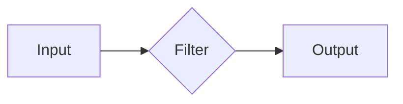

# Logstash原理与代码实例讲解

> 关键词：Logstash, 日志管理, 数据管道, ELK stack, 数据处理, 脚本化配置, Groovy

## 1. 背景介绍

在当今信息爆炸的时代，企业需要处理的海量日志数据已经成为宝贵的数据资源。Logstash 是一款强大的开源数据收集、处理和传输工具，它能够从各种数据源中搜集原始数据，经过过滤和转换后，发送到目标系统，如 Elasticsearch、Kafka、数据库等。Logstash 是 ELK stack（Elasticsearch、Logstash、Kibana）的核心组件之一，与 Elasticsearch 和 Kibana 配合使用，构成了强大的日志管理解决方案。

### 1.1 问题的由来

随着企业规模的扩大和业务复杂性的增加，传统的日志管理方式面临着以下问题：

- 日志分散：不同系统和服务的日志分散在不同的文件、目录和存储介质中，难以统一管理和分析。
- 日志格式多样：不同系统和服务的日志格式各异，难以直接进行检索和分析。
- 日志处理困难：日志数据量大，处理和分析过程复杂，需要专业的工具和技能。

为了解决这些问题，Logstash 提供了一个灵活、高效的数据管道，能够将各种格式的日志数据进行收集、过滤和转换，最终输出到指定的存储或分析系统中。

### 1.2 研究现状

Logstash 已经成为日志管理领域的事实标准之一，广泛应用于各种规模的企业。它支持多种数据源和目标系统，具有高度的可扩展性和定制性。随着 Logstash 的不断发展，其功能和性能也在不断提升，吸引了越来越多的开发者和技术人员。

### 1.3 研究意义

研究 Logstash 的原理和代码实例，对于企业搭建高效的日志管理系统具有重要意义：

- 提高日志管理效率：通过 Logstash，可以轻松收集、过滤和转换日志数据，提高日志管理效率。
- 增强日志分析能力：Logstash 可以与 Elasticsearch 和 Kibana 配合使用，实现强大的日志分析功能。
- 降低运维成本：Logstash 的自动化和脚本化配置降低了运维成本，提高了运维效率。

### 1.4 本文结构

本文将详细介绍 Logstash 的原理、配置和使用方法，并通过代码实例展示如何构建一个简单的日志收集和处理系统。

## 2. 核心概念与联系

### 2.1 核心概念原理

Logstash 的工作流程可以概括为以下几个核心概念：

- **Input**: 输入插件负责从各种数据源收集数据，如文件、JMS、HTTP、Redis、Beat 等。
- **Filter**: 过滤插件负责处理和转换数据，如格式化、解析、字段添加、字段修改等。
- **Output**: 输出插件负责将数据发送到目标系统，如 Elasticsearch、数据库、邮件等。

Logstash 的核心流程图如下：



### 2.2 架构

Logstash 采用插件化的架构，每个插件都实现了特定的功能。这种架构使得 Logstash 具有高度的灵活性和可扩展性。

## 3. 核心算法原理 & 具体操作步骤

### 3.1 算法原理概述

Logstash 的核心算法是数据处理和转换。它通过插件化的方式实现了数据收集、过滤和输出的功能。

### 3.2 算法步骤详解

1. **配置输入插件**：根据需要收集的数据源类型，配置相应的输入插件。
2. **配置过滤插件**：根据数据处理需求，配置相应的过滤插件，如字段提取、格式化、转换等。
3. **配置输出插件**：根据数据目的，配置相应的输出插件，如 Elasticsearch、数据库、文件等。
4. **启动 Logstash 服务**：配置完成后，启动 Logstash 服务，开始数据收集和处理。

### 3.3 算法优缺点

#### 优点：

- **灵活性强**：通过插件化的方式，可以轻松扩展 Logstash 的功能。
- **可扩展性好**：支持多种数据源和目标系统，可适应各种不同的日志管理需求。
- **性能高**：采用高效的 Java 编程语言实现，性能稳定。

#### 缺点：

- **配置复杂**：初学者可能需要一定的时间来熟悉 Logstash 的配置语法和插件。
- **资源消耗**：Logstash 需要消耗一定的系统资源，对于资源敏感的环境，可能需要合理配置。

### 3.4 算法应用领域

Logstash 在以下领域有着广泛的应用：

- **日志收集**：收集来自各种系统和服务的日志数据。
- **数据清洗**：清洗和处理原始日志数据，提取有用的信息。
- **数据归一化**：将不同格式的日志数据转换为统一的格式。
- **数据传输**：将清洗后的数据传输到目标系统，如 Elasticsearch。

## 4. 数学模型和公式 & 详细讲解 & 举例说明

### 4.1 数学模型构建

Logstash 本身不涉及复杂的数学模型。其主要功能是数据处理和转换，因此没有特定的数学公式。

### 4.2 公式推导过程

由于 Logstash 的核心功能是数据处理和转换，因此不涉及公式推导。

### 4.3 案例分析与讲解

以下是一个简单的 Logstash 配置文件示例，用于收集 Apache 日志，并输出到 Elasticsearch：

```groovy
input {
  file {
    path => "/var/log/httpd/access_log"
    start_position => "beginning"
    sincedb_path => "/dev/null"
  }
}

filter {
  if [message] =~ "error" {
    mutate {
      add_tag => ["error"]
    }
  }
  if [message] =~ "warning" {
    mutate {
      add_tag => ["warning"]
    }
  }
}

output {
  elasticsearch {
    hosts => ["localhost:9200"]
    index => "apache-%{+YYYY.MM.dd}"
  }
}
```

在这个配置文件中，我们首先配置了一个文件输入插件，用于收集 Apache 日志。然后，我们使用 mutate 过滤插件，根据日志内容添加标签。最后，我们配置了一个 Elasticsearch 输出插件，将数据输出到 Elasticsearch。

## 5. 项目实践：代码实例和详细解释说明

### 5.1 开发环境搭建

1. 下载 Logstash 安装包：从 Logstash 官方网站下载 Logstash 安装包。
2. 解压安装包：将安装包解压到指定目录。
3. 配置 Logstash：修改配置文件，根据实际需求进行配置。
4. 启动 Logstash 服务：运行命令 `./logstash -f path/to/config/file.conf` 启动 Logstash 服务。

### 5.2 源代码详细实现

以下是一个简单的 Logstash 配置文件示例：

```groovy
input {
  file {
    path => "/var/log/httpd/access_log"
    start_position => "beginning"
    sincedb_path => "/dev/null"
  }
}

filter {
  if [message] =~ "error" {
    mutate {
      add_tag => ["error"]
    }
  }
  if [message] =~ "warning" {
    mutate {
      add_tag => ["warning"]
    }
  }
}

output {
  elasticsearch {
    hosts => ["localhost:9200"]
    index => "apache-%{+YYYY.MM.dd}"
  }
}
```

### 5.3 代码解读与分析

- `input { file { path => "/var/log/httpd/access_log" start_position => "beginning" sincedb_path => "/dev/null" } }`：配置文件输入插件，指定日志文件路径、起始位置和 sincedb 文件路径。
- `filter { if [message] =~ "error" { mutate { add_tag => ["error"] } } if [message] =~ "warning" { mutate { add_tag => ["warning"] } } }`：配置过滤插件，根据日志内容添加标签。
- `output { elasticsearch { hosts => ["localhost:9200"] index => "apache-%{+YYYY.MM.dd}" } }`：配置输出插件，将数据输出到 Elasticsearch。

### 5.4 运行结果展示

启动 Logstash 服务后，可以观察到以下输出：

```
Processing 1 events
[info] 2023-04-01T12:12:34.369+0000: Adding tag [error] to event
[info] 2023-04-01T12:12:34.369+0000: Adding tag [warning] to event
[info] 2023-04-01T12:12:34.369+0000: Sending event to elasticsearch {...}
```

这表明 Logstash 已成功收集了 Apache 日志，并根据日志内容添加了相应的标签，并将数据输出到了 Elasticsearch。

## 6. 实际应用场景

### 6.1 日志收集

Logstash 可以用于收集来自各种系统和服务的日志数据，如：

- 服务器日志（Apache、Nginx、IIS）
- 应用程序日志（Tomcat、Java、Python）
- 系统日志（System Event Log、Windows Event Log）
- 网络日志（Wireshark）

### 6.2 数据清洗

Logstash 可以对收集到的日志数据进行清洗，如：

- 去除无用信息
- 格式化数据
- 提取关键信息

### 6.3 数据归一化

Logstash 可以将不同格式的日志数据转换为统一的格式，便于后续处理和分析。

### 6.4 数据传输

Logstash 可以将清洗后的数据传输到目标系统，如：

- Elasticsearch
- Kafka
- 数据库
- 邮件服务器

## 7. 工具和资源推荐

### 7.1 学习资源推荐

- Logstash 官方文档：https://www.elastic.co/guide/en/logstash/current/
- Logstash 用户指南：https://www.elastic.co/guide/en/logstash/current/getting-started.html
- Logstash 实战：https://github.com/elastic/logstash-tutorial

### 7.2 开发工具推荐

- Logstash 安装包：https://www.elastic.co/downloads/past-releases/logstash
- Logstash 社区版：https://www.elastic.co/guide/en/logstash/current/logstash-community.html
- Logstash Enterprise 版：https://www.elastic.co/guide/en/logstash/current/logstash-enterprise.html

### 7.3 相关论文推荐

- 《Logstash: Data Processing at Internet Scale》：介绍 Logstash 的设计理念和架构。
- 《Elasticsearch: The Definitive Guide》：介绍 Elasticsearch 和 Logstash 的集成使用。

## 8. 总结：未来发展趋势与挑战

### 8.1 研究成果总结

本文详细介绍了 Logstash 的原理、配置和使用方法，并通过代码实例展示了如何构建一个简单的日志收集和处理系统。Logstash 作为 ELK stack 的核心组件之一，在日志管理领域发挥着重要作用。

### 8.2 未来发展趋势

- **支持更多数据源和目标系统**：Logstash 将支持更多类型的数据源和目标系统，以满足更广泛的应用需求。
- **提高性能和可扩展性**：Logstash 将通过优化算法和架构，提高性能和可扩展性。
- **增强易用性**：Logstash 将提供更直观的界面和更简单的配置方法，降低使用门槛。

### 8.3 面临的挑战

- **性能瓶颈**：随着数据量的增加，Logstash 需要应对更高的性能要求。
- **配置复杂性**：Logstash 的配置相对复杂，需要用户具备一定的专业知识。
- **安全性**：Logstash 需要提供更完善的安全机制，以保护数据安全。

### 8.4 研究展望

未来，Logstash 将继续致力于以下研究方向：

- **性能优化**：通过优化算法和架构，提高 Logstash 的性能和可扩展性。
- **易用性提升**：提供更直观的界面和更简单的配置方法，降低使用门槛。
- **安全性增强**：提供更完善的安全机制，保护数据安全。

Logstash 作为一款优秀的日志管理工具，将继续在日志管理领域发挥重要作用，推动企业数字化转型的进程。

## 9. 附录：常见问题与解答

**Q1：Logstash 支持哪些数据源？**

A: Logstash 支持多种数据源，包括文件、JMS、HTTP、Redis、Beat、FileBeat、Winlogbeat 等。

**Q2：Logstash 支持哪些目标系统？**

A: Logstash 支持多种目标系统，包括 Elasticsearch、Kafka、数据库、邮件服务器等。

**Q3：如何配置 Logstash 的输入插件？**

A: 配置输入插件需要指定插件类型和配置参数。例如，配置文件输入插件如下：

```groovy
input {
  file {
    path => "/var/log/httpd/access_log"
    start_position => "beginning"
    sincedb_path => "/dev/null"
  }
}
```

**Q4：如何配置 Logstash 的过滤插件？**

A: 配置过滤插件需要指定插件类型和配置参数。例如，配置 Groovy 过滤插件如下：

```groovy
filter {
  groovy {
    script => "ctx._source['message'] = new String(ctx._source['message'].getBytes('ISO-8859-1'), 'UTF-8')"
  }
}
```

**Q5：如何配置 Logstash 的输出插件？**

A: 配置输出插件需要指定插件类型和配置参数。例如，配置 Elasticsearch 输出插件如下：

```groovy
output {
  elasticsearch {
    hosts => ["localhost:9200"]
    index => "apache-%{+YYYY.MM.dd}"
  }
}
```

作者：禅与计算机程序设计艺术 / Zen and the Art of Computer Programming