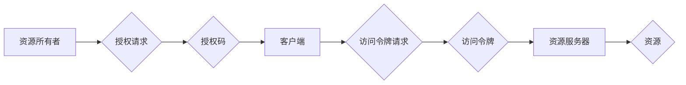
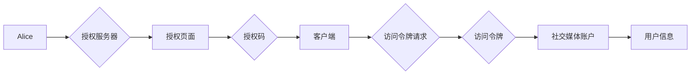

# OAuth 2.0 的优点和实现

> 关键词：OAuth 2.0, 认证授权, 资源所有者, 资源服务器, 客户端, 授权码流程, 密码流程, 客户端凭证流程, 简化流程

## 1. 背景介绍

随着互联网的快速发展，各种在线服务和应用程序层出不穷。这些服务需要访问用户在第三方网站上的数据，例如社交媒体、电子邮件账户等。然而，直接将用户凭证（如用户名和密码）提供给第三方服务，存在严重的安全风险。OAuth 2.0 应运而生，它提供了一种更加安全的方式来授权第三方应用程序访问用户资源。

### 1.1 问题的由来

传统的认证方式，如 Basic Authentication，将用户的用户名和密码直接发送给服务提供商，存在以下问题：

- 用户凭证泄露风险：用户凭证在传输过程中可能被拦截，导致用户账户被非法使用。
- 权限管理困难：服务提供商难以控制第三方应用程序访问用户数据的范围。
- 用户隐私泄露：第三方应用程序可能访问并使用用户的敏感信息。

OAuth 2.0 旨在解决上述问题，提供一种安全、灵活的认证和授权机制。

### 1.2 研究现状

OAuth 2.0 是一个开放标准，由 OAuth工作组制定。它已经得到了广泛的行业认可，并被许多大型科技公司采用，如 Google、Facebook、Twitter 等。

### 1.3 研究意义

OAuth 2.0 对于互联网安全、用户体验和生态系统的发展具有重要意义：

- 提高安全性：OAuth 2.0 通过避免直接暴露用户凭证，降低了用户账户被攻击的风险。
- 灵活的权限控制：OAuth 2.0 允许用户精细地控制第三方应用程序访问其数据的权限。
- 改善用户体验：用户可以轻松管理第三方应用程序的访问权限，而不必担心隐私泄露。

### 1.4 本文结构

本文将围绕 OAuth 2.0 的优点和实现展开，具体内容如下：

- 第2部分，介绍 OAuth 2.0 的核心概念和架构。
- 第3部分，详细讲解 OAuth 2.0 的算法原理和操作步骤。
- 第4部分，分析 OAuth 2.0 的优缺点和适用场景。
- 第5部分，通过代码实例展示 OAuth 2.0 的实现过程。
- 第6部分，探讨 OAuth 2.0 在实际应用场景中的应用。
- 第7部分，推荐 OAuth 2.0 相关的学习资源、开发工具和论文。
- 第8部分，总结 OAuth 2.0 的发展趋势和面临的挑战。

## 2. 核心概念与联系

OAuth 2.0 的核心概念包括：

- 资源所有者：用户，拥有需要访问的资源。
- 资源服务器：提供资源的实体，如网站或应用程序。
- 客户端：请求访问资源的实体，如第三方应用程序。
- 授权服务器：负责授权请求的实体，通常由资源服务器充当。

OAuth 2.0 的架构流程如下：



在这个流程中，资源所有者向客户端授权访问其资源，客户端使用授权码获取访问令牌，然后使用访问令牌从资源服务器获取资源。

## 3. 核心算法原理 & 具体操作步骤

### 3.1 算法原理概述

OAuth 2.0 的核心原理是通过一系列协议和步骤，在客户端、资源所有者和资源服务器之间建立信任关系，允许客户端以有限的权限访问资源。

### 3.2 算法步骤详解

OAuth 2.0 的基本步骤如下：

1. 客户端向资源所有者请求授权。
2. 资源所有者同意授权，并向客户端返回授权码。
3. 客户端使用授权码向授权服务器请求访问令牌。
4. 授权服务器验证授权码，并返回访问令牌。
5. 客户端使用访问令牌从资源服务器获取资源。

### 3.3 算法优缺点

**优点**：

- 安全性：OAuth 2.0 通过避免直接使用用户凭证，降低了凭证泄露的风险。
- 灵活性：OAuth 2.0 支持多种授权流程，可以满足不同场景的需求。
- 扩展性：OAuth 2.0 的设计使得新的授权流程和令牌类型可以方便地添加。

**缺点**：

- 复杂性：OAuth 2.0 的协议相对复杂，需要开发者理解和实现。
- 硬件安全：OAuth 2.0 的安全性依赖于客户端和服务器之间的通信安全。

### 3.4 算法应用领域

OAuth 2.0 可以应用于以下领域：

- 第三方应用程序：允许第三方应用程序访问用户的资源，例如社交媒体、电子邮件账户等。
- API 保护：保护企业的API资源，防止未经授权的访问。
- 云服务：保护云服务中的资源，例如虚拟机、数据库等。

## 4. 数学模型和公式 & 详细讲解 & 举例说明

OAuth 2.0 主要依赖于以下数学模型和公式：

- 授权码：一个用于证明授权的随机字符串。
- 访问令牌：一个用于访问资源的字符串。
- 刷新令牌：用于获取新的访问令牌。

以下是一个简单的例子：

假设用户 Alice 想要授权第三方应用程序访问她的社交媒体账户。

1. Alice 访问授权服务器，输入客户端ID和授权URL。
2. 授权服务器向 Alice 返回授权页面，其中包含客户端ID、重定向URI和用户信息。
3. Alice 点击“授权”按钮，授权服务器向客户端返回授权码。
4. 客户端使用授权码向授权服务器请求访问令牌。
5. 授权服务器验证授权码，并返回访问令牌和刷新令牌。
6. 客户端使用访问令牌从社交媒体账户获取用户信息。



## 5. 项目实践：代码实例和详细解释说明

### 5.1 开发环境搭建

为了演示 OAuth 2.0 的实现，我们需要以下环境：

- Python 3.6+
- Flask：一个轻量级的Web框架
- requests：用于发送HTTP请求的库

### 5.2 源代码详细实现

以下是一个简单的 OAuth 2.0 客户端和授权服务器的实现：

```python
from flask import Flask, redirect, request, jsonify
import requests

app = Flask(__name__)

# 客户端ID和客户端密钥
CLIENT_ID = 'your-client-id'
CLIENT_SECRET = 'your-client-secret'

# 授权服务器URL
AUTHORIZATION_SERVER_URL = 'https://authorization-server.com'

# 资源服务器URL
RESOURCE_SERVER_URL = 'https://resource-server.com'

@app.route('/')
def index():
    return '''
        <a href="{}">授权</a>
    '''.format(AUTHORIZATION_SERVER_URL)

@app.route('/callback')
def callback():
    # 获取授权码
    code = request.args.get('code')
    
    # 使用授权码获取访问令牌
    token_response = requests.post(
        f'{AUTHORIZATION_SERVER_URL}/token',
        auth=(CLIENT_ID, CLIENT_SECRET),
        data={'grant_type': 'authorization_code', 'code': code, 'redirect_uri': request.host_url}
    )
    
    # 使用访问令牌获取资源
    access_token = token_response.json().get('access_token')
    resource_response = requests.get(
        f'{RESOURCE_SERVER_URL}/resource',
        headers={'Authorization': f'Bearer {access_token}'}
    )
    
    # 返回资源内容
    return jsonify(resource_response.json())

if __name__ == '__main__':
    app.run(debug=True)
```

### 5.3 代码解读与分析

这段代码定义了一个简单的Web应用程序，其中包括以下功能：

- `/`：用户点击链接后，将被重定向到授权服务器。
- `/callback`：授权服务器将用户重定向回客户端，并附带授权码。客户端使用授权码获取访问令牌，并使用访问令牌获取资源。

### 5.4 运行结果展示

当用户访问应用程序时，他们将被重定向到授权服务器。用户同意授权后，授权服务器将用户重定向回客户端，并附带授权码。客户端使用授权码获取访问令牌，并使用访问令牌获取资源。

## 6. 实际应用场景

OAuth 2.0 在以下实际应用场景中得到了广泛的应用：

- 社交媒体登录：用户可以使用他们的社交媒体账户登录到第三方应用程序。
- API访问控制：保护企业的API资源，防止未经授权的访问。
- 云服务访问：保护云服务中的资源，例如虚拟机、数据库等。

## 7. 工具和资源推荐

### 7.1 学习资源推荐

- OAuth 2.0 文档：https://tools.ietf.org/html/rfc6749
- OAuth 2.0 教程：https://developer.okta.com/docs/reference/api/oauth-2.0/
- Flask教程：https://flask.palletsprojects.com/

### 7.2 开发工具推荐

- requests：https://requests.readthedocs.io/
- Flask：https://flask.palletsprojects.com/

### 7.3 相关论文推荐

- OAuth 2.0 规范：https://tools.ietf.org/html/rfc6749

## 8. 总结：未来发展趋势与挑战

### 8.1 研究成果总结

OAuth 2.0 已经成为互联网上最受欢迎的认证和授权协议之一。它提供了一种安全、灵活的方式来授权第三方应用程序访问用户资源。

### 8.2 未来发展趋势

OAuth 2.0 的未来发展趋势包括：

- 支持更多的授权流程和令牌类型。
- 提高协议的安全性。
- 易于使用的开发工具和库。

### 8.3 面临的挑战

OAuth 2.0 面临的挑战包括：

- 安全性：OAuth 2.0 的安全性依赖于客户端和服务器之间的通信安全。
- 兼容性：确保不同实现之间的兼容性。

### 8.4 研究展望

OAuth 2.0 的研究展望包括：

- 开发更安全的协议。
- 提高协议的易用性。
- 探索新的授权流程和令牌类型。

## 9. 附录：常见问题与解答

**Q1：OAuth 2.0 与 OpenID Connect 有什么区别？**

A: OAuth 2.0 是一个认证和授权协议，而 OpenID Connect 是一个基于 OAuth 2.0 的身份验证框架。OpenID Connect 在 OAuth 2.0 的基础上增加了用户信息传递功能。

**Q2：OAuth 2.0 是否支持刷新令牌？**

A: 是的，OAuth 2.0 支持刷新令牌。刷新令牌可以用来获取新的访问令牌，而不需要再次进行授权流程。

**Q3：OAuth 2.0 是否支持单点登录（SSO）？**

A: 是的，OAuth 2.0 可以与单点登录（SSO）系统集成，实现跨多个应用程序的统一认证。

**Q4：OAuth 2.0 是否支持多因素认证？**

A: OAuth 2.0 本身不直接支持多因素认证。但是，可以通过与其他认证机制的集成来实现多因素认证。

**Q5：OAuth 2.0 是否支持访问控制？**

A: 是的，OAuth 2.0 支持访问控制。授权服务器可以分配不同的权限级别，允许客户端访问不同的资源。

---

作者：禅与计算机程序设计艺术 / Zen and the Art of Computer Programming