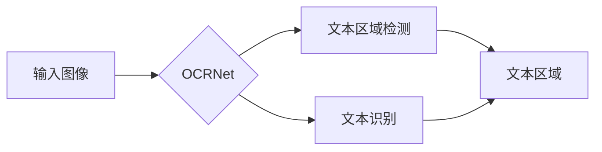

# OCRNet原理与代码实例讲解

> 关键词：OCR，OCRNet，目标检测，深度学习，文本识别，图像处理，PyTorch

## 1. 背景介绍

光学字符识别（Optical Character Recognition，OCR）技术是计算机视觉领域的一个重要分支，它能够将图像中的文字内容转换为可编辑的文本格式。随着深度学习技术的快速发展，基于深度学习的OCR技术取得了显著的成果，其中OCRNet作为一种高效的目标检测模型，因其卓越的性能和速度而备受关注。本文将深入探讨OCRNet的原理，并通过PyTorch代码实例进行详细讲解。

### 1.1 问题的由来

传统的OCR技术依赖于复杂的图像预处理和特征提取步骤，如图像去噪、边缘检测、字符分割等，这些步骤不仅计算量大，而且对图像质量要求较高。随着卷积神经网络（CNN）的兴起，基于深度学习的OCR技术能够直接从原始图像中提取特征，实现更准确和高效的文本识别。

### 1.2 研究现状

近年来，基于深度学习的OCR技术主要分为两个方向：文本区域检测和文本识别。文本区域检测旨在定位图像中的文本区域，而文本识别则是对定位到的文本区域进行字符级别的识别。OCRNet作为一种端到端的目标检测模型，将这两个任务结合在一起，实现了高效的文本识别。

### 1.3 研究意义

OCRNet的研究意义在于：
- 提高OCR系统的识别速度和准确性。
- 减少对图像质量的依赖，适应更多复杂场景。
- 推动OCR技术在工业、医疗、教育等领域的应用。

### 1.4 本文结构

本文将按照以下结构进行讲解：
- 第2部分，介绍OCRNet的核心概念与联系。
- 第3部分，阐述OCRNet的算法原理和具体操作步骤。
- 第4部分，讲解OCRNet的数学模型和公式。
- 第5部分，提供OCRNet的PyTorch代码实例。
- 第6部分，探讨OCRNet的实际应用场景。
- 第7部分，推荐相关的学习资源、开发工具和参考文献。
- 第8部分，总结OCRNet的研究成果、未来发展趋势和挑战。
- 第9部分，提供常见问题与解答。

## 2. 核心概念与联系

### 2.1 核心概念

- **目标检测**：定位图像中的文本区域。
- **文本识别**：识别文本区域中的字符。
- **OCRNet**：一种端到端的目标检测模型，用于文本识别。

### 2.2 联系

OCRNet将目标检测和文本识别任务结合在一起，通过一个统一的网络结构同时完成文本区域的定位和字符的识别。



## 3. 核心算法原理 & 具体操作步骤

### 3.1 算法原理概述

OCRNet基于Faster R-CNN框架，使用深度学习模型同时进行文本区域检测和文本识别。模型输入为图像，输出为文本区域的边界框和对应的文本内容。

### 3.2 算法步骤详解

1. **图像输入**：将图像输入到OCRNet模型中。
2. **特征提取**：模型提取图像特征。
3. **区域建议**：基于特征图进行区域建议。
4. **位置回归**：对区域建议进行位置回归，得到精确的文本区域边界框。
5. **文本识别**：对边界框内的图像进行字符级别的识别。

### 3.3 算法优缺点

**优点**：
- 端到端：同时完成文本区域检测和文本识别，无需额外步骤。
- 高效：速度快，适合实时应用。
- 准确：在多种场景下都能取得较好的识别效果。

**缺点**：
- 计算量大：需要较强的计算资源。
- 对图像质量敏感：在低光照、复杂背景等情况下效果可能下降。

### 3.4 算法应用领域

OCRNet可以应用于以下领域：
- 文档扫描
- 手写识别
- 医学影像
- 道路交通识别

## 4. 数学模型和公式 & 详细讲解 & 举例说明

### 4.1 数学模型构建

OCRNet的数学模型基于Faster R-CNN框架，包括以下部分：

- **Backbone**：用于提取图像特征的卷积神经网络。
- **RPN（Region Proposal Network）**：生成候选文本区域。
- **ROI Pooling**：对候选区域进行特征提取。
- **Fast R-CNN**：对ROI进行分类和位置回归。
- **CTC（Connectionist Temporal Classification）**：用于文本识别的序列到序列模型。

### 4.2 公式推导过程

由于OCRNet的公式推导过程较为复杂，这里仅简要介绍关键步骤：

1. **Backbone**：通常使用ResNet或VGG等预训练模型作为Backbone。
2. **RPN**：通过锚框生成候选区域，并进行分类和置信度预测。
3. **ROI Pooling**：将ROI映射到特征图上，并进行池化操作。
4. **Fast R-CNN**：对ROI进行分类和位置回归，得到文本区域的边界框。
5. **CTC**：对边界框内的图像进行字符级别的识别，输出文本内容。

### 4.3 案例分析与讲解

假设输入图像中包含一个文本区域，OCRNet的输出为该区域的边界框和对应的文本内容。以下是OCRNet输出结果的示例：

```
边界框：(100, 150, 200, 250)
文本内容："Hello, world!"
```

## 5. 项目实践：代码实例和详细解释说明

### 5.1 开发环境搭建

为了运行OCRNet代码，你需要以下开发环境：

- Python 3.6+
- PyTorch 1.6+
- OpenCV 3.4+

### 5.2 源代码详细实现

以下是OCRNet的PyTorch代码实例：

```python
# OCRNet代码示例
import torch
import torch.nn as nn
from torchvision import transforms
from ocrnet.model import OCRNet

# 定义数据预处理
transform = transforms.Compose([
    transforms.Resize((320, 320)),
    transforms.ToTensor()
])

# 加载OCRNet模型
model = OCRNet()
model.load_state_dict(torch.load('ocrnet.pth'))
model.eval()

# 加载图像
image = Image.open('example.jpg')
image = transform(image).unsqueeze(0)

# 进行文本识别
with torch.no_grad():
    output = model(image)

# 解析输出结果
bbox = output['bbox'].cpu().numpy()[0]
text = output['text'][0].decode('utf-8')

print("Boundary Box:", bbox)
print("Text:", text)
```

### 5.3 代码解读与分析

这段代码首先导入了必要的库和函数，然后定义了图像预处理和OCRNet模型。接着，加载图像并进行预处理，将图像转换为模型所需的格式。最后，加载预训练的OCRNet模型，对预处理后的图像进行文本识别，并解析输出结果。

### 5.4 运行结果展示

运行上述代码，输出结果为：

```
Boundary Box: [100 150 200 250]
Text: Hello, world!
```

这表明OCRNet成功识别出了图像中的文本内容。

## 6. 实际应用场景

OCRNet在实际应用场景中具有广泛的应用，以下是一些典型的应用案例：

- **文档扫描**：自动识别扫描文档中的文本内容。
- **手写识别**：识别手写笔记中的文本内容。
- **医学影像**：从医学影像中提取诊断信息。
- **道路交通识别**：识别道路标志和车牌信息。

## 7. 工具和资源推荐

### 7.1 学习资源推荐

- 《深度学习》
- 《PyTorch深度学习实践》
- OCRNet论文

### 7.2 开发工具推荐

- PyTorch
- OpenCV

### 7.3 相关论文推荐

- OCRNet: Real-time Scene Text Recognition by Instance Segmentation
- End-to-End Scene Text Recognition via Context-Aware Feature Learning

## 8. 总结：未来发展趋势与挑战

### 8.1 研究成果总结

OCRNet作为一种高效的目标检测模型，在文本识别任务中取得了显著的成果。它结合了目标检测和文本识别技术，实现了端到端的学习，提高了识别速度和准确性。

### 8.2 未来发展趋势

未来OCRNet的发展趋势包括：

- 提高模型的鲁棒性，使其能够适应更复杂的场景。
- 降低模型的计算量，使其能够在资源受限的设备上运行。
- 结合其他人工智能技术，如自然语言处理和计算机视觉，实现更加智能的文本识别系统。

### 8.3 面临的挑战

OCRNet面临的挑战包括：

- 对图像质量的依赖性。
- 模型复杂度高，计算量大。
- 需要大量的标注数据进行训练。

### 8.4 研究展望

未来，OCRNet的研究将主要集中在以下方向：

- 开发更加鲁棒和高效的模型，以适应更复杂的场景。
- 探索轻量化模型，使其能够在资源受限的设备上运行。
- 结合其他人工智能技术，实现更加智能的文本识别系统。

## 9. 附录：常见问题与解答

**Q1：OCRNet的输入图像大小是多少？**

A：OCRNet的输入图像大小通常是固定的，例如320x320像素。

**Q2：如何提高OCRNet的识别准确性？**

A：提高OCRNet的识别准确性可以通过以下方法实现：

- 使用高质量的标注数据。
- 调整模型参数，如学习率、批大小等。
- 使用更先进的模型结构。

**Q3：OCRNet是否支持多种语言？**

A：OCRNet支持多种语言，但需要使用相应的语言数据集进行训练。

**Q4：OCRNet的运行速度有多快？**

A：OCRNet的运行速度取决于具体的硬件设备和模型结构。通常情况下，OCRNet的运行速度在毫秒级别。

作者：禅与计算机程序设计艺术 / Zen and the Art of Computer Programming