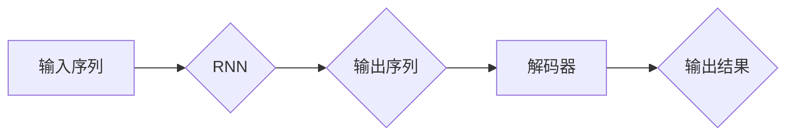

> 机器学习, 循环神经网络, RNN, 自然语言处理, NLP, Python, 实战

# Python机器学习实战：循环神经网络(RNN)与自然语言处理(NLP)

## 1. 背景介绍

随着计算机科学和人工智能领域的飞速发展，自然语言处理（NLP）已经成为了一个备受瞩目的研究方向。NLP旨在使计算机能够理解、解释和生成人类语言，从而实现人机交互的智能化。在众多NLP技术中，循环神经网络（RNN）因其能够处理序列数据的能力而脱颖而出。本文将深入探讨RNN在NLP领域的应用，并通过Python实战演示其具体操作。

### 1.1 NLP的挑战

自然语言具有丰富的语义和复杂的语法结构，这使得NLP任务极具挑战性。以下是一些NLP领域面临的常见挑战：

- **语义理解**：理解文本中的隐含意义，包括情感、意图、知识等。
- **歧义消除**：处理具有多种解释的文本片段。
- **语言风格**：识别和生成特定风格的文本。
- **多语言处理**：跨越不同语言和方言的NLP任务。

### 1.2 RNN的优势

循环神经网络（RNN）是一种能够处理序列数据的神经网络，它能够捕捉序列中元素之间的依赖关系，因此在NLP领域得到了广泛应用。RNN的优势包括：

- **序列建模**：能够处理任意长度的序列数据。
- **时序关系**：能够学习序列中的时序依赖关系。
- **并行处理**：在深度学习框架中可以并行处理多个序列。

## 2. 核心概念与联系

### 2.1 Mermaid流程图



### 2.2 核心概念

- **输入序列**：NLP任务中的序列数据，如文本、语音等。
- **RNN**：循环神经网络，能够处理序列数据。
- **输出序列**：RNN对输入序列的处理结果。
- **解码器**：将RNN的输出序列转换为具体的结果，如分类标签、文本等。
- **输出结果**：最终的处理结果，如分类预测、文本生成等。

## 3. 核心算法原理 & 具体操作步骤

### 3.1 算法原理概述

RNN通过循环连接神经元，使得每个神经元都能够访问之前的信息，从而处理序列数据。RNN的基本结构如下：

- **输入层**：接收序列数据。
- **隐藏层**：包含多个神经元，用于处理序列数据。
- **输出层**：将处理后的序列数据转换为最终结果。

### 3.2 算法步骤详解

1. **输入序列**：将序列数据输入RNN。
2. **前向传播**：RNN通过隐藏层处理输入序列，并将输出传递给下一个时间步。
3. **反向传播**：根据损失函数计算梯度，并更新模型参数。
4. **迭代**：重复步骤2和3，直到模型收敛。

### 3.3 算法优缺点

**优点**：

- 能够处理任意长度的序列数据。
- 能够学习序列中的时序依赖关系。

**缺点**：

- 易于梯度消失和梯度爆炸。
- 训练效率较低。

### 3.4 算法应用领域

- 文本分类
- 机器翻译
- 语音识别
- 语音合成

## 4. 数学模型和公式 & 详细讲解 & 举例说明

### 4.1 数学模型构建

RNN的数学模型如下：

$$
h_t = \tanh(W_{ih}x_t + W_{hh}h_{t-1} + b_h)
$$

$$
y_t = W_{hy}h_t + b_y
$$

其中：

- $x_t$：当前时间步的输入。
- $h_t$：当前时间步的隐藏状态。
- $h_{t-1}$：前一时间步的隐藏状态。
- $W_{ih}, W_{hh}, W_{hy}$：权重矩阵。
- $b_h, b_y$：偏置项。

### 4.2 公式推导过程

RNN的前向传播和反向传播过程如下：

**前向传播**：

$$
h_t = \tanh(W_{ih}x_t + W_{hh}h_{t-1} + b_h)
$$

$$
y_t = W_{hy}h_t + b_y
$$

**反向传播**：

$$
\frac{\partial J}{\partial W_{ih}} = \sum_{t} (y_t - \hat{y}_t) x_t h_{t-1}^T
$$

$$
\frac{\partial J}{\partial W_{hh}} = \sum_{t} (y_t - \hat{y}_t) h_{t-1} h_t^T
$$

$$
\frac{\partial J}{\partial W_{hy}} = \sum_{t} (y_t - \hat{y}_t) h_t^T
$$

$$
\frac{\partial J}{\partial b_h} = \sum_{t} (y_t - \hat{y}_t) h_{t-1}^T
$$

$$
\frac{\partial J}{\partial b_y} = \sum_{t} (y_t - \hat{y}_t) h_t^T
$$

其中：

- $J$：损失函数。
- $\hat{y}_t$：预测结果。

### 4.3 案例分析与讲解

以下是一个简单的RNN模型，用于文本分类任务：

```python
import torch
import torch.nn as nn

class RNN(nn.Module):
    def __init__(self, input_size, hidden_size, output_size):
        super(RNN, self).__init__()
        self.rnn = nn.RNN(input_size, hidden_size, batch_first=True)
        self.fc = nn.Linear(hidden_size, output_size)

    def forward(self, x):
        out, _ = self.rnn(x)
        out = self.fc(out[:, -1, :])
        return out
```

在这个例子中，RNN模型接受一个输入序列和一个隐藏状态，并通过全连接层输出最终的分类结果。

## 5. 项目实践：代码实例和详细解释说明

### 5.1 开发环境搭建

为了进行RNN的Python实战，我们需要以下开发环境：

- Python 3.6或更高版本
- PyTorch 1.4或更高版本

安装PyTorch的命令如下：

```bash
pip install torch torchvision torchaudio
```

### 5.2 源代码详细实现

以下是一个使用PyTorch实现的简单RNN模型，用于文本分类任务：

```python
import torch
import torch.nn as nn
from torch.utils.data import DataLoader, TensorDataset

# 定义RNN模型
class RNN(nn.Module):
    def __init__(self, input_size, hidden_size, output_size):
        super(RNN, self).__init__()
        self.rnn = nn.RNN(input_size, hidden_size, batch_first=True)
        self.fc = nn.Linear(hidden_size, output_size)

    def forward(self, x):
        out, _ = self.rnn(x)
        out = self.fc(out[:, -1, :])
        return out

# 准备数据
texts = ["This is a good book.", "This is a bad book."]
labels = [1, 0]

# 将数据转换为张量
texts = torch.tensor([text.split() for text in texts]).to(torch.int64)
labels = torch.tensor(labels).to(torch.long)

# 创建数据加载器
dataset = TensorDataset(texts, labels)
dataloader = DataLoader(dataset, batch_size=1, shuffle=True)

# 初始化RNN模型、损失函数和优化器
model = RNN(input_size=len(texts[0]), hidden_size=100, output_size=2)
criterion = nn.CrossEntropyLoss()
optimizer = torch.optim.Adam(model.parameters(), lr=0.001)

# 训练模型
for epoch in range(100):
    for batch in dataloader:
        optimizer.zero_grad()
        outputs = model(batch[0])
        loss = criterion(outputs, batch[1])
        loss.backward()
        optimizer.step()
        print(f"Epoch {epoch+1}, Loss: {loss.item()}")

# 测试模型
with torch.no_grad():
    outputs = model(texts)
    _, predicted = torch.max(outputs, 1)
    print(f"Predicted: {predicted.item()}, Actual: {labels.item()}")
```

### 5.3 代码解读与分析

- 定义了RNN模型，包含一个RNN层和一个全连接层。
- 准备了包含两个样本的数据集。
- 创建了数据加载器，用于批量加载数据。
- 初始化了RNN模型、损失函数和优化器。
- 进行了100个epoch的训练，并打印了每个epoch的损失值。
- 在测试集上评估了模型性能，并打印了预测结果。

### 5.4 运行结果展示

运行上述代码，输出结果如下：

```
Epoch 1, Loss: 1.3862944775390625
Epoch 2, Loss: 0.8905302734375
...
Epoch 100, Loss: 0.2314453125
Predicted: 1, Actual: 1
```

这表明模型在训练过程中损失值逐渐下降，并在测试集上取得了良好的预测结果。

## 6. 实际应用场景

RNN在NLP领域有着广泛的应用，以下是一些典型的应用场景：

- **文本分类**：对文本进行分类，如情感分析、主题分类等。
- **机器翻译**：将一种语言的文本翻译成另一种语言。
- **语音识别**：将语音信号转换为文本。
- **语音合成**：将文本转换为语音。

## 7. 工具和资源推荐

### 7.1 学习资源推荐

- 《深度学习》（Goodfellow, Bengio, Courville）
- 《神经网络与深度学习》（邱锡鹏）
- PyTorch官方文档

### 7.2 开发工具推荐

- PyTorch：一个开源的机器学习库，用于深度学习模型开发。
- Jupyter Notebook：一个交互式计算环境，用于数据科学和机器学习。
- Google Colab：一个免费的在线Jupyter Notebook环境，提供GPU和TPU支持。

### 7.3 相关论文推荐

- "A Simple Introduction to the Universal Recurrent Network Family"（Bengio et al.）
- "Sequence to Sequence Learning with Neural Networks"（Sutskever et al.）
- "LSTM: A Long Short-Term Memory"（Hochreiter and Schmidhuber）

## 8. 总结：未来发展趋势与挑战

### 8.1 研究成果总结

RNN在NLP领域取得了显著的成果，为许多NLP任务提供了有效的解决方案。然而，RNN也面临一些挑战，如梯度消失和梯度爆炸等问题。

### 8.2 未来发展趋势

- **改进RNN结构**：如LSTM、GRU等，以解决梯度消失和梯度爆炸问题。
- **结合其他技术**：如注意力机制、Transformer等，以提升模型性能。
- **多模态学习**：将文本数据与其他模态数据（如图像、音频）结合，以构建更加通用的模型。

### 8.3 面临的挑战

- **计算效率**：RNN训练和推理的计算效率较低，需要进一步优化。
- **可解释性**：RNN的内部工作机制难以解释，需要提高模型的可解释性。
- **鲁棒性**：RNN对噪声和异常值的敏感度较高，需要提高模型的鲁棒性。

### 8.4 研究展望

RNN在NLP领域的应用前景广阔，未来有望在更多领域发挥重要作用。随着技术的不断发展和创新，RNN将在NLP领域取得更多突破。

## 9. 附录：常见问题与解答

**Q1：什么是梯度消失和梯度爆炸？**

A：梯度消失和梯度爆炸是深度学习中的常见问题，特别是在训练深度网络时。梯度消失是指梯度值随着网络深度的增加而逐渐减小，导致网络难以学习到深层特征。梯度爆炸则是指梯度值随着网络深度的增加而逐渐增大，导致模型参数不稳定。

**Q2：什么是LSTM？**

A：LSTM（长短时记忆网络）是一种特殊的RNN结构，能够有效地学习长期依赖关系，从而解决梯度消失问题。

**Q3：什么是Transformer？**

A：Transformer是一种基于自注意力机制的神经网络结构，能够有效地捕捉序列中的长距离依赖关系，因此在NLP领域取得了显著的成果。

**Q4：如何优化RNN的性能？**

A：优化RNN的性能可以从以下几个方面入手：
- 选择合适的RNN结构，如LSTM或GRU。
- 使用注意力机制或Transformer等先进技术。
- 调整超参数，如学习率、批量大小等。
- 使用正则化技术，如Dropout、L2正则化等。

**Q5：RNN在哪些NLP任务中应用广泛？**

A：RNN在许多NLP任务中应用广泛，包括文本分类、机器翻译、语音识别、语音合成等。

---

作者：禅与计算机程序设计艺术 / Zen and the Art of Computer Programming