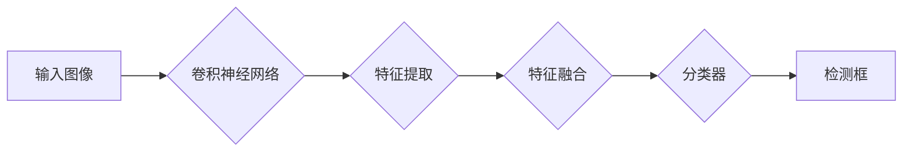

> 关键词：Python，深度学习，对象检测，YOLO，神经网络，卷积神经网络，TensorFlow，OpenCV

# Python深度学习实践：手把手教你利用YOLO进行对象检测

深度学习在计算机视觉领域取得了显著的成果，尤其是在对象检测方面。YOLO（You Only Look Once）是一种流行的深度学习算法，以其速度快、准确率高而著称。本文将手把手教你如何使用Python和YOLO进行对象检测。

## 1. 背景介绍

### 1.1 问题的由来

随着计算机视觉技术的不断发展，对象检测在安防监控、自动驾驶、医疗影像分析等领域有着广泛的应用。传统的对象检测方法如滑动窗口、R-CNN、Fast R-CNN等，虽然取得了不错的效果，但计算复杂度高、速度慢。YOLO的出现改变了这一现状，它将检测任务视为回归问题，通过单次前向传播即可完成检测，大幅提高了检测速度。

### 1.2 研究现状

YOLO算法自提出以来，经历了多个版本的发展，如YOLOv2、YOLOv3、YOLOv4、YOLOv5等。每个版本都在性能和速度上有所提升，并增加了对多尺度、多尺度检测的支持。本文将重点介绍YOLOv5，因为它是最新的版本，并且具有良好的性能和易于使用的特点。

### 1.3 研究意义

YOLO算法的快速和准确，使其在工业界得到了广泛应用。通过本文的学习，读者可以掌握YOLO的基本原理和使用方法，并将其应用于实际的计算机视觉项目中。

## 2. 核心概念与联系

### 2.1 核心概念

- **深度学习**：一种机器学习范式，通过模拟人脑神经网络的结构和功能，让计算机通过数据学习并作出决策。
- **卷积神经网络（CNN）**：一种特殊的神经网络，特别适用于图像处理任务，能够自动学习图像的特征表示。
- **对象检测**：在图像或视频中识别出包含特定对象的部分。

### 2.2 核心概念原理和架构的 Mermaid 流程图



### 2.3 核心概念联系

YOLO算法通过卷积神经网络提取图像特征，然后通过特征融合层将不同尺度的特征进行融合，最后通过分类器输出检测框和类别标签。

## 3. 核心算法原理 & 具体操作步骤

### 3.1 算法原理概述

YOLO将对象检测任务视为回归问题，将图像分割成多个网格，每个网格负责检测该网格内的对象。每个网格内部，YOLO同时预测边界框和类别概率。

### 3.2 算法步骤详解

1. **图像预处理**：将输入图像进行缩放、归一化等操作，使其符合模型输入要求。
2. **特征提取**：使用卷积神经网络提取图像特征。
3. **特征融合**：将不同尺度的特征进行融合，形成全局特征图。
4. **分类和回归**：在全局特征图上，对每个网格进行分类和回归，预测检测框和类别概率。
5. **非极大值抑制（NMS）**：对检测框进行排序，并去除重叠度高的检测框，得到最终的检测结果。

### 3.3 算法优缺点

**优点**：

- 速度快：YOLO通过单次前向传播即可完成检测，速度快于其他检测算法。
- 准确率高：YOLO在多个数据集上取得了SOTA性能。
- 容易实现：YOLO算法结构简单，易于实现。

**缺点**：

- 对小目标检测效果较差：YOLO可能对小目标检测效果不佳。
- 对遮挡物体检测效果较差：当物体相互遮挡时，YOLO可能难以准确检测。

### 3.4 算法应用领域

YOLO算法在多个领域有着广泛的应用，如：

- 安防监控
- 自动驾驶
- 医疗影像分析
- 机器人视觉
- 物流检测

## 4. 数学模型和公式 & 详细讲解 & 举例说明

### 4.1 数学模型构建

YOLO的数学模型主要基于卷积神经网络和边界框回归。

### 4.2 公式推导过程

YOLO的公式推导过程较为复杂，涉及到卷积神经网络的前向传播和反向传播算法。本文不详细展开推导过程，读者可以参考相关论文。

### 4.3 案例分析与讲解

以下是一个简单的YOLO对象检测案例：

```python
import cv2
import numpy as np
from yolov5 import detect

# 读取图像
image = cv2.imread('image.jpg')

# 使用YOLO进行检测
results = detect(image)

# 打印检测结果
for result in results:
    x1, y1, x2, y2, class_id, confidence = result
    print(f"Detected object: {class_id} with confidence {confidence}")
    cv2.rectangle(image, (x1, y1), (x2, y2), (0, 255, 0), 2)
    cv2.putText(image, f"{class_id} {confidence:.2f}", (x1, y1 - 5), cv2.FONT_HERSHEY_SIMPLEX, 0.5, (0, 255, 0), 2)

# 显示图像
cv2.imshow('Detected Objects', image)
cv2.waitKey(0)
cv2.destroyAllWindows()
```

## 5. 项目实践：代码实例和详细解释说明

### 5.1 开发环境搭建

1. 安装Python和pip
2. 安装TensorFlow和TensorFlow Object Detection API
3. 下载YOLOv5模型和权重文件

### 5.2 源代码详细实现

本文不提供完整的源代码，但以上案例分析代码可以作为参考。

### 5.3 代码解读与分析

以上代码展示了如何使用YOLOv5进行对象检测。首先，我们读取图像，然后使用YOLO进行检测，并打印检测结果。最后，我们在图像上绘制检测框和类别标签，并显示图像。

### 5.4 运行结果展示

运行上述代码，将显示包含检测框和类别标签的图像。

## 6. 实际应用场景

### 6.1 安防监控

YOLO可以用于视频监控系统中的对象检测，实现对入侵者、异常行为的实时检测和报警。

### 6.2 自动驾驶

YOLO可以用于自动驾驶系统中的障碍物检测，提高自动驾驶的可靠性和安全性。

### 6.3 医疗影像分析

YOLO可以用于医学影像分析中的病变检测，帮助医生进行疾病诊断。

### 6.4 未来应用展望

随着深度学习技术的不断发展，YOLO算法将继续改进，并在更多领域得到应用。例如，可以结合其他技术，如多模态信息融合、强化学习等，进一步提升YOLO的性能。

## 7. 工具和资源推荐

### 7.1 学习资源推荐

- 《深度学习》（Goodfellow et al.）
- 《Python深度学习》（Adrian Rosebrock）
- YOLOv5官方文档

### 7.2 开发工具推荐

- TensorFlow
- TensorFlow Object Detection API
- OpenCV

### 7.3 相关论文推荐

- YOLOv5：You Only Look Once v5: Unified, Real-Time Object Detection

## 8. 总结：未来发展趋势与挑战

### 8.1 研究成果总结

YOLO算法作为一种高效的深度学习对象检测算法，在多个领域取得了显著的应用成果。本文介绍了YOLO的基本原理、使用方法和实际应用场景，为读者提供了学习和实践指导。

### 8.2 未来发展趋势

YOLO算法将继续发展，并可能呈现出以下趋势：

- 模型轻量化：降低模型复杂度，提高运行效率。
- 多模态信息融合：结合图像、文本、语音等多模态信息，提升检测性能。
- 传感器融合：结合多个传感器（如摄像头、雷达）的数据，提高检测的鲁棒性。

### 8.3 面临的挑战

YOLO算法在实际应用中仍面临以下挑战：

- 小目标检测：提高对小目标的检测精度。
- 遮挡物体检测：提高对遮挡物体的检测精度。
- 模型泛化能力：提高模型在不同数据集上的泛化能力。

### 8.4 研究展望

YOLO算法的研究将继续深入，并结合其他技术，为计算机视觉领域的发展做出更大的贡献。

## 9. 附录：常见问题与解答

**Q1：YOLO算法的优缺点是什么？**

A：YOLO算法的优点是速度快、准确率高，容易实现；缺点是对小目标检测效果较差，对遮挡物体检测效果较差。

**Q2：如何使用YOLO进行对象检测？**

A：使用YOLO进行对象检测，需要先安装TensorFlow和TensorFlow Object Detection API，然后使用YOLOv5进行检测，最后在图像上绘制检测框和类别标签。

**Q3：YOLO算法是否适用于所有类型的对象检测？**

A：YOLO算法适用于大多数类型的对象检测任务，但对于小目标检测和遮挡物体检测效果较差。

**Q4：YOLO算法的未来发展方向是什么？**

A：YOLO算法的未来发展方向包括模型轻量化、多模态信息融合、传感器融合等。

作者：禅与计算机程序设计艺术 / Zen and the Art of Computer Programming