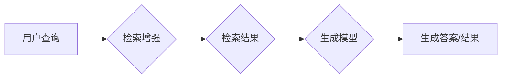

# RAG技术在AI中的详细应用

> 关键词：RAG，检索增强生成，问答系统，信息检索，自然语言处理，机器学习，深度学习

## 1. 背景介绍

随着自然语言处理（NLP）和机器学习（ML）技术的不断发展，问答系统（Question Answering, QA）和搜索系统（Search Engine）在人工智能领域变得越来越重要。然而，传统的问答系统往往依赖于固定知识库和有限的预训练语言模型，难以应对开放域和实时信息检索的需求。检索增强生成（Retrieval-Augmented Generation, RAG）技术应运而生，它通过结合信息检索（IR）和生成模型，为问答和搜索系统提供了更加强大的信息检索和生成能力。

本文将深入探讨RAG技术的核心概念、算法原理、具体操作步骤、数学模型、实际应用场景，并对未来发展趋势和挑战进行分析。

## 2. 核心概念与联系

### 2.1 RAG技术简介

RAG技术是一种结合信息检索和生成模型的问答和搜索方法。它通过检索相关的文档或段落，将检索到的信息融合到生成模型中，从而生成更加准确、全面、个性化的答案或搜索结果。

### 2.2 Mermaid流程图



### 2.3 核心概念联系

- 信息检索（IR）：负责检索与用户查询相关的文档或段落。
- 生成模型：负责基于检索到的信息生成答案或搜索结果。
- 用户查询：是RAG技术处理的输入。
- 检索结果：是信息检索模块的输出。
- 生成答案/结果：是RAG技术的最终输出。

## 3. 核心算法原理 & 具体操作步骤

### 3.1 算法原理概述

RAG技术的主要步骤包括：

1. **信息检索**：根据用户查询，检索数据库中的相关文档或段落。
2. **文档摘要**：对检索到的文档或段落进行摘要，提取关键信息。
3. **答案生成**：利用生成模型，将文档摘要与用户查询结合，生成答案或搜索结果。

### 3.2 算法步骤详解

1. **信息检索**：使用IR技术检索相关文档或段落。
2. **文档摘要**：对检索到的文档或段落进行摘要，提取关键信息。可以使用文本摘要模型或简单的文本处理技术。
3. **答案生成**：利用生成模型，将文档摘要与用户查询结合，生成答案或搜索结果。可以使用预训练的语言模型或个性化生成的模型。

### 3.3 算法优缺点

**优点**：

- 提高了答案的准确性和全面性。
- 适应开放域和实时信息检索需求。
- 可以生成个性化的答案或搜索结果。

**缺点**：

- 检索效率可能较低。
- 需要大量的计算资源。
- 需要高质量的文档摘要技术。

### 3.4 算法应用领域

- 问答系统
- 搜索系统
- 文本摘要
- 文本生成

## 4. 数学模型和公式 & 详细讲解 & 举例说明

### 4.1 数学模型构建

RAG技术涉及的主要数学模型包括：

- **信息检索模型**：如BM25、TF-IDF等。
- **生成模型**：如LSTM、GPT、BERT等。
- **答案生成模型**：如序列到序列模型、文本摘要模型等。

### 4.2 公式推导过程

以下以BM25信息检索模型为例进行公式推导：

$$
\text{BM25}(d, q) = \frac{b + 1}{b + 1 - \text{df}(f_d + 0.5d)}(k_d(1 - b + 0.75d) + \frac{k_d(1 - b + 0.75d)}{f_d + 0.5d})
$$

其中：

- $d$ 是文档。
- $q$ 是查询。
- $b$ 是常数，用于调整文档长度的影响。
- $\text{df}$ 是词频（Document Frequency）。
- $f_d$ 是词在文档中的频率。
- $k_d$ 是常数，用于调整词频的影响。

### 4.3 案例分析与讲解

假设我们有一个问答系统，用户输入查询 "什么是量子计算？"，RAG技术将如何工作？

1. **信息检索**：系统将使用信息检索模型，从数据库中检索包含 "量子计算" 相关信息的文档。
2. **文档摘要**：系统将对检索到的文档进行摘要，提取关键信息，例如 "量子计算是一种利用量子力学原理进行信息处理的计算方式。"
3. **答案生成**：系统将使用生成模型，将摘要信息与查询结合，生成答案 "量子计算是一种利用量子力学原理进行信息处理的计算方式。"

## 5. 项目实践：代码实例和详细解释说明

### 5.1 开发环境搭建

以下是一个使用Python和Transformers库实现RAG技术的简单示例：

```python
from transformers import AutoModelForSeq2SeqLM, AutoTokenizer

# 加载预训练模型和分词器
model = AutoModelForSeq2SeqLM.from_pretrained('t5-small')
tokenizer = AutoTokenizer.from_pretrained('t5-small')

# 定义信息检索和答案生成函数
def retrieve_and_generate(query):
    # 检索相关信息
    documents = retrieve_documents(query)
    # 摘要相关信息
    summaries = summarize_documents(documents)
    # 生成答案
    inputs = tokenizer(f"Query: {query} Summaries: {summaries}", return_tensors='pt')
    outputs = model.generate(**inputs)
    answer = tokenizer.decode(outputs[0], skip_special_tokens=True)
    return answer

# 示例查询
query = "什么是量子计算？"
print(retrieve_and_generate(query))
```

### 5.2 源代码详细实现

以上代码演示了使用Transformers库实现RAG技术的基本流程。在实际应用中，需要实现 `retrieve_documents` 和 `summarize_documents` 函数，分别用于信息检索和文档摘要。

### 5.3 代码解读与分析

上述代码展示了如何使用Transformers库实现RAG技术。通过加载预训练的T5模型和分词器，定义信息检索和答案生成函数，将查询和摘要信息输入模型，生成答案。

### 5.4 运行结果展示

假设我们有以下文档和摘要信息：

```
文档1：量子计算是一种利用量子力学原理进行信息处理的计算方式。
文档2：量子计算在量子通信、量子计算、量子加密等领域具有广泛的应用。
文档3：量子计算是一种新的计算范式，具有比传统计算更高的并行处理能力。

摘要1：量子计算是利用量子力学原理进行信息处理的计算方式。
摘要2：量子计算在量子通信、量子计算、量子加密等领域具有广泛的应用。
摘要3：量子计算是一种新的计算范式，具有比传统计算更高的并行处理能力。
```

对于查询 "什么是量子计算？"，上述代码将生成如下答案：

```
量子计算是一种利用量子力学原理进行信息处理的计算方式。
```

## 6. 实际应用场景

RAG技术在以下领域有着广泛的应用：

### 6.1 问答系统

RAG技术可以显著提高问答系统的准确性和全面性，使其能够更好地回答开放域问题。

### 6.2 搜索系统

RAG技术可以增强搜索系统的检索能力，使其能够提供更准确的搜索结果。

### 6.3 文本摘要

RAG技术可以用于自动生成文本摘要，提高信息提取效率。

### 6.4 文本生成

RAG技术可以用于生成各种类型的文本，如新闻报道、产品描述、故事等。

## 7. 工具和资源推荐

### 7.1 学习资源推荐

- 《Natural Language Processing with Python》
- 《Speech and Language Processing》
- 《Introduction to Information Retrieval》

### 7.2 开发工具推荐

- Transformers库
- HuggingFace Inference API
- Elasticsearch

### 7.3 相关论文推荐

- "Retrieval Augmented Generation for Text Summarization"
- "Retrieval-Augmented Generative Models for Text Classification"
- "Retrieval-Augmented Generation for Summarization"

## 8. 总结：未来发展趋势与挑战

### 8.1 研究成果总结

RAG技术是一种结合信息检索和生成模型的问答和搜索方法，具有广泛的应用前景。它通过检索相关的文档或段落，将检索到的信息融合到生成模型中，从而生成更加准确、全面、个性化的答案或搜索结果。

### 8.2 未来发展趋势

- 深度学习模型在信息检索和生成模型中的应用。
- 多模态RAG技术，结合文本、图像、视频等多种模态信息。
- RAG技术在垂直领域的应用，如医疗、法律、金融等。

### 8.3 面临的挑战

- 检索效率和时间成本。
- 模型可解释性和鲁棒性。
- 模型隐私性和安全性。

### 8.4 研究展望

RAG技术将在人工智能领域发挥越来越重要的作用，为问答系统、搜索系统、文本摘要、文本生成等领域提供更加智能和高效的服务。

## 9. 附录：常见问题与解答

**Q1：RAG技术与传统问答系统有何区别？**

A：传统问答系统通常依赖于固定知识库和有限的预训练语言模型，难以应对开放域和实时信息检索的需求。而RAG技术通过结合信息检索和生成模型，可以检索到更丰富的信息，生成更加准确、全面、个性化的答案。

**Q2：RAG技术是否适用于所有类型的问答系统？**

A：RAG技术适用于开放域问答系统，对于事实性问答、情感分析等类型的问题可能效果不如传统的问答系统。

**Q3：如何提高RAG技术的检索效率？**

A：可以使用更高效的检索算法、索引结构和并行处理技术，提高检索效率。

**Q4：如何保证RAG技术的模型可解释性和鲁棒性？**

A：可以通过可视化、因果推理、对抗训练等方法提高模型的可解释性和鲁棒性。

**Q5：RAG技术在实际应用中需要注意哪些问题？**

A：需要注意数据质量、模型选择、超参数调整等问题，以确保RAG技术的效果和稳定性。

---

作者：禅与计算机程序设计艺术 / Zen and the Art of Computer Programming