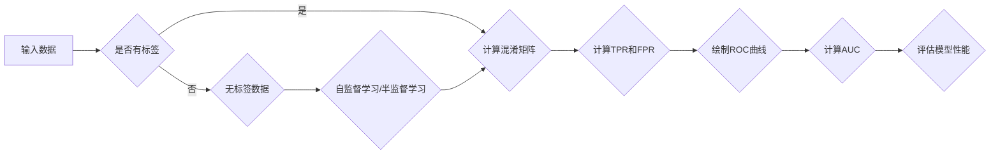

> 关键词：ROC曲线，混淆矩阵，分类评估，AUC，混淆矩阵，真阳性率，假阳性率，阈值优化

# ROC曲线原理与代码实例讲解

ROC曲线是机器学习领域常用的性能评估工具，特别是在二分类问题中，它能够直观地展示模型在不同阈值下的性能。本文将深入探讨ROC曲线的原理，并通过Python代码实例对其进行讲解，帮助读者更好地理解和应用这一重要工具。

## 1. 背景介绍

在机器学习领域，评估分类模型的性能至关重要。传统的评估指标如准确率、召回率等，在正负样本比例不平衡的情况下，可能无法全面反映模型的性能。ROC曲线和AUC（Area Under Curve）则能够克服这一局限性，为模型性能提供更为全面和可靠的评估。

### 1.1 问题的由来

在实际应用中，我们经常会遇到以下问题：
- 如何在没有足够标注数据的情况下评估模型的性能？
- 如何在不同阈值下评估模型的性能？
- 如何在正负样本比例不平衡的情况下评估模型的性能？

ROC曲线和AUC能够帮助我们解决上述问题。

### 1.2 研究现状

ROC曲线和AUC已经在机器学习领域得到了广泛的应用。许多开源库，如scikit-learn，都提供了计算ROC曲线和AUC的函数。此外，许多学术论文和书籍也对ROC曲线和AUC进行了深入的研究和讨论。

### 1.3 研究意义

ROC曲线和AUC能够帮助我们：
- 更全面地评估模型的性能。
- 选择最优的分类阈值。
- 比较不同模型的性能。

### 1.4 本文结构

本文将按照以下结构进行：
- 介绍ROC曲线的基本概念和原理。
- 使用Python代码实例进行讲解。
- 讨论ROC曲线在实际应用中的使用场景。
- 展望ROC曲线的未来发展趋势。

## 2. 核心概念与联系

### 2.1 核心概念

- **混淆矩阵**：一个表格，用于展示模型预测结果与实际标签之间的对比。
- **真阳性率（True Positive Rate, TPR）**：又称为召回率（Recall），指实际为正类的样本中被正确预测为正类的比例。
- **假阳性率（False Positive Rate, FPR）**：指实际为负类的样本中被错误预测为正类的比例。
- **ROC曲线**：通过改变分类阈值，绘制TPR与FPR之间的关系曲线。
- **AUC**：ROC曲线下方的面积，用于评估模型的性能。

### 2.2 Mermaid流程图



### 2.3 核心概念联系

ROC曲线和AUC与混淆矩阵、TPR和FPR等概念紧密相关。ROC曲线是通过TPR和FPR之间的关系来绘制的，而AUC则是ROC曲线下方的面积，用于评估模型的性能。

## 3. 核心算法原理 & 具体操作步骤

### 3.1 算法原理概述

ROC曲线是通过改变分类阈值，绘制TPR与FPR之间的关系曲线。在ROC曲线上，TPR的值始终大于等于FPR的值。AUC则是ROC曲线下方的面积，用于评估模型的性能。

### 3.2 算法步骤详解

1. 计算混淆矩阵。
2. 计算TPR和FPR。
3. 通过TPR和FPR的值绘制ROC曲线。
4. 计算AUC。

### 3.3 算法优缺点

**优点**：
- 能够全面地评估模型的性能。
- 适用于正负样本比例不平衡的情况。

**缺点**：
- ROC曲线和AUC对于阈值敏感，需要根据具体任务选择合适的阈值。
- ROC曲线和AUC不能直接比较不同类型模型的性能。

### 3.4 算法应用领域

ROC曲线和AUC在以下领域得到广泛应用：
- 医学诊断
- 金融风险评估
- 信用评分
- 情感分析

## 4. 数学模型和公式 & 详细讲解 & 举例说明

### 4.1 数学模型构建

- **混淆矩阵**：

$$
\begin{bmatrix}
\text{TP} & \text{FP} \\
\text{FN} & \text{TN}
\end{bmatrix}
$$

- **真阳性率（TPR）**：

$$
\text{TPR} = \frac{\text{TP}}{\text{TP} + \text{FN}}
$$

- **假阳性率（FPR）**：

$$
\text{FPR} = \frac{\text{FP}}{\text{FP} + \text{TN}}
$$

- **ROC曲线**：通过改变分类阈值，绘制TPR与FPR之间的关系曲线。

- **AUC**：ROC曲线下方的面积。

### 4.2 公式推导过程

ROC曲线的绘制和AUC的计算比较直观，不需要复杂的数学推导。

### 4.3 案例分析与讲解

假设我们有一个简单的二分类模型，它的预测结果如下表所示：

| 真实标签 | 预测标签 |
|----------|----------|
| 1        | 1        |
| 1        | 0        |
| 0        | 1        |
| 0        | 0        |

根据上述表格，我们可以计算出混淆矩阵、TPR、FPR、ROC曲线和AUC的值：

| 真实标签 | 预测标签 | 混淆矩阵 |
|----------|----------|----------|
| 1        | 1        | 1        |
| 1        | 0        | 1        |
| 0        | 1        | 1        |
| 0        | 0        | 1        |
|          |          | 4        |

- **TPR**：$\frac{2}{4} = 0.5$
- **FPR**：$\frac{2}{4} = 0.5$
- **ROC曲线**：由于TPR和FPR相等，ROC曲线将穿过坐标原点(0.5, 0.5)。
- **AUC**：$\frac{1}{2}$

这个例子展示了如何计算ROC曲线和AUC的值。

## 5. 项目实践：代码实例和详细解释说明

### 5.1 开发环境搭建

为了进行ROC曲线和AUC的计算，我们需要以下环境：

- Python
- scikit-learn库

### 5.2 源代码详细实现

以下是一个简单的Python代码实例，用于计算ROC曲线和AUC的值：

```python
from sklearn.metrics import roc_curve, auc
import matplotlib.pyplot as plt

# 预测结果和真实标签
y_true = [1, 1, 0, 0]
y_pred = [0.9, 0.2, 0.1, 0.8]

# 计算TPR和FPR
fpr, tpr, thresholds = roc_curve(y_true, y_pred)

# 计算AUC
roc_auc = auc(fpr, tpr)

# 绘制ROC曲线
plt.figure()
plt.plot(fpr, tpr, color='darkorange', lw=2, label='ROC curve (area = %0.2f)' % roc_auc)
plt.plot([0, 1], [0, 1], color='navy', lw=2, linestyle='--')
plt.xlim([0.0, 1.0])
plt.ylim([0.0, 1.05])
plt.xlabel('False Positive Rate')
plt.ylabel('True Positive Rate')
plt.title('Receiver Operating Characteristic')
plt.legend(loc="lower right")
plt.show()
```

### 5.3 代码解读与分析

- 首先，我们导入了必要的库。
- 然后，我们定义了预测结果和真实标签。
- 接着，我们使用`roc_curve`函数计算FPR和TPR。
- 然后，我们使用`auc`函数计算AUC。
- 最后，我们使用matplotlib绘制ROC曲线。

### 5.4 运行结果展示

运行上述代码后，我们将看到一个ROC曲线图，其中包含AUC的值。

## 6. 实际应用场景

ROC曲线和AUC在以下场景中非常有用：

- **医疗诊断**：在医疗诊断中，ROC曲线和AUC可以帮助我们评估疾病检测模型的性能。
- **金融风险评估**：在金融风险评估中，ROC曲线和AUC可以帮助我们评估欺诈检测模型的性能。
- **信用评分**：在信用评分中，ROC曲线和AUC可以帮助我们评估信用评分模型的性能。
- **情感分析**：在情感分析中，ROC曲线和AUC可以帮助我们评估情感分类模型的性能。

## 7. 工具和资源推荐

### 7.1 学习资源推荐

- **书籍**：
  - "An Introduction to Statistical Learning" by Gareth James, Daniela Witten, Trevor Hastie, and Robert Tibshirani
  - "Machine Learning: A Probabilistic Perspective" by Kevin P. Murphy
- **在线课程**：
  - "Machine Learning" by Andrew Ng on Coursera
  - "Practical Machine Learning with Python" by Peter Prettenhofer and Falko Mueller

### 7.2 开发工具推荐

- **Python库**：
  - scikit-learn
  - scikit-optimize
  - matplotlib

### 7.3 相关论文推荐

- **"An Introduction to Statistical Learning" by Gareth James, Daniela Witten, Trevor Hastie, and Robert Tibshirani**：这本书详细介绍了机器学习的各种方法和原理，包括ROC曲线和AUC。

## 8. 总结：未来发展趋势与挑战

### 8.1 研究成果总结

ROC曲线和AUC是机器学习中重要的性能评估工具，它们能够帮助我们全面地评估模型的性能，尤其是在正负样本比例不平衡的情况下。随着机器学习技术的不断发展，ROC曲线和AUC的应用将会越来越广泛。

### 8.2 未来发展趋势

- ROC曲线和AUC将会与其他性能评估方法结合，如PR曲线和F1分数。
- ROC曲线和AUC将会与其他机器学习方法结合，如集成学习和强化学习。
- ROC曲线和AUC将会在更多领域得到应用，如医疗、金融、教育等。

### 8.3 面临的挑战

- **阈值选择**：ROC曲线和AUC对于阈值敏感，需要根据具体任务选择合适的阈值。
- **多类别问题**：ROC曲线和AUC主要用于二分类问题，对于多类别问题需要进一步的研究。

### 8.4 研究展望

ROC曲线和AUC将会在机器学习领域发挥越来越重要的作用，为模型的性能评估提供更加全面和可靠的依据。

## 9. 附录：常见问题与解答

**Q1：ROC曲线和AUC有什么区别？**

A：ROC曲线是TPR与FPR之间的关系曲线，而AUC是ROC曲线下方的面积。AUC是ROC曲线的一个统计量，用于评估模型的性能。

**Q2：ROC曲线和AUC适用于所有分类问题吗？**

A：ROC曲线和AUC主要用于二分类问题，对于多类别问题需要进一步的研究。

**Q3：如何选择合适的分类阈值？**

A：选择合适的分类阈值取决于具体任务的需求。在医疗诊断中，我们可能更关注召回率，而在垃圾邮件检测中，我们可能更关注准确率。

**Q4：ROC曲线和AUC与其他性能评估方法相比有什么优势？**

A：ROC曲线和AUC能够全面地评估模型的性能，尤其是在正负样本比例不平衡的情况下。

**Q5：ROC曲线和AUC有哪些局限性？**

A：ROC曲线和AUC对于阈值敏感，需要根据具体任务选择合适的阈值。

作者：禅与计算机程序设计艺术 / Zen and the Art of Computer Programming