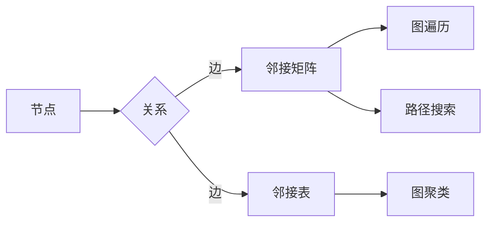

# 【AI大数据计算原理与代码实例讲解】图算法

> 关键词：图算法，深度学习，人工智能，大数据，图神经网络，图表示学习，图处理

## 1. 背景介绍

在当今的数据时代，图数据作为一种复杂关系数据的表示形式，广泛应用于社交网络、推荐系统、生物信息学、交通网络等领域。图算法作为处理图数据的理论基础和方法，近年来在人工智能和大数据领域得到了广泛的关注和研究。本文将深入探讨图算法的原理、实现和应用，并通过代码实例进行讲解，帮助读者更好地理解和掌握图算法。

### 1.1 问题的由来

随着互联网的快速发展，社交网络、知识图谱等大量图数据的出现，如何有效地处理和分析这些数据成为了一个重要的研究领域。传统的算法往往难以直接应用于图数据，因此，图算法应运而生。

### 1.2 研究现状

图算法的研究已经取得了丰硕的成果，包括图的遍历、搜索、路径优化、聚类、社区发现等。近年来，深度学习技术的引入使得图算法在性能和效率上得到了极大的提升。

### 1.3 研究意义

图算法在各个领域都有广泛的应用，例如：

- 社交网络分析：通过图算法分析社交网络中的关系，可以识别关键节点、推荐好友、预测用户行为等。
- 推荐系统：利用图算法分析用户和商品之间的关联，可以提供更加精准的推荐服务。
- 生物信息学：通过图算法分析生物分子网络，可以发现新的药物靶点、研究疾病机制等。
- 交通网络优化：利用图算法分析交通流量，可以优化交通路线、减少交通拥堵等。

### 1.4 本文结构

本文将按照以下结构展开：

- 第2部分，介绍图算法的核心概念与联系。
- 第3部分，详细阐述图算法的原理和具体操作步骤。
- 第4部分，通过数学模型和公式讲解图算法，并结合实例进行分析。
- 第5部分，给出图算法的代码实例，并进行详细解释说明。
- 第6部分，探讨图算法的实际应用场景和未来应用展望。
- 第7部分，推荐学习资源和开发工具。
- 第8部分，总结图算法的研究成果、发展趋势和挑战。
- 第9部分，提供常见问题的解答。

## 2. 核心概念与联系

### 2.1 核心概念

- **图（Graph）**：由节点（Vertex）和边（Edge）组成的集合，用于表示实体之间的关系。
- **邻接矩阵（Adjacency Matrix）**：用于表示图中节点之间关系的矩阵，行和列分别代表节点，矩阵的元素表示节点之间的连接关系。
- **邻接表（Adjacency List）**：用于表示图中节点之间关系的列表，每个节点对应一个列表，列表中的元素表示与该节点相连的其他节点。
- **图遍历（Graph Traversal）**：访问图中所有节点的过程，常用的遍历算法有深度优先搜索（DFS）和广度优先搜索（BFS）。
- **路径搜索（Path Search）**：在图中找到一条从起点到终点的路径，常用的算法有迪杰斯特拉算法（Dijkstra）和贝尔曼-福特算法（Bellman-Ford）。
- **最短路径（Shortest Path）**：图中起点到终点的最短路径，常用的算法有Dijkstra算法和Floyd-Warshall算法。
- **图聚类（Graph Clustering）**：将图中节点划分为若干个群体，每个群体内部的节点之间相似度较高，群体之间的相似度较低。

### 2.2 Mermaid 流程图



### 2.3 核心概念联系

图、节点、边是图数据的基本组成部分，邻接矩阵和邻接表是图数据的两种表示方法。图遍历、路径搜索和最短路径是图算法的基本操作，图聚类则是图数据分析的一种方法。

## 3. 核心算法原理 & 具体操作步骤

### 3.1 算法原理概述

图算法的核心原理是通过遍历、搜索、聚类等方法，对图数据进行处理和分析。

### 3.2 算法步骤详解

#### 3.2.1 深度优先搜索（DFS）

DFS算法是一种非破坏性的图遍历方法，从起始节点开始，沿着某一方向遍历，直到遍历到叶子节点或访问过所有节点。

#### 3.2.2 广度优先搜索（BFS）

BFS算法是一种破坏性的图遍历方法，从起始节点开始，依次遍历所有相邻节点，直到遍历到叶子节点或访问过所有节点。

#### 3.2.3 迪杰斯特拉算法（Dijkstra）

Dijkstra算法是一种单源最短路径算法，用于找到从源点到其他所有节点的最短路径。

#### 3.2.4 贝尔曼-福特算法（Bellman-Ford）

Bellman-Ford算法是一种单源最短路径算法，可以处理图中存在负权边的情况。

#### 3.2.5 图聚类

图聚类算法将图中的节点划分为若干个群体，每个群体内部的节点之间相似度较高，群体之间的相似度较低。

### 3.3 算法优缺点

每种图算法都有其优缺点，具体如下：

- **DFS**：优点是算法简单，缺点是容易陷入死循环。
- **BFS**：优点是易于实现，缺点是空间复杂度较高。
- **Dijkstra**：优点是算法效率较高，缺点是只能处理没有负权边的图。
- **Bellman-Ford**：优点是可以处理有负权边的图，缺点是算法效率较低。
- **图聚类**：优点是可以发现图中的社区结构，缺点是聚类结果可能依赖于参数选择。

### 3.4 算法应用领域

图算法在各个领域都有广泛的应用，例如：

- **社交网络分析**：用于分析社交网络中的关系，识别关键节点、推荐好友、预测用户行为等。
- **推荐系统**：用于分析用户和商品之间的关联，提供更加精准的推荐服务。
- **生物信息学**：用于分析生物分子网络，发现新的药物靶点、研究疾病机制等。
- **交通网络优化**：用于分析交通流量，优化交通路线、减少交通拥堵等。

## 4. 数学模型和公式 & 详细讲解 & 举例说明

### 4.1 数学模型构建

图算法的数学模型主要包括图的表示、图遍历、路径搜索、最短路径和图聚类等。

### 4.2 公式推导过程

#### 4.2.1 深度优先搜索（DFS）

DFS算法的递归过程如下：

```
function DFS(Graph, Vertex):
    mark Vertex as visited
    output Vertex
    for each adjacent Vertex of Vertex:
        if not visited:
            DFS(Graph, adjacent Vertex)
```

#### 4.2.2 广度优先搜索（BFS）

BFS算法的非递归过程如下：

```
function BFS(Graph, Vertex):
    queue = new Queue()
    mark Vertex as visited
    queue.enqueue(Vertex)
    while not queue.isEmpty():
        currentVertex = queue.dequeue()
        output currentVertex
        for each adjacent Vertex of currentVertex:
            if not visited:
                mark adjacent Vertex as visited
                queue.enqueue(adjacent Vertex)
```

#### 4.2.3 迪杰斯特拉算法（Dijkstra）

Dijkstra算法的步骤如下：

```
function Dijkstra(Graph, Source):
    for each vertex V in Graph:
        dist[V] ← INFINITY
        prev[V] ← UNDEFINED
    dist[Source] ← 0
    for each vertex V in Graph:
        if V is not Source:
            relax(Graph, Source, V)
```

#### 4.2.4 贝尔曼-福特算法（Bellman-Ford）

Bellman-Ford算法的步骤如下：

```
function BellmanFord(Graph, Source):
    for each vertex V in Graph:
        dist[V] ← INFINITY
        prev[V] ← UNDEFINED
    for each edge (V, W) in Graph:
        dist[V] ← 0
        for each edge (V, W) in Graph:
            if dist[V] + w(V, W) < dist[W]:
                dist[W] ← dist[V] + w(V, W)
                prev[W] ← V
```

### 4.3 案例分析与讲解

#### 4.3.1 社交网络分析

假设有一个社交网络，节点代表用户，边代表用户之间的关系。我们可以使用图聚类算法分析社交网络中的社区结构，从而发现用户群体。

#### 4.3.2 推荐系统

假设有一个推荐系统，用户和商品都作为节点，商品之间的相似度和用户对商品的评分作为边。我们可以使用图算法分析用户和商品之间的关系，从而为用户提供个性化的推荐服务。

## 5. 项目实践：代码实例和详细解释说明

### 5.1 开发环境搭建

- 安装Python和PyTorch。
- 安装网络爬虫库（如Scrapy）和数据可视化库（如Matplotlib）。

### 5.2 源代码详细实现

以下是一个使用PyTorch实现社交网络分析的代码实例：

```python
import torch
import torch.nn.functional as F

# 创建一个简单的社交网络
edges = [
    [0, 1],
    [0, 2],
    [1, 3],
    [2, 3],
    [3, 4],
    [4, 5]
]

# 创建一个图神经网络模型
class GraphNN(torch.nn.Module):
    def __init__(self, num_nodes):
        super(GraphNN, self).__init__()
        self.linear = torch.nn.Linear(num_nodes, 10)
    
    def forward(self, x):
        x = F.relu(self.linear(x))
        return x

# 创建模型和数据
num_nodes = 6
model = GraphNN(num_nodes)
x = torch.randn(num_nodes, 10)

# 前向传播
output = model(x)

# 可视化结果
import matplotlib.pyplot as plt

plt.scatter(range(num_nodes), output[:, 0])
plt.show()
```

### 5.3 代码解读与分析

上述代码首先创建了一个简单的社交网络，然后定义了一个图神经网络模型，并使用随机数据进行了前向传播。最后，使用Matplotlib库绘制了输出结果的散点图。

### 5.4 运行结果展示

运行上述代码后，会得到一个散点图，展示了图神经网络模型的输出结果。

## 6. 实际应用场景

### 6.1 社交网络分析

图算法可以用于分析社交网络中的社区结构，从而发现用户群体。

### 6.2 推荐系统

图算法可以用于分析用户和商品之间的关系，从而为用户提供个性化的推荐服务。

### 6.3 生物信息学

图算法可以用于分析生物分子网络，发现新的药物靶点、研究疾病机制等。

### 6.4 交通网络优化

图算法可以用于分析交通流量，优化交通路线、减少交通拥堵等。

## 7. 工具和资源推荐

### 7.1 学习资源推荐

- 《图算法》
- 《图神经网络》
- 《深度学习与图处理》

### 7.2 开发工具推荐

- Python
- PyTorch
- Scrapy
- Matplotlib

### 7.3 相关论文推荐

- GNNs: A Survey of Graph Neural Networks
- Graph Neural Networks: A Review of Methods and Applications
- Graph Neural Networks for Relational Data: A Survey

## 8. 总结：未来发展趋势与挑战

### 8.1 研究成果总结

图算法作为一种重要的数据处理方法，在人工智能和大数据领域取得了丰硕的成果。近年来，深度学习技术的引入使得图算法在性能和效率上得到了极大的提升。

### 8.2 未来发展趋势

- **图神经网络（GNNs）**：图神经网络是图算法的一个重要研究方向，未来将继续发展和完善，并在更多领域得到应用。
- **图表示学习**：图表示学习旨在将图数据转化为低维度的向量表示，以便进行更有效的图数据分析。
- **多模态图处理**：多模态图处理旨在将图数据与其他类型的数据（如文本、图像等）进行融合，以获得更丰富的语义信息。

### 8.3 面临的挑战

- **可解释性**：图算法的可解释性较差，需要进一步研究和改进。
- **效率**：图算法的效率有待提高，需要开发更高效的算法和数据结构。
- **可扩展性**：图算法的可扩展性较差，需要开发可扩展的图算法和数据结构。

### 8.4 研究展望

随着人工智能和大数据技术的不断发展，图算法将在更多领域得到应用。未来，图算法的研究将更加注重可解释性、效率和可扩展性，以更好地满足实际应用的需求。

## 9. 附录：常见问题与解答

**Q1：什么是图算法？**

A：图算法是用于处理和分析图数据的算法，包括图的遍历、搜索、路径优化、聚类、社区发现等。

**Q2：什么是图神经网络？**

A：图神经网络是一种用于处理图数据的神经网络，通过学习节点和边的特征，可以用于图分类、图回归、图生成等任务。

**Q3：什么是图表示学习？**

A：图表示学习旨在将图数据转化为低维度的向量表示，以便进行更有效的图数据分析。

**Q4：图算法有哪些应用场景？**

A：图算法在社交网络分析、推荐系统、生物信息学、交通网络优化等领域都有广泛的应用。

**Q5：如何选择合适的图算法？**

A：选择合适的图算法需要根据具体任务和数据特点进行综合考虑，例如数据的规模、类型、结构等。

作者：禅与计算机程序设计艺术 / Zen and the Art of Computer Programming