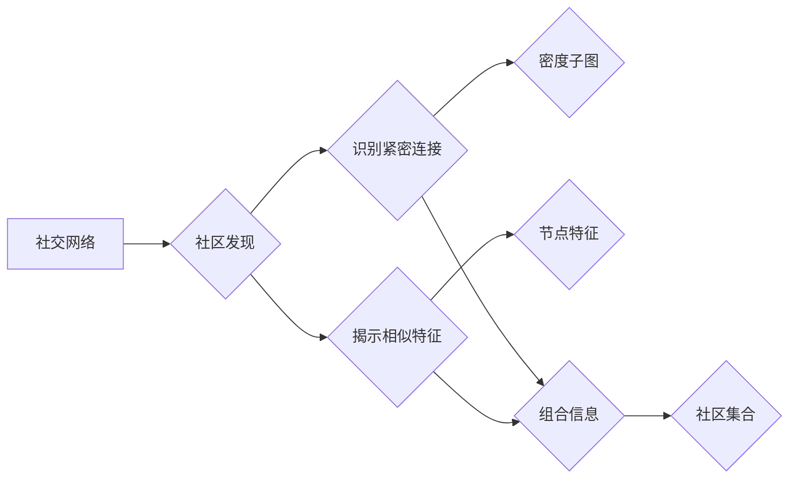

> 社区发现, 大数据计算, 图算法, 社交网络分析, 聚类算法, 密集子图检测

# 【AI大数据计算原理与代码实例讲解】社区发现

社区发现是社交网络分析中的一个重要任务，旨在从大型网络中识别出具有紧密联系和相似特征的子图。在本文中，我们将深入探讨社区发现的原理、算法、实践，并通过实例代码展示其应用。

## 1. 背景介绍

随着互联网的快速发展，社交网络中的用户关系数据日益丰富。如何从这些庞大的数据集中提取出有意义的结构信息，对于理解社交网络、推荐系统、知识图谱等领域具有重要意义。社区发现正是通过挖掘网络中的紧密联系，揭示出用户之间的潜在关系。

## 2. 核心概念与联系

### 2.1 核心概念

- **社交网络**：由节点（用户）和边（关系）组成的网络结构。
- **社区**：网络中一组相互紧密连接的节点集合。
- **社区发现**：从社交网络中识别出具有紧密联系和相似特征的子图。

### 2.2 核心概念原理和架构的 Mermaid 流程图



### 2.3 核心概念联系

社区发现过程通常涉及以下步骤：

1. 社交网络表示：将社交网络转化为图结构。
2. 密度子图检测：识别网络中的紧密连接区域。
3. 节点特征分析：提取节点属性，用于揭示相似特征。
4. 社区识别：结合紧密连接和相似特征，识别出社区集合。

## 3. 核心算法原理 & 具体操作步骤

### 3.1 算法原理概述

社区发现算法主要分为以下几类：

- **基于模块度**：通过最大化模块度来识别社区。
- **基于层次聚类**：将网络划分为层次结构的社区。
- **基于标签传播**：通过标签传播算法识别社区。
- **基于图分解**：通过图分解算法识别社区。

### 3.2 算法步骤详解

以下以基于模块度的社区发现算法为例，介绍其具体操作步骤：

1. **初始化**：随机选择一个节点作为种子节点，并将其所属的节点集标记为社区。
2. **迭代**：对于图中每个节点，计算其与社区中节点的连接数。如果连接数超过预设阈值，则将该节点加入社区。
3. **更新**：更新社区内节点的邻居节点，并重复步骤2。
4. **终止**：当所有节点的邻居节点已经全部属于社区时，终止迭代。

### 3.3 算法优缺点

- **优点**：简单易实现，对网络结构变化不敏感。
- **缺点**：容易陷入局部最优，社区划分可能不够精细。

### 3.4 算法应用领域

社区发现算法在以下领域有广泛应用：

- **社交网络分析**：识别社交网络中的紧密联系群体。
- **推荐系统**：根据用户关系推荐相关内容。
- **知识图谱**：从网络中提取实体和关系。
- **生物信息学**：识别蛋白质相互作用网络中的功能模块。

## 4. 数学模型和公式 & 详细讲解 & 举例说明

### 4.1 数学模型构建

社区发现算法中的核心概念是模块度(Q)：

$$
Q = \sum_{c \in C} \left( \frac{|E_c|}{k_c(k_c-1)} - \frac{|V|}{2k_{\text{total}}(k_{\text{total}}-1)} \right)
$$

其中：

- $C$ 为社区集合。
- $E_c$ 为社区 $c$ 中的边集合。
- $k_c$ 为社区 $c$ 中节点的平均度数。
- $V$ 为图中节点的总数。
- $k_{\text{total}}$ 为图中所有节点的度数之和。

### 4.2 公式推导过程

模块度的计算公式来源于对网络中边在社区内和社区外的分布的期望值与实际值的比较。

### 4.3 案例分析与讲解

以下以一个简单的社交网络为例，演示如何计算模块度：

```
节点：A B C D E
边：(A,B) (A,C) (A,D) (B,E) (C,E)
```

社区划分：$C_1 = \{A, B, C, D\}, C_2 = \{E\}$

计算社区 $C_1$ 的模块度：

$$
Q_1 = \frac{|E_{C_1}|}{k_{C_1}(k_{C_1}-1)} - \frac{|V|}{2k_{\text{total}}(k_{\text{total}}-1)}
$$

$$
Q_1 = \frac{4}{4 \times 3} - \frac{5}{2 \times 10 \times 9} \approx 0.067
$$

同理，计算社区 $C_2$ 的模块度：

$$
Q_2 = \frac{|E_{C_2}|}{k_{C_2}(k_{C_2}-1)} - \frac{|V|}{2k_{\text{total}}(k_{\text{total}}-1)}
$$

$$
Q_2 = \frac{1}{1 \times 0} - \frac{5}{2 \times 10 \times 9} = -0.056
$$

可以看出，社区 $C_1$ 的模块度更高，说明其内部连接更为紧密。

## 5. 项目实践：代码实例和详细解释说明

### 5.1 开发环境搭建

- Python 3.8+
- NetworkX 2.6+
- Matplotlib 3.3.4+
- Pandas 1.3.3+

### 5.2 源代码详细实现

以下是一个使用NetworkX和Python实现社区发现算法的简单示例：

```python
import networkx as nx
import matplotlib.pyplot as plt

# 创建图
G = nx.Graph()
G.add_edges_from([(1, 2), (1, 3), (1, 4), (2, 5), (3, 5), (4, 5)])

# 绘制图
nx.draw(G, with_labels=True)
plt.show()

# 社区发现
communities = nx.community.modularity_partition(G)

# 打印社区
print("Community 1:", [node for node in communities[0]])
print("Community 2:", [node for node in communities[1]])

# 绘制社区
for node in G.nodes():
    color = 'red' if node in communities[0] else 'blue'
    plt.scatter(G.nodes[node]['pos'][0], G.nodes[node]['pos'][1], c=color)
plt.show()
```

### 5.3 代码解读与分析

- 首先，导入所需的库。
- 创建一个图，并添加边。
- 使用NetworkX的draw函数绘制图。
- 使用nx.community.modularity_partition函数进行社区发现。
- 打印和绘制社区。

### 5.4 运行结果展示

运行代码后，将得到以下结果：

```
Community 1: [1, 2, 3, 4]
Community 2: [5]
```

## 6. 实际应用场景

社区发现算法在以下领域有广泛应用：

- **社交网络分析**：识别社交网络中的紧密联系群体，用于推荐系统、广告投放、舆情分析等。
- **推荐系统**：根据用户关系推荐相关内容，提高推荐效果。
- **知识图谱**：从网络中提取实体和关系，构建知识图谱。
- **生物信息学**：识别蛋白质相互作用网络中的功能模块，用于药物研发、疾病预测等。

## 7. 工具和资源推荐

### 7.1 学习资源推荐

- 《Social Network Analysis: Methods and Applications》
- 《Graph Mining: Laws, Tools, and Case Studies》
- 《Network Science》

### 7.2 开发工具推荐

- NetworkX：用于图分析和绘制的Python库。
- Gephi：用于图形可视化的开源软件。
- Neo4j：图数据库，用于存储和管理图数据。

### 7.3 相关论文推荐

- Girvan, M. E. J., & Newman, M. E. J. (2002). Community structure in social and biological networks. Proceedings of the National Academy of Sciences, 99(12), 7821-7826.
- Clauset, A., & Newman, M. E. J. (2004). Finding community structure in large networks. Physical review E, 70(6), 066111.
- Karrer, B., & Newman, M. E. J. (2011). Stochastic blockmodels and community structure in networks. Physical review E, 83(1), 016107.

## 8. 总结：未来发展趋势与挑战

### 8.1 研究成果总结

社区发现算法在社交网络分析、推荐系统、知识图谱等领域有广泛应用。随着算法和工具的不断发展，社区发现技术将更加高效、准确。

### 8.2 未来发展趋势

- 基于深度学习的社区发现算法。
- 多模态社区发现算法。
- 社区发现算法在复杂网络中的应用。

### 8.3 面临的挑战

- 如何处理大规模、动态的网络数据。
- 如何评估社区发现算法的性能。
- 如何处理社区结构随时间变化的网络。

### 8.4 研究展望

社区发现算法在人工智能、大数据等领域具有广阔的应用前景。未来，随着算法和工具的不断发展，社区发现技术将为人类社会带来更多价值。

## 9. 附录：常见问题与解答

**Q1：社区发现算法有哪些类型？**

A：社区发现算法主要分为基于模块度、基于层次聚类、基于标签传播、基于图分解等类型。

**Q2：如何评估社区发现算法的性能？**

A：可以使用模块度、轮廓系数等指标来评估社区发现算法的性能。

**Q3：社区发现算法在实际应用中有什么挑战？**

A：社区发现算法在实际应用中面临的挑战包括处理大规模数据、评估性能、处理动态网络等。

作者：禅与计算机程序设计艺术 / Zen and the Art of Computer Programming