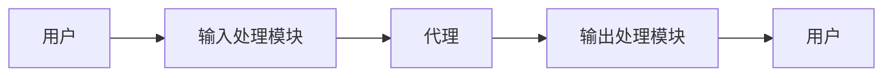

# 【LangChain编程：从入门到实践】LangChain中的代理

> 关键词：LangChain, 对话代理, AI编程, 模块化, 交互式编程, API集成, 智能助理, NLP, 编程助手

## 1. 背景介绍

随着人工智能技术的飞速发展，自然语言处理（NLP）技术在各个领域得到了广泛应用。从智能客服到智能助手，从文本摘要到机器翻译，NLP技术正逐步改变我们的生活和工作方式。而LangChain作为一种新兴的NLP工具，提供了构建智能对话代理的强大能力。本文将深入探讨LangChain中的代理概念，从入门到实践，帮助读者全面了解并掌握这一技术。

### 1.1 LangChain简介

LangChain是一个开源的NLP工具，它允许用户通过简单的编程接口，轻松构建和理解自然语言交互系统。LangChain的核心思想是将复杂的NLP任务分解成一个个可复用的模块，并通过编程的方式将这些模块组合起来，实现复杂的对话逻辑。

### 1.2 代理的概念

在LangChain中，代理（Agent）是一个能够理解自然语言输入、执行特定任务并返回自然语言输出的程序。代理可以是简单的聊天机器人，也可以是能够完成复杂任务的智能助理。

### 1.3 文章结构

本文将分为以下几个部分：

- 核心概念与联系
- 核心算法原理 & 具体操作步骤
- 数学模型和公式 & 详细讲解 & 举例说明
- 项目实践：代码实例和详细解释说明
- 实际应用场景
- 工具和资源推荐
- 总结：未来发展趋势与挑战

## 2. 核心概念与联系

### 2.1 LangChain的架构

LangChain的架构可以分为以下几个核心部分：



- **输入处理模块**：负责接收用户输入的自然语言，并将其转换成代理可以理解的格式。
- **代理**：执行具体的任务，如查询数据库、调用API、执行命令等。
- **输出处理模块**：将代理的输出转换成用户可以理解的自然语言。

### 2.2 代理的工作流程

代理的工作流程可以概括为以下步骤：

1. 接收用户输入。
2. 对输入进行处理，提取关键信息。
3. 根据提取的信息，执行特定的任务。
4. 将任务结果转换成自然语言输出。
5. 将输出返回给用户。

## 3. 核心算法原理 & 具体操作步骤

### 3.1 算法原理概述

LangChain中的代理通常基于以下几种算法原理：

- **自然语言理解（NLU）**：将自然语言输入转换成机器可以理解的格式。
- **任务执行**：根据输入信息执行特定的任务。
- **自然语言生成（NLG）**：将任务结果转换成自然语言输出。

### 3.2 算法步骤详解

#### 3.2.1 自然语言理解（NLU）

NLU的主要步骤包括：

1. **分词**：将输入文本分割成单词或短语。
2. **词性标注**：为每个单词分配一个词性标签，如名词、动词、形容词等。
3. **句法分析**：分析句子的结构，识别句子成分。
4. **语义解析**：理解句子的语义，提取关键信息。

#### 3.2.2 任务执行

任务执行的步骤取决于具体的任务类型，以下是一些常见的任务执行步骤：

1. **API调用**：调用外部API获取数据。
2. **数据库查询**：从数据库中检索数据。
3. **命令执行**：执行操作系统命令。

#### 3.2.3 自然语言生成（NLG）

NLG的主要步骤包括：

1. **信息抽取**：从任务结果中提取关键信息。
2. **模板填充**：使用模板将关键信息填充到预设的输出格式中。
3. **自然语言生成**：将填充后的模板转换成自然语言输出。

### 3.3 算法优缺点

#### 3.3.1 优点

- **模块化**：将复杂的NLP任务分解成可复用的模块，提高开发效率。
- **可扩展性**：可以方便地添加新的模块和功能。
- **灵活性**：可以根据不同的任务需求调整模块和参数。

#### 3.3.2 缺点

- **复杂性**：构建复杂的代理需要一定的编程技能。
- **性能**：对于复杂的任务，代理的性能可能受到影响。

### 3.4 算法应用领域

LangChain中的代理可以应用于以下领域：

- 智能客服
- 智能助理
- 文本摘要
- 机器翻译
- 信息检索

## 4. 数学模型和公式 & 详细讲解 & 举例说明

### 4.1 数学模型构建

在LangChain中，NLU和NLG部分通常涉及到以下数学模型：

- **词嵌入**：将单词映射到高维空间中的向量。
- **循环神经网络（RNN）**：处理序列数据。
- **卷积神经网络（CNN）**：提取文本特征。
- **Transformer**：处理长距离依赖问题。

### 4.2 公式推导过程

由于篇幅限制，此处不展开具体公式的推导过程。读者可以参考相关文献进行学习。

### 4.3 案例分析与讲解

以一个简单的智能客服代理为例，分析其数学模型：

- **输入处理模块**：使用词嵌入将用户输入的文本映射到向量空间。
- **代理**：使用RNN或Transformer对输入向量进行处理，提取关键信息。
- **输出处理模块**：使用NLG将提取的信息转换成自然语言输出。

## 5. 项目实践：代码实例和详细解释说明

### 5.1 开发环境搭建

为了实践LangChain中的代理，需要以下开发环境：

- Python环境
- 安装LangChain库：`pip install langchain`
- 选择合适的NLU和NLG模块

### 5.2 源代码详细实现

以下是一个简单的LangChain代理的示例代码：

```python
from langchain import Agent, load_module, load_template

# 加载NLU模块
nlu_module = load_module('nlu_module.py')

# 加载NLG模块
nlg_module = load_module('nlg_module.py')

# 创建代理
agent = Agent(nlu_module, nlg_module)

# 处理用户输入
user_input = "我想查询天气"
response = agent.run(user_input)

# 输出结果
print(response)
```

### 5.3 代码解读与分析

- `load_module`函数用于加载NLU和NLG模块。
- `Agent`类用于创建代理实例。
- `run`方法用于处理用户输入并返回结果。

### 5.4 运行结果展示

运行上述代码后，代理会根据用户输入的文本查询天气信息，并返回自然语言结果。

## 6. 实际应用场景

LangChain中的代理在以下场景中具有广泛的应用：

- **智能客服**：提供24小时在线客服服务，回答用户的问题。
- **智能助理**：帮助用户完成各种任务，如日程安排、信息检索等。
- **文本摘要**：自动生成文本摘要，提高信息获取效率。
- **机器翻译**：实现跨语言交流，打破语言障碍。
- **信息检索**：根据用户输入的关键词，检索相关信息。

## 7. 工具和资源推荐

### 7.1 学习资源推荐

- LangChain官方文档：https://langchain.readthedocs.io/
- NLP相关书籍和课程
- NLP相关技术博客和论坛

### 7.2 开发工具推荐

- Python编程语言
- LangChain库
- NLU和NLG模块

### 7.3 相关论文推荐

- "Attention is All You Need"：https://arxiv.org/abs/1706.03762
- "BERT: Pre-training of Deep Bidirectional Transformers for Language Understanding"：https://arxiv.org/abs/1810.04805

## 8. 总结：未来发展趋势与挑战

### 8.1 研究成果总结

LangChain中的代理技术为构建智能对话系统提供了强大的工具和平台。通过模块化的设计，用户可以轻松构建复杂的代理，并应用于各个领域。

### 8.2 未来发展趋势

- **模型轻量化**：提高代理的运行效率，降低资源消耗。
- **多模态融合**：将文本、图像、音频等多模态信息融合到代理中。
- **知识图谱嵌入**：将知识图谱嵌入到代理中，提高代理的知识推理能力。

### 8.3 面临的挑战

- **数据标注**：构建高质量的训练数据需要大量的人工标注工作。
- **模型可解释性**：提高代理的决策透明度，增强用户信任。
- **安全性和隐私保护**：确保代理不会泄露用户隐私，避免恶意攻击。

### 8.4 研究展望

LangChain中的代理技术有望在未来得到更广泛的应用，并推动人工智能技术的发展。

## 9. 附录：常见问题与解答

**Q1：LangChain中的代理是如何工作的？**

A1：LangChain中的代理通过将NLU、NLG等模块组合起来，实现用户输入到输出之间的转换。

**Q2：如何构建一个LangChain代理？**

A2：构建LangChain代理需要以下步骤：
1. 选择合适的NLU和NLG模块。
2. 将模块组合起来，创建代理实例。
3. 使用代理处理用户输入。

**Q3：LangChain代理有哪些应用场景？**

A3：LangChain代理可以应用于智能客服、智能助理、文本摘要、机器翻译、信息检索等领域。

**Q4：如何提高LangChain代理的性能？**

A4：提高LangChain代理性能的方法包括：
1. 选择合适的模型和模块。
2. 优化模型参数。
3. 使用数据增强技术。

**Q5：LangChain代理的安全性和隐私保护如何保障？**

A5：保障LangChain代理的安全性和隐私保护的方法包括：
1. 限制用户访问权限。
2. 对用户数据进行加密存储和传输。
3. 定期更新安全漏洞修复。

作者：禅与计算机程序设计艺术 / Zen and the Art of Computer Programming