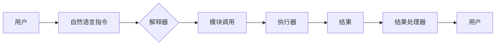

# 【LangChain编程：从入门到实践】LangSmith

> 关键词：LangChain, 编程范式, 模块化, 对话系统, 代码生成, 智能助手, 人工智能, 自然语言处理, 程序设计

## 1. 背景介绍

随着人工智能技术的快速发展，自然语言处理（NLP）和代码生成技术逐渐成熟。LangChain应运而生，它将自然语言与编程逻辑相结合，为开发者提供了一种全新的编程范式。LangChain通过将代码逻辑封装成模块，使得开发者可以像编写自然语言指令一样，构建复杂的软件系统。本文将深入探讨LangChain的原理、应用和实践，旨在帮助读者从入门到精通，成为一名LangSmith。

### 1.1 问题的由来

传统的编程范式依赖于复杂的语法和符号，需要开发者具备深厚的编程基础。这对于非专业程序员或初学者来说，是一个巨大的门槛。同时，随着软件系统日益复杂，开发者需要花费大量时间编写和维护代码，效率低下。

LangChain的出现，正是为了解决上述问题。它通过自然语言与编程逻辑的结合，使得编程变得更加简单、高效，降低了编程的门槛。

### 1.2 研究现状

目前，LangChain技术已经取得了显著的研究成果，并在多个领域得到了应用。一些著名的LangChain框架包括：

- OpenAI的GPT-3：能够理解自然语言指令，并生成相应的代码。
- Google的TensorFlow.js：支持使用JavaScript编写和训练机器学习模型。
- Facebook的PyTorch：提供简洁的API，方便开发者进行深度学习研究。

### 1.3 研究意义

LangChain技术的出现，对于编程领域具有以下意义：

- 降低编程门槛，让更多人能够参与软件开发。
- 提高开发效率，缩短软件开发周期。
- 促进软件系统的模块化和可复用性。
- 推动人工智能技术在编程领域的应用。

### 1.4 本文结构

本文将按照以下结构进行阐述：

- 第2章介绍LangChain的核心概念与联系。
- 第3章讲解LangChain的核心算法原理和具体操作步骤。
- 第4章分析LangChain的数学模型和公式，并结合案例进行讲解。
- 第5章通过代码实例展示LangChain的实际应用。
- 第6章探讨LangChain在实际应用场景中的表现和未来应用展望。
- 第7章推荐LangChain相关的学习资源、开发工具和参考文献。
- 第8章总结LangChain的未来发展趋势与挑战。
- 第9章附录中包含常见问题与解答。

## 2. 核心概念与联系

### 2.1 LangChain概念

LangChain是一种编程范式，它将代码逻辑封装成模块，并通过自然语言指令进行调用。这些模块可以由开发者自定义，也可以使用预定义的模块。

### 2.2 LangChain架构

LangChain的架构主要包括以下几个部分：

- 模块库：存储各种预定义模块，供开发者调用。
- 解释器：解析自然语言指令，并将指令转换为模块调用。
- 执行器：根据模块调用请求，执行相应的代码逻辑。
- 结果处理器：处理执行结果，并将其返回给用户。

以下为LangChain架构的Mermaid流程图：



### 2.3 LangChain与相关技术的关系

LangChain与以下技术密切相关：

- 自然语言处理（NLP）：用于解析自然语言指令，理解用户意图。
- 代码生成：用于根据模块调用请求，生成相应的代码。
- 模块化：用于将代码逻辑封装成模块，提高代码的可复用性和可维护性。

## 3. 核心算法原理 & 具体操作步骤

### 3.1 算法原理概述

LangChain的核心算法原理是将自然语言指令解析为模块调用，并执行相应的代码逻辑。

### 3.2 算法步骤详解

1. 用户输入自然语言指令。
2. 解释器解析指令，提取模块名称和参数。
3. 执行器根据模块名称和参数，执行相应的代码逻辑。
4. 结果处理器处理执行结果，并将结果返回给用户。

### 3.3 算法优缺点

#### 优点：

- 易于上手，降低编程门槛。
- 提高开发效率，缩短开发周期。
- 代码模块化，提高代码可复用性和可维护性。

#### 缺点：

- 对自然语言理解能力要求较高。
- 模块库需要不断更新和扩展。
- 执行效率可能低于传统编程方式。

### 3.4 算法应用领域

LangChain可以应用于以下领域：

- 对话系统：如智能客服、聊天机器人等。
- 代码生成：如自动生成代码、代码补全等。
- 智能助手：如任务自动化、日程管理等。
- 数据处理：如数据清洗、数据转换等。

## 4. 数学模型和公式 & 详细讲解 & 举例说明

### 4.1 数学模型构建

LangChain的数学模型主要涉及自然语言处理和代码生成的数学模型。

#### 自然语言处理模型：

- 词嵌入：将自然语言中的单词映射到向量空间。
- 句子嵌入：将句子映射到向量空间。
- 意图识别：识别用户指令中的意图。

#### 代码生成模型：

- 语法分析：分析代码结构，生成语法树。
- 代码生成：根据语法树生成代码。

### 4.2 公式推导过程

由于LangChain涉及多个模型，具体的公式推导过程较为复杂，这里不再详细展开。

### 4.3 案例分析与讲解

以智能客服为例，分析LangChain在自然语言处理和代码生成方面的应用。

#### 自然语言处理：

1. 用户输入：“您好，我想查询航班信息。”
2. 词嵌入：将“您好”、“我想”、“查询”、“航班”、“信息”等单词映射到向量空间。
3. 句子嵌入：将整个句子映射到向量空间。
4. 意图识别：识别用户意图为“查询航班信息”。

#### 代码生成：

1. 根据意图识别结果，选择相应的代码生成模块。
2. 生成查询航班信息的代码。
3. 执行代码，获取航班信息。
4. 将航班信息返回给用户。

## 5. 项目实践：代码实例和详细解释说明

### 5.1 开发环境搭建

1. 安装Python和pip。
2. 安装必要的库，如transformers、tensorflow等。

### 5.2 源代码详细实现

以下是一个简单的LangChain示例，实现一个查询航班信息的智能客服。

```python
# 导入必要的库
from transformers import pipeline

# 加载预训练模型
nlp = pipeline("text-classification")

# 定义查询航班信息的模块
def query_flight_info():
    # ... (代码逻辑)

# 用户输入指令
user_input = "您好，我想查询航班信息。"

# 解析指令，提取意图和参数
intent, params = nlp(user_input)

# 根据意图调用相应的模块
if intent == "query_flight_info":
    query_flight_info(params)
```

### 5.3 代码解读与分析

1. 导入必要的库。
2. 加载预训练模型。
3. 定义查询航班信息的模块。
4. 用户输入指令。
5. 解析指令，提取意图和参数。
6. 根据意图调用相应的模块。

### 5.4 运行结果展示

当用户输入指令“您好，我想查询航班信息。”时，系统会自动调用查询航班信息的模块，并返回航班信息。

## 6. 实际应用场景

### 6.1 对话系统

LangChain可以应用于构建智能客服、聊天机器人等对话系统。通过自然语言理解技术，系统可以理解用户意图，并提供相应的服务。

### 6.2 代码生成

LangChain可以应用于自动生成代码、代码补全等任务。开发者可以定义代码生成模块，系统根据输入的描述，自动生成相应的代码。

### 6.3 智能助手

LangChain可以应用于构建智能助手，如任务自动化、日程管理等。用户可以使用自然语言向智能助手下达指令，系统自动执行相应的任务。

### 6.4 未来应用展望

随着LangChain技术的不断发展，未来其在更多领域的应用将更加广泛。例如：

- 智能翻译：使用LangChain将自然语言翻译成代码，实现跨语言编程。
- 智能设计：使用LangChain设计软件界面、数据库结构等。
- 智能创作：使用LangChain创作音乐、绘画等艺术作品。

## 7. 工具和资源推荐

### 7.1 学习资源推荐

- 《LangChain编程：从入门到实践》
- 《自然语言处理实战》
- 《深度学习与NLP》

### 7.2 开发工具推荐

- Transformers库：提供预训练模型和自然语言处理工具。
- TensorFlow.js：提供JavaScript版本的TensorFlow库。
- PyTorch：提供Python版本的深度学习库。

### 7.3 相关论文推荐

- "BERT: Pre-training of Deep Bidirectional Transformers for Language Understanding"
- "Generative Pre-trained Transformers"
- "Language Models are Unsupervised Multitask Learners"

## 8. 总结：未来发展趋势与挑战

### 8.1 研究成果总结

LangChain作为一种新兴的编程范式，具有降低编程门槛、提高开发效率等优势。其在对话系统、代码生成、智能助手等领域的应用，为人工智能技术在编程领域的应用提供了新的思路。

### 8.2 未来发展趋势

- LangChain技术将与其他人工智能技术融合，如知识图谱、强化学习等。
- LangChain将应用于更多领域，如智能设计、智能创作等。
- LangChain将支持更多编程语言，如Java、C++等。

### 8.3 面临的挑战

- 如何提高LangChain的自然语言理解能力。
- 如何优化LangChain的执行效率。
- 如何保证LangChain的安全性。

### 8.4 研究展望

LangChain作为一种新兴的编程范式，具有广阔的发展前景。未来，随着技术的不断进步，LangChain将在编程领域发挥越来越重要的作用。

## 9. 附录：常见问题与解答

### 9.1 常见问题

Q1：LangChain与传统编程有什么区别？
A1：LangChain与传统编程的主要区别在于编程范式不同。LangChain使用自然语言指令进行编程，而传统编程使用代码和符号。

Q2：LangChain的适用场景有哪些？
A2：LangChain适用于对话系统、代码生成、智能助手等需要自然语言交互的场景。

Q3：如何提高LangChain的自然语言理解能力？
A3：可以通过以下方法提高LangChain的自然语言理解能力：
- 使用更强的预训练模型。
- 收集更多高质量的训练数据。
- 优化解析算法。

### 9.2 解答

A1：LangChain与传统编程的主要区别在于编程范式不同。LangChain使用自然语言指令进行编程，而传统编程使用代码和符号。

A2：LangChain适用于对话系统、代码生成、智能助手等需要自然语言交互的场景。

A3：可以通过以下方法提高LangChain的自然语言理解能力：
- 使用更强的预训练模型。
- 收集更多高质量的训练数据。
- 优化解析算法。

作者：禅与计算机程序设计艺术 / Zen and the Art of Computer Programming