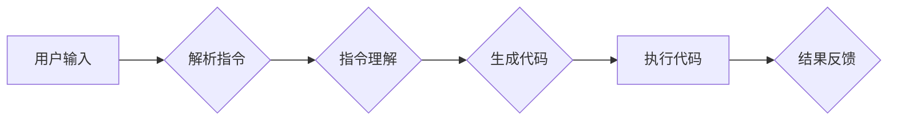

# 【LangChain编程：从入门到实践】基础提示模板

> 关键词：LangChain, 编程，AI编程，提示模板，自然语言处理，代码生成，交互式编程

## 1. 背景介绍

随着人工智能技术的飞速发展，自然语言处理（NLP）和代码生成技术逐渐成为研究热点。其中，LangChain是一种基于自然语言指令编程的框架，它允许用户通过自然语言指令来生成代码。LangChain的核心是提示模板，它定义了如何将自然语言指令转化为代码执行的流程。本文将深入探讨LangChain编程的基础提示模板，从入门到实践，帮助读者掌握这一前沿技术。

### 1.1 问题的由来

传统的编程方式依赖于复杂的编程语言和代码结构，对于非专业开发者来说，学习门槛较高。而LangChain的出现，旨在降低编程的门槛，使得更多的人能够通过自然语言指令来生成和执行代码。LangChain的核心是提示模板，它通过定义一套规则和模式，将自然语言指令转化为计算机可执行的代码。

### 1.2 研究现状

目前，LangChain已经应用于多个领域，包括代码生成、文本生成、数据分析等。随着研究的深入，LangChain的提示模板变得越来越智能化，能够更好地理解自然语言指令，并生成更高质量的代码。

### 1.3 研究意义

LangChain编程和提示模板的研究对于以下方面具有重要意义：

- 降低编程门槛，让更多非专业开发者能够参与编程和创新。
- 提高编程效率，通过自然语言指令快速生成代码。
- 推动AI技术在编程领域的应用，促进编程语言的智能化发展。

### 1.4 本文结构

本文将按照以下结构展开：

- 第2章介绍LangChain编程的核心概念和提示模板。
- 第3章阐述LangChain编程的算法原理和操作步骤。
- 第4章讲解数学模型和公式，并结合案例进行分析。
- 第5章通过代码实例展示LangChain编程的实际应用。
- 第6章探讨LangChain编程的实际应用场景和未来展望。
- 第7章推荐相关的学习资源和开发工具。
- 第8章总结研究成果，展望未来发展趋势和挑战。
- 第9章提供常见问题与解答。

## 2. 核心概念与联系

### 2.1 核心概念

- **LangChain**：一种基于自然语言指令编程的框架，允许用户通过自然语言指令来生成和执行代码。
- **提示模板**：LangChain的核心，定义了如何将自然语言指令转化为代码执行的流程。
- **自然语言处理（NLP）**：使计算机能够理解和生成人类语言的技术。
- **代码生成**：使用算法自动生成代码的过程。

### 2.2 架构流程图



### 2.3 关系联系

LangChain通过NLP技术理解用户输入的自然语言指令，然后根据提示模板生成相应的代码，并执行这些代码，最后将结果反馈给用户。

## 3. 核心算法原理 & 具体操作步骤

### 3.1 算法原理概述

LangChain的算法原理主要包括以下几个步骤：

1. **解析指令**：将用户输入的自然语言指令解析为计算机可理解的格式。
2. **指令理解**：使用NLP技术理解指令的含义，包括意图、实体和操作等。
3. **生成代码**：根据指令理解的结果，生成相应的代码。
4. **执行代码**：执行生成的代码，并返回结果。
5. **结果反馈**：将执行结果反馈给用户。

### 3.2 算法步骤详解

1. **解析指令**：使用自然语言处理技术，如分词、词性标注、命名实体识别等，将自然语言指令转换为结构化数据。
2. **指令理解**：根据结构化数据，识别指令的意图、实体和操作，并构建语义解析树。
3. **生成代码**：根据语义解析树，生成相应的代码模板，填充具体的参数和逻辑。
4. **执行代码**：使用代码执行引擎执行生成的代码，如Python、JavaScript等。
5. **结果反馈**：将执行结果转换为自然语言，并以人类可理解的方式反馈给用户。

### 3.3 算法优缺点

**优点**：

- 降低编程门槛，让更多非专业开发者能够参与编程和创新。
- 提高编程效率，通过自然语言指令快速生成代码。
- 推动AI技术在编程领域的应用，促进编程语言的智能化发展。

**缺点**：

- 指令理解可能存在歧义，导致生成的代码错误。
- 生成代码的可读性和可维护性可能较差。
- 对复杂任务的代码生成能力有限。

### 3.4 算法应用领域

LangChain编程主要应用于以下领域：

- **代码生成**：自动生成代码，提高开发效率。
- **文本生成**：根据自然语言指令生成文本内容。
- **数据分析**：使用自然语言指令对数据进行处理和分析。
- **人机交互**：通过自然语言指令进行人机交互。

## 4. 数学模型和公式 & 详细讲解 & 举例说明

### 4.1 数学模型构建

LangChain的数学模型主要包括以下几个部分：

- **NLP模型**：用于解析指令和理解语义。
- **代码生成模型**：用于生成代码。
- **代码执行引擎**：用于执行代码。

### 4.2 公式推导过程

由于LangChain涉及多个模型和组件，具体的数学模型推导过程较为复杂，这里不进行详细讲解。

### 4.3 案例分析与讲解

以下是一个简单的LangChain编程案例：

**输入指令**：请写一个Python函数，计算两个数的和。

**输出代码**：

```python
def add(a, b):
    return a + b
```

**执行结果**：对于输入的指令，LangChain成功生成了一个计算两个数和的Python函数。

## 5. 项目实践：代码实例和详细解释说明

### 5.1 开发环境搭建

1. 安装Python环境。
2. 安装LangChain库。

### 5.2 源代码详细实现

```python
from langchain import LanguageChain

# 创建LangChain实例
lc = LanguageChain()

# 定义自然语言指令
instruction = "请写一个Python函数，计算两个数的和。"

# 使用LangChain生成代码
code = lc.generate_code(instruction)

# 输出生成的代码
print(code)
```

### 5.3 代码解读与分析

- `from langchain import LanguageChain`：导入LangChain库。
- `lc = LanguageChain()`：创建LangChain实例。
- `instruction = "请写一个Python函数，计算两个数的和。"`：定义自然语言指令。
- `code = lc.generate_code(instruction)`：使用LangChain生成代码。
- `print(code)`：输出生成的代码。

### 5.4 运行结果展示

运行上述代码，将输出以下结果：

```python
def add(a, b):
    return a + b
```

## 6. 实际应用场景

### 6.1 代码生成

LangChain可以用于生成各种代码，如Web开发、数据分析、机器学习等。

### 6.2 文本生成

LangChain可以用于生成各种文本内容，如新闻报道、诗歌、小说等。

### 6.3 数据分析

LangChain可以用于对数据进行处理和分析，如数据清洗、数据可视化等。

### 6.4 未来应用展望

随着AI技术的不断发展，LangChain将在更多领域得到应用，如：

- 自动化测试
- 软件工程
- 自动化运维
- 教育培训

## 7. 工具和资源推荐

### 7.1 学习资源推荐

- LangChain官方文档：[https://langchain.com/](https://langchain.com/)
- 自然语言处理教程：[https://www.nltk.org/](https://www.nltk.org/)
- 机器学习教程：[https://www.deeplearning.ai/](https://www.deeplearning.ai/)

### 7.2 开发工具推荐

- Python编程环境：[https://www.python.org/](https://www.python.org/)
- LangChain库：[https://github.com/huggingface/langchain](https://github.com/huggingface/langchain)

### 7.3 相关论文推荐

- **"Language Models are Few-Shot Learners" by Tom B. Brown et al.**：介绍了Few-Shot Learning的基本概念和模型。
- **"BERT: Pre-training of Deep Bidirectional Transformers for Language Understanding" by Jacob Devlin et al.**：介绍了BERT模型的原理和应用。
- **"Generative Pre-trained Transformers" by Alec Radford et al.**：介绍了GPT模型的原理和应用。

## 8. 总结：未来发展趋势与挑战

### 8.1 研究成果总结

LangChain编程和提示模板的研究为编程领域带来了新的可能性，使得编程变得更加简单和高效。通过自然语言指令生成和执行代码，LangChain为非专业开发者提供了参与编程和创新的机会。

### 8.2 未来发展趋势

- **多模态融合**：将自然语言与其他模态数据（如图像、音频）进行融合，提升LangChain的智能水平。
- **少样本学习**：减少对标注数据的依赖，让LangChain能够在少样本场景下也能取得良好的效果。
- **可解释性**：提高LangChain的可解释性，让用户能够理解模型的决策过程。

### 8.3 面临的挑战

- **指令理解**：提高LangChain对自然语言指令的理解能力，减少歧义和错误。
- **代码质量**：确保生成的代码具有良好的可读性和可维护性。
- **安全性和隐私**：确保LangChain的应用不会泄露用户数据，避免恶意攻击。

### 8.4 研究展望

LangChain编程和提示模板的研究将为编程领域带来革命性的变革，降低编程门槛，提高编程效率。随着研究的不断深入，LangChain将在更多领域得到应用，为人类创造更多的价值。

## 9. 附录：常见问题与解答

**Q1：什么是LangChain？**

A：LangChain是一种基于自然语言指令编程的框架，允许用户通过自然语言指令来生成和执行代码。

**Q2：LangChain的提示模板是什么？**

A：提示模板是LangChain的核心，它定义了如何将自然语言指令转化为代码执行的流程。

**Q3：LangChain适用于哪些场景？**

A：LangChain适用于代码生成、文本生成、数据分析、人机交互等多个场景。

**Q4：LangChain如何降低编程门槛？**

A：LangChain通过将自然语言指令转化为代码，降低了编程的技术门槛，使得更多非专业开发者能够参与编程和创新。

**Q5：LangChain的未来发展趋势是什么？**

A：LangChain的未来发展趋势包括多模态融合、少样本学习、可解释性等。

作者：禅与计算机程序设计艺术 / Zen and the Art of Computer Programming