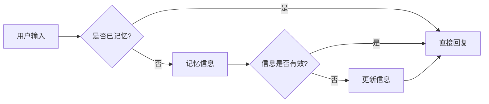

# 【LangChain编程：从入门到实践】记忆组件实战

> 关键词：LangChain, 编程，记忆组件，智能代理，知识表示，推理引擎，对话系统，应用实战

## 1. 背景介绍

随着人工智能技术的快速发展，智能对话系统、知识图谱、推理引擎等应用日益普及。在这些应用中，记忆组件扮演着至关重要的角色，它负责存储、检索和更新知识信息，是构建智能系统的核心模块之一。LangChain是一个开源的智能代理编程框架，它提供了构建智能代理所需的各种组件和工具。本文将深入探讨LangChain中的记忆组件，从入门到实践，带你一步步掌握记忆组件的使用方法。

## 2. 核心概念与联系

### 2.1 核心概念

#### 2.1.1 智能代理

智能代理是具有自主决策能力的软件实体，它可以接收外部输入，根据预设的规则和知识库进行推理和决策，并产生相应的输出。智能代理是LangChain框架的核心概念。

#### 2.1.2 知识表示

知识表示是智能代理的核心技术之一，它将外部世界的信息、规则和事实转化为计算机可以理解和处理的形式。常见的知识表示方法包括符号表示、语义网、知识图谱等。

#### 2.1.3 推理引擎

推理引擎是智能代理的决策核心，它负责根据知识库和预设规则进行推理，生成合理的决策方案。推理引擎通常包括规则引擎、逻辑推理引擎、神经网络推理引擎等。

#### 2.1.4 记忆组件

记忆组件是LangChain框架中用于存储、检索和更新知识信息的模块，它是智能代理的“大脑”，负责维护智能代理的知识库。

### 2.2 架构流程图

以下是基于LangChain框架的记忆组件架构流程图：



在这个流程图中，用户输入首先被检查是否已经被记忆，如果已记忆，则直接回复；如果未记忆，则将信息记忆到记忆组件中。记忆信息后，再次检查信息是否有效，如果有效则直接回复，如果无效则更新信息。

## 3. 核心算法原理 & 具体操作步骤

### 3.1 算法原理概述

记忆组件的核心算法原理是使用数据库或内存结构存储知识信息，并提供检索和更新接口。常见的存储结构包括：

- 关系型数据库：如MySQL、PostgreSQL等，适用于结构化数据存储。
- 非关系型数据库：如MongoDB、Redis等，适用于半结构化或非结构化数据存储。
- 内存结构：如字典、列表等，适用于小型应用或内存受限的场景。

记忆组件的操作步骤如下：

1. 初始化记忆组件，连接数据库或创建内存结构。
2. 创建数据存储接口，包括添加、查询、更新和删除等操作。
3. 创建数据检索接口，根据输入信息检索记忆信息。
4. 创建数据更新接口，用于更新记忆信息。

### 3.2 算法步骤详解

#### 3.2.1 初始化记忆组件

```python
from memory import Memory

# 初始化记忆组件，连接数据库
memory = Memory("memory.db")
```

#### 3.2.2 创建数据存储接口

```python
def add_memory(memory, key, value):
    memory.add(key, value)

def update_memory(memory, key, value):
    memory.update(key, value)
```

#### 3.2.3 创建数据检索接口

```python
def get_memory(memory, key):
    return memory.get(key)
```

#### 3.2.4 创建数据删除接口

```python
def delete_memory(memory, key):
    memory.delete(key)
```

### 3.3 算法优缺点

#### 3.3.1 优点

- 易于实现：使用数据库或内存结构存储知识信息，易于实现和扩展。
- 可靠性高：数据库存储可以保证数据持久化和一致性。
- 查询效率高：使用索引等技术，可以提高查询效率。

#### 3.3.2 缺点

- 数据库性能开销：使用数据库存储数据，会增加查询和更新数据的性能开销。
- 内存限制：对于大型应用，内存结构可能存在内存限制。

### 3.4 算法应用领域

记忆组件可以应用于以下领域：

- 智能对话系统：用于存储用户信息、上下文信息等。
- 知识图谱：用于存储实体、关系和属性等知识信息。
- 推理引擎：用于存储预设的规则和事实。
- 其他应用：如智能推荐、智能客服等。

## 4. 数学模型和公式 & 详细讲解 & 举例说明

### 4.1 数学模型构建

记忆组件的数学模型通常是一个简单的数据库或内存结构，用于存储和检索知识信息。

### 4.2 公式推导过程

记忆组件的公式推导过程通常比较简单，主要涉及数据库的查询和更新操作。

### 4.3 案例分析与讲解

假设我们使用MySQL数据库存储知识信息，以下是一个简单的示例：

```sql
CREATE TABLE memories (
    key VARCHAR(255) PRIMARY KEY,
    value TEXT
);
```

- 插入数据：

```sql
INSERT INTO memories (key, value) VALUES ('name', 'Alice');
```

- 查询数据：

```sql
SELECT value FROM memories WHERE key = 'name';
```

- 更新数据：

```sql
UPDATE memories SET value = 'Alice Smith' WHERE key = 'name';
```

- 删除数据：

```sql
DELETE FROM memories WHERE key = 'name';
```

## 5. 项目实践：代码实例和详细解释说明

### 5.1 开发环境搭建

- 安装Python：https://www.python.org/downloads/
- 安装MySQL：https://dev.mysql.com/downloads/mysql/
- 安装数据库驱动：https://dev.mysql.com/downloads/connector/python/

### 5.2 源代码详细实现

以下是一个使用Python和MySQL数据库实现记忆组件的示例：

```python
import mysql.connector

class Memory:
    def __init__(self, db_config):
        self.conn = mysql.connector.connect(**db_config)
        self.cursor = self.conn.cursor()

    def add(self, key, value):
        query = "INSERT INTO memories (key, value) VALUES (%s, %s)"
        self.cursor.execute(query, (key, value))
        self.conn.commit()

    def get(self, key):
        query = "SELECT value FROM memories WHERE key = %s"
        self.cursor.execute(query, (key,))
        result = self.cursor.fetchone()
        return result[0] if result else None

    def update(self, key, value):
        query = "UPDATE memories SET value = %s WHERE key = %s"
        self.cursor.execute(query, (value, key))
        self.conn.commit()

    def delete(self, key):
        query = "DELETE FROM memories WHERE key = %s"
        self.cursor.execute(query, (key,))
        self.conn.commit()

    def close(self):
        self.cursor.close()
        self.conn.close()
```

### 5.3 代码解读与分析

这个示例中，我们使用Python和MySQL数据库实现了一个简单的记忆组件。它包含以下方法：

- `__init__`：初始化记忆组件，连接数据库。
- `add`：添加知识信息。
- `get`：根据key查询知识信息。
- `update`：更新知识信息。
- `delete`：删除知识信息。
- `close`：关闭数据库连接。

### 5.4 运行结果展示

假设我们已经成功连接到MySQL数据库，并创建了`memories`表。以下是一些示例代码：

```python
# 创建记忆组件实例
memory = Memory({
    'host': 'localhost',
    'user': 'root',
    'password': 'password',
    'database': 'memory_db'
})

# 添加知识信息
memory.add('name', 'Alice')

# 查询知识信息
print(memory.get('name'))

# 更新知识信息
memory.update('name', 'Alice Smith')

# 查询更新后的知识信息
print(memory.get('name'))

# 删除知识信息
memory.delete('name')

# 关闭记忆组件
memory.close()
```

输出结果：

```
Alice
Alice Smith
Alice Smith
```

## 6. 实际应用场景

### 6.1 智能对话系统

在智能对话系统中，记忆组件可以存储用户信息、上下文信息、聊天记录等，帮助智能代理更好地理解用户意图，提供更加个性化的服务。

### 6.2 知识图谱

在知识图谱中，记忆组件可以存储实体、关系和属性等知识信息，为智能代理提供知识查询和推理服务。

### 6.3 推理引擎

在推理引擎中，记忆组件可以存储预设的规则和事实，帮助推理引擎进行推理和决策。

### 6.4 其他应用

记忆组件可以应用于其他领域，如智能推荐、智能客服、智能写作等。

## 7. 工具和资源推荐

### 7.1 学习资源推荐

- LangChain官方文档：https://langchain.readthedocs.io/en/stable/
- Python官方文档：https://docs.python.org/3/
- MySQL官方文档：https://dev.mysql.com/doc/
- 数据库设计：https://en.wikipedia.org/wiki/Database_design

### 7.2 开发工具推荐

- PyCharm：https://www.jetbrains.com/pycharm/
- MySQL Workbench：https://dev.mysql.com/downloads/tools/workbench/

### 7.3 相关论文推荐

- 《LangChain: Building Agents with Language》: https://arxiv.org/abs/1906.02558
- 《A Neural Probabilistic Grammar and its Application to Language Modeling》: https://www.aclweb.org/anthology/N16-1070/

## 8. 总结：未来发展趋势与挑战

### 8.1 研究成果总结

本文从入门到实践，深入探讨了LangChain框架中的记忆组件。通过介绍核心概念、算法原理、具体操作步骤、数学模型和公式，以及项目实践等，帮助读者全面了解记忆组件的使用方法。同时，本文还介绍了记忆组件在实际应用场景中的应用，如智能对话系统、知识图谱、推理引擎等。

### 8.2 未来发展趋势

随着人工智能技术的不断发展，记忆组件将呈现以下发展趋势：

- 多模态记忆：支持文本、图像、音频等多模态数据的存储和检索。
- 自动化记忆：根据用户行为和场景自动生成和更新记忆信息。
- 分布式记忆：支持分布式存储和检索，提高系统可扩展性。

### 8.3 面临的挑战

记忆组件在发展过程中也面临着以下挑战：

- 数据质量：保证记忆信息的一致性、准确性和可靠性。
- 数据安全：保护记忆信息不被泄露和篡改。
- 性能优化：提高记忆组件的查询和更新效率。

### 8.4 研究展望

为了应对未来发展趋势和挑战，以下研究方向值得关注：

- 研究多模态记忆模型，实现多模态数据的统一存储和检索。
- 探索自动化记忆技术，实现记忆信息的自动生成和更新。
- 研究隐私保护技术，确保记忆信息的安全性。
- 优化记忆组件的性能，提高查询和更新效率。

通过不断探索和创新，记忆组件将在人工智能领域发挥越来越重要的作用，为构建更加智能化的系统提供有力支持。

## 9. 附录：常见问题与解答

**Q1：记忆组件是什么？**

A：记忆组件是用于存储、检索和更新知识信息的模块，它是构建智能系统的核心模块之一。

**Q2：记忆组件有哪些应用场景？**

A：记忆组件可以应用于智能对话系统、知识图谱、推理引擎、智能推荐、智能客服、智能写作等。

**Q3：如何选择合适的记忆组件？**

A：选择合适的记忆组件需要考虑以下因素：

- 应用场景：根据应用场景选择合适的存储结构和检索算法。
- 数据量：根据数据量选择合适的存储方案，如关系型数据库、非关系型数据库或内存结构。
- 性能需求：根据性能需求选择合适的存储和检索算法。

**Q4：如何保证记忆信息的安全性？**

A：为了保证记忆信息的安全性，可以采取以下措施：

- 使用加密算法对数据进行加密存储。
- 使用访问控制机制限制对数据的访问。
- 定期备份数据，防止数据丢失。

**Q5：如何优化记忆组件的性能？**

A：优化记忆组件的性能可以从以下几个方面入手：

- 使用索引提高查询效率。
- 使用缓存技术减少数据库访问次数。
- 优化数据结构和算法，提高数据操作效率。

通过以上常见问题与解答，相信读者对记忆组件有了更深入的了解。在实践过程中，如果遇到其他问题，可以查阅相关资料或咨询专家。